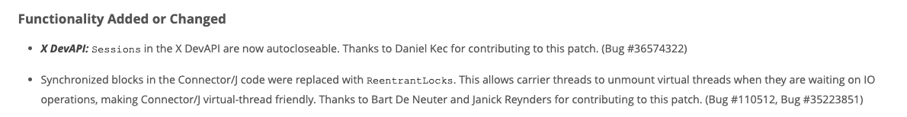

This article traces how I diagnosed thread blocking caused by network I/O and found a fundamental solution with JDK 21 virtual threads. Beyond the initial fix, it examines the unexpected challenges of thread pinning and overwhelming that emerged during adoption, along with their solutions.

## Why Was the Thread Pool Exhausted?

It is 10 a.m. on Monday. Just as I am starting the week with a cup of coffee, latency alerts begin appearing in Slack.

I hurriedly check the monitoring dashboard.

-   Available threads: 0

Why was the thread pool exhausted?

The cause was server-side event tracking that we had built with the marketing team through an integration with the Meta Conversions API.

<pre class="mermaid">
flowchart LR
    accTitle: Client-side and server-side event tracking
    accDescr: A user action reaches Meta through both a browser pixel event and a server-side Conversions API call whose network response takes 200 to 500 milliseconds.
    User([User]) --&gt; Browser[Browser]
    Browser --&gt; Script[Client script]
    Script --&gt; EventBrowser[Browser event]
    EventBrowser --&gt;|Pixel event| Meta[Meta Events Manager]
    Script --&gt; Server[Server]
    Server --&gt;|Conversions API call: 200–500 ms network I/O| Meta
</pre>

The system sends all major user actions to Meta for collection. It identifies actions such as page navigation, button clicks, and completed purchases so that we can track marketing performance. However, <strong>each API call incurred 200–500 ms of network I/O</strong>. When that met the traffic spike at the opening time for free trials, the problem surfaced.

<strong>To understand the devastating effect of network I/O on thread-pool exhaustion, you first need to understand the limitations of platform threads.</strong>

### Technical Analysis

Let us examine <strong>the limitations of platform threads</strong>.

-   A thread is <strong>blocked</strong> while performing I/O such as database access or an API call. A blocked thread cannot do other work.
-   Their <strong>context-switching cost is relatively high</strong> compared with virtual threads, which have a low context-switching cost, and coroutines, which incur no thread-switching cost.
-   <strong>Creating a thread takes a long time.</strong> Pre-creating them is not necessarily a solution because each thread requires megabytes of memory and may therefore <strong>waste significant resources</strong>.

<pre class="mermaid">
flowchart LR
    accTitle: Network I/O blocks platform threads
    accDescr: Every request occupies one platform thread while its network operation is in progress, reducing the number of threads available for other work.
    subgraph Pool[Platform thread pool]
        T1[Platform thread 1]
        T2[Platform thread 2]
        T3[Platform thread 3]
    end
    T1 --&gt;|blocked| IO1[Network I/O]
    T2 --&gt;|blocked| IO2[Network I/O]
    T3 --&gt;|blocked| IO3[Network I/O]
</pre>

*When an I/O operation occurs, blocking prevents the thread from doing other work.*

We can summarize the problem as follows.

Suppose the thread pool has 100 available threads. If each request incurs 200 ms of network I/O, just 500 requests per second will consume every available thread.

<strong>Of course, increasing the number of threads could solve this immediate problem, but addressing the underlying blocking I/O can conserve resources.</strong>

## Solving the Root Problem

If blocking is the problem, we can use a non-blocking tool.

The JVM ecosystem offered several choices.

### 1\. Spring Reactor

Reactor is the Spring ecosystem's flagship asynchronous-programming tool.

```java
public Mono<Void> trackEvent(EventData eventData) {
    return Mono.fromCallable(() -> eventData)
        .flatMap(this::validateEvent)
        .flatMap(this::enrichEventData)
        .flatMap(this::sendToMetaAPI)
        .then();
}
```

Our previously simple `trackEvent()` method would have to become a `Mono` chain, and every caller would need to change in turn. What about database access? We would have to learn and introduce R2DBC.

That would mean accepting both a team-wide learning curve and a change to the entire project's architecture, so I looked for another option.

### 2\. Coroutines

Coroutines appeared easier to adopt than Reactor, but they would require mixing Kotlin into a Java project and still involve substantial code changes. Then an article on the [Kakao Pay Tech Blog](https://tech.kakaopay.com/post/coroutine_virtual_thread_wayne/) caught my eye: it reported that virtual threads performed better than coroutines.

### 3\. Virtual Threads

Virtual threads are a lightweight threading technology available since JDK 21.

Here is a rough diagram of their architecture.

A carrier thread is an existing platform thread and can be thought of as mapping one-to-one to a kernel thread.

<pre class="mermaid">
flowchart LR
    accTitle: Virtual threads, carrier threads, and kernel threads
    accDescr: Many lightweight virtual threads are mounted as needed onto a smaller carrier-thread pool, whose platform threads map one-to-one to kernel threads.
    subgraph ThreadPool[Thread pool]
        subgraph VirtualPool[Virtual threads]
            VTs[Many lightweight virtual threads]
        end
        subgraph CarrierPool[Carrier threads]
            C1[Carrier thread 1]
            C2[Carrier thread 2]
            C3[Carrier thread 3]
        end
    end
    subgraph KernelPool[Kernel threads]
        K1[Kernel thread 1]
        K2[Kernel thread 2]
        K3[Kernel thread 3]
    end
    VTs -. mount as work is scheduled .-&gt; C1
    VTs -. mount as work is scheduled .-&gt; C2
    VTs -. mount as work is scheduled .-&gt; C3
    C1 --&gt; K1
    C2 --&gt; K2
    C3 --&gt; K3
</pre>

When a thread is assigned to process a request, the virtual thread is connected to a carrier thread through mounting.

<pre class="mermaid">
flowchart LR
    accTitle: Mounting a virtual thread on a carrier thread
    accDescr: A ready virtual thread mounts onto an available carrier thread, which runs on its corresponding kernel thread.
    subgraph ThreadPool[Thread pool]
        subgraph VirtualPool[Virtual threads]
            Ready[Other ready virtual threads]
            Selected[Selected virtual thread]
        end
        subgraph CarrierPool[Carrier threads]
            C1[Available carrier thread]
            C2[Carrier thread 2]
            C3[Carrier thread 3]
        end
    end
    subgraph KernelPool[Kernel threads]
        K1[Kernel thread 1]
        K2[Kernel thread 2]
        K3[Kernel thread 3]
    end
    Selected --&gt;|mount| C1
    C1 --&gt; K1
    C2 --&gt; K2
    C3 --&gt; K3
</pre>

When that virtual thread encounters I/O, it unmounts, disconnecting from the carrier thread so another virtual thread can use it. This is how virtual threads achieve non-blocking behavior.

<pre class="mermaid">
flowchart LR
    accTitle: Unmounting a virtual thread during blocking I/O
    accDescr: A virtual thread waiting for I/O detaches from its carrier thread, freeing that carrier so another ready virtual thread can mount and run.
    subgraph ThreadPool[Thread pool]
        subgraph VirtualPool[Virtual threads]
            Waiting[Virtual thread waiting for I/O]
            Ready[Another ready virtual thread]
        end
        subgraph CarrierPool[Carrier threads]
            C1[Carrier thread freed for other work]
            C2[Carrier thread 2]
            C3[Carrier thread 3]
        end
    end
    subgraph KernelPool[Kernel threads]
        K1[Kernel thread 1]
        K2[Kernel thread 2]
        K3[Kernel thread 3]
    end
    Waiting -. unmounts from .-&gt; C1
    Ready --&gt;|can now mount| C1
    C1 --&gt; K1
    C2 --&gt; K2
    C3 --&gt; K3
</pre>

Once the I/O operation completes, the virtual thread reconnects to a carrier thread, finishes its work, and returns the response.

This allows a small number of carrier threads to handle many requests.

Virtual threads also use little memory and are quick to create.

The table below compares platform threads and virtual threads.

|  | Platform Thread | Virtual Thread |
| --- | --- | --- |
| Stack size | \~2MB | \~10KB |
| Creation time | \~1ms | \~1μs |
| Context switching | \~100μs | \~10μs |

## Applying Virtual Threads

Adoption was straightforward.

```java
@EnableAsync
@Configuration
public class AsyncConfig implements AsyncConfigurer {
    
    private static final String PREFIX = "virtual-thread-";
    private static final String TOMCAT_PREFIX = "tomcat-virtual-thread-";
    
    @Bean(TaskExecutionAutoConfiguration.APPLICATION_TASK_EXECUTOR_BEAN_NAME)
    public AsyncTaskExecutor executor() {
        return createAsyncTaskExecutor(true, PREFIX, 5000);
    }
    
    @Bean
    public TomcatProtocolHandlerCustomizer<?> protocolHandlerVirtualThreadExecutorCustomizer() {
        return protocolHandler -> 
            protocolHandler.setExecutor(
                createAsyncTaskExecutor(true, TOMCAT_PREFIX, 5000)
            );
    }
    
    private SimpleAsyncTaskExecutor createAsyncTaskExecutor(
            final boolean isVirtualThread, final String prefix, final int timeout) {
        SimpleAsyncTaskExecutor asyncTaskExecutor = new SimpleAsyncTaskExecutor();
        asyncTaskExecutor.setVirtualThreads(isVirtualThread);
        asyncTaskExecutor.setThreadFactory(Thread.ofVirtual().name(prefix, 0).factory());
        asyncTaskExecutor.setTaskTerminationTimeout(timeout);
        return asyncTaskExecutor;
    }
}
```

This one configuration switches the entire application to virtual threads. Virtual threads handle everything from Tomcat accepting a request to asynchronous work.

The existing code does not need to change at all.

```java
public void trackEvent(TrackedEvent event) {
    // ...
    sendToMeta(event);  // 200–500 ms blocking
}
```

Introducing virtual threads alone produced the following results:

-   Peak-time P95 latency: <strong>1.3 seconds → 80 ms</strong>
-   Lower memory usage

## The Problems Were Not Over

I wish the story had ended with, "We applied virtual threads, and that was it."

During performance testing, however, performance fell short of expectations, and we encountered unexpected errors.

### 1\. Thread Pinning: When Virtual Threads Meet `synchronized`

During performance testing, database-access throughput did not improve at all. The cause was <strong>the `synchronized` keyword used internally by MySQL Connector/J 8.x</strong>.

When a virtual thread encounters `synchronized`, it cannot release its platform thread. The JVM records the owner of a `synchronized` monitor lock as the platform thread, trapping the virtual thread inside it. The advantages of virtual threads disappear.

Solving blocking caused by `synchronized` requires migrating to `ReentrantLock`. Fortunately, Connector/J moved quickly to support virtual threads.

The Connector/J 9.0.0 release notes explain that its code was made more virtual-thread-friendly by replacing `synchronized` with `ReentrantLock`. After upgrading to Connector/J 9.x, we confirmed that throughput improved.



Not every library is as proactive about virtual-thread compatibility as Connector/J.

Many libraries in the JVM ecosystem reportedly still use `synchronized` as-is.

Thread pinning, however, appears likely to become a thing of the past.

According to [JEP 491](https://openjdk.org/jeps/491), JDK 24 brought a major improvement:

-   The JVM now tracks the virtual thread itself, rather than the platform thread, as the lock owner
-   As a result, a virtual thread can unmount from the platform thread even when it encounters `synchronized`

### 2\. Overwhelming: The Disappearance of Flow Control

```java
HikariPool-1 - Connection is not available, request timed out after ~~~~~ms
```

During a spike test, database-connection timeouts appeared. Why did the database connection suddenly become a problem?

Blocking on platform threads had been serving an unexpected purpose: <strong>natural throttling</strong>.

> With platform threads: 100 threads = at most 100 concurrent database accesses  
> After virtual threads: Unlimited threads = the database connection pool is exhausted almost instantly

<strong>If an excessive volume of requests reaches the database unchanged, the database itself may fail—a dangerous situation.</strong>

I then found the exact same case in a [Kakao Tech Meet talk](https://www.youtube.com/watch?v=vQP6Rs-ywlQ&t=1544s). The solution was intentional flow control with a semaphore.

Because the talk did not provide implementation code, I designed the flow control myself.

I used the decorator pattern to wrap the `DataSource` and `Connection` objects.

<pre class="mermaid">
flowchart LR
    accTitle: Database flow control with a DataSource decorator
    accDescr: ThrottledDataSource acquires a semaphore permit before borrowing a pooled connection, wraps it in DbConnectionReleaser, and returns the permit when the application closes the wrapper.
    App[Application code]
    Wrapper[DbConnectionReleaser wrapping Connection]
    subgraph Throttled[ThrottledDataSource]
        Semaphore[Semaphore]
        subgraph DataSource[DataSource]
            subgraph Pool[Connection pool]
                Connection[Physical connection]
            end
        end
    end
    App --&gt;|getConnection| Semaphore
    Semaphore --&gt;|acquire permit, then delegate| Connection
    Connection --&gt;|wrap| Wrapper
    App --&gt;|close| Wrapper
    Wrapper --&gt;|close physical connection| Connection
    Wrapper --&gt;|release permit| Semaphore
</pre>

I implemented a semaphore that permits only as many concurrent accesses as the database connection-pool size. The key is to acquire a semaphore permit when `DataSource.getConnection()` is called and return it when `Connection.close()` is called.

```java
public class ThrottledDataSource implements DataSource {
    
    private final DataSource dataSource;
    private final Semaphore semaphore;
    
    public ThrottledDataSource(final DataSource dataSource, final int maximumPoolSize) {
        this.dataSource = dataSource;
        this.semaphore = new Semaphore(maximumPoolSize);
    }
    
    @Override
    public Connection getConnection() throws SQLException {
        try {
            semaphore.acquire();
            return new DbConnectionReleaser(dataSource.getConnection(), semaphore);
        } catch (InterruptedException e) {
            throw new RuntimeException(e);
        }
    }
    
    // Delegate the remaining methods
}
```

<strong>I wrapped `Connection` as well to guarantee that the resource is returned.</strong>

```java
public class DbConnectionReleaser implements Connection {
    
    private final Connection delegate;
    private final Semaphore semaphore;
    
    public DbConnectionReleaser(final Connection delegate, final Semaphore semaphore) {
        this.delegate = delegate;
        this.semaphore = semaphore;
    }
    
    @Override
    public void close() throws SQLException {
        try {
            delegate.close();
        } finally {
            semaphore.release();  // Always return the semaphore permit
        }
    }
    
    // Delegate the remaining methods
}
```

All that remains is to wrap the data source with `ThrottledDataSource` in `DataSourceConfig`:

```java
@Configuration
public class DataSourceConfig {
    
    @Bean
    @ConfigurationProperties(prefix = "spring.datasource.hikari")
    public HikariConfig hikariConfig() {
        return new HikariConfig();
    }
    
    @Bean
    public DataSource dataSource(final HikariConfig hikariConfig) {
        HikariDataSource dataSource = new HikariDataSource(hikariConfig);
        return new ThrottledDataSource(dataSource, hikariConfig.getMaximumPoolSize());
    }
}
```

## What Virtual Threads Changed

Thread-pool exhaustion can be solved simply by increasing the number of threads, but that may not address the root cause. This case showed how easily virtual threads can resolve the existing problem of blocking I/O. We reduced peak-time P95 latency dramatically, from 1.3 seconds to 80 ms, while also lowering memory usage.

The ease of adopting virtual threads is especially noteworthy. Unlike Spring Reactor or coroutines, they can be applied immediately through configuration changes without modifying the codebase. There were pitfalls such as thread pinning, of course, but we could address them by upgrading library versions or moving to JDK 24.

Virtual threads are more than a technical improvement: they mark an important transition in the JVM ecosystem toward a modern concurrency paradigm. If you want to solve blocking-I/O problems with minimal code changes, I strongly recommend considering virtual threads.

## References

-   Woowahan Tech Blog, [The Future of Java: Virtual Threads](https://techblog.woowahan.com/15398/)
-   Kakao Tech Meet, [Exploring JDK 21's New Virtual Threads (James Ahn)](https://www.youtube.com/watch?v=vQP6Rs-ywlQ&t=1544s)
-   [JEP 491: Synchronize Virtual Threads without Pinning](https://openjdk.org/jeps/491)
-   Kakao Pay Tech Blog, [Comparing and Using Coroutines and Virtual Threads](https://tech.kakaopay.com/post/coroutine_virtual_thread_wayne/)
