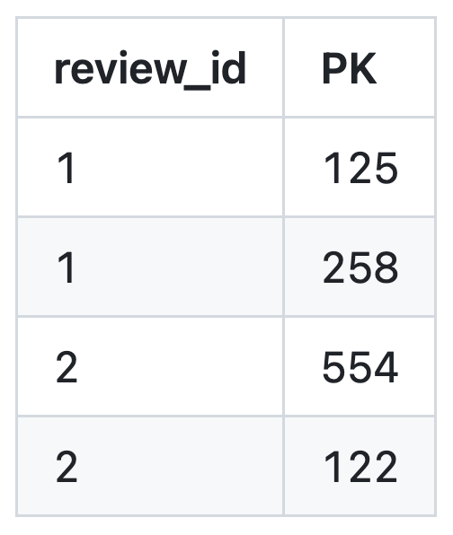
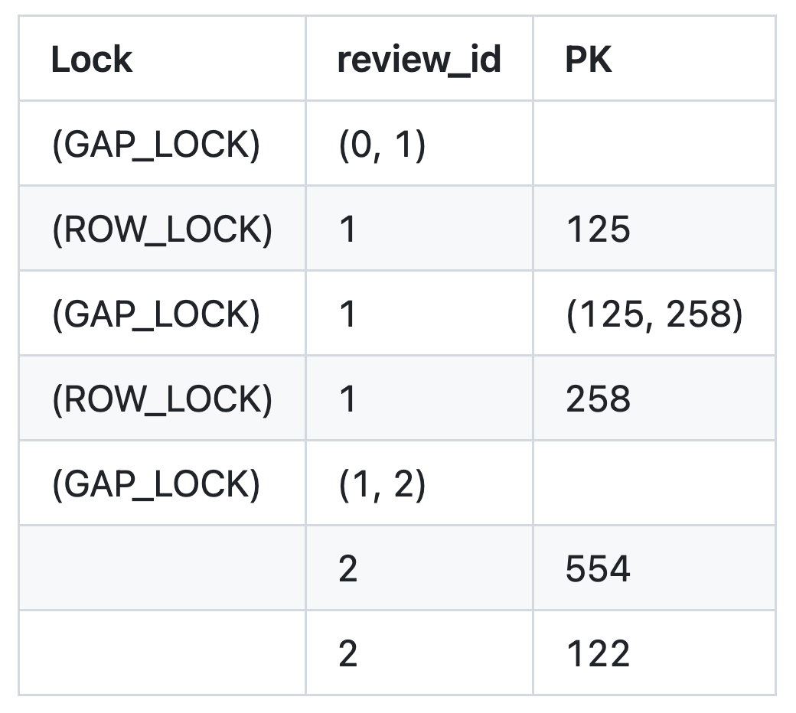
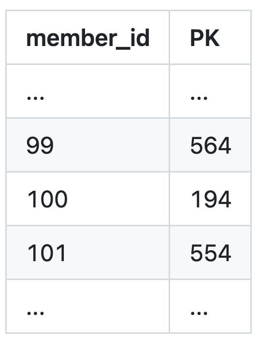
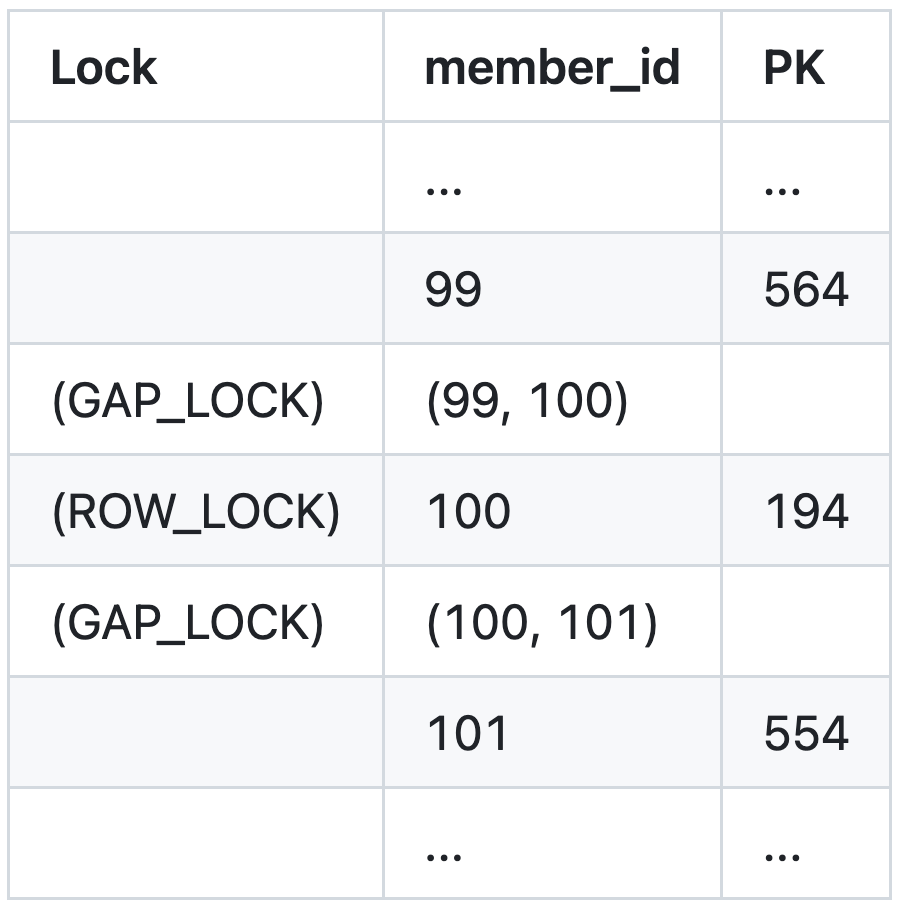
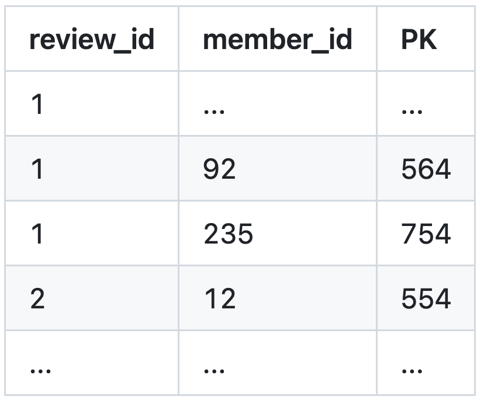
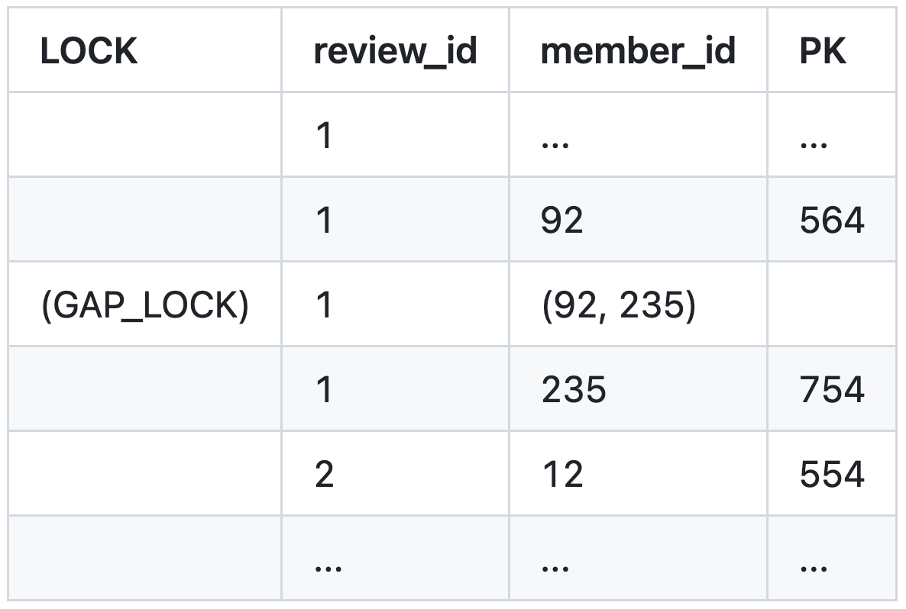

This article follows the process of solving the concurrency problems in a like feature with database locks. It explains how pessimistic locking works and examines the performance degradation caused by next-key locks.

## Like-Feature Requirements

-   Concurrency must be coordinated across servers in a multi-server environment

### Feature Specification

<strong>1) Add a Like</strong>

-   A user can like a review
-   A user can like a given review only once (prevent duplicates)
-   Concurrent requests must be handled safely

<strong>2) Remove a Like</strong>

-   Use soft deletion rather than physical deletion
-   A user can like the review again after removing the like

<strong>3) View Like Status</strong>

-   Never liked: display as inactive
-   Currently liked: display as active
-   Like removed: display as inactive

### Entity Design

Let us design a `ReviewLike` entity that determines whether a user has liked a review.

```java
@Entity
public class ReviewLike {

  @Id
  private Long id;
  
  private Long reviewId;
  private Long memberId;
  
  private LocalDateTime deletedAt;
}
```

Adding a like saves a `ReviewLike`, while removing one records the time in `deletedAt`.

### A Like Feature Without Concurrency Control

First, let us examine code with no concurrency control.

```java
@Service
@RequiredArgsConstructor
public class ReviewLikeService {
    private final ReviewLikeRepository repository;
    
    public void addLike(Long reviewId, Long memberId) {
        // Check whether the user has already liked the review
        Optional<ReviewLike> existing = repository.findByReviewIdAndMemberId(reviewId, memberId);
        
        if (existing.isEmpty()) {
            ReviewLike newLike = ReviewLike.builder()
                .reviewId(reviewId)
                .memberId(memberId)
                .build();
            repository.save(newLike);
        }
    }
}
```

At first glance, nothing appears wrong.

But then: "Click-click..."

What happens when a user double-clicks and sends two requests at the same time?

<pre class="mermaid">
sequenceDiagram
    accTitle: Duplicate likes without concurrency control
    accDescr: Two concurrent requests both find no existing like, both pass validation, and both insert a ReviewLike row, producing a duplicate.
    participant A as Request A
    participant DB as Database
    participant B as Request B
    Note over DB: Initial state: ReviewLike table is empty
    par Both requests query concurrently
        A->>DB: SELECT ReviewLike
        DB-->>A: no like found
    and
        B->>DB: SELECT ReviewLike
        DB-->>B: no like found
    end
    Note over A: Validation passes
    Note over B: Validation passes
    par Both requests insert
        A->>DB: INSERT ReviewLike
    and
        B->>DB: INSERT ReviewLike
    end
    Note over DB: Problem: two duplicate ReviewLike rows
</pre>

A race condition can occur.

If two threads query simultaneously, both find "nothing," and both proceed to save a record.

As a result:

-   One like remains even after the user removes the like
-   The like count increases twice

These side effects can occur.

### Choosing a Concurrency-Control Strategy

In a distributed system, the concurrency controls provided by the Java API alone are insufficient.

<strong>That is because requests may arrive simultaneously at different servers.</strong>

#### What About a Unique-Key Constraint?

You might think, "Can't we add a unique key on the `(member_id, review_id)` pair?" Because we use soft deletion, however, the same pair may be inserted multiple times, so it cannot remain unique.

#### Could an X Lock Solve It?

The previous article, ["Solving a Concurrency Problem with a Single UPDATE"](/blog/7/), covered concurrency control without an explicit read lock. In this case, however, <strong>we have to create data that does not yet exist</strong>, so we cannot use an exclusive lock or optimistic locking.

#### What Options Remain?

We can consider locking on a key composed of `member_id` and `review_id`.

-   Pessimistic lock
-   Named lock
-   Distributed lock

Let us examine pessimistic locking in detail.

## Pessimistic Locking

Pessimistic locking places a shared lock or exclusive lock when a transaction begins. It <strong>pessimistically assumes that the same data will be modified concurrently and locks it in advance</strong>.

In SQL, it looks like this:

```sql
-- Begin transaction
BEGIN;

-- Place a range lock based on the WHERE conditions.
SELECT * FROM review_like 
WHERE review_id = :review_id AND member_id = :member_id
FOR UPDATE;

-- INSERT if no result exists
INSERT INTO review_like (review_id, member_id) 
VALUES (1, 100);

COMMIT;
```

MySQL uses a <strong>next-key lock</strong>, which combines row locks and gap locks.

Because this technique can lock even a range in which no row exists, it appears suitable for our requirements.

The scope of the lock changes dramatically depending on the index design, however, so we need to be careful.

Let us examine each case.

### Case 01: No Index

Without an index, MySQL cannot predict where the data is—or where it would have to be inserted.

As a result, it performs <strong>a full table scan</strong> and locks every record.

Every request unrelated to the target review must wait, causing an enormous performance drop.

<pre class="mermaid">
sequenceDiagram
    accTitle: Pessimistic locking without an index
    accDescr: An update without a usable index scans the entire table and holds a table lock, forcing unrelated insert requests to wait until the update finishes.
    participant Client
    participant DB as Database
    participant A as Other client A
    participant B as Other client B
    Client->>DB: UPDATE WHERE review_id = 1 AND member_id = 100
    Note over DB: No index → full-table scan&lt;br/&gt;table lock acquired
    A->>DB: INSERT request
    Note over A,DB: Waiting for the table lock
    B->>DB: INSERT request
    Note over B,DB: Waiting for the table lock
    DB-->>Client: UPDATE complete
    Note over DB: Table lock released
    DB-->>A: Begin INSERT
    DB-->>B: Begin INSERT
</pre>

<strong>If you use a lock, you must therefore consider the index.</strong>

### Case 02: An Index on (`review_id`)

Consider an index only on `review_id`.

<pre class="mermaid">
sequenceDiagram
    accTitle: Lock contention with a review_id index
    accDescr: A lock on the review_id 1 index range serializes like requests from different users for the same review.
    participant U100 as User 100
    participant U200 as User 200
    participant U300 as User 300
    participant DB as Database
    U100->>DB: Like request — review_id = 1
    Note over DB: Lock the review_id = 1 index range
    U200->>DB: Like request — review_id = 1
    Note over U200,DB: Waiting for User 100's lock
    U300->>DB: Like request — review_id = 1
    Note over U300,DB: Waiting
    DB-->>U100: Request complete
    Note over DB: Release lock, then process the next request
    DB-->>U200: Request complete
    Note over DB: Release lock, then process the next request
    DB-->>U300: Request complete
</pre>

Suppose `user_100` runs `SELECT ... FOR UPDATE` with the condition `review_id=1`.



*Sample data for the (`review_id`) index*

MySQL places a next-key lock on the index range where `review_id=1`.



This produces the following results:

-   If several users access `review_id=1` simultaneously, all of them must wait for the gap lock
-   The more popular the review, the worse the bottleneck becomes

### Case 03: An Index on (`member_id`)

The next-key lock is placed according to `member_id`.

<pre class="mermaid">
sequenceDiagram
    accTitle: Lock contention with a member_id index
    accDescr: A user liking two different reviews is serialized because the first request locks that user's member_id index range.
    participant U100 as User 100
    participant DB as Database
    U100->>DB: Like Review 1
    Note over DB: Lock the member_id = 100 index range
    U100->>DB: Like Review 2
    Note over U100,DB: Second request waits for the first request
    DB-->>U100: Review 1 request complete
    Note over DB: Release lock, then process the next request
    DB-->>U100: Review 2 request complete
</pre>



*Sample data for the (`member_id`) index*

A bottleneck occurs when one member likes multiple reviews simultaneously.



### Case 04: An Index on (`review_id`, `member_id`)

This option is most likely to produce the narrowest lock range.

<pre class="mermaid">
sequenceDiagram
    accTitle: Next-key locking with a composite index
    accDescr: Client A locks the record and surrounding gap for composite key 1,100, so Client B's insert for the adjacent key 1,101 waits until the lock is released.
    participant A as Client A
    participant B as Client B
    participant DB as Database
    A->>DB: Request review_id = 1, member_id = 100
    Note over DB: Lock record (1,100) and the surrounding gap
    B->>DB: INSERT adjacent key (1,101)
    Note over B,DB: Waiting on Client A's gap lock
    DB-->>A: Request complete
    Note over DB: Release next-key lock
    DB-->>B: Begin INSERT
</pre>

For example, suppose the index data is arranged as follows.



*Sample data for the (`review_id`, `member_id`) index*

When querying with `review_id=1` and `member_id=150`, MySQL places a gap lock on the `member_id` range from 93 to 234.



Even this design still has the following problems:

-   It has the narrowest range, but the gap lock still covers the surrounding area
-   It inevitably affects like requests from other members

## Limitations of Pessimistic Locking

Pessimistic locking solves the concurrency bug, but throughput can fall sharply.

If 100 people like one popular review simultaneously, latency will rise significantly.

The drawbacks of pessimistic locking are as follows:

1.  <strong>Higher database load</strong> — The database handles all concurrency control
2.  <strong>Broad next-key lock scope</strong> — More of the index is locked than necessary
3.  <strong>Occupied database connections</strong> — A connection remains held while waiting for the lock

Given these drawbacks, pessimistic locking is suitable when:

-   The service has low or moderate traffic
-   Data consistency is the highest priority
-   You want to minimize implementation complexity (`SELECT ... FOR UPDATE` makes implementation simple)

### Is There a Better Solution?

<strong>There is no single correct answer to the question, "Which lock is best?"</strong>

The important thing is to choose a suitable locking strategy based on the service's characteristics, expected traffic, and acceptable complexity.

Traffic for social features such as likes tends to concentrate on specific content, so a named lock or distributed lock may be a better choice than pessimistic locking.

-   <strong>Named lock</strong> (MySQL)
-   <strong>Distributed lock</strong> (Redis, ZooKeeper, and others)

If you want to learn more about Redis distributed locks, I recommend ["Myths and Facts About Lettuce Distributed Locks"](/blog/9/).

## Concurrency Series

-   [Relearning Java Concurrency Control from the Ground Up](/blog/11/)
-   [Solving a Concurrency Problem with a Single `UPDATE`](/blog/7/)
-   Understanding Next-Key Locks Through a Like Feature
-   [Myths and Facts About Lettuce Distributed Locks](/blog/9/)
-   [Separating Concurrency-Control Code with AOP](/blog/13/)
