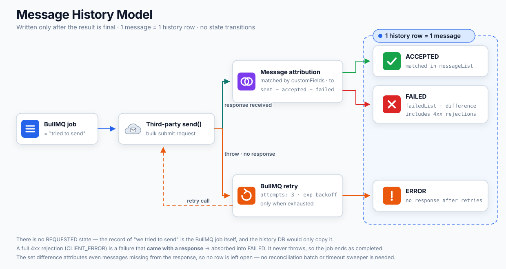
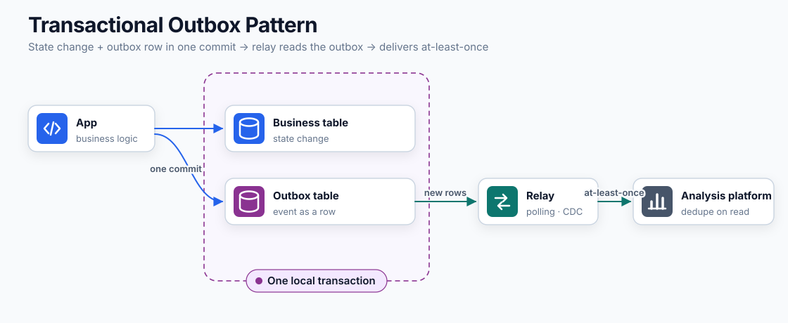
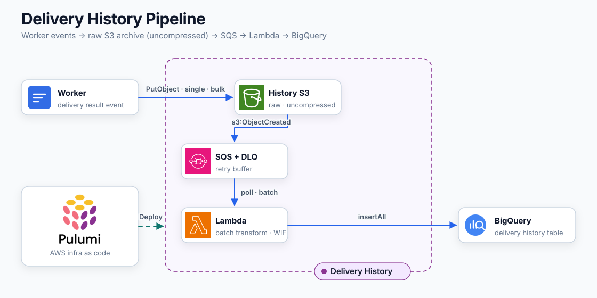
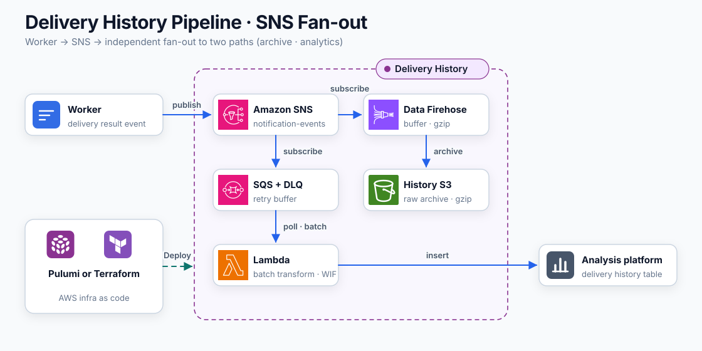
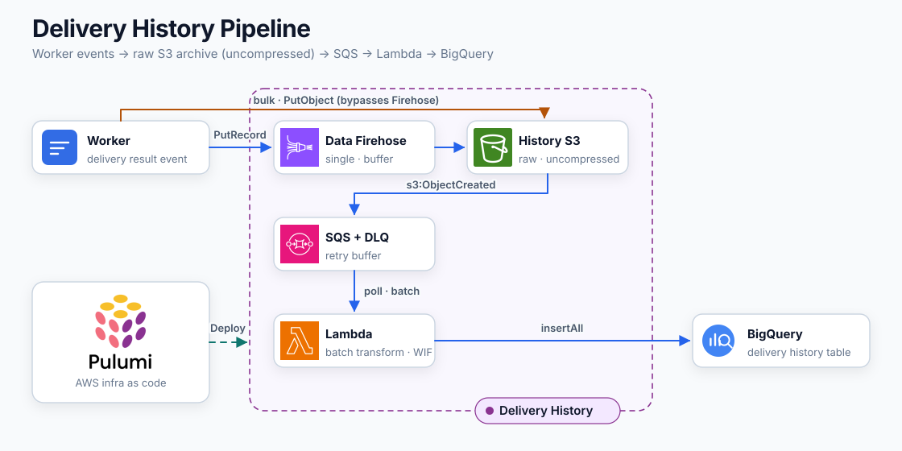
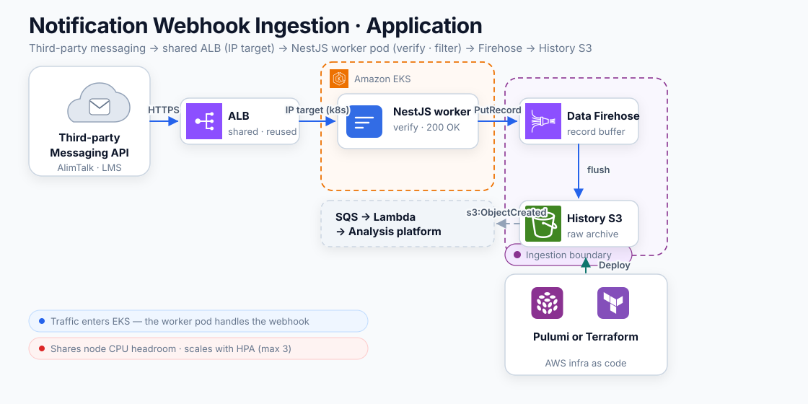
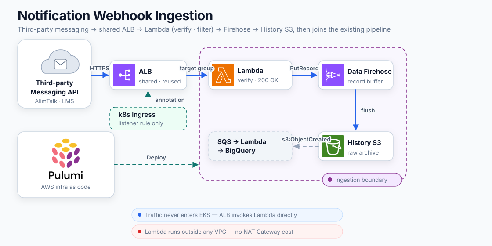
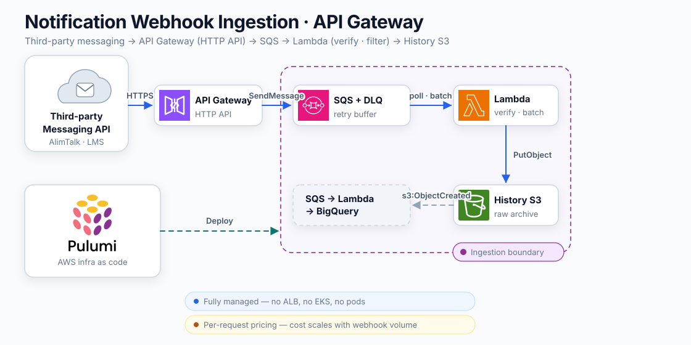

## Introduction

[Part 1](/blog/20) and [Part 2](/blog/21) were about getting messages out reliably. This post is about what comes after they are sent.

What was sent, when, to whom, and with what result has to be recorded somewhere. The question is where. I will weigh a relational database, a serial S3 pipeline, SNS fan-out, and a Firehose route against each other.

The order is problem → data → design → storage. Storage is an implementation detail, so it felt right to choose it last.

## The problems we were living with

A third party does the sending for us, and its console keeps the full history. You might think that with good use of the third party there is no reason to store the data ourselves. Run a notification system for a while, though, and you will hit the problems below.

- <strong>We cannot answer "what went to this user, and when" on our side.</strong> The console can search by messageId or groupId, but not by anything in our operational DB. Every CS inquiry means a human cross-referencing the console against our DB.
- <strong>We cannot aggregate failure rates over a period.</strong> The list of failures is in our hands only at response time. If we do not record it then, we cannot reconstruct yesterday's failure rate. Calls that threw outright — network issues, 4xx/5xx — leave no history on the third party's side either, so they do not even enter the denominator.
- <strong>We cannot see what content actually went out.</strong> The console's CSV and Excel exports omit template variables.
- <strong>Retention is six months and the query API is rate-limited.</strong> The moment you want to compare against the same period last year, the data is gone, and the 20-calls-per-5-seconds limit meant frequent 429s when the admin screen leaned on it for lookups.

<strong>Delegate the act, but never the data.</strong>

## What needs to be recorded

What data, stored how, would solve the problems above?

First, <strong>the unit of record is one recipient.</strong> A single submission request carries multiple recipients, and with the request as the unit we could not answer the first problem. A CS inquiry always needs the full history of one person. Some information exists only at the request level, though, so there are two layers: group and entry.

The data to keep falls out of the problems one by one.


| Problem | Data to keep |
| --- | --- |
| Cannot search by user | Our recipient identifier, send time |
| Cannot count failure rates by period | Final result and failure reason per message |
| Thrown calls missing from the denominator | A failure record we write ourselves even without a provider response |
| Cannot see what went out | The content after variable substitution |
| Cannot split by template or channel | Template and channel identifiers |


Some conditions do not map to data fields. <strong>Retention is at least two years.</strong> Comparing against the same period last year requires that much. The history must also <strong>join with the user table in the operational DB</strong>, without loading the operational DB, to measure per-channel performance and retention. Last comes <strong>a place to archive the raw original</strong>. Once the history is transformed into our schema and loaded, we need a source to return to when the transformation was wrong or a new question comes up. As long as the original survives, both backfill and reprocessing stay possible.

The query patterns will look roughly like this.

- Failure rates and reason distributions by period
- Performance by template and channel
- Response and retention analysis joined with the user table
- Per-recipient history lookups for CS inquiries

Aggregations and bulk reads dominate.

Writes are bulk appends and reads will mostly be scans.

## Design first

There were three things to settle about how this data gets stored. All three are questions that can be answered without assuming any particular storage, and each answer stacks one more property the storage will have to provide. The reverse direction exists too, of course. If a storage offers a property attractive enough, an answer made here can be revisited. That review happens in the section where the storage is chosen.

### 1. Are sending and history the same concern?

Sending a notification and monitoring outcomes through history are different concerns. Sending is about getting this message out right now, and it must not fail. History is about collecting the results to ask questions later. Its consumers are CS tracing, failure-rate aggregation, and performance analysis, so minutes of delay are fine, and losing a record — rarely — costs exactly one record. The two have opposite requirements.

Tie two different concerns into one flow and a by-product's failure propagates into the main function. In a structure that writes history inside the same transaction and completes the send only after the write succeeds, a dead history store stops sending. An alimtalk that does not go out because the analysis platform got slow is, for example, hard to accept.

There are cases where the two genuinely are one concern: when writing history is a precondition of sending. For communications where regulation says "no record means it was not sent," binding them is correct and completeness is what you get in return. The state "sent successfully but no history" cannot exist at all.

In our requirements, history was not a precondition of sending. <strong>Keep the two independent and cut the dependency with events.</strong> The worker publishes the send result as an event and does not wait for storage to succeed. If publishing fails, sends keep going out and the failed event is retried outside the send flow. If even the retries fail, a window remains where the send happened but the event is gone; we accept that window as rare record loss. Results that got a response can be backfilled from the provider console, but thrown calls have no history on the other side, so not even that. Cutting with events brings something along too: the responsibility of reshaping data into the storage's schema also leaves the sending code.

This is where the storage picks up a condition: it accepts events from outside the send path, and a failed write does not stop sending.

### 2. When do we finalize a record?

There are two roads: create a row at submission time and transition its state, or write once after the result is finalized.



The state-transition approach can observe in-flight sends. How many are waiting for submission right now, which group is stuck — it all shows up in the history directly. Above all, <strong>even when the call itself throws, a "we tried to send" row is already there.</strong> The thrown calls that fell out of the denominator are simply caught here. The price is unresolved rows. A row that never gets a response stays `REQUESTED` and cleaning those up takes a sweep.

The record-after-finalization approach ends with one message as one history row and no state transitions. No unresolved rows means no sweep, and volume does not multiply by the number of states. The price is that in-flight status is invisible in the history and thrown cases are recorded only after retries are exhausted.

<strong>We chose record-after-finalization.</strong> The fact of submission already lives in the BullMQ job; if the history DB copied it, volume would grow and the two records could drift apart. Progress can be watched on the queue dashboard. Three statuses remain.


| Status | Meaning | Published when |
| --- | --- | --- |
| `ACCEPTED` | Submission succeeded | Matched in the response's success list |
| `FAILED` | Submission failed | Matched in the response's failure list |
| `ERROR` | The provider call itself threw | Retries exhausted or not retryable |


One thing to pin down: all three describe <strong>the outcome up to submission</strong>. Even `ACCEPTED` means the provider accepted the request, not that the message reached a device. Actual delivery is a separate event the provider reports much later via webhook, and <strong>that result is also appended to the history from the webhook.</strong> Same method: not editing an already-written row, but appending the finalized result as a separate event. The no-state-transition principle survives the webhook. Where to receive that webhook is weighed after the storage is chosen.

Record-after-finalization comes with one invariant to keep: <strong>after processing one response, every message sent in that request must end up with a terminal status.</strong> The moment a message lands in none of the response's lists and stays unresolved, the sweep we said we did not need is back. So the matching rules are written to attribute everything, with nothing left over. The concrete matching depends on the provider's response format — an implementation matter — so the design stops at this invariant.

A request rejected wholesale with a 4xx is still a failure that received a response, so it is absorbed as `FAILED` and does not throw. The job ends `completed`. The point is not to spend `attempts` on failures that retries cannot change. Only when no response arrives at all does the handler throw, and when BullMQ exhausts its three attempts, `ERROR` is recorded.

All the storage needs here is append. No UPDATE, and no batch that scans for unresolved rows.

### 3. Where do we guarantee history idempotency?

Retries are everywhere. BullMQ can run a job again and the same event can flow twice through the middle of a pipeline. Each time, the same send can be written into the history twice. What we settle here is <strong>history idempotency</strong>: one send must be one record in the history. Send idempotency — not sending the same message twice — is a separate problem and comes back in the storage section. There are broadly two places to filter: mid-flow, or the final history.

Making exactly-once in the middle of a pipeline needs one more stateful store that remembers processed keys. That store becomes a new point of failure, and eventually you are back at the question of who deduplicates the deduplicator.

<strong>We left delivery at-least-once and put history idempotency at the final place where the history is consumed.</strong> However many times the same event flows through the middle, it is enough that one message reads as one row at consumption time. The means belong to the storage. If it can enforce uniqueness, a PK or UNIQUE settles it at load time; if it cannot, filter at query time.

There is one premise. However many times the same send is retried, <strong>its identifier must not change.</strong> If the identifier cannot serve as a key, no layer can recognize a duplicate.

The condition on the storage is a means of guaranteeing uniqueness. Per message or per send group — either works.

### Projecting the decisions onto the data

Settle the three and the data's shape follows. The abstract items from the requirements section become concrete fields here for the first time. The recipient identifier is `user_id`, the final result `status`, the failure reason `status_code`, the sent content `variables`.

```typescript
export type NotificationHistoryGroup = {
  group_id: string;   // based on the BullMQ job.id — fixed across retries
  sent_at: Date;
  template_type: string;
  notification_type: string;
  entries: NotificationHistory[];
};

// entry in a group = one recipient's result
type NotificationHistory = {
  message_id: string;
  user_id: number;
  status: 'ACCEPTED' | 'FAILED' | 'ERROR';
  status_code?: string;
  variables?: Record<string, string>;
};
```

The decisions are embedded all over this shape. `REQUESTED` missing from `status` is the result of decision 2, writing only after finalization. `message_id` as the idempotency key is the result of decision 3. Fixing `group_id` to the job.id is the same thread. Only when the group identifier survives repeated runs of the same job can any layer recognize a duplicate. Had the decisions gone the other way, this type would carry `REQUESTED` and state-transition timestamps.

The shape itself adds one more condition on the storage. <strong>The nested group-and-entries structure must be flattenable into two units.</strong> This single condition later eliminates one option outright.

### What the design demands from storage

With the three settled, this is what remains to ask of the storage.

- Writable from outside the send path
- Can flatten the two-layer group/entry structure into two units
- Append-only is enough (no UPDATE, no sweep)
- Has a means of per-message uniqueness (a constraint, or a controlled query surface)
- Has a place to archive the raw original
- Plus what came from the initial conditions — aggregation scans, two-year retention, joining the user table

## Now we pick the storage

Four options, one yardstick. On top of the conditions above I added three axes where storages differ: when the storage splits in two, does divergence fix itself (consistency); how long until a write shows up in queries (freshness); how many things there are to run, and at what cost (operational burden).

### 1. A relational database

<pre class="mermaid">

flowchart LR
    accTitle: A dedicated relational DB for history
    accDescr: The worker writes a message row with REQUESTED status right before calling the provider, then appends the closing status and the provider identifiers after the response. Analytics requires moving the data again into the analysis platform through a separate pipeline.
    W["Worker"] --&gt;|"before the call"| M[("message<br/>status: REQUESTED")]
    W --&gt;|"after the response"| S[("status: ACCEPTED · FAILED · ERROR<br/>provider: groupId · messageId")]
    M --&gt; SQL["SQL queries<br/>CS · ops"]
    S --&gt; SQL
    SQL -. "re-load for analytics" .-&gt; AP["Analysis platform"]

</pre>

By the design section's decisions, this option starts at a disadvantage. There is still a reason to examine it first: it is <strong>the only candidate that lets design decisions 1 and 2 be answered the other way.</strong> The other three do not offer that choice. So the question here is whether it pays enough to reopen those decisions.

Write the message row with `REQUESTED` right before the provider call and close it after the response, and even a call that throws wholesale leaves a trace. No waiting for retries to run out. Idempotency is caught by a constraint, too.

```sql
UNIQUE KEY uk_message_id_status (message_id, status)
```

If an `INSERT IGNORE` of `REQUESTED` inserts zero rows, this send was already attempted. Throw `UnrecoverableError` on the spot to cut BullMQ's retries and duplicate sending is blocked at the source. Filtering duplicate history is something every option can do. But <strong>preventing duplicate sends themselves</strong> is possible only when you record before sending, into a store with constraints.

On top of that, a single store means consistency problems cannot arise, and writes are readable immediately, so freshness is the best of the four. It is familiar, has migration tooling, and queries are plain SQL.

There were three prices to pay.

#### The closing UPDATE becomes a bottleneck

Each message gets a different identifier back from the provider, so after the response you end up issuing an UPDATE per row. I measured on local MySQL 8.4, assuming 20,000-message chunks.


| Closing method | `flush_log=1` | `flush_log=2` |
| --- | --- | --- |
| 19,000 per-row UPDATEs | 8.8 s | 6.6 s |
| 19 multi-row INSERT chunks | 0.56 s | 0.56 s |


Relaxing `innodb_flush_log_at_trx_commit` shaved only 25%. <strong>The bottleneck was not fsync but the number of commits</strong> — 19,000 commits versus 19.

There is a fix. Stack the provider identifiers insert-only into a separate table with `UNIQUE(message_id)`, and closing becomes a single multi-row INSERT, with duplicate responses filtered by the key. But that is only if you design it that way. UPDATE the message rows as first drawn, and bulk sends hit the bottleneck as-is.

#### You clean up unresolved rows yourself

The price of recording before sending. If the call went out but the worker died before writing the response, the row stays `REQUESTED`. We cannot tell from our side whether the submission was accepted, so automatic resending is dangerous too.

Hence a sweep. Every 10 minutes, over the last 24 hours, find rows 30 minutes past `REQUESTED` with neither a closing status nor a provider row, and raise them as metrics. A human checks the provider console for whether the send actually left and re-registers only the ones that did not. <strong>The operational burden is born in this cycle, not in code.</strong>

#### You end up owning another instance

Putting it in the operational DB was the first option on the table. Joins work and foreign keys work. Volume killed it. During the regular tax-filing season we sent an average of 620,000 messages a day, 26 million over the period, clustered unevenly by hour. In a year that is 40–50 million message rows and over 100 million status rows. Those writes compete with operational transactions for buffer pool and IOPS.

There is one more reason to separate. `flush_log=2` in the table above is <strong>an instance-wide setting</strong> and cannot be split per table. History can lose a second of writes — the provider can backfill it — but payments cannot. With both workloads on one instance, relaxing durability only for history is not even an available choice.

So you stand up a separate instance, and schema migrations, purge batches, and the personal-data deletion pipeline all become that instance's problem. We decided to keep only 12 months online. Then monthly partitioning collided with the UNIQUE key structure used as the idempotency guard, so it became PK-range chunked deletes. Settle one thing and another follows — it keeps growing.

There was a small one that shows the option's character, too. Put a provider throw's raw error message into `error_message VARCHAR(500)` and the attached URL and response-body fragments easily push past 500 characters. In strict mode that is not a truncation but a failed INSERT. <strong>The INSERT that records an error fails because of the error message's length.</strong> With fixed-schema storage, these holes get plugged one by one.

#### When this option is still the right one

The query-pattern problem never goes away. Three of the four patterns are aggregations, so indexes hold out for a while, the data eventually gets moved once more into the analysis platform, and RDS becomes a waypoint. Even so, if any of the following applies, this option is the simplest.

- You need immediately consistent reads right after sending. If some screen breaks when a sent message is not in the list yet, minutes of delay are unacceptable.
- History is a precondition of sending. If writing history is itself duplicate-send prevention, as with the `INSERT IGNORE` guard, the answer to design decision 1 changes.
- Volume is small. If plain SQL covers the aggregations, there is no reason to split storage in two.
- The organization has no analytics platform. Without a separate analysis platform, the double-loading downside does not even exist.

Whether these four apply is what decides for or against this option.

> #### Aside — the transactional outbox pattern
>
> A pattern for when a DB state change and an event publish must be bound atomically. Instead of emitting the event on the spot, the same transaction writes it as a row into an outbox table, and a separate relay reads those rows and pushes them out. If the commit happened, the event is guaranteed to leave, so the dual-write problem — state changed but the event lost — disappears.
>
> 
>
> There is a price. A relay is one more thing to operate and freshness lags by the relay's cycle. Delivery is at-least-once, so consumers need idempotency too.
>
> The reason it was not a candidate is single: the pattern holds when the state change is a local transaction, and our send's state change is a provider HTTP call — it cannot go inside a transaction. Using an outbox would mean bringing a transactional store into the send path first, and the dependency decision 1 cut would be back.
>
> If you chose the relational DB option, though, the pattern follows naturally. The message row is the outbox row and the re-loading that moves data to the analysis platform is the relay. What I called a waypoint above is this structure.

### 2. A serial S3 pipeline



The worker's job ends at writing the event to S3; object-created notifications flow through SQS to Lambda, then on to the analysis platform. Loading sits outside the send path, Lambda flattens the nested structure into two tables, and aggregation is the analysis platform's job. It fits the design's conditions as-is.

<strong>S3 as the single source of truth</strong> is the heart of this structure. The two stores cannot drift, and if the analysis-platform side loses data, replaying the objects is the backfill. Nobody cross-references anything by hand.

There is a reason SQS sits in the middle. S3 can send events only to SNS, SQS, Lambda, or EventBridge, and <strong>with default settings, SNS and Lambda drop an event once retries are exhausted, keeping nothing.</strong> In an environment that occasionally hits the Lambda concurrency limit, that is silent loss. To keep the failures you end up attaching SQS as a DLQ anyway, so putting SQS in the path from the start is the better move. With up to 14 days of retention and a DLQ on top, it becomes the retry buffer.

The price is that it is serial: when the front clogs, everything behind falls behind with it. But it slows rather than stops, and once recovered it catches up on the backlog by itself.

If consumers are mostly after-the-fact analysis that tolerates seconds to minutes of delay, and the archived original and the analysis tables must always agree, this is the structure. If real-time is a requirement, look at the next option.

### 3. SNS fan-out



The worker publishes to SNS and SNS broadcasts to the archive path and the analysis path. Decoupled from sending like the previous option, with a new property on top: <strong>the two paths are independent.</strong> An S3 outage does not block analysis-platform loading and freshness becomes seconds.

What it gives up is consistency. If only one side fails, S3 and the analysis platform sit divergent until someone runs a backfill script. What was "falls behind, then catches up" in the serial option becomes "stays divergent" here. There is one more resource to manage, and SNS's 256KB message limit means logic to split bulk-send events. Cost grows by SNS publish and delivery over serial: about $3–4 a month at baseline, around $13 at peak.

This option fits when failure rates must sit on a real-time dashboard or anomalies must be caught within seconds. <strong>In the end it is a question of buying freshness or buying completeness.</strong> Our consumers were all after-the-fact analysis, so paying consistency and manual backfills for second-level freshness had a weak case.

### 4. Going through Firehose



It sits alongside the previous two but is a slightly different kind of thing. It only changes how data gets into S3, so <strong>it can be inserted in front of either the serial or the fan-out structure.</strong>

The reason to insert it is cost. S3 has no API for uploading multiple objects at once, so with many single-recipient sends, one job becomes one object. At peak that is over 11 million PUTs a month, and the bill follows.


| Monthly cost at peak | Direct S3 PUT | Via Firehose |
| --- | --- | --- |
| PUT · ingest | ~$56.7 | ~$1.84 |
| Per-object SQS · Lambda | ~$16.4 | ~$0.05 |
| Total | ~$73 | ~$1.9 |


Buffer and batch and the gap disappears; Firehose means not building that buffering yourself. But <strong>it bills every record rounded up to a 5KB multiple.</strong> A single-send job is actually 555B, billed as 5KB — nine times over. Real usage of 12.7GB turning into 63.3GB on the bill is this structure at work. The absolute amount still favors Firehose.

Three factors make the cheaper side not the pick.

- One more thing to manage. Stream configuration, buffer size, and flush interval all become operational surface.
- It waits for the buffer to fill, so freshness lags by the buffer interval: 60 seconds means a minute, 900 seconds means fifteen minutes.
- <strong>Files cannot be split per send group.</strong> Nested NDJSON rules out dynamic partitioning. Bulk sends are already batches, so they are better off bypassing Firehose, and then the path forks in two. That is what the picture shows.

This option fits when S3 is pure archive, never queried directly and never the backfill source. If, conversely, one object must correspond to one send group, you pay the PUT bill in exchange for that simplicity.

### Side by side


| Criterion | Relational DB | Serial S3 | SNS fan-out | Via Firehose |
| --- | --- | --- | --- | --- |
| Aggregation queries | Indexes hold, then hit a wall | Analysis platform's job | Analysis platform's job | Analysis platform's job |
| Coupling to sending | Propagates if synchronous | Cut | Cut | Cut |
| History idempotency | At load time, by constraint | Dedup at query time | Dedup at query time | Dedup at query time |
| Unresolved rows | Sweep needed | None | None | None |
| Consistency | Single store | Self-healing | Manual backfill | Self-healing |
| Freshness | Immediate | Seconds to minutes | Seconds | Buffer interval (1–15 min) |
| Things to manage | Instance · sweep · purge · PII | S3 · SQS · Lambda | Those + SNS | Those + the stream |
| Monthly cost, baseline | ~$70 | ~$11 | ~$15 | ~$5 |
| Monthly cost, peak | ~$360 | ~$79 | ~$92 | ~$7 |


Costs all assume direct S3 PUTs. The Firehose column is with it inserted into the serial option; inserted into fan-out it becomes ~$8 baseline and ~$21 at peak.

The flip at peak stands out. At baseline the serial option is six times cheaper than the relational DB. Toward peak, PUT requests dominate the bill and it climbs to $79, close to the relational DB. Insert Firehose in that regime and it drops nearly tenfold again. The relational DB moves the other way: more volume means a bigger instance, and the gap widens.

Our choice settled like this. The relational DB gave us no reason to reopen decisions 1 and 2. History was not a precondition of sending, and we did not need pre-send records. With no immediate-read requirement either, it was out. Among the remaining three we picked serial S3 on baseline operational burden. Something was given up in the folding. This structure has no guard that records before sending to block duplicate sends at the source, so we accept duplicate sends in the rare case where a worker dies after the call but before recording the result. If peak becomes the norm, inserting Firehose is the next move — swap the front without changing the structure.

### Two options that did not make the table

<strong>The analysis platform's managed ingestion service</strong> keeps everything up to S3 and delegates periodic loads. Zero lines of code and near-zero cost. But it loads files as-is, so it cannot flatten the nested structure we settled on into two tables. One condition, straight elimination. A loading delay of at least 15 minutes, and platform-side configuration that requires knowing AWS, also factor in. If your events have no nesting, this is the cheapest and simplest answer.

<strong>Caching over the third party's query API</strong> inherits every problem listed at the start. It stays bound to six-month retention and the 429 limit, and thrown calls have no history on the other side to begin with. For simple point lookups, though — showing one user's recent sends — this side actually wins. The analysis platform charges in proportion to data scanned, and backing a frequently opened screen with scans is waste. Different roles; neither replaces the other.

## Where to receive webhooks

Decision 2 said delivery results arrive by webhook and are recorded as separate events. What remains is the receiving side. Everything so far was us pushing outward; a webhook is the third party calling us — inbound. An HTTP endpoint has to open.

Start with the workload's shape: <strong>low-volume and spiky</strong>, near-silent normally and then a burst right after a bulk send. And the third party resends the same result if it gets no response. Duplicates can arrive, but by decision 3's principle they are filtered at the history layer, so the receiver does not have to care. The receiver's job narrows to three things: validate the request, keep only terminal statuses and drop intermediate ones, return 200 immediately and hand off loading asynchronously.

The destination already exists. Put validated, filtered events into the history S3 and the pipeline built above takes it from there. A bonus of designing around S3 as the single source: <strong>one more inflow changes nothing downstream.</strong> So all that is weighed is the front, HTTPS to S3, and as seen above, Firehose can be inserted if buffering is needed.

### 1. Shared ALB to the application



Receive webhooks as plain service code. The ALB routes straight to pods in the cluster and the pod validates, filters, and loads. Deployment, logging, and observability match the existing service, and if validation or filtering ever needs domain logic, the code is right there to reuse.

In exchange, spikes contend with the service for resources. Webhooks surge exactly when a bulk send just finished — when workers are busiest — and until HPA scales out, they share node CPU. If webhook handling needs the service's code and data, or the team does not want more managed pieces, this option is the fit.

### 2. Shared ALB to Lambda



Keep the ALB and swap the target from pods to Lambda. <strong>Traffic never enters the cluster.</strong> Lambda validates, returns 200 immediately, and hands off to S3. Run it outside the VPC and there is no NAT Gateway cost either.

The price is split ownership. Routing rules live in k8s Ingress annotations while the Lambda is managed by IaC, so the boundary sits in two places. This option fits when a shared ALB already exists and the receive load should be isolated from service resources.

### 3. API Gateway



The option that leaves our infrastructure entirely. API Gateway's native SQS integration puts requests straight onto the queue. <strong>No compute at ingestion time.</strong> Lambda pulls batches, validates, keeps only terminal statuses, and writes to S3. No load balancer, no cluster, all managed and billed per request — spikes are absorbed by SQS and baseline cost converges to zero.

In exchange, validation moves behind the queue. A request with a bad signature still enters the queue and is filtered only at consumption time. If there is no infrastructure to reuse, or the receiver should be fully separated from the sending infrastructure, this option is the fit.

### A precondition before turning it on

Cost is not decisive — all three land at tens to a few hundred dollars a year. The axes that split them are <strong>who absorbs the spike</strong> (pods, Lambda concurrency, or the queue) and where the management points appear.

And whichever path is chosen, something must be sorted out first. <strong>Webhooks arrive per account.</strong> Results of sends that left outside our system — manual console sends, external tool integrations — arrive at the same endpoint. A result with no history to match against piles up only as an orphan row with no content. Unifying all sending through the system comes first, which is also why we did not rush the receiver choice.

## Wrap-up

The structure became S3 as the single source of truth, flowing through SQS and Lambda into the analysis platform. Day-partitioned on `sent_at` with a two-year expiry and clustered by `user_id`. History idempotency is guaranteed, per the decision, at the final history layer. Since the analysis platform's PK does not enforce uniqueness, the means is a dedup view keyed on `message_id`. Personal-data deletion requests are handled with `user_id`-based DML on the analysis platform, while the effectively immutable S3 objects are covered by a three-year lifecycle expiry. The cost the relational-DB option would have paid as a deletion pipeline, this structure pays as the interval the original lingers before expiring. The leg where Lambda writes to the analysis platform uses Workload Identity Federation — shipping a service-account key JSON brings rotation burden, and a leaked key is valid indefinitely. Delivery-result webhooks also join the same S3 after validation only. The receiver path gets fixed once sending is unified.

With the problem and the design drawn first, picking the storage turned out to be almost mechanical. Hold each candidate against the conditions and the field narrows by itself. Had we picked the storage first, the history model would have been pulled toward whatever that storage does well.

The design decisions themselves hang on conditions, of course. <strong>Are sending and history the same concern</strong> is the first button. Answer "the same" — history as a precondition of sending — and the options narrow while the guarantees strengthen; the relational DB blocking duplicate sends with a single `INSERT IGNORE` is that guarantee. Answer "different" and delay and duplicates become acceptable; the options widen and you build that guarantee yourself. Answering this question first and weighing the rest after — that is the order.

## References

- [Transactional outbox pattern](https://microservices.io/patterns/data/transactional-outbox.html)
- [Amazon S3 Event Notifications](https://docs.aws.amazon.com/AmazonS3/latest/userguide/EventNotifications.html)
- [Amazon Data Firehose pricing](https://aws.amazon.com/firehose/pricing/)
- [MySQL `innodb_flush_log_at_trx_commit`](https://dev.mysql.com/doc/refman/8.4/en/innodb-parameters.html#sysvar_innodb_flush_log_at_trx_commit)
- [Workload Identity Federation](https://cloud.google.com/iam/docs/workload-identity-federation)
