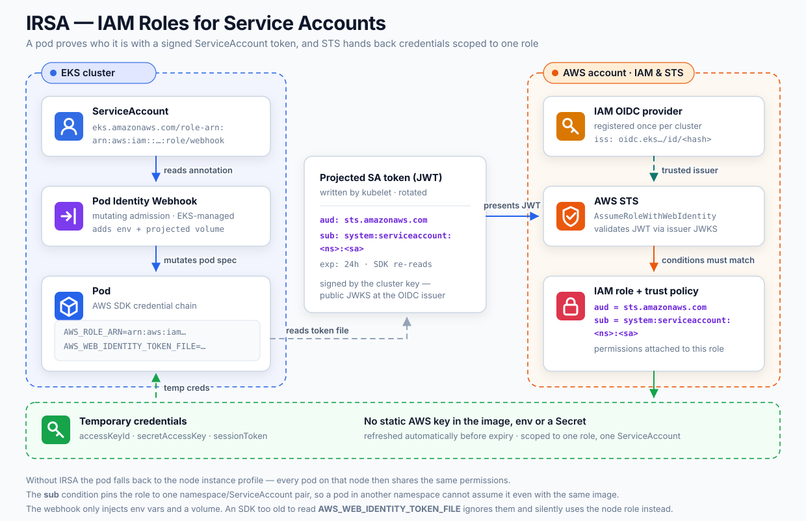

import PasswordlessAuthDemo from "@/materials/24/PasswordlessAuthDemo";
import PrivilegesTimingDemo from "@/materials/24/PrivilegesTimingDemo";
import TrustChainDiagram from "@/materials/24/TrustChainDiagram";
import PrivilegesOrderDiagram from "@/materials/24/PrivilegesOrderDiagram";

## Introduction

An application's database access splits into two layers of a different nature.

- **Authentication** — is this process allowed to connect to the DB
- **Authorization** — once connected, what can it do

The two layers are owned by different systems, too. For an application running on Kubernetes, authentication is decided by cloud IAM and authorization by the database engine. This post walks through how to set up each layer so that no stored password exists anywhere and privileges stay minimal, focusing on the principles.

The first half assumes AWS EKS and RDS; the second half (privilege design) applies to PostgreSQL anywhere.

---

## Part 1. Authentication — removing the password

### IRSA — how a pod proves who it is

IRSA (IAM Roles for Service Accounts) ties a Kubernetes ServiceAccount to an IAM role. This one link lets a pod obtain AWS credentials without carrying an access key.



Broken into steps, the flow goes like this.

① Annotate the ServiceAccount with a role ARN.

```yaml
apiVersion: v1
kind: ServiceAccount
metadata:
  name: myapp
  annotations:
    eks.amazonaws.com/role-arn: arn:aws:iam::<account>:role/myapp-db
```

② The Pod Identity Webhook mutates the pod spec. It is a mutating admission webhook managed by EKS. When a pod is created, it reads the annotation above and injects two things.

- The environment variables `AWS_ROLE_ARN` and `AWS_WEB_IDENTITY_TOKEN_FILE`
- A volume to hold the projected service account token

This is the part that is hard to see the first time. You wrote a single annotation line in the manifest, yet environment variables show up inside the container — this webhook is why.

③ kubelet writes a JWT to a file. The projected token is a JWT signed with the cluster key, and its main claims are:

```
aud: sts.amazonaws.com
sub: system:serviceaccount:<namespace>:<serviceaccount>
exp: 24h by default (kubelet renews it before expiry, the SDK re-reads it)
```

**`sub` is the identity itself.** The combination of namespace and ServiceAccount name is the "who".

④ The AWS SDK calls STS. When `AWS_WEB_IDENTITY_TOKEN_FILE` is present, the SDK's credential chain reads that file and calls `AssumeRoleWithWebIdentity`. Application code has nothing to do.

⑤ STS verifies the JWT. How it verifies matters: STS does not ask the cluster. It fetches the public JWKS of the issuer registered as an OIDC provider in IAM and checks the signature. That is why every cluster needs its OIDC provider registered once.

If the signature holds, STS matches the conditions in the role's trust policy.

```json
"Condition": {
  "StringEquals": {
    "oidc.eks.<region>.amazonaws.com/id/<hash>:aud": "sts.amazonaws.com",
    "oidc.eks.<region>.amazonaws.com/id/<hash>:sub": "system:serviceaccount:myapp-dev:myapp"
  }
}
```

If `sub` differs from the condition, the call is refused, so a pod in another namespace cannot steal the same role.

⑥ Temporary credentials are issued. An access key, a secret, and a session token, valid for one hour by default. The pod uses these to call AWS APIs.

To sum up, IRSA's chain of trust links together like this.

<TrustChainDiagram lang="en" />

**There is no stored password anywhere.** The thing that could leak does not exist. That is the heart of this design.

### RDS IAM authentication — turning temporary credentials into a DB token

Now the pod has to reach the database. RDS can accept an IAM token in place of a password.

Here is the part that is easy to get wrong: issuing the token is **not a network call.** The SDK takes the temporary credentials and SigV4-signs a URL of a specific format — a local computation. That signature string goes straight into the "password" slot.

> **SigV4 (AWS Signature Version 4)** — the standard way AWS API requests are signed. HMAC-sign the request content and timestamp with your secret key and AWS can verify that an untampered request came from the owner of that key, without ever receiving the secret. Every AWS SDK call uses this signature internally, and an RDS IAM token is that signature applied to a connection URL.

```ts
postgres({
  host, port, database, username,
  // a function runs on every new connection → a fresh token each time
  password: () => signer.getAuthToken(),
  ssl: 'require',   // IAM auth requires TLS
})
```

`require` only encrypts the connection; it does not verify the server certificate. Since the token is the password, production is safer pinning the RDS CA bundle and verifying at the `verify-full` level.

A token lives for 15 minutes. Mint a fresh one per connection and an expired token never gets reused. The signature carries the IAM identity, which is how RDS can judge whether the request came from a principal holding `rds-db:connect`.

The IAM policy looks like this.

```json
{
  "Effect": "Allow",
  "Action": "rds-db:connect",
  "Resource": "arn:aws:rds-db:<region>:<account>:dbuser:<cluster-resource-id>/myapp_dev_app"
}
```

The DB account name is baked into the Resource, so the dev role can only connect as the dev DB account. The production account name is not in this policy, so even a freshly minted token gets refused.

### grant rds_iam — the switch on the DB side

That was the AWS side; the DB needs one matching setting.

```sql
create user myapp_dev_app with login;
grant rds_iam to myapp_dev_app;
```

`rds_iam` is a PostgreSQL role that RDS/Aurora pre-creates inside the instance. The grant statement itself is ordinary, but `rds_iam` does not exist in a stock PostgreSQL distribution. On vanilla PostgreSQL 17:

```sql
select rolname from pg_roles where rolname like 'rds%';
-- (0 rows)

grant rds_iam to myapp_app;
-- ERROR: role "rds_iam" does not exist
```

Built-in PostgreSQL roles like `pg_read_all_data` and `pg_monitor` show up fine, so the `rds_` family is what RDS adds on its own.

Granting this role makes RDS authenticate that account with IAM tokens only. There is an important side effect as well: **password authentication is shut off for that account.** Even a password that was set beforehand becomes unusable.

It means the half-state where "both the token and the password work" cannot exist. *No static passwords in production* stops being a promise in a document and becomes something the database engine enforces.

The authentication layer pairs up like this.

| | Without it |
|---|---|
| DB: `grant rds_iam` | RDS refuses the token |
| AWS: `rds-db:connect` policy | The pod can mint a token but has no permission |
| AWS: IAM role + trust policy | The pod cannot get temporary credentials at all |

Drop any one of the three and the connection fails. Put only the annotation in the manifest without creating the role, and the pod fails at the STS step.

Stitching Part 1 together end to end: an identity that starts at the pod travels through STS all the way to the DB connection, and no stored password appears at any point along the way.

<PasswordlessAuthDemo client:visible lang="en" />

---

## Part 2. Authorization — keeping privileges minimal

Getting authenticated and connected is not the end. What that account can do inside the database is something IAM knows nothing about. It is entirely PostgreSQL's privilege setup.

### Ownership is an attribute, not a privilege

In PostgreSQL, the owner of an object can **always** `DROP`, `ALTER`, and `TRUNCATE` it. That ability comes attached to ownership; it is not a privilege granted with `GRANT`. So no syntax exists to take it away.

```sql
revoke drop on table employees from myapp_app;  -- no such syntax
```

So "we never granted the app account any DDL" is not enough. If the app account is the **owner**, DDL you never granted is already possible. For least privilege to actually hold, ownership has to move to a different role.

### SET ROLE changes the owner, not the executor

Separate the owner, and keep it from logging in.

```sql
create role myapp_owner nologin;
grant myapp_owner to admin;  -- membership required for SET ROLE
```

How do you create tables as a role that cannot log in? Connect as the admin account, then switch with `SET ROLE`. The switch requires membership in the target role, which is why the `grant` above goes with it. The RDS admin account is not a superuser, so without the membership the switch is refused.

`SET ROLE` does not borrow execution permissions. It changes who owns the objects this session creates.

```sql
create table t_without (x int);
set role myapp_owner;
create table t_with (x int);
reset role;

select tablename, tableowner from pg_tables where tablename like 't_%';
```

```
 tablename |  tableowner
-----------+--------------
 t_with    | myapp_owner
 t_without | admin
```

Hang it on the migration tool's connection (`PGOPTIONS='-c role=myapp_owner'`) and no per-file discipline is needed.

What this means for security is clear. No account that can drop tables exists in loggable form. The owner is NOLOGIN; reaching it takes connecting with admin credentials and an explicit `SET ROLE`. If the admin credentials sit behind a secret manager, then in the steady state no DDL-capable credential is loaded anywhere. Not in the pods, not in CI.

<pre class="mermaid">{`flowchart LR
    accTitle: What splitting into three accounts guarantees
    accDescr: The admin account can log in but its credentials sit behind a secret manager and are used only by humans, never loaded into pods or CI. The owner role is NOLOGIN with no credentials at all and is reachable only via SET ROLE from the admin; it owns the tables, so it holds all DDL. The app account logs in with an IAM token and can run DML only. The app path is the only one loaded into application pods.
    admin["postgres · admin<br>login: yes — secret manager, humans only<br>never loaded into pods or CI"]
    owner["myapp_owner<br>NOLOGIN — no credentials exist<br>owns tables → all DDL"]
    app["myapp_app<br>login with an IAM token<br>DML only — DDL refused"]
    pod["application pod"]
    admin -->|SET ROLE| owner
    pod -->|the only loaded path| app
`}</pre>

When the app account attempts DDL, it is stopped like this.

```
ERROR: must be owner of table employees
```

### ON ALL TABLES does not include the future

With the owner separated, the app account gets DML and nothing else.

```sql
grant select, insert, update, delete on all tables in schema public to myapp_app;
```

The phrase `ALL TABLES` reads like the future tense, but what actually happens is a walk over the tables that exist at the moment the statement runs, granting on each one. Tables added afterwards are not included.

Add a table in a migration and that table alone has a privilege hole. The nasty part of this problem is the symptom — "permission denied only on the newly created table" — which looks like an application bug.

The one that is especially easy to miss is **sequences**.

```sql
insert into audit_log (...) values (...);
-- ERROR: permission denied for sequence audit_log_id_seq
```

A `bigserial` column uses a sequence internally, so table privileges alone will not let an `INSERT` through. Cover the table grant but miss the sequence grant and you get the tedious-to-diagnose state where `SELECT` works and only `INSERT` dies.

### ALTER DEFAULT PRIVILEGES matches on who created it

What `ALTER DEFAULT PRIVILEGES` does fits in one line.

> From now on, attach these privileges automatically to objects the given role creates.

Replaying the same database's timeline both ways looks like this. Privileges attach at different moments, and that difference decides the outcome of every later migration.

<PrivilegesTimingDemo client:visible lang="en" />

```sql
alter default privileges for role myapp_owner in schema public
  grant select, insert, update, delete on tables to myapp_app;
alter default privileges for role myapp_owner in schema public
  grant usage, select on sequences to myapp_app;
```

It is not retroactive. Objects that already exist are untouched. Flip that around: register it at a point where no tables exist yet, and everything created afterwards is covered automatically.

<PrivilegesOrderDiagram lang="en" />

The snapshot grant statement stops being needed at all.

`FOR ROLE` must match the actual creator. The rule matches on the role that **created** the object. If a migration creates tables as the admin account instead of `myapp_owner`, the rule does not fire. And no error is raised when that happens — the table is created normally and only the privileges are quietly missing.

This is the counterpart of the earlier `SET ROLE`. When either side slips, it slips silently, so checking owners after a migration is a habit worth keeping.

```sql
select tablename, tableowner from pg_tables where schemaname = 'public';
```

### Verifying

I reproduced this end to end on a local PostgreSQL 17. The snapshot grant never ran; only the accounts and the default privileges were set up before running the migrations.

```
      table_name       |            privs
-----------------------+-----------------------------
 access_requests       | DELETE,INSERT,SELECT,UPDATE
 app_users             | DELETE,INSERT,SELECT,UPDATE
 audit_log             | DELETE,INSERT,SELECT,UPDATE
```

I also connected as the app account and checked directly.

| Action | Result |
|---|---|
| `insert into audit_log ...` (bigserial sequence) | success |
| `select` / `update` / `delete` | success |
| `drop table app_users` | `must be owner of table app_users` |
| `alter table app_users add column ...` | `must be owner of table app_users` |

The sequence-backed `INSERT` going through means the "table grant present, sequence grant missing" state described earlier structurally cannot occur.

One thing to watch. Default privileges apply to **every** object that role creates, so the table where the migration tool records its history gets the privileges too. The app has no reason to touch that history, so from a least-privilege standpoint the privileges get taken back.

```sql
revoke all on schema_migrations from myapp_app;
```

### Two constraints worth knowing

PostgreSQL 15 changed the rules for the `public` schema. Creating a table as the owner role can run into this error.

```
ERROR: permission denied for schema public
```

From 15 on, the `public` schema is owned by `pg_database_owner` and PUBLIC lost its CREATE privilege. A role that does not own the database cannot create objects in `public`. If the database was created with `create database ... owner myapp_owner`, the owner is thereby a member of `pg_database_owner` and there is no problem — but if you are adding an owner role to a database that already exists, this condition has to be arranged separately.

`psql -c` wraps multiple statements in a single transaction.

```sh
psql -c "create database myapp_dev; revoke connect on database myapp_dev from public;"
# ERROR: CREATE DATABASE cannot run inside a transaction block
```

`CREATE DATABASE` cannot run inside a transaction block. Passing a file via `-f` or stdin gets per-statement autocommit and works fine, but chaining statements with semicolons in `-c` gets blocked. In a GUI client, check the auto-commit setting.

## Wrap-up

**Authentication** — a pod's identity is its namespace plus ServiceAccount name, and that identity travels through a signed JWT to an IAM role. A DB account granted `rds_iam` has password authentication shut off entirely, so there is no password left to leak.

**Authorization** — ownership is an attribute that cannot be revoked, so least privilege cannot hold while the app account owns the tables. Separate the owner as `NOLOGIN` and the login path that carries DDL disappears.

`GRANT ... ON ALL TABLES` is a snapshot. To cover objects that do not exist yet, use `ALTER DEFAULT PRIVILEGES` — but it is not retroactive, so it has to be registered **before the objects are created**. The one thing to remember is that when `FOR ROLE` does not match the actual creator, it stays silent instead of failing.

Writing "re-run the grants whenever you add a table" into a runbook and reordering things so the grants never need re-running are two different kinds of fix.
