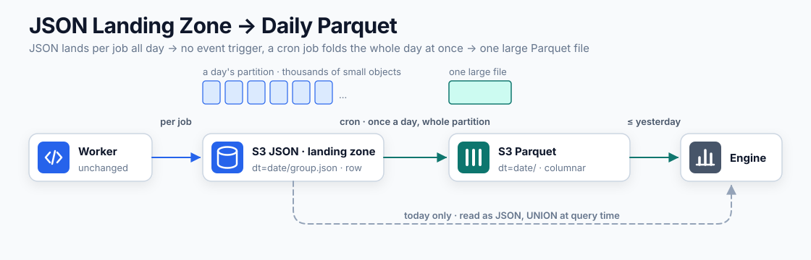

import ColumnarLayoutDemo from "@/materials/25/ColumnarLayoutDemo";
import ParquetLayoutDemo from "@/materials/25/ParquetLayoutDemo";
import RangeReadDemo from "@/materials/25/RangeReadDemo";
import RowGroupPruningDemo from "@/materials/25/RowGroupPruningDemo";
import SmallFilesDemo from "@/materials/25/SmallFilesDemo";

## Introduction

[Part 3](/blog/22) was about where to store delivery history.
We picked a structure that keeps S3 as the single source of truth and loads it into date partitions, and that structure is running well today.
What is left is the query layer that Part 3 only sketched and never built.

S3 holds a pile of finely split JSON files. What happens if you query them as they are? It is slow. Why it is slow stays the same no matter which option you pick, but when you pay for it differs by option.

This article is that weighing. First it names two obstacles that make the JSON pile hard to read, then it puts four options on top of them. Point a serverless engine such as Athena or BigQuery straight at the files, load an analysis platform properly, convert to Parquet and read that, or put Iceberg on top of the Parquet. There is no right answer, only conditions. Change our conditions and the answer changes with them.

## What we need to ask

Here are the query patterns Part 3 settled on.

- Failure rate and reason distribution over a period
- Performance by template and by channel
- Reaction and retention analysis along the user axis
- A specific recipient's history when a support ticket comes in

These queries run every day, and hundreds of times a day at that. When a support ticket arrives, someone has to check that same day what went out to that user, and marketing looks at per-template performance on a regular cadence. Freshness demands are low, though: data through yesterday is usually enough. <strong>The frequency is hundreds of times a day and the freshness is through yesterday.</strong> That combination is what separates the options.

Sort the query axes and they fall into two kinds. The first three are aggregation and bulk scans; only the last, the support lookup, is a point lookup. Part 3 handed point lookups to a cache over the third-party lookup API, but that path is bound by six-month retention and a request limit, and a send that failed outright was never recorded on their side to begin with. So the query layer in this article has to carry point lookups too.

## Two obstacles to reading it as is

The write side looks like this. One send group (one BullMQ job) becomes one object, and the key forms a date partition such as `dt=2026-07-29/<group_id>.json`. Per-recipient results are nested inside the object in an `entries` array.

This shape is optimal for writing. A single PutObject is atomic, so there is no half-written file, and a retried job overwrites the same key, so there are no duplicates. The trouble starts when you try to read that same shape.

### 1. There are too many files

One job is one object, so the file count grows with the job count. In peak periods hundreds of thousands of messages go out in a day, so if single-recipient sends make up a large share, a day's partition accumulates thousands to tens of thousands of objects.

S3 needs an HTTP round trip for every file it reads. So <strong>a small total size still queries slowly when the files are many.</strong> Reading 100MB as one file and reading it as ten thousand files are completely different jobs. Part 3 weighed Firehose because of PUT request cost; the same problem shows up on the read side as round-trip latency.

This is not a quirk of our setup, it is written into the docs. Athena's performance guide explicitly warns about datasets made of many small files. Planning a query means listing every partition location, and S3's LIST returns only 1,000 keys at a time, so a partition holding more than 1,000 files costs several round trips just to enumerate. In bad cases it trips the S3 request limit and the query fails with a `SlowDown` response.

The same bytes take very different amounts of time to read depending on how they are split up.

<SmallFilesDemo client:visible lang="en" />

<strong>This problem has nothing to do with format.</strong> Turn the JSON into Parquet and ten thousand files still means ten thousand round trips. <strong>Only merging the files fixes it.</strong> That fact comes back later when we set the conversion cycle.

### 2. The data is bundled by row

History queries read different columns per question, and some columns go unread unless there is a special reason to open them.

| Question | Columns actually read |
| --- | --- |
| Failure rate over a period | `status` · `sent_at` |
| Volume by template | `template_type` · `sent_at` |
| Failure reason distribution | `status_code` |
| Analysis along the user axis | `user_id` · `sent_at` |

No question needs more than three or four columns. Yet the largest things in an entry are the rendered message body (`variables`) and the destination. Those columns go unread unless the point is to inspect what was actually sent. <strong>The heaviest column is the least-read one.</strong>

A row-oriented format (JSON) bundles every field of one recipient onto one line.

```
{user_id:1, phone:…, status:…, variables:{…hundreds of bytes…}}
{user_id:2, phone:…, status:…, variables:{…hundreds of bytes…}}
```

Even when only `status` is needed, those values sit hundreds of bytes apart, and storage reads in blocks, so `variables` is dragged along whole. On top of that comes the cost of being a text format. Every row of the bytes you fetched has to be parsed, turning `"12345"` into a number hundreds of thousands of times over.

A column-oriented format groups the same field together.

```
[status:    ACCEPTED, ACCEPTED, FAILED, …]   ← only this is read
[variables: {…}, {…}, {…}]                   ← never touched
```

Leave the bytes exactly as they are and change only the direction of the grouping, and the range the same question touches changes with it.

<ColumnarLayoutDemo client:visible lang="en" />

Parquet is the standard column-based format. Parquet does not group purely by column, though. Stretch a whole file into one long column and reading even a little means knowing the whole file, and you cannot split the read across cores. So <strong>it cuts the rows into chunks (row groups) first and groups by column inside each chunk.</strong> Then it writes into the file's footer where each chunk sits and the minimum and maximum of each column. The reader loads the footer first and jumps straight to the position it needs.

<ParquetLayoutDemo client:visible lang="en" />

This layout is worth pinning down because everything that follows rests on it. Skipping, Bloom filters, and writing in sorted order are all things that turn on this structure.

Reading only the columns you need (projection) is not the only property that follows.

<strong>Compression actually bites.</strong> Compression works when similar values sit next to each other, and row-oriented data mixes numbers, strings, and objects, so no pattern shows. Group by column and `status` becomes a bulk repetition of three distinct values that dictionary encoding all but erases, while `sent_at` is a run of similar values where only the differences need storing. Aggregation can count over the dictionary as it stands, so there is no need to restore the original strings.

<strong>Aggregation vectorizes.</strong> Values of the same type sit contiguously, so an engine processes them thousands at a time. That is structurally impossible in JSON, where every row has to go through text parsing.

The columnar win is often explained as "fewer bytes scanned means a cheaper bill", but <strong>what sets the cost is not the total you have stored, it is the total you sweep.</strong> Athena charges $5 per TB scanned and BigQuery on-demand is free up to 1 TiB a month. Say a month's data is 10GB: sweeping it once costs five cents. Stop there and cost looks like a non-issue, but a multiplier is missing. JSON cannot pick columns, so any question at all sweeps all 10GB, and <strong>handling support tickets for hundreds of users makes that scan happen hundreds of times a day.</strong> Four times and BigQuery's free allowance is gone for the month; hundreds of times and Athena runs to hundreds of dollars a month. Read two columns out of Parquet instead and the swept bytes drop to a single-digit percentage. <strong>Query cost does separate the first option from the third.</strong>

It may sound odd that the file lives in S3 and yet only part of it is read. It works because S3 accepts HTTP range requests (`Range`). The engine never downloads the file whole; it <strong>fetches the footer first to learn the positions, then asks again for only the spans it needs.</strong>

<RangeReadDemo client:visible lang="en" />

## Now we pick the query layer

Four options against the same three yardsticks. How many things stay on and need tending (always-on infrastructure), when the price the two obstacles create gets paid (the shape of the query cost), and what the most recent moment you can ask about is (freshness).

### 1. Point a serverless engine at the JSON

Start with the option that builds the least. Define one external table over S3 and query it with a serverless engine such as Athena or BigQuery. No conversion, no pipeline, nothing left running. The `dt=` key is already the Hive partitioning convention, so date conditions work as partition pruning without further work.

The properties are good. <strong>Freshness is the highest of the four.</strong> An object the worker uploaded a moment ago is caught by the next query. The one exception is a new partition when the date rolls over: with Athena you have to run `MSCK REPAIR TABLE` or turn on partition projection for that day to come into view. The `dt=` convention is already in place, so the latter is one line in the table definition. Source and query target are the same files, so the two can never diverge. Backfill does not exist as a concept here.

In exchange, <strong>you pay for both obstacles again on every query.</strong> The cost of enumerating and round-tripping tens of thousands of files, and the cost of reading unwanted columns and parsing every row, starts from scratch each time you ask. In time and in money both. And our queries run hundreds of times a day, so the structure is one that pays the same price that many times over.

This option is right when <strong>queries are genuinely rare</strong>. If it is a quarterly report or a one-off look during an incident, building a conversion pipeline is itself the waste. Enduring one slow query is cheaper. We would have stopped at this option too, if our queries were not as frequent as they are.

### 2. Load an analysis platform properly

This is the option Part 3 sketched at the end. When an object lands in S3, a notification travels through SQS to Lambda, and Lambda flattens the nested structure into the analysis platform.

It takes query performance and freshness at the same time. Loading trails the send path from outside it on a seconds-to-minutes cadence, so freshness is close to the first option, and queries read what the analysis platform has already organized into its own format, so they are as fast as the third option. Worth pinning down here: <strong>open up an analysis platform and it is columnar too.</strong> This option queries fast for the same reason the third one does; the difference is only whether you build it or buy it. The join against the operational DB's user table, which Part 3 set as a requirement, also stays inside the platform here.

The problem is that <strong>you buy these properties as always-on infrastructure</strong>. SQS and Lambda have to stay up, someone has to watch the failures piling into the DLQ, and changing the schema means redeploying Lambda. If the source S3 and the platform side drift apart, you also need someone to run a backfill script. Having two copies of the data is a cost in itself. The moment the bill lands is decoupled from querying, too. On a day when nobody asks anything, loading still runs and storage still accumulates in two copies. The amount is not the issue; the fact that <strong>when you pay has nothing to do with when you query</strong> is where this parts ways with the third option.

Push it to the extreme and you get a query-only mart in RDS. Everyone can use plain familiar SQL, and support point lookups finish with a single index. But in aggregation <strong>obstacle 2 comes right back</strong>. Being row-based, counting a single `status` reads whole rows with `variables` riding along. Once hundreds of millions of rows have accumulated, that difference turns directly into time. On top of that, <strong>the instance runs 24 hours and the bill runs 24 hours</strong>. Our queries number in the hundreds a day, but add them all up and the instance actually works for a few minutes. The rest is time when nobody is asking, and the bill is the same during it. Part 3 ruled out a relational DB as the write target because of volume; using it as the read target did not add up either. This time the reason is not volume but hours left running. We could not find a reason to stand one up.

This option is right when <strong>freshness and response time become requirements</strong>. If failure rates have to sit on a dashboard permanently, or a send that just went out has to be visible immediately, or the organization already has an analysis platform and someone tending it, then this option's cost is not a new bill. At that point the third option becomes the detour.

### 3. Convert to Parquet and read that

This option solves obstacle 1 (the files have to be merged) and obstacle 2 (the data has to be regrouped by column) with a single conversion.

The source is a two-level structure with `entries` nested inside a group. Parquet supports LIST and STRUCT types, so it could hold that shape as is. Leave it that way, though, and every query repeats an UNNEST to unwrap the nesting. Since we are converting anyway, we flatten once into a single relational level. One recipient becomes one row and group-level fields are copied onto each row.

```sql
COPY (
  SELECT g.group_id, g.sent_at, g.notification_type, g.template_type,
         e.message_id, e.user_id, e.status, e.status_code, e.variables
  FROM read_json_auto('s3://…/dt=2026-07-29/*.json', hive_partitioning = true) g,
       UNNEST(g.entries) AS t(e)
) TO 's3://…/parquet/dt=2026-07-29/data.parquet' (FORMAT PARQUET);
```

The example is written in DuckDB syntax. The engine is not chosen yet and there are several tools that can run this SQL.

The copying may look wasteful, but that worry does not hold in a columnar format. Group fields such as `sent_at` or `template_type` repeat as many times as there are recipients, yet a repetition of identical values is what dictionary encoding compresses to nearly nothing. Unlike denormalization in a row-oriented DB, here it is effectively free, and every query afterwards finishes with `WHERE` and `GROUP BY` alone, no joins. The exception is `variables`. Keys differ per template so it cannot be spread into fixed columns; we hold it as a MAP type and pull values out by key when needed.

Once flattened, a group is a column value rather than a structure. However many send groups fell in one hour, the query just sees more rows, and you can regroup along whatever axis you want, whether by hour, by template, or by group.

```sql
SELECT date_trunc('hour', sent_at) AS h,
       count(*) AS sent,
       count(*) FILTER (WHERE status = 'FAILED') AS failed
FROM read_parquet('s3://…/parquet/dt=*/*.parquet', hive_partitioning = true)
WHERE dt BETWEEN '2026-07-01' AND '2026-07-31'
GROUP BY h ORDER BY h;
```

#### When to batch the conversion

Parquet files have to be big. A Parquet file of a few rows carries more metadata than body, and compression only pays once there are repeated values to work with. So writing Parquet per job is not the answer; the data has to collect somewhere and be written in bulk.

We looked at putting the buffer inside the worker first. We rejected it. Today the result goes out to S3 the moment a job finishes, so a dying pod still leaves the record it already wrote. Have the worker hold an hour in memory and that whole hour becomes a loss window. Widening the loss window inside a structure built to shrink history loss did not add up. With several replicas there are several buffers, so files split as many ways as there are pods, and flushing buffers on graceful shutdown comes along with it.

The conclusion was not to build a new buffer at all. <strong>The JSON already accumulating in S3 is the buffer.</strong> The worker keeps loading JSON per job the way it does now (the landing zone), and a batch periodically turns those files into Parquet. The file-count problem and the format problem are solved together by that single conversion.

This is where it diverges from the pipeline drawn in Part 3. That one was event-driven: every object creation woke Lambda through SQS. If freshness is what you want, that is the right shape. <strong>But there is nothing to gain from reacting to Parquet one record at a time.</strong> Files have to be large to pay off, so it is better to leave them alone until they pile up and sweep them in one go. So it is cron, not events. At the appointed hour a cron job reads a whole accumulated partition and folds it into one file. A single schedule takes the place SQS and Lambda held in Part 3's structure.


What is left is the cycle.

| Cycle | Files over three years | Freshness | Problem |
| --- | --- | --- | --- |
| Hourly | Over twenty thousand | An hour ago | Obstacle 1 comes straight back |
| Daily | About a thousand | Through yesterday | Today has to be read as JSON |
| Monthly | A few dozen | Through last month | The whole current month stays JSON |

<strong>We set it to daily.</strong> Because the unit we ask in is a day. Failure rates and template performance are both cut by date, and what yesterday looked like is checked every day. Match the conversion unit to the query unit and a single query rarely crosses a file boundary. Size does not block this choice. A day is plenty to bundle into one file, and three years of accumulation is only about a thousand files, so obstacle 1 does not come back to life.

Monthly is the best on file count but did not fit our conditions. Queries run every day, and if the entire current month sits there as unconverted JSON, then early in the month nearly every query ends up sweeping the JSON pile. That is falling back to the first option. Cut daily and the range read as JSON is fixed at <strong>today, always</strong>.



Support point lookups benefit from this cycle too. As seen earlier, each chunk's minimum and maximum are written in the footer, so chunks that do not match the condition are skipped. On top of that, files cut by day put the earlier stage, file pruning, to work first. "What this user received last week" only has to open seven files, and the other thousand are never opened at all. Support tickets are usually about the last few days, so a date range attaches naturally.

#### When you have to find a user without a date

The problem is a query with no date range. Take nothing but a `user_id` and search the whole retention period and file pruning does not engage, so all thousand files get opened. Chunk-level skipping does not help either, because <strong>writing in time order the way we do now</strong> scatters a given user's sends across every chunk, so the minimum and maximum ranges all overlap.

But this is not a limit of the format, it is <strong>a consequence of how we write.</strong> There are two ways to offset it.

<strong>Sort within the file.</strong> Sort by `user_id` during conversion and each chunk covers a narrow user range without overlapping the others, so skipping works for user queries as well. What you lose is the time-axis ordering, and in our structure that loss is small. Dates are already cut by the `dt=` partition, so one file is a single day regardless. The layout becomes <strong>cut by date on the outside, sorted by user on the inside</strong>. Chunk size has to be considered alongside it. A chunk only pays off if it stays inside a narrow band of the sort key, and cutting it too fine leaves too few chunks to parallelize over.

<strong>Plant a Bloom filter.</strong> Parquet can attach a Bloom filter to a column. It answers "this value is definitely not here" from a bitmap held per chunk, and since a no is certain while only a yes is probabilistic, wasted reads happen but no row is ever missed. It targets columns with too many distinct values for dictionary encoding to work, and `user_id` is exactly that. It also differs from sorting in that sorting picks a single axis while Bloom filters can be attached to several columns.

Change nothing but the way we write and the number of chunks the same query opens drops from four to one.

<RowGroupPruningDemo client:visible lang="en" />

One condition attaches. <strong>This only works if the engine supports it.</strong> It has to be planted on write and understood on read. DuckDB supports both reading and writing from 1.2.0. Since the engine is not chosen yet, this is one more item to check when choosing it.

So concluding that the user axis forces us outside the format is premature. Sorting and Bloom filters offset a good deal of it, and if queries become frequent enough that they still fall short, that is the moment to move to the second option.

#### Where to keep the Parquet

We started out assuming S3, but it does not have to be. Since a k8s CronJob owns the conversion, we could attach a PVC, write to an EBS volume, and query from that volume.

<strong>The appeal is read speed.</strong> S3 adds an HTTP round trip every time a file is opened; a mounted disk does not. A column-based format reads by skipping around inside a file to pick out only the columns it needs, and in that kind of access round-trip latency becomes cost directly. Obstacle 1 was a problem of file count; this one happens inside a single file.

We passed on it anyway.

<strong>A disk bills the whole time it is on.</strong> EBS charges for the capacity you provisioned, not the capacity you actually filled. Queries run a few times a day while the volume stays attached 24 hours. It is the same shape as passing on RDS earlier, and it catches on the always-on-infrastructure axis all the same. S3 bills for what you put in it.

<strong>Capacity has to be decided up front.</strong> How many GB three years will be has to be nailed down now, and running short creates work to grow it. It turns a decision that could wait into one that cannot.

<strong>It is tied to an AZ and a node.</strong> EBS is an AZ-scoped resource, so a pod scheduled into another AZ cannot attach it, and gp3 attaches to a single node, so a pod on another node cannot open the same volume. It does not show today because there is one querying party, but the moment that grows the structure has to be redrawn.

A principle from Part 3 gets in the way too. Keeping S3 as the single source of truth is the core of that structure, and if only the converted copy lives on a disk, lifecycle and deletion requests end up managed in two places.

A disk is right when <strong>queries are frequent and latency is the user experience</strong>. If a dashboard is permanently attached, a local disk earns its keep. Go that far, though, and the second option is the better answer. If you are aiming between the two, there is a place called a cache. Keep the source in S3 and pull only the frequently read recent days onto disk. The response times we need today do not call for it, so we did not build it.

#### What we gain and what we give up

There are properties of this structure we value.

<strong>Not a line of worker code changes.</strong> The conversion is a batch running outside the send path, and the boundary Part 3 drew between sending and history holds here as well.

<strong>The conversion is idempotent.</strong> As long as the source JSON survives, a failed conversion can simply be rerun, and a schema change can be applied retroactively by rebuilding. If the nightly batch skips a day, running two days' worth the next day is all it takes.

<strong>There is nothing left running.</strong> The conversion ends with one tool that reads JSON and writes Parquet, and that tool lives only while the batch runs. It means the query layer has not one process up 24 hours.

There are things we give up too. The query layer gains <strong>one batch</strong>, and seeing today's data means a <strong>UNION of the Parquet and today's JSON</strong>. The first is a burden you can rerun after a failure, and the second is one layer of inconvenience on the query-tool side. The price the second option pays as an always-on pipeline, this option pays as one batch a day and one line of UNION.

### 4. Put Iceberg on top of Parquet

Look at Parquet and Iceberg follows. It is a format that layers table semantics over Parquet files, bringing ACID snapshot commits, schema evolution, time travel, and row-level deletes.

Read that list again and most of it is <strong>a solution to write-side problems</strong>. It earns its keep where several writers commit at once, the schema changes often, and row-level edits are needed. Our history has one writer that only appends, and since records are written after finalization there are no edits. There is no problem for it to solve. What remains is pruning from file statistics, and as seen earlier the date axis is already pruned by path alone while sorting and Bloom filters handle the user axis inside the file. Both happen without Iceberg.

The cost, on the other hand, is certain. Reading requires a query engine, you have to keep a catalog, and you have to run a compaction job. What ended with one batch in the third option grows into three always-on resources. The reason we avoided the second option was always-on infrastructure, and this brings it back under a different name.

This option is right when <strong>there are several writers or row-level deletes are frequent</strong>. If personal-data deletion requests arrive several times a day and only rows for a given `user_id` must be erased, Iceberg's row-level delete solves exactly that. We deferred that requirement in Part 3 to lifecycle expiry on the source S3. The converted copy sits in the same date partition, so the same policy makes it disappear alongside the source. At our current rate this is enough.

### Side by side

| | 1. Serverless query | 2. Analysis platform | 3. Parquet conversion | 4. Iceberg |
| --- | --- | --- | --- | --- |
| Always-on infrastructure | None | SQS · Lambda · platform | None (1 batch) | Catalog · engine · compaction |
| Conversion | None | Continuous streaming | Once nightly | Nightly + compaction |
| Query latency | High (tens of thousands of files per query) | Low | Low (only today is JSON) | Low |
| Freshness | Immediate | Seconds to minutes | Through yesterday + today as JSON | Per commit |
| Shape of the query cost | Per query | Always-on + per query | Only at conversion | Always-on + per query |
| Copies of the data | 1 | 2 | 2 (source and converted) | 2 |
| Right when | Queries are rare | Freshness and response time are requirements | Queries are frequent and you do not want more infrastructure | Several writers or frequent row deletes |

The table shows that <strong>the first and second are the two ends and the third sits between them</strong>. The first option builds nothing and pays every time it reads; the second pays continuously and reads for free. The third piles that price into once a day. Frequency does not line the three up in a row, though. The more frequent the queries, the faster the first option degrades in both time and money, but that does not push you toward the second. <strong>Frequency is the axis that retires the first option, and what separates the second from the third is freshness and always-on infrastructure.</strong>

Our conditions are these. <strong>Queries run hundreds of times a day, freshness through yesterday is usually enough, and we do not want more infrastructure to tend.</strong> At that frequency the first option's "pay again every time" piles up in both time and money, and since through yesterday is enough, there is no reason to fund an always-on pipeline for the second option's seconds-level freshness. So we chose the third.

Change the conditions and the answer changes. If queries drop to once a quarter, maintaining the batch is itself the waste and the first option is right; if freshness demands rise to seconds or minutes, or query latency becomes the user experience the way a failure-rate dashboard would, you have to move to the second. It is not that our conditions are special and therefore the third option; it is that our freshness demand sits between those two, and therefore the third option.

There is one more reason this decision is a light one. <strong>Compatibility.</strong> Parquet is the de facto standard columnar format of the analytics ecosystem, so DuckDB, Spark, Trino, Athena, BigQuery, and pandas all read it natively. We start with no always-on engine, but even if we later move to the second option there is no need to rebuild the data. The format choice does not bind the tool choice. So not having chosen an engine yet is merely a deferred decision, and settling it later after seeing how querying solidifies costs nothing on the data side.

## Wrap-up

If Part 3 was "where to store it", this article was "how to read what you stored". The answer was to separate the storage format from the query format. Landing stays as it is, immediate and by row (JSON), and querying happens on columns (Parquet) converted every night. The worker does not change, the conversion is idempotent, and there is no query infrastructure left running. The engine is still unchosen.

Three things stayed with us.

First, <strong>the shape that is good to write is not the shape that is good to read.</strong> The per-job JSON object is a shape chosen for write-side properties, atomic writes and idempotent overwrites, and those properties still hold. Expecting that same shape to also be queryable was a stretch, and building the read-friendly shape separately through conversion was the right call.

Second, <strong>freshness demand and query frequency are different axes.</strong> "It can be late" and "it is rare" travel together easily but are in fact separate. Our queries needed only through yesterday while running hundreds of times a day, and treating the two as one would have left us enduring every one of those hundreds as a slow query.

Third, some decisions can wait and <strong>some cannot</strong>. Format conversion and engine choice can be redone retroactively as long as the source survives, so they can wait. Which fields to store, by contrast, cannot be redone. Putting `user_id` into the schema back in Part 3 is what made this article's user-axis analysis possible. What you did not keep at write time cannot be conjured later, no matter what format you convert to.

## References

- [Apache Parquet documentation](https://parquet.apache.org/docs/)
- [Amazon Athena - data optimization](https://docs.aws.amazon.com/athena/latest/ug/performance-tuning-data-optimization-techniques.html)
- [Amazon Athena pricing](https://aws.amazon.com/athena/pricing/)
- [BigQuery pricing](https://cloud.google.com/bigquery/pricing)
- [Apache Parquet - Bloom filter](https://parquet.apache.org/docs/file-format/bloomfilter/)
- [DuckDB - Parquet](https://duckdb.org/docs/stable/data/parquet/overview.html)
- [DuckDB - Parquet tips](https://duckdb.org/docs/stable/data/parquet/tips)
- [Parquet Bloom Filters in DuckDB](https://duckdb.org/2025/03/07/parquet-bloom-filters-in-duckdb)
- [DuckDB - httpfs extension](https://duckdb.org/docs/stable/core_extensions/httpfs/overview.html)
- [DuckDB - Hive partitioning](https://duckdb.org/docs/stable/data/partitioning/hive_partitioning.html)
- [Dremel: Interactive Analysis of Web-Scale Datasets](https://research.google/pubs/dremel-interactive-analysis-of-web-scale-datasets-2/)
- [Apache Iceberg](https://iceberg.apache.org/)
