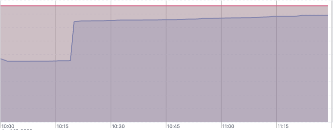
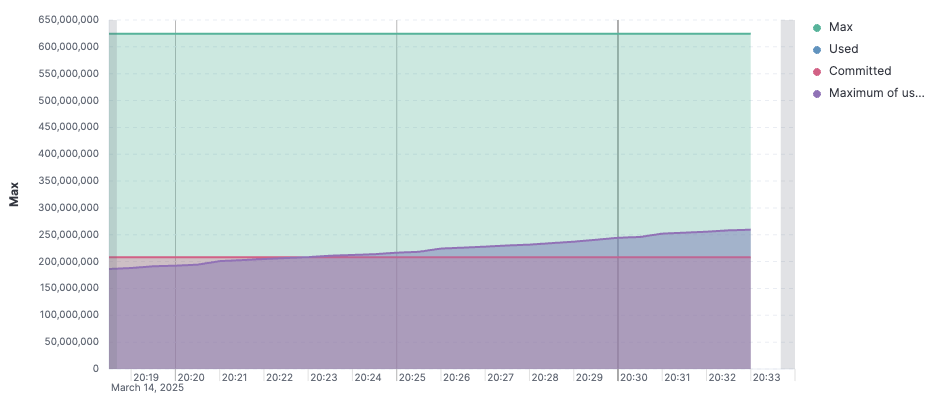
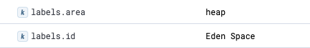
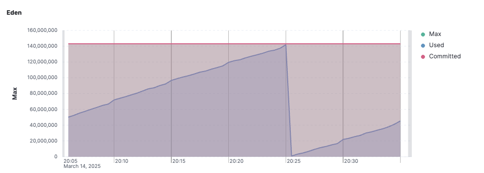
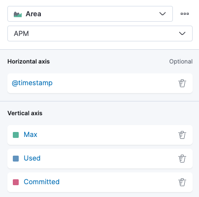
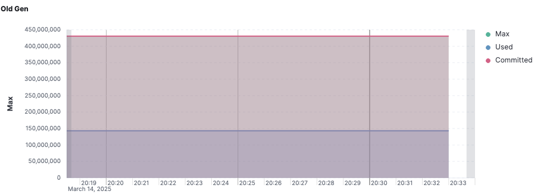
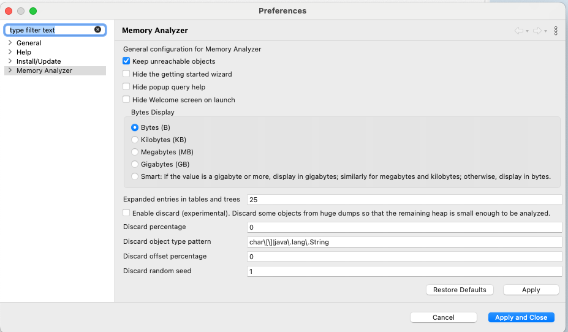
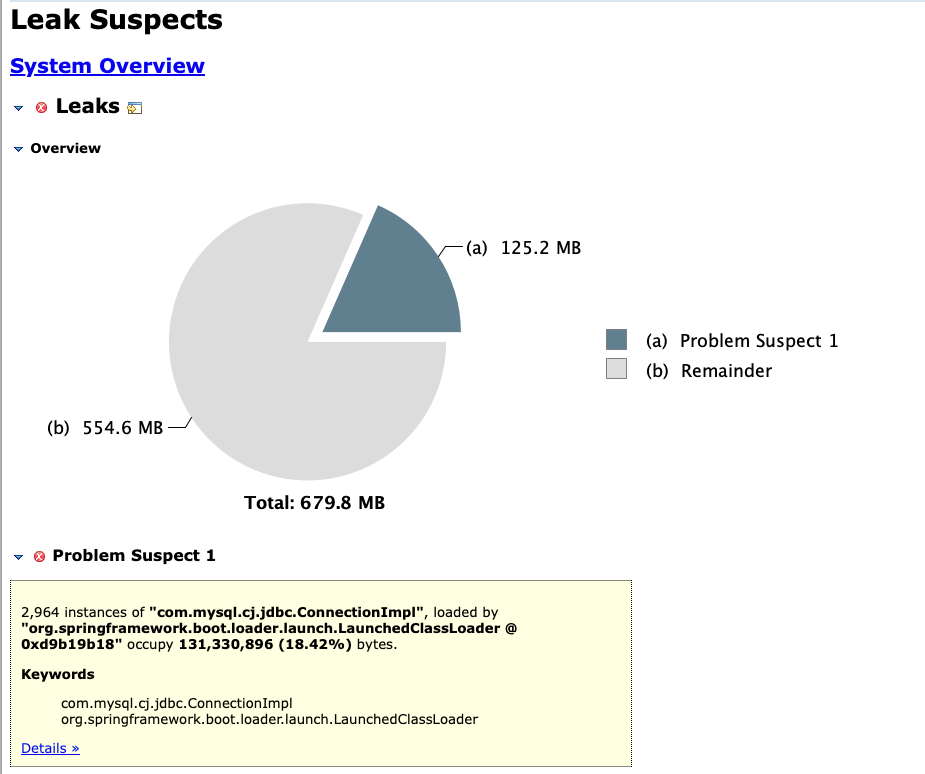
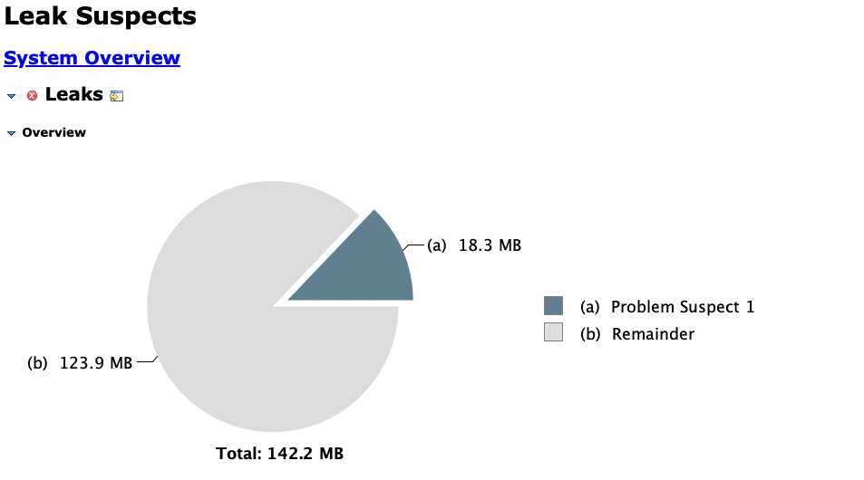

## Is Your Application Safe?

"Have you ever seen a system that appeared perfectly healthy in production suddenly slow down, take longer to respond, and eventually fail? Did you know that a single line of code we commonly overlook can <strong>degrade application performance and even cause a server outage</strong>?"

Problems like these <strong>usually begin with a small memory-management mistake.</strong>

While an application runs, memory is continuously allocated and released. In particular, if you do not properly understand <strong>how the Java Virtual Machine manages memory</strong>, a <strong>memory leak</strong> can occur, progressively degrading system performance and eventually causing an outage.



The graph above shows JVM memory usage. At a certain point, <strong>memory usage increases sharply</strong>. Many objects have been created, and because they are not being released, they remain in memory and continue occupying space<strong>.</strong> This could lead to degraded performance or an outage.

In this post, I will cover <strong>the JVM memory structure, the causes of memory leaks, and ways to prevent them</strong>. Understanding and optimizing JVM memory can prevent both performance degradation and outages. Let us examine each topic in turn.

## JVM Memory

### Memory Structure

JVM memory consists primarily of the Heap, Stack, PC Register, Native Method Stack, and several other areas.

<pre class="mermaid">
flowchart LR
  accTitle: JVM runtime data areas
  accDescr: The JVM runtime contains shared method and heap areas plus a separate JVM stack for each thread. Stack frames hold local variables and are pushed and popped as methods run.

  subgraph Runtime["Runtime Data Area"]
    direction LR
    subgraph Shared["Shared Areas"]
      direction TB
      subgraph Method["Method Area"]
        direction LR
        ClassData["Class metadata: runtime constants, fields, methods, bytecode, and constructors"]
        OtherClasses["Other class metadata"]
      end
      subgraph Heap["Heap Area"]
        direction LR
        Instance1["Instance"]
        Instance2["Instance"]
        Instance3["Instance"]
      end
    end
    subgraph Thread1["Thread 1"]
      direction TB
      subgraph Stack1["JVM Stack"]
        direction TB
        FrameN["Frame N: local variables"]
        MoreFrames["..."]
        Frame1["Frame 1: local variables"]
        FrameN --- MoreFrames --- Frame1
        Frame1 --&gt;|push| FrameN
        FrameN --&gt;|pop| Frame1
      end
    end
    subgraph ThreadN["Thread N"]
      direction TB
      StackN["JVM Stack"]
    end
  end
</pre>

Of these, the Heap is the largest JVM memory area and the primary target of garbage collection, so optimizing it can have the greatest impact. Proper Heap tuning can reduce GC overhead and improve application response times.

### Memory Configuration Options

The Heap must be sized appropriately to keep Minor GC from running too frequently. On the other hand, making the Heap too large can increase the length of application pauses during GC, so its size must be chosen carefully.

Here are a few of the memory configuration options available in the JVM.

| Option | Description |
| --- | --- |
| -Xms{size} | Sets the JVM's minimum memory size |
| -Xmx{size} | Sets the JVM's maximum memory size |
| -XX:InitialRAMPercentage={size} | Sets the Heap size to {size}% of total RAM |
| -XX:MaxRAMPercentage={size} | Sets the maximum Heap size to {size}% of total RAM |
| -XX:NewRatio={ratio} | Sets the ratio between the New and Old areas<br>With -XX:NewRatio=1, {New}:{Old} = 1:1<br>With -XX:NewRatio=2, {New}:{Old} = 1:2 |
| -XX:NewSize={size} | Sets the size of the New area |
| -XX:SurvivorRatio={ratio} | Sets the ratio between the Eden and Survivor areas |
| -XX:PermSize={size} | Sets the initial memory size used permanently by the JVM.<br>Ignored since PermGen was removed and replaced by Metaspace in JDK 8. Be careful! |
| -XX:MaxPermSize={size} | Sets the maximum memory size used permanently by the JVM.<br>Like -XX:PermSize={size}, this option is ignored. Be careful! |

<pre class="mermaid">
flowchart LR
  accTitle: JVM memory areas controlled by sizing options
  accDescr: Xms and Xmx set the initial and maximum heap sizes. NewSize and MaxNewSize size the Young Generation, which contains Eden and two Survivor spaces alongside reserved virtual space.

  subgraph Heap["Heap: -Xms initial size; -Xmx maximum size"]
    direction LR
    subgraph Young["Young Generation: -XX:NewSize; -XX:MaxNewSize"]
      direction LR
      YoungVirtual["Virtual"]
      Eden["Eden"]
      Survivor1["Survivor 1"]
      Survivor2["Survivor 2"]
    end
    subgraph Old["Old Generation"]
      OldVirtual["Virtual"]
    end
  end
  Native["Native Area"]
  Virtual["Virtual"]
</pre>

You can pass these options to the `java` command as follows.

```bash
$ java -Xms1024m -Xmx1024m -jar myapp.jar
```

```shell
$ java -XX:InitialRAMPercentage=50.0 -XX:MaxRAMPercentage=50.0 -jar myapp.jar
```

It is generally best to set the initial and maximum memory values to the same value, as shown above, for the following reasons.

-   When the initial and maximum memory sizes differ, the JVM must allocate additional memory whenever the Heap runs low. GC occurs while the Heap size is dynamically adjusted, which can negatively affect performance.
-   Setting the initial and maximum memory sizes to the same value also reduces fluctuations caused by memory allocation and release, making application performance more predictable.

The Heap size also affects both how often GC runs and how long each GC takes, so it must be configured with care.

-   With more memory, GC runs less often but takes longer.
-   With less memory, each GC takes less time but runs more often.

For example, suppose <strong>Minor GC runs very frequently</strong>. If Minor GC occurs too soon, the JVM cannot clear enough short-lived objects from the Young area, and <strong>more objects are promoted to the Old Generation</strong>. The Old area then fills quickly, eventually triggering frequent Full GCs and degrading application performance. In this situation, the Young area should be expanded to reduce the frequency of Minor GC.

```bash
$ java -Xms1024m -Xmx1024m -XX:NewSize=256m -jar myapp.jar
```

### GC Configuration Options

The JVM provides several GC algorithms. Each manages memory differently and has different performance characteristics, so it is important to select one that fits the project. Shenandoah GC, for example, may suit real-time applications where low latency is critical, while ZGC or G1GC may be efficient for large-scale services. Rather than simply accepting the default GC, you should consider the application's performance requirements and system environment and apply the most suitable algorithm.

| GC | Option | Characteristics |
| --- | --- | --- |
| Serial GC | -XX:+UesSerialGC | Single-threaded; suited to small-memory environments. |
| Parallel GC | -XX:+UseParallelGC | Multithreaded and optimized for high throughput.<br>Default in JDK 8 |
| G1GC | -XX:UseG1GC | Reduces latency by managing memory in regions.<br>Useful when Full GC pauses must remain below a few hundred milliseconds.<br>Default in JDK 11 |
| ZGC | -XX:+UseZGC | Ultra-low-latency GC designed to minimize Stop-the-World time with large heaps.<br>May be inefficient below 10 GB and is said to work particularly well above 50 GB.<br>JDK 11+ |
| Shenandoah GC | -XX:UseShenandoahGC | Guarantees low latency by running many small GC cycles. JDK 12+ |

## Memory Metrics

To determine whether memory usage is climbing sharply, GC is running excessively, or heavy use of a local cache is exhausting memory, the relevant metrics must be monitored continuously.

### Inspecting Memory Metrics with Actuator

In Spring Boot, you can inspect JVM memory metrics through Actuator. Add the dependency as follows.

```kotlin
implementation("org.springframework.boot:spring-boot-starter-actuator")
```

Enable metrics in the `application.yaml` configuration file.

```yaml
management:
  endpoints:
    web:
      exposure:
        include: metrics
```

Now run the application and visit <strong>`/actuator/metrics`</strong>. You will see various metrics, including the following memory-related ones.

```json
{
  "names": [
    ...
    "jvm.memory.committed",
    "jvm.memory.max",
    "jvm.memory.usage.after.gc",
    "jvm.memory.used",
    ...
  ]
}
```

To inspect <strong>`jvm.memory.used`</strong> in greater detail, visit <strong>`/actuator/metrics/jvm.memory.used`</strong>. Under `availableTags`, you can see the <strong>`heap`</strong> and <strong>`nonheap`</strong> values for the <strong>`area`</strong> tag, along with memory areas such as <strong>`G1 Eden Space`</strong> and <strong>`G1 Old Gen`</strong> under the <strong>`id`</strong> tag.

```json
{
  "name": "jvm.memory.used",
  "description": "The amount of used memory",
  "baseUnit": "bytes",
  "measurements": [
    {
      "statistic": "VALUE",
      "value": {number}
    }
  ],
  "availableTags": [
    {
      "tag": "area",
      "values": [
        "heap",
        "nonheap"
      ]
    },
    {
      "tag": "id",
      "values": [
        "G1 Survivor Space",
        "Compressed Class Space",
        "Metaspace",
        "CodeCache",
        "G1 Old Gen",
        "G1 Eden Space"
      ]
    }
  ]
}
```

### Visualization

Kibana can visualize JVM Heap usage in an intuitive way. The graph below is an example showing the maximum, used, and committed values for the Heap, along with peak usage.



Visualizing Heap usage itself is relatively simple. Add the <strong>`jvm.memory.max`</strong>, <strong>`jvm.memory.used`</strong>, and `jvm.memory.commited` metrics to a Kibana visualization, and you can easily see total Heap usage. Visualizing memory to analyze GC cycles, however, is a little more involved.

Kibana APM records the metric that tracks JVM memory usage as <strong>`jvm_memory_used`</strong>. You can use the <strong>`area`</strong> and <strong>`id`</strong> tags that we saw in Actuator to filter data by memory area, including heap, nonheap, and GC-related regions.



Let us apply a filter that tracks memory usage in Eden, where Minor GC occurs. To inspect data from <strong>`Eden Space`</strong>, use the following filter. I also added axes for the <strong>`max`</strong> and <strong>`commited`</strong> values.

```shell
average(jvm_memory_used, kql='labels.id:"Eden Space"  and labels.area:"heap"')
```

```shell
average(jvm_memory_max, kql='labels.id:"Eden Space"  and labels.area:"heap"')
```

```shell
average(jvm_memory_committed, kql='labels.id:"Eden Space"  and labels.area:"heap"')
```

The graph shows Eden usage at around 140 MB, with Minor GC occurring every few tens of minutes. As explained above, excessively frequent Minor GC can cause problems, so its frequency needs to be monitored carefully.



Next, let us analyze Old Generation memory usage.

Add <strong>`vertical axis`</strong> entries whose <strong>`labels.id`</strong> filters target the Old area, as shown below.



```shell
average(jvm_memory_used, kql='labels.id:"Tenured Gen"  and labels.area:"heap"')
```

```shell
average(jvm_memory_max, kql='labels.id:"Tenured Gen" and labels.area:"heap"')
```

```shell
average(jvm_memory_committed, kql='labels.id:"Tenured Gen"  and labels.area:"heap"')
```



The Old Generation stores objects promoted from Eden. If its usage continues to grow, a Full GC becomes increasingly likely. If Old Generation usage does not fall after a Major GC or Full GC and instead keeps increasing, a memory leak is highly likely.

There is a way to identify the cause: capture a Heap Dump from the Java application and analyze it with a Memory Analyzer Tool.

## Heap Dump

### Heap Dump Command

The command for creating a Heap Dump is simple.

```shell
$ jmap -dump:format=b,file=/tmp/<filename>.hprof <JAVA_PROCESS_ID>
```

-   The <strong>`-dump`</strong> option of the `jmap` command creates a Heap Dump.
    -   <strong>`format=b`</strong> specifies binary format.
    -   <strong>`file={path}/{filename}.hprof`</strong> specifies the output filename.
-   <JAVA\_PROCESS\_ID> is the process ID of the running application. In a container environment, this is commonly PID <strong>` 1 `</strong>. Containers are lightweight environments optimized to run an application. They share the host operating system's kernel and do not need to run unnecessary system processes, allowing the application inside the container to naturally occupy PID <strong>` 1 `</strong>.

There is, however, an important <strong>caution</strong>.

<strong>When a Heap Dump is created</strong>, the JVM must save a snapshot of the entire Heap. To do so, <strong>GC suspends all application threads in a Stop-the-World pause.</strong> Creating the Heap Dump file also requires writing a large volume of memory data to disk, which generates disk I/O. Disk writes are relatively slow, so <strong>the process can take tens of seconds or more</strong>.

### Heap Dumps in Production

As explained above, extracting a Heap Dump with <strong>`jmap`</strong> can stop a Java application for tens of seconds. Running it indiscriminately in production therefore carries a serious risk of causing an outage.

Trying to reproduce the issue in a development or staging environment may not work either, because the lower volume of network requests often means that too few objects accumulate in the Old Generation. What should you do in that situation?

Use the load balancer to stop API traffic from reaching the target container before extracting the Heap Dump. In a Kubernetes environment, this can be done by temporarily removing the endpoint of the Pod connected to the Service.

In Kubernetes, removing the Service's <strong>`spec.selector.app`</strong> configuration prevents it from discovering new Pods while preserving the existing Endpoints.

```shell
$ kubectl describe pod -n my-namespace
# Identify the endpoint of the Pod you want to disconnect

$ kubectl edit endpoints -n my-namespace my-svc
# Remove the target endpoint and save

$ kubectl get ep -n my-namespace
# Confirm that the endpoint has been removed
```

API requests will no longer reach that Pod, so the Heap Dump can now be extracted safely. Once the Dump file has been created, copy it to the device you are using, then delete the Heap Dump file from inside the Pod.

```shell
$ kubectl cp \
  my-namespace/my-api-deploy-59b79c4795-q8l6p:/tmp/my-api-20250226.hprof \ 
  /Users/myroot/dumps/my-api-20250226.hprof
  
$ kubectl exec -it my-api -n my-namespace -- rm -f /tmp/my-api-20250226.hprof
# Delete the Heap Dump file remaining inside the Pod
```

After all work is complete, restore service traffic to its original state. Add the Service's <strong>`spec.selector.app`</strong> configuration again and apply it. Kubernetes will now restore the Endpoints automatically. Use the following command to verify that the connection has been restored correctly.

```shell
$ kubectl get ep -n my-namespace
```

### Eclipse Memory Analyzer

After extracting the Heap Dump, you can use Eclipse MAT (Memory Analyzer Tool) to  
analyze memory usage patterns and identify the cause of a memory leak.

-   [Eclipse Memory Analyzer](https://eclipse.dev/mat/)

After installing Eclipse MAT, enable `Keep unreachable objects` in the settings. This setting lets you inspect objects that lost their connections to other objects during Heap Dump parsing.



Open the Heap Dump file (`.hprof`) you just created in the application and click the memory leak analysis button. The problems will appear as shown below.



Pay particular attention to the following items in the Leak Suspects Report.

-   <strong>Biggest Objects by Retained Size</strong>: Objects retaining the most memory, which are likely causes of the problem
-   <strong>Class Histogram</strong>: The number of objects created by each class and the memory they occupy

Once the Heap Dump reveals the source of the leak, it is time to modify the code or optimize the memory-management strategy. The specific solution depends on the problem, so take the appropriate action based on the data you have analyzed.

## Can One Carelessly Written Line Cause a Memory Leak?

### 1\. Failing to Declare an Inner Class `static`

Item 24 of *Effective Java*, "Favor static member classes over nonstatic," includes the following explanation.

> The only syntactic difference between static and nonstatic member classes is the presence of the `static` modifier, but the semantic difference is surprisingly large. An instance of a nonstatic member class is implicitly associated with an instance of its enclosing class. A method on the nonstatic member class can therefore use a qualified `this` to invoke a method on the enclosing instance or obtain a reference to it.

The key sentence is, "An instance of a nonstatic member class is implicitly associated with an instance of its enclosing class." Omitting `static` means the member class has a hidden reference to its enclosing instance. This can create a serious problem: a memory leak in which garbage collection cannot reclaim the enclosing class instance.

Be sure to add `static` when declaring an inner class.

### 2\. ThreadLocal

By default, a <strong>`ThreadLocal`</strong> shares the lifecycle of its Java thread. Failing to manage a <strong>`ThreadLocal`</strong> properly can therefore cause a memory leak. To understand why, we need to examine how <strong>`ThreadLocal`</strong> works.

#### How Does ThreadLocal Work?

If you inspect the <strong>`Thread`</strong> class, you will find a field named <strong>`threadLocals`</strong>, declared as a <strong>`ThreadLocalMap`</strong>.

```java
public class Thread implements Runnable {
  //...
  ThreadLocal.ThreadLocalMap threadLocals;
  //...
}
```

Inspecting <strong>`ThreadLocalMap`</strong> shows that it is managed as an array of <strong>`Entry`</strong> objects. In other words, each <strong>`Thread`</strong> has its own independent <strong>`ThreadLocal`</strong> storage.

```java
static class ThreadLocalMap {
  //...
  private Entry[] table;
  //...
}
```

#### Thread Pools and ThreadLocal

Assuming a Platform Thread system, simply creating and discarding a thread on a server is not a problem because its ThreadLocal disappears with it. However, <strong>creating threads is expensive, so most servers use a thread-pooling system</strong>.

When a request reaches a Spring server, for example, the thread pool assigns a thread. After that thread completes its work and returns the response, it is not deleted; it returns to the thread pool.

At that point, any data in the <strong>`ThreadLocal`</strong> remains unless it is explicitly removed. If an expensive resource was pooled and stored in a <strong>`ThreadLocal`</strong>, <strong>the value remains even after the thread returns to the pool</strong>, wasting memory. You must therefore call <strong>`ThreadLocal.remove()`</strong> after the work is complete.

```java
threadLocal.remove();
```

#### ScopedValue

One way to address this problem is to use <strong>`ScopedValue`</strong>, which <strong>stores a value only within an execution context</strong>. A <strong>`ScopedValue`</strong> retains its value only within a specific execution scope and is cleaned up automatically when that execution ends.

#### Could Virtual Threads Be an Alternative?

You might think, "If a <strong>`ThreadLocal`</strong> shares the lifecycle of its thread, couldn't a <strong>Virtual Thread</strong>, which is deleted when its task completes, solve the problem?" Virtual threads introduce another concern, however. In theory, an unlimited number of virtual threads can be created. If every thread uses ThreadLocal, memory usage can grow without bound. If a large amount of memory is occupied all at once, the server could go down with an OOM (Out of Memory) error.

### 3\. String

Because `String` is immutable, every string concatenation with the <strong>` + `</strong> operator creates a new <strong>`String`</strong> object. Creating many small strings this way can increase GC pressure, degrading performance and wasting memory.

Java automatically optimizes some string operations to prevent this problem. In particular, the compiler internally converts a simple <strong>` + `</strong> expression to a <strong>`StringBuilder`</strong> to improve performance.

```java
public String getName() {
  return firstName + " " + lastName;
  // Internally, this behaves like the following:
  // return new StringBuilder().append(firstName).append(" ").append(lastName).toString();
}
```

However, this optimization does not apply when the <strong>` + `</strong> operator is used across multiple lines or inside a loop. In those cases, a new <strong>`String`</strong> object is created each time, potentially causing memory usage to rise sharply.

```java
public String badStringConcat() {
    String result = "";
    for (int i = 0; i < 10000; i++) {
        result += i;
    }
    return result;
}
```

When repeated string concatenation is necessary, explicitly using <strong>`StringBuilder`</strong> or <strong>`StringBuffer`</strong> is therefore the best solution.

```java
public String goodStringConcat() {
    StringBuilder sb = new StringBuilder();
    for (int i = 0; i < 10000; i++) {
        sb.append(i);
    }
    return sb.toString();
}
```

## DB Connections: A Hidden Time Bomb

DB Connections may appear harmless while an application is running normally, but <strong>if they are not managed properly, they can become hidden time bombs that threaten the system</strong>.

In the past, developers had to open and close DB Connections directly with JDBC, making leaks likely when connections were not explicitly released. Today, ORM frameworks such as MyBatis and JPA manage Connections, so many developers believe they no longer need to worry about Connection leaks.

However, <strong>hidden problems still exist.</strong>

### 1\. AbandonedConnectionCleanupThread

<strong>`AbandonedConnectionCleanupThread`</strong> is a background thread run internally by the MySQL JDBC driver (Connector/J) to automatically clean up a DB Connection when a developer fails to close it explicitly after completing database work.

Starting with Spring Boot 2.0, HikariCP became the default database connection-pooling system, and HikariCP's <strong>`HouseKeeper`</strong> began cleaning up connections automatically. This made <strong>`AbandonedConnectionCleanupThread`</strong> unnecessary.

The article [The DB Connection Leak Problem That 99% of Developers Do Not Know About](https://helloworld.kurly.com/blog/connection-leak/) describes a case where a short `max-lifetime` caused the number of <strong>`AbandonedConnectionCleanupThread`</strong> instances to explode. Some developers may read it and conclude that a sufficiently long `max-lifetime` prevents the problem. Analyzing a memory leak with MAT, however, shows that even with a sufficiently long `max-lifetime`, <strong>`AbandonedConnectionCleanupThread`</strong> can still produce a slow leak.



The complete solution is therefore to stop using AbandonedConnectionCleanup.

Fortunately, mysql-connector-j 8.0.22 and later provide an option to disable AbandonedConnectionCleanup. Add <strong>`-Dcom.mysql.cj.disableAbandonedConnectionCleanup=true`</strong> to the `java` command as shown below.

```shell
$ java -Dcom.mysql.cj.disableAbandonedConnectionCleanup=true -jar myapp.jar
```

### 2\. Injecting an EntityManager

Receiving an EntityManager through Spring Framework dependency injection as shown below can cause concurrency problems.

```java
@Repository
public class MyRepository {

  private final EntityManager em;
  
  public MyRepository(EntityManager em) {
    this.em = em;
  }
}
```

When JPA is used, multiple <strong>`EntityManager`</strong> instances are created within an application and managed as beans. Receiving an <strong>`EntityManager`</strong> through Spring Framework dependency injection, such as <strong>`@Autowired`</strong> or constructor injection, creates a dependency on one of those <strong>`EntityManager`</strong> instances.

Spring applications are multithreaded by default and can handle multiple requests concurrently. If the same <strong>`EntityManager`</strong> instance is shared by several threads, concurrency problems can occur.

In fact, <strong>`EntityManager`</strong> is not thread-safe. If it is shared across threads, one thread may attempt to close the DB Connection while another executes a query through the same <strong>`EntityManager`</strong>. This can prevent the connection from being returned properly.

Injecting the <strong>`EntityManager`</strong> through <strong>`@PersistenceContext`</strong> is therefore recommended. With <strong>`@PersistenceContext`</strong>, Spring returns a shared proxy called <strong>`SharedEntityManagerBean`</strong> instead of an <strong>`EntityManager`</strong>. This proxy prevents an <strong>`EntityManager`</strong> from being shared across threads. It returns and synchronizes the <strong>`EntityManager`</strong> associated with the current transaction, creating one if none exists. Each transaction therefore uses an independent <strong>`EntityManager`</strong>, ensuring thread-safe behavior and allowing <strong>`Connection.close()`</strong> to run correctly.

In a Spring environment, using <strong>`@PersistenceContext`</strong> is the safest approach.

(Recent Spring Boot versions appear to return a proxy object even when the EntityManager is received through Spring dependency injection.)

```java
@Repository
public class MyRepository {

  @PersistenceContext
  private EntityManager em; 
}
```

## Conclusion

A single line of code that we overlook can lead to an unexpected memory leak, excessive GC, or degraded performance. The JVM manages memory automatically, but <strong>without proper code optimization and an understanding of memory usage patterns</strong>, an application can slow down or, in severe cases, suffer an OOM (Out of Memory) error that takes the service offline.

As we have seen, understanding the JVM memory structure and applying techniques that prevent memory leaks can effectively stop unnecessary object retention, excessive GC, and memory exhaustion.

Memory management is <strong>one of the most important aspects</strong> of application performance optimization.  
Ignoring an invisible problem eventually comes at the cost of <strong>service outages and degraded performance</strong>.

Small practices that prevent JVM memory leaks are <strong>the first step toward a faster and more stable system</strong>.

## References

-   [A Complete Guide to JVM Internals and Memory Areas](https://inpa.tistory.com/entry/JAVA-%E2%98%95-JVM-%EB%82%B4%EB%B6%80-%EA%B5%AC%EC%A1%B0-%EB%A9%94%EB%AA%A8%EB%A6%AC-%EC%98%81%EC%97%AD-%EC%8B%AC%ED%99%94%ED%8E%B8)
-   [Permgen vs Metaspace in Java](https://www.baeldung.com/java-permgen-metaspace)
-   [What Replaced MaxPermSize and PermSize After They Disappeared in Java 8?](https://blog.voidmainvoid.net/184)
-   [A Quick Introduction to Garbage Collection Tuning](https://inpa.tistory.com/entry/JAVA-%E2%98%95-%EA%B0%80%EB%B9%84%EC%A7%80-%EC%BB%AC%EB%A0%89%EC%85%98-GC-%ED%8A%9C%EB%8B%9D-%EB%A7%9B%EB%B3%B4%EA%B8%B0)
-   [The DB Connection Leak Problem That 99% of Developers Do Not Know About](https://helloworld.kurly.com/blog/connection-leak/)
-   *Effective Java*, Joshua Bloch, Programming Insight
-   [Java 21: Understanding Scoped Values](https://devel-repository.tistory.com/68)
-   [The Concept and Behavior of ThreadLocal](https://velog.io/@semi-cloud/%EC%8A%A4%ED%94%84%EB%A7%81-%EA%B3%A0%EA%B8%89%ED%8E%B81-ThreadLocal)
-   [Troubleshooting HikariCP and Connection Leaks](https://do-study.tistory.com/97)
-   [Should You Use @Autowired Instead of @PersistenceContext to Inject an EntityManager?](https://velog.io/@biddan606/EntityManager%EB%A5%BC-%EC%A3%BC%EC%9E%85%ED%95%A0-%EB%95%8C-Autowired-vs-PersistContext)
