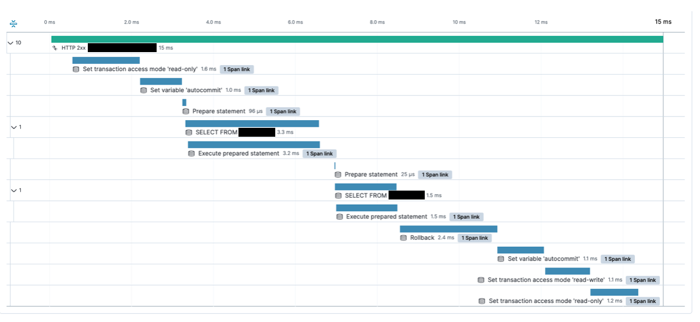
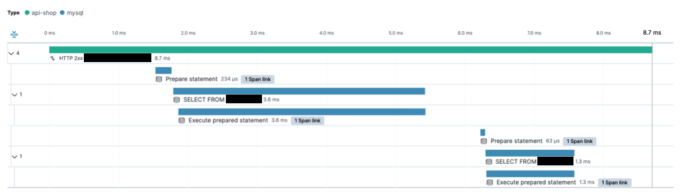

In Spring, `@Transactional(readOnly = true)` is commonly said to optimize performance by changing dirty checking to Manual mode. In practice, however, unnecessary JDBC calls can actually make it slower. Based on real call traces from Elastic APM, this post analyzes how read-only transactions affect performance and suggests a more practical alternative.

## The @Transactional Secret That Only Some Developers Know

The following API calls a Service method declared with `@Transactional(readOnly = true)`. Elastic APM tracing showed that although the API executed only two SELECT queries, it made several additional JDBC calls.



*Although only two queries clearly ran, several other operations were invoked as well.*

What exactly do those operations include?

## set\_option

They come from the <strong>internal settings (`set_option`) that JPA applies to manage a transaction when `@Transactional` is used</strong>. The following JDBC calls occur automatically during the process, and they can affect performance.

### 1\. Set transaction access mode 'read-only'

`@Transactional(readOnly = true)` causes the <strong>Connection to be configured as read-only at the JDBC level</strong>. At the implementation level, it invokes the following code.

```java
Connection.setReadOnly(true)
```

This setting can help optimize query plans in databases such as MySQL and PostgreSQL. Most JDBC drivers, however, do not require it, and it may <strong>introduce an additional network round trip</strong>.

### 2\. autocommit

When Spring begins a transaction, it also configures JPA's FlushMode. The default is `FlushModeType.AUTO`, which automatically triggers a flush when the transaction is committed or JPQL is executed.

```java
public interface Session extends SharedSessionContract, EntityManager {

	/**
	 * Set the current {@link FlushModeType JPA flush mode} for this session.
	 * <p>
	 * <em>Flushing</em> is the process of synchronizing the underlying persistent
	 * store with persistable state held in memory. The current flush mode determines
	 * when the session is automatically flushed.
	 *
	 * @param flushMode the new {@link FlushModeType}
	 *
	 * @see #setHibernateFlushMode(FlushMode) for additional options
	 */
	@Override
	void setFlushMode(FlushModeType flushMode);
    
}
```

```java
Session.setHibernateFlushMode(FlushMode.AUTO)
```

### 3\. Rollback

It is easy to assume that a rollback occurs only after an exception, but a database transaction can end <strong>only through an explicit commit or rollback</strong>. A rollback may therefore be invoked even when no exception occurs. With `@Transactional(readOnly = true)`, for example, Spring may conclude that no changes exist and <strong>explicitly call `rollback()`</strong> to end the transaction.

This means that even when nothing changes in the database, the JDBC driver still receives a rollback request, which can also become an <strong>unnecessary cost</strong>.

## What Changed After Removing @Transactional

I ran the API introduced above after removing `@Transactional(readOnly = true)`. Calls such as <strong><strong>Set transaction access mode 'read-only', <strong>autocommit, and <strong>Rollback</strong></strong></strong></strong> no longer occurred. As a result, I saw the API response time fall by nearly half.



*Simply removing @Transactional made the API faster.*

<strong>`@Transactional(readOnly = true)` is commonly said to improve application performance because it can change dirty checking to Manual mode. In this case, however, removing the transaction itself produced a much larger performance gain.</strong>

### Be Careful in a Replicated Environment!

Removing `@Transactional` purely for performance can cause problems in a database replication environment. Systems that use replication for higher database throughput and availability commonly route requests to a Primary or Replica database with `AbstractRoutingDataSource`, depending on whether the transaction is read-only.

```java
final AbstractRoutingDataSource dataSourceRouter =
        new AbstractRoutingDataSource() {
          @Override
          protected Object determineCurrentLookupKey() {
            return TransactionSynchronizationManager.isCurrentTransactionReadOnly()
                ? REPLICA_DATASOURCE_KEY
                : PRIMARY_DATASOURCE_KEY;
          }
        };
```

Because the branch depends on `TransactionSynchronizationManager.isCurrentTransactionReadOnly()`, <strong>removing the transaction itself can send every read request to the Primary</strong>. This breaks load distribution across Replicas and can harm overall system performance.

To solve this problem, the <strong>KakaoPay Tech Blog</strong> proposed a custom annotation like the following.

```java
@Target({ElementType.TYPE, ElementType.METHOD})
@Retention(RetentionPolicy.RUNTIME)
@Transactional(readOnly = true, propagation = Propagation.SUPPORTS)
public @interface ReadOnlyTransactional {}
```

With the `SUPPORTS` propagation level, a method called on its own without a transaction <strong>does not create one</strong>. If an upstream transaction exists, the method <strong>participates in that transaction</strong>.

In other words, a method annotated only with `@ReadOnlyTransactional` does not start a JPA transaction, so it can <strong>avoid unnecessary JDBC calls such as `setReadOnly` and `rollback`</strong> while allowing <strong>Replica routing based on `AbstractRoutingDataSource` to continue working correctly</strong>.

On the other hand, if an upstream layer has already started an `@Transactional(REQUIRED)` transaction, `@ReadOnlyTransactional` has no effect. This provides the additional advantage of <strong>fitting flexibly into an existing transaction structure</strong>.

### Be Careful When Using Lazy Loading Too!

What happens if an API uses Lazy Loading and you remove `@Transactional(readOnly = true)`? Every request to that API will produce the following error.

```text
org.hibernate.LazyInitializationException: could not initialize proxy - no Session
```

If Spring does not start a transaction, JPA cannot use a persistence context, which means Lazy Loading cannot be used either. An API that must use Lazy Loading for technical reasons needs `@Transactional` to provide a persistence context.

## Conclusion

`@Transactional(readOnly = true)` is commonly presented as a setting that <strong>optimizes read performance</strong>, but I found that it can add <strong>unnecessary JDBC-level calls</strong>, including Set readOnly, AutoCommit, and Rollback.

I also examined an approach that introduces an annotation such as `@ReadOnlyTransactional` with propagation set to `SUPPORTS`, reducing transaction overhead while preserving Replica routing.

The important point is <strong>not to apply one transaction strategy uniformly across the service, but to adapt it to each API's purpose and the system architecture</strong>. Remember that unnecessary use of `@Transactional` can itself become a performance bottleneck. In production, the key is to consider separating read-only transaction strategies where appropriate.

## References

-   [Are You Using JPA Transactional Correctly?](https://tech.kakaopay.com/post/jpa-transactional-bri/#%EC%8B%A4%EC%A0%9C%EB%A1%9C-set_option%EA%B3%BC-commit%EC%9D%B4-%EC%84%B1%EB%8A%A5%EC%97%90-%EC%98%81%ED%96%A5%EC%9D%84-%EB%AF%B8%EC%B9%A0%EA%B9%8C), KakaoPay Tech Blog
-   [Spring @Transactional read-only mode rollback behavior](https://stackoverflow.com/questions/43742617/spring-transactional-read-only-mode-rollback-behaviour), Stack Overflow
