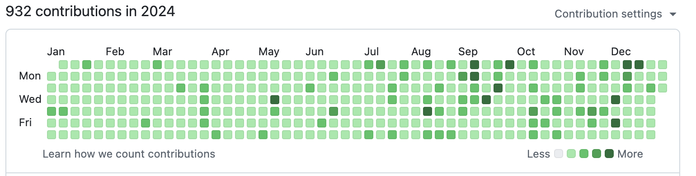
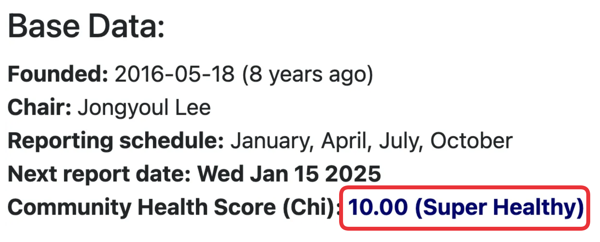
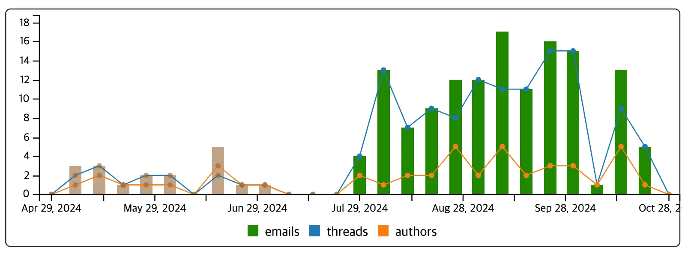
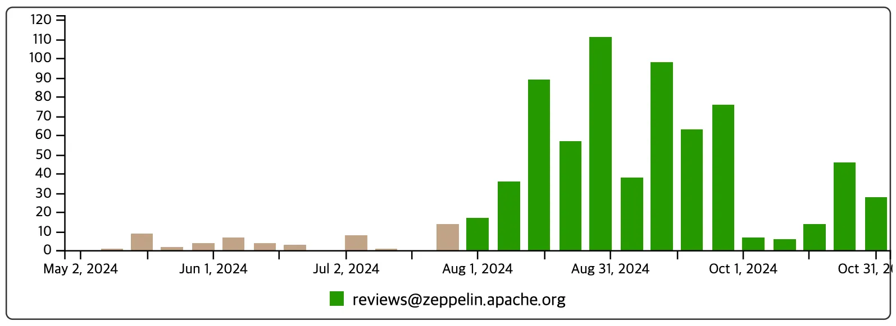
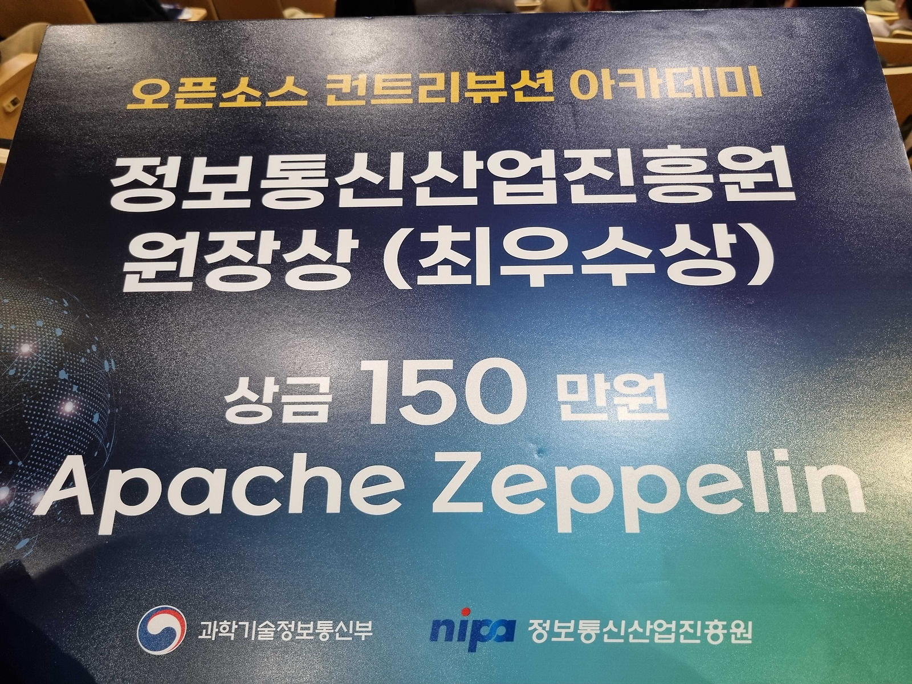
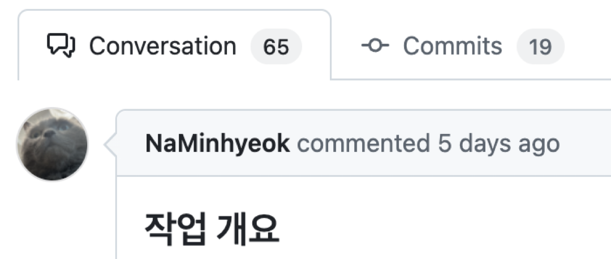
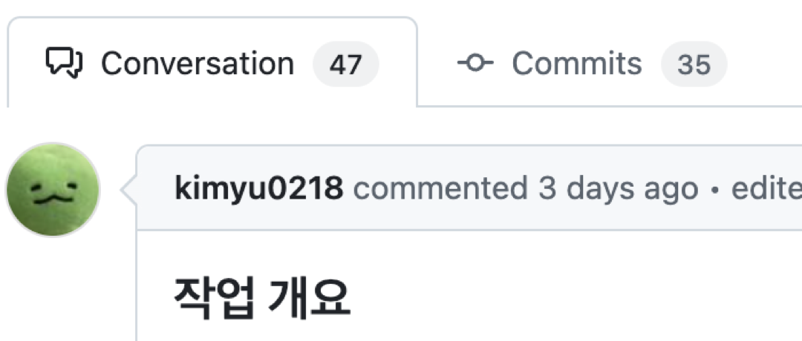
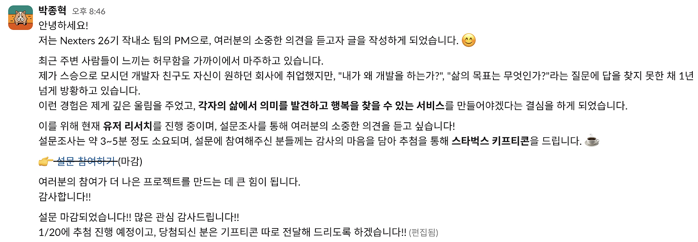
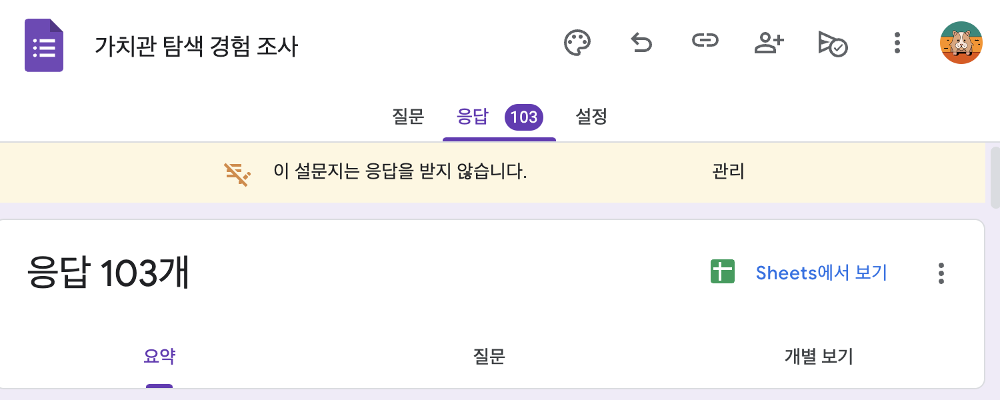

## 개발

### 1\. 1일 1커밋

올해도 어김없이 1일 1커밋을 성공적으로 이어갔다.

이제는 "1일 1커밋을 해야 하니까 개발을 한다"는 생각이 아니라, "매일 개발을 해야 하니까 그 과정에서 1일 1커밋을 자연스럽게 기록한다"는 느낌이다. 마치 개발을 위한 다이어리를 쓰는 것처럼 말이다. 이는 분명 긍정적인 변화라고 생각한다.

### 2\. 블로그

글또 9기의 경험이 좋았기에, 글또 10기에도 참여하게 되었다.

[글또 10기 시작!](https://myvelop.tistory.com/244)

글또에 참여한 이후, 더 좋은 글을 쓰기 위해 고민하는 시간이 많아졌다.

덕분에 글의 퀄리티는 높아졌다고 생각하지만, 예상과는 달리 블로그 방문자는 오히려 절반으로 줄었다. AI의 발전으로 직접 검색을 통해 자료를 찾는 일이 줄어든 영향도 있겠지만, 가장 큰 원인은 결국 나에게 있다고 본다.

쓰고 싶은 콘텐츠는 많지만, 막상 글로 옮기려 하면 시간이 오래 걸린다. 더 많은 콘텐츠를 생산하지 못한 것이 가장 아쉬운 점이다.

### 3\. 오픈소스 컨트리뷰션

개발을 시작하면서, 언젠가는 이름만 들어도 누구나 알만한 오픈소스에 기여하는 것이 목표였다.

그때 눈에 들어온 것이 <strong>오픈소스 컨트리뷰션</strong>이었다.

[2024 오픈소스 컨트리뷰션 아카데미 시작!](https://myvelop.tistory.com/232)

나는 Zeppelin의 의존성 관리 도구인 <strong>Helium</strong>의 업데이트 자동화를 주로 담당했다. 기존에는 S3 + AWS Lambda로 관리되고 있었지만, AWS 서버 지원이 중단되면서 새로운 방식으로의 전환이 필요했다. 이를 해결하기 위해 <strong>GitHub Actions를 활용한 자동화 작업</strong>을 진행했다. 그 과정에서 Helium의 버그를 찾아 수정하고, Kubernetes(k8s) 지원을 위한 Docker화 작업도 도왔다.

하나의 기여가 이루어지기까지는 생각보다 오랜 시간이 걸렸다. Maintainer분들도 전업 기여자가 아닌 현업 개발자였기 때문에, PR을 올리면 리뷰를 받는 데 <strong>일주일 이상</strong> 걸리는 경우도 많았다.

개인 스터디 일정 등으로 인해 모든 시간을 오픈소스 기여에 쏟을 수는 없었지만, 매주 주말에 열리는 <strong>오프라인 모임에는 꼭 참석</strong>했다. 함께 식사하며 개발 이야기를 나누는 시간이 즐거웠고, 다양한 책도 추천받으며 많은 배움을 얻을 수 있었다.

그리고 의미 있는 성과도 있었다. 우리 팀이 기여한 이후, Helium이 포함된 <strong>Apache Zeppelin이 Kafka, Spark를 포함한 Apache TLP(Top-Level Project) 중 가장 높은 커뮤니티 건강 지수를 달성</strong>했다. 무려 <strong>10점 만점에 10점!</strong> 🎉

또한 User Discussion 활성화 트래픽이 246% 상승했고 PR Review 활성화 트래픽이 858% 증가했다고 한다.

이런 성과를 인정받아 최우수상을 수여받게 되었다. 사실 이렇게 큰 상을 받게될 거라고는 상상도 하지 못하고 있었기 때문에 굉장히 놀랐고, 기뻤다.

### 4\. 토스 러너스하이 1기

<strong>업무의 본질은 무엇일까?</strong> 결국, <strong>제품을 성공시키는 것</strong>이다.

하지만 제품의 성공은 단순히 좋은 코드를 작성하는 것만으로 이루어지지 않는다. 올바른 방향으로 나아가기 위해서는 <strong>데이터 기반의 소통이 필요</strong>하며, 실패를 두려워하기보다 <strong>과감하게 시도하고, 그 과정에서 성과를 만들어내야 한다</strong>.

토스 멘토링을 통해 변화의 필요성을 논리적으로 설명하는 방법을 배우고, 개선된 성과가 조직에 미치는 영향을 보다 명확하게 전달할 수 있게 되었다. 예전에는 "아마 이게 더 낫지 않을까요?"라고 말하는 사람이었다면, 이제는 <strong>구체적인 근거를 바탕으로 팀원을 설득할 수 있는 사람</strong>이 되었다.

### 5\. 넥스터즈 합격

여름에 25기에 지원했지만, 지원서 제출일 저녁에 부랴부랴 작성한 것으로는 당연히 합격할 수 없었다.

26기에는 다르게 접근했다. <strong>일주일 동안 지원서를 준비</strong>했고, 제출 당일에는 <strong>반차까지 내며 포트폴리오를 정리</strong>했다. 그 결과 <strong>서류에 합격</strong>할 수 있었고, 면접을 거쳐 마침내 <strong>넥스터즈 26기에 합류</strong>하게 되었다.

[Nexters 26기 지원 및 면접 후기](https://myvelop.tistory.com/248)

## 새로운 도전. PM

넥스터즈에 처음 합류함과 동시에, <strong>PM 역할</strong>에 도전하는 무모한 도전을 시작했다.

### 백엔드 개발자로서

내 노력의 결실을 확인할 수 있는 시간이었다. <strong>2년간의 현업 경험이 결코 헛되지 않았음을 실감했다.</strong> 이제는 개발 프로젝트의 흐름을 파악하고, <strong>백엔드와 프론트엔드 팀의 일정을 조율하며 이끌어갈 수 있는 사람</strong>이 되었다.

사실, <strong>백엔드 개발자로서 직접 코드를 작성하는 시간은 거의 없었다.</strong> 대신, 프로젝트 전체를 설계하고, 도메인 모델링을 정의해 팀원들에게 제공하며, 코드 리뷰를 통해 개발의 방향성을 잡아주는 역할을 했다. <s>이거 완전 CTO 아잉교</s>

백엔드 팀원들의 <strong>열정은 대단했다.</strong> 궁금한 것도 많고, 소통에도 누구보다 적극적이었다. PR에는 수십 개의 코멘트가 달렸고, 나 역시 이 과정을 통해 배운 것이 많았다. <strong>내가 몰랐던 부분을 알아가고, 다른 사람의 코드를 읽으며 토론하는 과정이 무척 즐거웠다.</strong>

### PM으로서

프로덕트의 성공을 위해 진심으로 임했고, 내가 할 수 있는 일이라면 물불 가리지 않고 뛰어들었다.

한 번은 유저 리서치를 진행하면서, 팀원들에게 <strong>최소 50명에게 응답을 받아내겠다고 선언</strong>했다. 이를 위해 회사 사람들에게 일일이 찾아가 설문을 부탁하고, 친구들에게도 요청했다. 하지만 그것만으로는 부족하다고 느껴, 글또 커뮤니티의 자유 홍보 채널에 아래와 같은 글을 올려 추가로 홍보를 진행했다

결과적으로 <strong>48시간만에 103명의 설문</strong>을 받아, 리서치로부터 유의미한 데이터를 뽑아낼 수 있었다.

회사에서도 단순히 개발 업무만 하지 않고 기획자로서의 업무도 겸하고 있는데 PM의 역할을 할 때 큰 도움이 됐다. 덕분에 어떤 팀원에게는 백엔드 개발자가 아니라 기획자같다는 얘기를 듣기도 했다. <s>디자이너들 생각은 다를텐데</s>

프로젝트를 성공적으로 마치기 위해 최선을 다하고 있다. <strong>일정을 산정하여 제시</strong>하고, 팀원들과 적극적으로 소통하며 현재의 <strong>병목을 파악하고 해결하는 역할</strong>을 맡고 있다. 지금은 <strong>일정을 최대한 맞추기 위해 백엔드 개발뿐만 아니라, 프론트엔드와 Flutter 개발</strong>까지 동시에 진행하며 바쁘게 지내고 있다.

### 리더로서

리더로서 많이 아쉬웠다고 생각한다.

리더가 똑똑해야 팀원들이 고생을 안 하는데, 오히려 내 부족함 때문에 팀원들이 더 힘들었고 그 점이 가장 아쉽다

좋은 리더란 최고의 업무 효율을 만들어내는 사람이라고 생각한다. 여기서 말하는 업무 효율이란, 팀원들의 희생을 강요하는 것이 아니다. 올바른 선택을 통해 <strong>기회 비용을 최소화</strong>하고, 적절한 일정 조율로 <strong>직군별 병목을 방지</strong>하는 것이 중요하다.

이를 위해선 <strong>전략과 계획이 필수적</strong>이다. <strong>팀원보다 몇 수 앞을 내다보고 미리 고민</strong>해야 더 효과적인 방향을 제시할 수 있으며, 팀원들의 헛수고를 줄일 수 있다. 특히, 시간이 부족할 때는 이러한 역량이 더욱 중요해진다.

## 삶

### 1\. 내 나이만큼 책 읽기

27권의 책 읽기라는 목표를 달성했다. 나에게 깊게 각인 책도 있고, 그저그런 책들도 있었다.

나에게 가장 큰 도움이 되었던 "오브젝트"였고, 가장 좋았던 책은 몽테뉴의 "에세"였다.

2024년 내가 읽은 책은 아래와 같다.

#### 문학

-   랩걸, 호프 자런
-   참을 수 없는 존재의 가벼움, 밀란 쿤데라
-   반지의 제왕 1, J. R. R. 톨킨
-   반지의 제왕 2, J. R. R. 톨킨
-   반지의 제왕 3, J. R. R. 톨킨
-   반지의 제왕 4, J. R. R. 톨킨
-   이방인, 알베르 카뮈
-   에세1, 몽테뉴

#### 철학

-   인간 불평등 기원론, 루소
-   소크라테스 익스프레스, 에릭 와이너
-   운명론, 키케로

#### 개발 관련 서적

-   DDD 시작하기, 최범균
-   프로그래머의 길 멘토에게 묻다, 데이브 후버
-   리팩토링, 마틴 파울러
-   SQL Anti-Patterns, 빌카윈
-   구글 개발자는 이렇게 일한다, 타이터스 윈터스 외 2인
-   가상 면접 사례로 배우는 대규모 시스템 설계 기초1, 알렉스 쉬
-   클린 코드, 로버트 C. 마틴
-   오브젝트, 조영호
-   자바 ORM 표준 JPA 프로그래밍, 김영한
-   Real MySQL1, 백은빈, 이성욱
-   함께 자라기, 이창준
-   성공과 실패를 결정하는 1%의 네트워크 원리, 츠토무 톤
-   마이크로서비스 아키텍처 구축, 샘 뉴먼
-   이펙티브 자바, 조슈아 블로크
-   만들면서 배우는 클린 아키텍처, 톰 홈버그
-   헤드퍼스트 디자인패턴, 에릭 프리먼 외 3인

### 2\. 꾸준히 운동하기

보통 주 5일정도 헬스장에 나갔고, 여유가 있을 땐 주 7일 운동을 하기도 했다.

몸이 찌뿌둥할 때는 런닝도 가끔 나간다. 땀을 흘리는 그 느낌이 굉장히 좋다.

운동 덕분에 집중력도 올라가고, 자신감도 생겼다.

### 3\. 절주

술 마신 다음날 숙취에 절어 아무것도 못하고 시간을 낭비하는 내 자신이 싫었다.

술자리를 가지는 횟수도 한 달에 한두 번 정도로 줄었고, 마시더라도 취할 정도로 마시지 않게 되었다.

## 올해 계획

### 1\. 1일 1커밋

올해도 1일 1일 커밋! 꾸준히 해볼 생각이다!

### 2\. 좋은 글 많이 작성하기

예전에는 방문자 수에 엄청나게 큰 의미를 부여했었는데, 지금은 생각이 바뀌었다. 글을 작성함으로써, 내 생각이 정연해지고 그걸로 내가 성장할 수 있다면 충분하다는 생각이 들었다. 남들에게 좋은 글보다는 나에게 좋은 글을 위주로 작성해볼 생각이다. 나에게도 좋은 글이라면 누군가에게도 좋은 영향이 될 수 있지 않을까.
