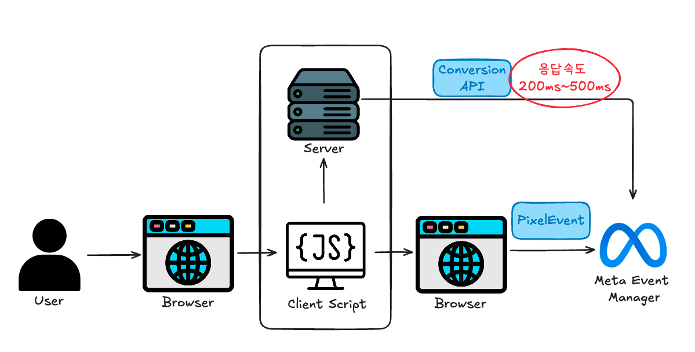
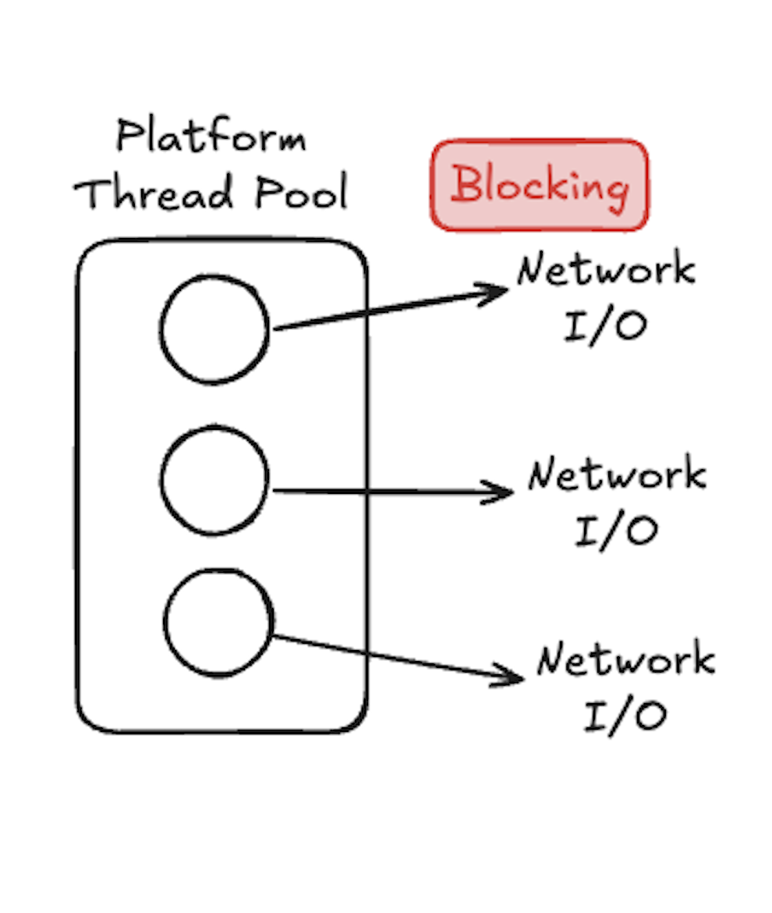
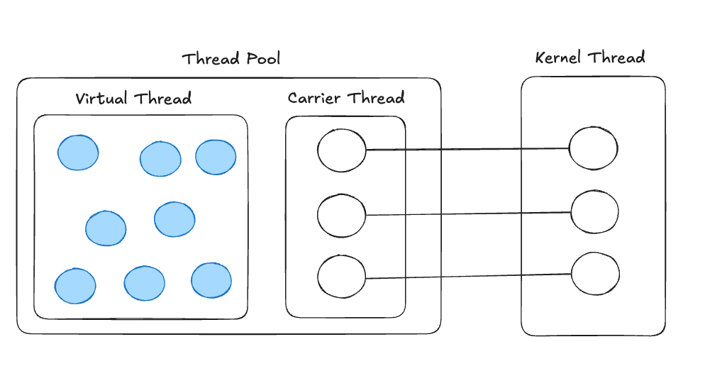
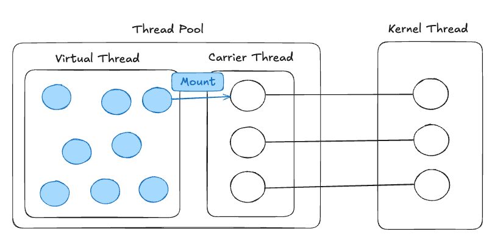
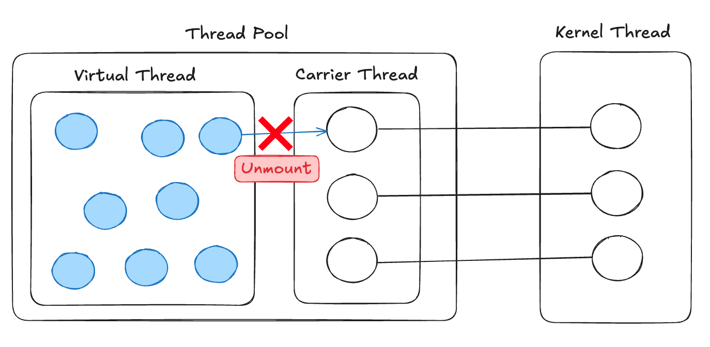
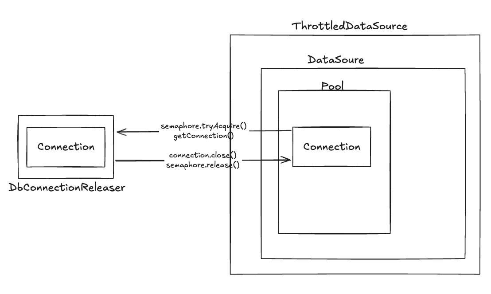

이 글은 Network I/O로 인한 스레드 블로킹 문제를 진단하고, JDK 21의 가상 스레드(Virtual Thread)를 활용해 근본적인 해결책을 찾아가는 과정을 담고 있다. 단순히 문제를 해결하는 것을 넘어, 가상 스레드 도입 과정에서 마주친 Thread Pinning과 Overwhelming 같은 예상치 못한 도전들과 그 해결책까지 상세히 다룬다.

## 스레드 풀이 왜 고갈되었을까?

월요일 오전 10시, 커피를 마시며 한 주를 시작하려는 순간 슬랙에서 지연시간 알림이 오기 시작한다.

급하게 모니터링 대시보드를 확인해본다.

-   잔여 스레드 수: 0

왜 스레드 풀이 고갈되었을까?

마케팅 팀과 협업해 만든 서버 사이드 이벤트 추적(Meta Conversion API 연동)의 영향이었다.



데이터를 수집하기 위해 사용자의 모든 주요 행동을 Meta에 전송하는 시스템이다. 페이지 이동, 버튼 클릭, 구매 완료 등의 행동 유형을 파악하고, 마케팅 성과를 추적하고 있다. 하지만 <strong>각 API 호출마다 200\~500ms의 Network I/O가 발생</strong>했고, 무료체험 오픈 시간대의 트래픽과 만나자 문제가 발생한 것이다.

<strong>Network I/O가 스레드 풀 고갈에 미치는 치명적인 영향을 알려면 플랫폼 스레드의 한계에 대해서 이해하고 있어야 한다.</strong>

### 기술적인 문제 분석

<strong>플랫폼 스레드의 한계</strong>를 파악해보자.

-   DB 접근, API 호출 등 I/O 작업을 수행할 때 <strong>스레드가 Blocking된다.</strong> 이때 Blocking된 스레드는 다른 작업을 할 수 없다.
-   컨텍스트 스위칭 비용이 낮은 가상스레드, 스레드 스위칭 비용이 없는 코루틴 등에 비해 <strong>상대적으로 컨텍스트 스위칭 비용이 높다.</strong>
-   <strong>스레드 생성하는 데 시간이 오래 걸린다.</strong> 그렇다고 미리 만들어두기엔 스레드 1개당 MB 단위의 메모리를 필요로 하기 때문에 <strong>자원을 낭비하게 될 가능성이 크다.</strong>



*I/O 작업이 발생할 때 Blocking이 일어나기 때문에 스레드가 다른 작업을 할 수 없다.*

문제상황을 정리해보자면 다음과 같다.

예를 들어, 스레드 풀에서 가용할 수 있는 스레드를 100개를 설정했다고 해보자. Network I/O 200ms가 발생한다고 했을 때, 해당 요청이 1초에 500번만 들어와도 가용 가능한 스레드가 없어진다.

<strong>물론 스레드의 수를 늘리면 위 문제를 간단하게 해결할 수 있겠지만, 근본적인 문제인 Blocking I/O를 해결하면 리소스를 아낄 수 있다.</strong>

## 근본적인 문제 해결하기

Blocking이 문제라면 Non-Blocking 도구를 활용하면 된다.

JVM 생태계에는 여러 선택지가 있었다.

### 1\. Spring Reactor

Spring 생태계의 대표적인 비동기 프로그래밍 도구다.

```java
public Mono<Void> trackEvent(EventData eventData) {
    return Mono.fromCallable(() -> eventData)
        .flatMap(this::validateEvent)
        .flatMap(this::enrichEventData)
        .flatMap(this::sendToMetaAPI)
        .then();
}
```

기존의 간단한 trackEvent() 메서드가 Mono 체인으로 변해야 했고, 이를 호출하는 모든 코드까지 연쇄적으로 수정해야 했다. DB 접근은? R2DBC를 공부하고 도입해야 한다.

팀의 학습 곡선과 프로젝트 전체 아키텍처의 변경을 감수해야 하기에 다른 방법을 찾아봤다.

### 2\. 코루틴

Reactor보다는 적용 난이도가 낮아 보였지만 자바 프로젝트에 Kotlin을 섞어야 하고, 여전히 상당한 코드 변경이 필요했다. 그때 [카카오페이 기술블로그](https://tech.kakaopay.com/post/coroutine_virtual_thread_wayne/)에서 코루틴보다 가상스레드의 성능이 더 좋다는 글이 눈에 띄었다.

### 3\. 가상 스레드

JDK 21부터 제공하기 시작한 기술로, 경량 스레드 기술이다.

가상 스레드의 구성도를 대충 그려보자면 아래와 같다.

Carrier Thread는 기존의 Platform Thread라고 이며, Kernel Thread와 1대 1로 매핑되는 관계라고 생각하면 된다.



요청을 처리하기 위해 스레드를 할당할 때, 가상 스레드는 Mount 과정을 통해 Carrier Thread와 연결된다.



이때 가상스레드가 I/O 작업을 만나면 Unmount를 통해 연결을 끊고, 다른 가상스레드가 Carrier Thread를 사용할 수 있는 상태로 만든다. 이게 가상 스레드가 Non-Blocking으로 동작하는 방식이다.



I/O 작업이 끝나면 다시 Carrier Thread와 연결하여 작업을 마무리하고 응답을 진행하게 될 것이다.

덕분에 적은 Carrier Thread 개수만으로도 많은 요청을 처리할 수 있다.

또한 가상 스레드는 적은 메모리, 짧은 생성시간 등의 장점을 가지고 있다.

아래 표는 플랫폼 스레드와 가상 스레드를 비교한 내용이다.

|  | Platform Thread | Virtual Thread |
| --- | --- | --- |
| Stack 사이즈 | \~2MB | \~10KB |
| 생성시간 | \~1ms | \~1μs |
| 컨텍스트 스위칭 | \~100μs | \~10μs |

## 가상 스레드 적용해보기

적용 방법은 간단했다.

```java
@EnableAsync
@Configuration
public class AsyncConfig implements AsyncConfigurer {
    
    private static final String PREFIX = "virtual-thread-";
    private static final String TOMCAT_PREFIX = "tomcat-virtual-thread-";
    
    @Bean(TaskExecutionAutoConfiguration.APPLICATION_TASK_EXECUTOR_BEAN_NAME)
    public AsyncTaskExecutor executor() {
        return createAsyncTaskExecutor(true, PREFIX, 5000);
    }
    
    @Bean
    public TomcatProtocolHandlerCustomizer<?> protocolHandlerVirtualThreadExecutorCustomizer() {
        return protocolHandler -> 
            protocolHandler.setExecutor(
                createAsyncTaskExecutor(true, TOMCAT_PREFIX, 5000)
            );
    }
    
    private SimpleAsyncTaskExecutor createAsyncTaskExecutor(
            final boolean isVirtualThread, final String prefix, final int timeout) {
        SimpleAsyncTaskExecutor asyncTaskExecutor = new SimpleAsyncTaskExecutor();
        asyncTaskExecutor.setVirtualThreads(isVirtualThread);
        asyncTaskExecutor.setThreadFactory(Thread.ofVirtual().name(prefix, 0).factory());
        asyncTaskExecutor.setTaskTerminationTimeout(timeout);
        return asyncTaskExecutor;
    }
}
```

이 설정 하나로 애플리케이션 전체가 가상스레드로 전환된다. Tomcat이 요청을 받는 것부터 비동기 작업까지 모두 가상스레드가 처리한다.

기존의 코드도 전혀 수정할 필요가 없다.

```java
public void trackEvent(TrackedEvent event) {
    // ...
    sendToMeta(event);  // 200~500ms blocking
}
```

가상스레드를 적용하는 것만으로도 다음과 같은 성과를 얻을 수 있었다.

-   피크 시간 P95 Latency: <strong>1.3초 → 80ms</strong>
-   메모리 사용량 감소

## 끝나지 않은 문제

"가상스레드를 적용하고 끝!"... 이었으면 좋았겠지만

성능 테스트를 진행하던 중 생각보다 성능이 나오지 않았고, 예상치 못한 에러도 만났다.

### 1\. Thread Pinning - 가상스레드가 synchronized를 만났을 때

성능 테스트에서 DB 접근 작업 시 처리량이 전혀 개선되지 않았다. 원인은 <strong>MySQL Connector/J 8.x가 내부적으로 사용하는 synchronized 키워드</strong>였다.

가상스레드는 synchronized를 만나면 플랫폼 스레드를 반납하지 못한다. JVM이 synchronized의 잠금(Monitor Lock) 소유자를 플랫폼 스레드로 기록하기 때문에 가상 스레드가 그 안에 갇혀 버린다. 가상 스레드의 장점이 사라지는 것이다.

만약 synchronized의 Blocking 문제를 해결하고 싶다면 ReentrantLock으로의 마이그레이션이 필요하다. 다행히 Connector/J는 가상 스레드 지원을 위해 발 빠르게 움직였다.

Connector/J 9.0.0 릴리스 노트를 확인하면 synchronized 대신 ReentrantLock을 사용하여 가상 스레드 친화적인 방향으로 코드를 개선했다고 한다. 실제로 Connector/J 9.x 버전으로 업데이트하니, 처리량이 개선된 것을 확인할 수 있었다.


모든 라이브러리가 Connector/J처럼 가상 스레드 호환에 적극적인 것은 아니다.

아직 많은 JVM 생태계의 라이브러리들이 synchronized를 그대로 사용하고 있다고 한다.

하지만 Thread Pinning 문제는 역사 속으로 사라지게 될 것 같다.

[JEP 491](https://openjdk.org/jeps/491)에 따르면 JDK 24에서 획기적인 개선이 이뤄졌다.

-   JVM 잠금 소유자를 플랫폼 스레드가 아닌 가상 스레드 자체로 직접 추적하도록 변경
-   따라서 synchronized 키워드를 만다더라도 플랫폼 스레드로부터 unmount를 진행할 수 있다.

### 2\. Overwhelming - 사라진 유량 제어

```java
HikariPool-1 - Connection is not available, request timed out after ~~~~~ms
```

스파이크 테스트를 진행하니, DB Connection Timeout이 발생한다. 왜 갑자기 DB 연결에서 문제가 발생할까?

플랫폼 스레드의 blocking은 의외의 역할을 하고 있었다. 바로 <strong>자연스러운 스로틀링</strong>이었다.

> 플랫폼 스레드 시절: 100개 스레드 = 최대 100개 동시 DB 접근  
> 가상스레드 적용 후: 무제한 스레드 = DB 커넥션 풀 순식간에 고갈

<strong>만약 너무 많은 요청량이 그대로 DB에 전달되면 DB에서도 장애가 발생할 수 있는 위험한 상황인 것이다.</strong>

마침 [카카오 테크 밋](https://www.youtube.com/watch?v=vQP6Rs-ywlQ&t=1544s)에서 똑같은 사례를 발견했다. 해결책은 세마포어를 활용한 의도적인 유량 제어였다.

구현 코드는 제공해주지 않아 유량 제어를 직접 설계해봤다.

데코레이터 패턴을 활용하여 DataSource와 Connection 객체를 감싸 설정했다.



DB 커넥션 풀 크기만큼만 동시 접근을 허용하도록 세마포어를 구현했다. 핵심은 DataSource.getConnection() 호출 시 세마포어를 획득하고, Connection.close() 시 반환하는 것이다.

```java
public class ThrottledDataSource implements DataSource {
    
    private final DataSource dataSource;
    private final Semaphore semaphore;
    
    public ThrottledDataSource(final DataSource dataSource, final int maximumPoolSize) {
        this.dataSource = dataSource;
        this.semaphore = new Semaphore(maximumPoolSize);
    }
    
    @Override
    public Connection getConnection() throws SQLException {
        try {
            semaphore.acquire();
            return new DbConnectionReleaser(dataSource.getConnection(), semaphore);
        } catch (InterruptedException e) {
            throw new RuntimeException(e);
        }
    }
    
    // 나머지는 delegate pattern으로 처리
}
```

<strong>자원 반환을 보장하기 위해 Connection도 감쌌다.</strong>

```java
public class DbConnectionReleaser implements Connection {
    
    private final Connection delegate;
    private final Semaphore semaphore;
    
    public DbConnectionReleaser(final Connection delegate, final Semaphore semaphore) {
        this.delegate = delegate;
        this.semaphore = semaphore;
    }
    
    @Override
    public void close() throws SQLException {
        try {
            delegate.close();
        } finally {
            semaphore.release();  // 반드시 세마포어 반환
        }
    }
    
    // 나머지는 delegate로 위임
}
```

DataSourceConfig에서 ThrottledDataSource로 감싸기만 하면 된다:

```java
@Configuration
public class DataSourceConfig {
    
    @Bean
    @ConfigurationProperties(prefix = "spring.datasource.hikari")
    public HikariConfig hikariConfig() {
        return new HikariConfig();
    }
    
    @Bean
    public DataSource dataSource(final HikariConfig hikariConfig) {
        HikariDataSource dataSource = new HikariDataSource(hikariConfig);
        return new ThrottledDataSource(dataSource, hikariConfig.getMaximumPoolSize());
    }
}
```

## 가상 스레드가 가져온 변화

스레드 풀 고갈 문제는 단순히 스레드 수를 늘리는 것으로 해결할 수 있지만, 이는 근본적인 해결책이 아닐 수 있다. 이번 사례를 통해 가상 스레드가 기존의 블로킹 I/O 문제를 얼마나 간단하게 해결할 수 있는지 확인할 수 있었다. 피크 시간 P95 레이턴시를 1.3초에서 80ms로 대폭 개선하고, 메모리 사용량까지 줄이는 성과를 거두었다.

특히 주목할 점은 가상 스레드의 도입 용이성이다. Spring Reactor나 코루틴처럼 코드베이스를 수정할 필요 없이, 설정 변경만으로도 즉시 적용할 수 있다는 것은 큰 장점이다. 물론 Thread Pinning과 같은 함정들이 있었지만, 라이브러리 버전 업그레이드 혹은 JDK 24 업그레이드 등으로 해결 가능했다.

가상 스레드는 단순한 기술적 개선을 넘어, JVM 생태계가 현대적인 동시성 패러다임으로 전환하는 중요한 전환점이 되고 있다. 최소한의 코드 변경으로 블로킹 I/O 문제를 해결하고 싶다면, 가상 스레드 도입을 적극 고려해보길 권한다.

## 참고 자료

-   우아한 기술 블로그, [Java의 미래 Virtual Thread](https://techblog.woowahan.com/15398/)
-   카카오 테크 밋, [JDK 21의 신기능 Virtual Thread 알아보기 (안정수 James)](https://www.youtube.com/watch?v=vQP6Rs-ywlQ&t=1544s)
-   [JEP 491: Synchronize Virtual Threads without Pinning](https://openjdk.org/jeps/491)
-   카카오 페이 기술 블로그, [코루틴과 Virtual Thread 비교와 사용](https://tech.kakaopay.com/post/coroutine_virtual_thread_wayne/)
