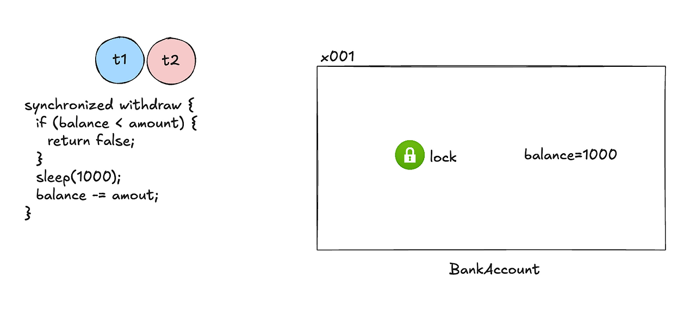
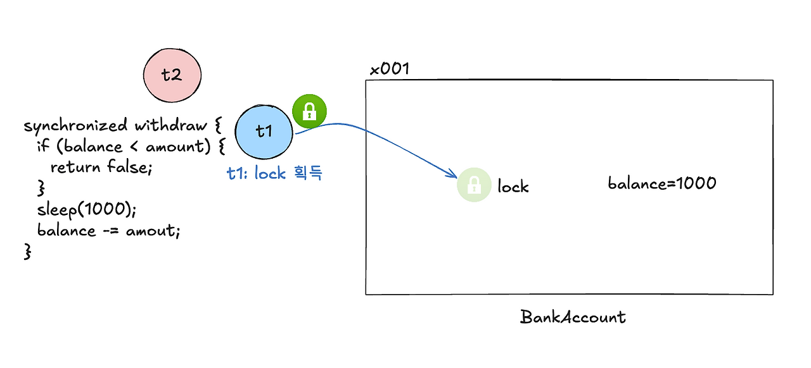
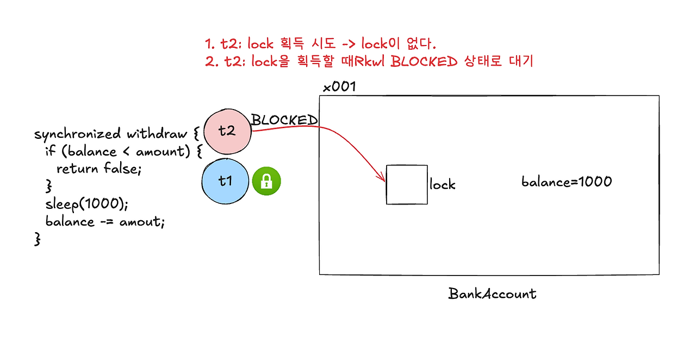
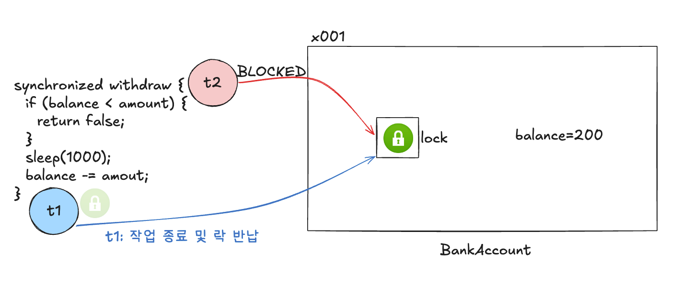
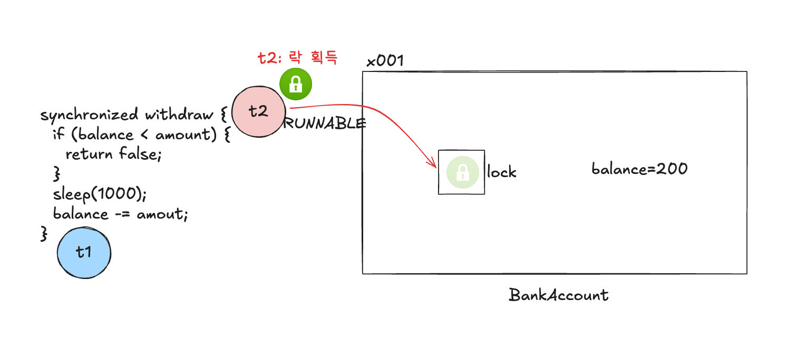
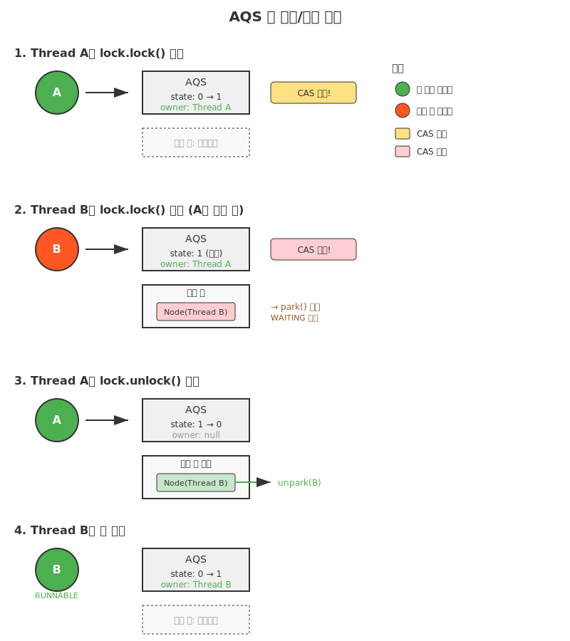

이 글에서는 synchronized 키워드의 JVM 모니터 락이 실제로 어떻게 동작하는지 살펴보고, ReentrantLock이 제공하는 동시성 처리 기능을 알아본 뒤, 동시성 프로그래밍을 할 때 발생할 수 있는 생산자-소비자 문제를 해결해본다. 그리고 사용자별 키 값을 활용한 락 분리 전략으로 성능을 개선하는 방법을 다룰 예정이다.

## synchronized만으로 충분할까

'synchronized를 쓰면 동시성 문제가 해결된다'라고만 이해하고 있을 수도 있다. 실제로 동시성 문제를 해결하기 위해 단순히 코드 블록에 synchronized만 붙이면 문제는 해결되지만 성능이 급격히 떨어지는 경우를 자주 볼 수 있다.

예를 들어, 모든 사용자의 포인트 처리가 하나의 공유된 락으로 처리하면, 사용자 A의 포인트 적립이 사용자 B의 포인트 적립을 대기하게 만드는 불필요한 병목이 발생한다.

자바에서 제공하는 동시성 처리 기능에 대해 정확히 이해하고 상황에 맞는 동시성 제어 전략을 선택할 수 있다면 이런 문제들을 효과적으로 해결할 수 있다.

## JVM 모니터 락의 비밀

### 간단한 계좌 차감 로직 예시 소개

계좌에서 돈을 인출하는 메서드에 synchronized를 붙여 동시성을 제어하는 코드 예시다.

synchronized 키워드가 붙는 순간, JVM 내부에서는 꽤 복잡한 일들이 벌어진다.

```java
    public synchronized boolean withdraw(long amount) {
        if (balance < amount) {
            return false;
        }
        Thread.sleep(1000); // 외부 시스템 연동 시뮬레이션
        balance -= amount;
        return true;
    }
```

### 모니터 락(Monitor Lock)이란

Java의 모든 객체는 모니터(monitor)라는 내재 락을 가지고 있다.

synchronized 키워드를 만나면, 스레드는 해당 객체의 모니터 락을 획득해야만 <strong>임계 영역</strong>에 진입할 수 있다.

> <strong>임계 영역(Critical Section)이란?</strong>  
> 여러 스레드(작업 단위)가 동시에 접근해서는 안 되는 공유 자원(데이터나 변수)에 접근하는 코드 영역 을 말한다.

아래 코드에서는 메소드 레벨에 synchronized가 걸렸기 때문에 this의 모니터 락을 획득하는 과정을 거친다.

```java
    public synchronized boolean withdraw(long amount) {
        if (balance < amount) {
            return false;
        }
        Thread.sleep(1000); // 외부 시스템 연동 시뮬레이션
        balance -= amount;
        return true;
    }
```

반면 아래와 같이 sychronized에서 사용할 객체를 명시하면 해당 객체의 모니터 락을 획득하도록 만들 수도 있다.

```java
    public boolean logic(String key) {
        synchronized (key) {
            // ...
        }
    }
```

### 락 획득 과정

두 개의 스레드(t1, t2)가 동시에 계좌에서 출금을 시도하는 상황을 살펴보자.

#### 1\. 초기 상태

BankAccount 객체는 모니터 락을 가지고 있다.

t1과 t2 두 스레드가 동시에 withdraw() 메서드를 호출하려고 대기 중이다.

계좌의 잔액은 1000원이다.



#### 2\. t1이 락을 획득

t1이 먼저 모니터 락을 획득했다.

이제 <strong>t1은 synchronized 블록 내부로 진입</strong>할 수 있다. (이것을 "임계 영역에 진입"한다고 표현)



#### 3\. t2는 BLOCKED 상태로 대기

여기서 핵심은 <strong>t2는 락을 획득하지 못해 BLOCKED 상태가 된다</strong>는 점이다.

> <strong>자바 스레드의 상태값 종류</strong>  
> 총 6가지의 상태가 있다.  
> NEW, RUNNABLE, BLOCKED, WAITING, TIMED\_WAITING, TERMINATED

t2가 락을 획득하려 시도하지만, 이미 t1이 보유 중이므로 BLOCKED 상태로 대기한다.

이 상태에서 t2는 CPU를 전혀 사용하지 않고 대기만 한다.



#### 4\. t1 작업 완료 및 락 반납

t1은 800원을 차감하고 synchronized 블록을 벗어난다.

잔액은 200원이 되고, 락이 해제된다.



#### 5\. t2 락 획득 및 실행

t1이 락을 반납하면 BLOCKED 상태였던 t2가 RUNNABLE 상태로 전환되며 락을 획득한다.

이제 t2가 synchronized 블록 안의 코드를 실행할 수 있다.



### Virtual Thread와 Thread Pinning

JDK 21에서 Virtual Thread가 도입되면서 synchronized 사용 시 주의할 점이 생겼다.

synchronized 블록 내에서 Virtual Thread는 캐리어 스레드에 "고정(pinned)"된다.

가상 스레드는 I/O 작업을 만났을 때, Unmount를 통해 스레드가 다른 작업을 할 수 있게 해주는 것이 장점인데, JVM이 synchronized의 잠금(Monitor Lock) 소유자를 플랫폼 스레드로 기록하기 때문에 가상 스레드가 그 안에 갇혀 버리는 문제가 발생한다.

이는 Virtual Thread의 주요 이점인 스레드 전환 효율성을 무효화시킨다.

다행히 JDK 24에서는 이 문제가 해결되어, synchronized 블록에서도 Virtual Thread가 자유롭게 스케줄링될 수 있다.

### sychronized의 한계

#### 1\. 락 획득 시도를 중단할 수 없다.

실제로 사용자가 동시성 처리와 관련된 버튼을 눌렀다가 로딩이 길어져 페이지를 떠났어도, 서버의 스레드는 계속 synchronized 블록 앞에서 대기한다. 타임아웃 설정도, 중간에 포기하는 것도 불가능하다.

#### 2\. 락 획득 순서를 보장하지 않는다.

이벤트 상품 구매처럼 순서가 중요한 경우, 먼저 온 사용자가 계속 밀리는 불공정한 상황이 발생할 수 있다.

#### 3\. 락 상태를 확인할 수 없다.

현재 Lock이 사용 중인지 확인하고 싶어도, synchronized로는 확인할 방법이 없다.

직접 임계 영역으로 진입해보는 수밖에 없다.

#### 4\. 여러 조건 변수를 사용할 수 없다.

synchronized에선느 wait()/notify()만 다루고 이 메소드들은 구분 없이 모든 대기 스레드를 다룬다.

불필요하게 깨어났다가 다시 잠드는 스레드가 많아지면 성능에 영향을 미칠 수 있다.

이 문제를 Thundering Herd Problem라고 부른다.

## 모니터 락을 넘어서: ReentrantLock

앞서 본 synchronized의 한계들을 해결할 수 있는 대안이 바로 ReentrantLock이다. java.util.concurrent 패키지에서 제공하는 이 락은 synchronized와 같은 상호 배제를 보장하면서도 훨씬 더 유연한 제어가 가능하다.

위의 차감 예시를 ReentrantLock으로 다시 작성해보자.

```java
    private final ReentrantLock lock = new ReentrantLock();

    public boolean withdraw(long amount) {
        lock.lock();
        try {
            if (balance < amount) {
                return false;
            }
            Thread.sleep(1000); // 외부 시스템 연동 시뮬레이션
            balance -= amount;
            return true;
        } finally {
            lock.unlock();
        }
    }
```

### AQS(AbstractQueuedSynchronizer)

ReentrantLock이 synchronized보다 유연한 이유는 AQS라는 프레임워크를 기반으로 동작하기 때문이다. JVM 모니터 락이 네이티브 레벨에서 동작한다면, AQS는 순수 Java로 구현되어 있다.

코드를 살펴보자.

-   state는 락 획득 숫자를 의미한다. <strong>ReentrantLock은 단어의 뜻 그대로 재진입이 가능한 락</strong>인데, <strong>같은 스레드가 중첩해서 락을 획득할 수 있다.</strong> 이 기능을 통해 <strong>스스로를 블로킹하는 모순적인 상황을 방지할 수 있다.</strong>

```java
public abstract class AbstractQueuedSynchronizer
    extends AbstractOwnableSynchronizer
    implements java.io.Serializable {
    
    /**
     * Head of the wait queue, lazily initialized.
     */
    private transient volatile Node head;

    /**
     * Tail of the wait queue. After initialization, modified only via casTail.
     */
    private transient volatile Node tail;

    /**
     * The synchronization state.
     */
    private volatile int state;
    
    abstract static class Node {
        volatile Node prev;       // initially attached via casTail
        volatile Node next;       // visibly nonnull when signallable
        Thread waiter;            // visibly nonnull when enqueued
        volatile int status;      // written by owner, atomic bit ops by others
    }
}
```

AQS가 락을 획득하고 해제하는 과정은 아래와 같다.



### ReentrantLock의 핵심 기능

ReentrantLock은 Lock 인터페이스를 구현한다. JVM이 아닌 자바 코드 레벨에서 Lock을 걸기 때문에 synchronized에서는 불가능했던 다양한 기능을 제공할 수 있다. 

```java
public interface Lock {
  
    void lock();
    void lockInterruptibly() throws InterruptedException;
    boolean tryLock();
    boolean tryLock(long time, TimeUnit unit) throws InterruptedException;
    void unlock();
    Condition newCondition();
}
```

#### 1\. lock() / unlock()

lock()은 락을 획득하는 메소드다. 다른 스레드가 이미 락을 획득했다면 락이 풀릴 때까지 WAITING한다.

unlock()은 락을 해제한다. 락이 해제되면 다른 스레드가 락을 획득할 수 있게 된다.

#### 2\. tryLock()

락을 시도하는 메소드이다. 

락 획득에 성공하면 true를 반환하고, 실패하면 false를 반환한다.

```java
public interface Lock {
    // 1회만 획득 요청
    boolean tryLock();

    // 시간만큼 대기
    boolean tryLock(long time, TimeUnit unit) throws InterruptedException;
}
```

락을 무한정 기다리는 것이 병목이 될 수 있으므로 중간에 실패하길 원한다면 넣어주는 것이 좋다.

#### 3\. lockInterruptibly()

대기하는 동안 다른 스레드가 Thread.interrupt()를 호출하면, 즉시 InterruptedException을 던지며 대기를 포기하는 락이다. lockInterruptibly()를 사용하면 종료 시점에 대기 중인 모든 스레드에 인터럽트를 걸어 깔끔하게 정리할 수 있다.

```java
public interface Lock {
  
    void lockInterruptibly() throws InterruptedException;
}
```

#### 4\. 공정 모드

ReentrantLock을 생성할 때 boolean을 전달하면 공정 모드를 설정할 수 있다.

```java
// 공정한 락: 먼저 온 스레드가 먼저 획득
private final ReentrantLock fairLock = new ReentrantLock(true);

// 불공정한 락: 성능 우선 (기본값)
private final ReentrantLock unfairLock = new ReentrantLock(false);
```

만약 요청의 순서가 중요한 이벤트 로직의 경우 공정 모드를 통해 순서를 보장할 수 있다.

다만 속도가 약간 느려진다고 한다.

## 생산자-소비자 문제

생산자-소비자 문제는 여러 스레드가 데이터를 공유할 때 발생할 수 있는 가장 대표적인 동시성 문제이다.

### 문제 설명

생산자-소비자 문제는 3가지 핵심요소로 구성된다.

-   <strong>생산자 (Producer)</strong>: 데이터나 작업을 생성하는 역할을 한다. 생성한 결과물을 공유 자원인 '버퍼'에 저장한다.
-   <strong>소비자 (Consumer):</strong> '버퍼'에 저장된 데이터나 작업을 가져와서 처리(소비)하는 역할을 한다. 버퍼에서 데이터를 가져와 사용한다.
-   <strong>유한 버퍼 (Bounded Buffer)</strong>: 생산자와 소비자 사이의 공유 자원입니다. 저장할 수 있는 데이터의 개수가 <strong>제한</strong>되어 있습니다. 제한된 용량이 문제의 핵심이다.

버퍼가 가득찼을 때 버퍼에 담으려고 하면 넘칠 것이고, 버퍼가 없을 때 꺼내려고 하면 불필요한 행동을 반복하게 된다. 따라서 아래와 같은 조건을 만족해야 하는 것이 좋다.

-   <strong>버퍼가 가득 차면, 생산자는 기다려야 한다</strong>: 버퍼에 더 이상 데이터를 넣을 공간이 없으면, 생산자는 소비자가 데이터를 빼서 공간을 만들 때까지 대기해야 한다.
-   <strong>버퍼가 비어 있으면, 소비자는 기다려야 한다</strong>: 버퍼에 가져갈 데이터가 하나도 없으면, 소비자는 생산자가 데이터를 채워 넣을 때까지 대기해야 한다.

이 문제는 ReentrantLock을 활용하면 해결할 수 있다.

### ReentrantLock의 Condition을 통한 세밀한 제어

Condition은 락과 결합되어 사용되며, 스레드가 특정 조건을 기다리거나 신호를 받을 수 있도록 한다. Object 클래스의 wait, notify, notifyAll과 유사한 역할을 한다고 보면 된다.

Lock에서 newCondition() 메소드를 호출하면 Condition 객체를 얻을 수 있다.

```java
public interface Lock {
  
    Condition newCondition();
}
```

간단하기 2개의 메소드만 알아보자.

-   <strong>await()</strong>: 현재 스레드가 가진 Lock을 해제하고, 다른 스레드가 signal()이나 signalAll()을 호출해 자신을 깨울 때까지 대기한다.
-   <strong>signal()</strong>: 해당 Condition에서 대기 중인(awaiting) 스레드 중 <strong>하나를 무작위로 선택하여 깨운다.</strong> 깨어난 스레드는 다시 Lock을 획득하기 위해 시도한다.

```java
public interface Condition {

  void await() throws InterruptedException;
  void signal();
}
```

아래와 같이 Condition을 활용하면 생산자-소비자 패턴을 효율적으로 구현할 수 있다. 큐가 비었을 때 생산할 때까지 소비자가 기다리고, 큐가 가득찼을 땐 소비할 때까지 생산자가 기다린다.

```java
public class BoundedQueue implements BoundedQueue {

  private final Lock lock = new ReentrantLock();
  private final Condition producerCond = lock.newCondition(); // 생산자
  private final Condition consumerCond = lock.newCondition(); // 소비자

  private final Queue<String> queue = new ArrayDeque<>();
  private final int max;

  public BoundedQueue(final int max) {
    this.max = max;
  }

  @Override
  public void produce(final String data) {
    lock.lock();
    try {
      while (queue.size() == max) {
        try {
          // 버퍼가 가득 차면 생산자를 대기시킨다.
          producerCond.await();
        } catch (InterruptedException e) {
          throw new RuntimeException(e);
        }
      }
      // 대기 상태가 풀리면 데이터를 저장한다. (소비 메소드에서 생산자의 signal()을 호출)
      queue.offer(data);
      // 생산자가 데이터를 저장하면 소비자의 signal() 호출한다.
      consumerCond.signal();
    } finally {
      lock.unlock();
    }
  }

  @Override
  public String consume() {
    lock.lock();
    try {
      while (queue.isEmpty()) {
        try {
          // 버퍼에 아무것도 없으면 소비자를 대기시킨다.
          consumerCond.await();
        } catch (InterruptedException e) {
          throw new RuntimeException(e);
        }
      }
      // 생산자가 signal()을 호출하면 데이터가 들어왔을 것이므로, 데이터를 소비한다.
      String data = queue.poll();
      // 소비자 데이터를 처리하면 생산자의 signal() 호출한다.
      producerCond.signal();
      return data;
    } finally {
      lock.unlock();
    }
  }
}
```

## Lock Striping: 동시성 성능 높이기

지금까지 본 synchronized와 ReentrantLock은 모두 하나의 락으로 전체 리소스를 보호한다. 하지만 이는 병목을 만든다.

```java
@Service
@RequiredArgsConstructor
public class PointService {

    private final MemberRepository memberRepository;
    private final PointRepository pointRepository;
    
    private final ReentrantLock lock = new ReentrantLock();
    
    public Point usePoint(long memberId, long pointAmount) {
        lock.lock();  // 모든 사용자가 이 하나의 락을 기다린다
        try {
        	Member member = memberRepository.getById(memberId);
			Point point = pointRepository.getByMemberId(memberId);
            return point.use(pointAmount);
        } finally {
            lock.unlock();
        }
    }
}
```

위 코드의 문제는 뭘까? 

각각 다른 사용자의 포인트가 서로 전혀 관련이 없는데도 같은 락을 기다려야 한다.

### Lock Striping

해결책은 간단하다. 사용자별로 락을 분리하는 것이다.

-   synchronized 키워드 활용

```java
@Service
@RequiredArgsConstructor
public class PointService {

    private final MemberRepository memberRepository;
    private final PointRepository pointRepository;
    
    private final Map<Long, Object> memberLocks = new ConcurrentHashMap<>();
    
    private Object getLockForMember(long memberId) {
        return userLocks.computeIfAbsent(memberId, key -> new Object());
    }
    
    @Transactional
    public Point usePoint(long memberId, long pointAmount) {
        synchronized (getLockForMember(memberId)) {
            Member member = memberRepository.getById(memberId);
            Point point = pointRepository.getByMemberId(memberId);
            return point.use(pointAmount);
        }
    }
}
```

-   ReentrantLock 활용

```java
@Service
@RequiredArgsConstructor
public class PointService {

    private final MemberRepository memberRepository;
    private final PointRepository pointRepository;
    
    private final Map<Long, ReentrantLock> memberLocks = new ConcurrentHashMap<>();
    
    private ReentrantLock getLockForMember(long memberId) {
        return userLocks.computeIfAbsent(memberId, key -> new ReentrantLock());
    }
    
    @Transactional
    public Point usePoint(long memberId, long pointAmount) {
        Lock memberLock = getLockForMember(long memberId);
        memberLock.lock();
        try {
            Member member = memberRepository.getById(memberId);
            Point point = pointRepository.getByMemberId(memberId);
            return point.use(pointAmount);
        } finally {
            memberLock.unlock();
        }
    }
}
```

## 마치며

여기서 다룬 내용은 단일 JVM 내에서의 동시성 제어다. 하지만 현실은 더 복잡하다.

만약 분산 시스템을 운영하고 있다면, 여러 서버에 걸친 공유 자원에 대한 동시성 처리가 필요할 것이다. 이때는 데이터베이스 레벨의 락이나 Redis, Zookeeper 같은 분산 락이 필요하다.

하지만 모든 동시성 문제를 분산 락으로 해결할 필요는 없다. 서버 인스턴스 내부의 자원을 보호해야 한다면, Java의 락을 먼저 고려해보자.

## 참고 자료

-   인프런, [김영한 실전 자바 - 고급 1편, 멀티스레드와 동시성](https://www.inflearn.com/course/%EA%B9%80%EC%98%81%ED%95%9C%EC%9D%98-%EC%8B%A4%EC%A0%84-%EC%9E%90%EB%B0%94-%EA%B3%A0%EA%B8%89-1)

## 동시성 처리 시리즈

-   처음부터 다시 배우는 Java 동시성 제어
-   [UPDATE 한 줄로 끝내는 동시성 처리](/ko/blog/7/)
-   [좋아요 기능으로 알아보는 넥스트 키 락](/ko/blog/12/)
-   [Lettuce 분산 락의 오해와 진실](/ko/blog/9/)
-   [AOP로 동시성 처리 코드 분리하기](/ko/blog/13/)
