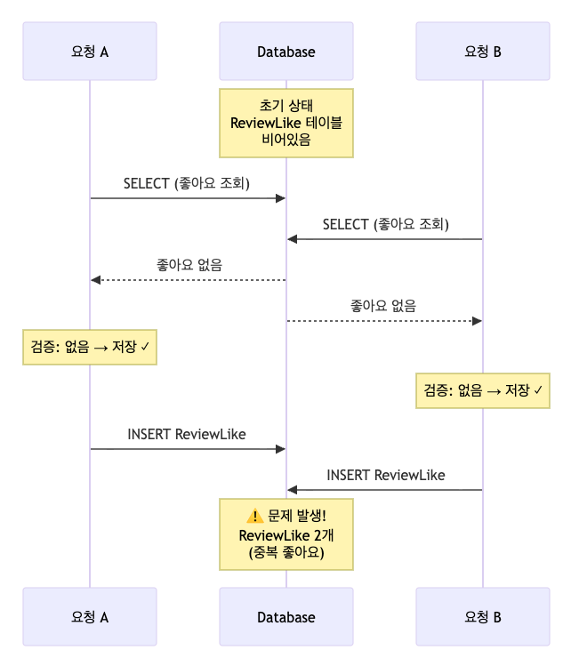
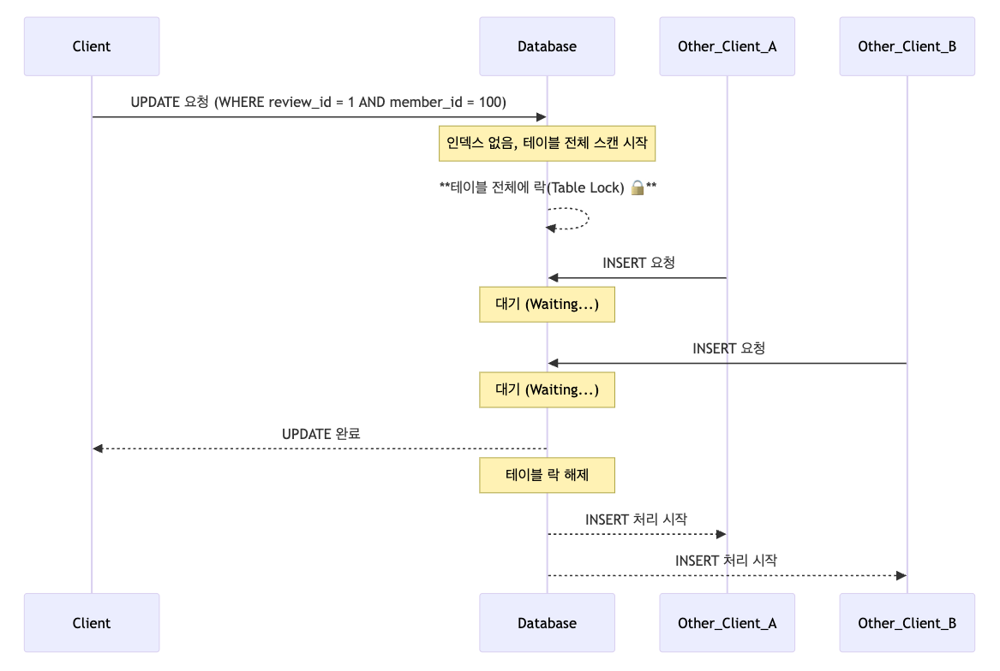
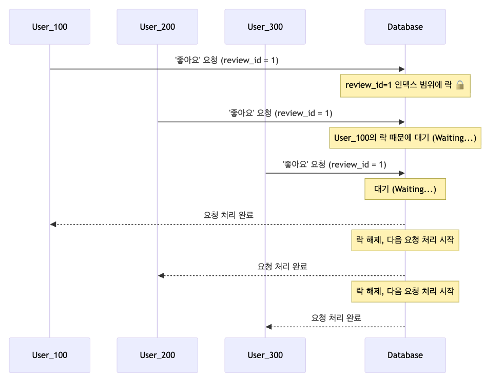
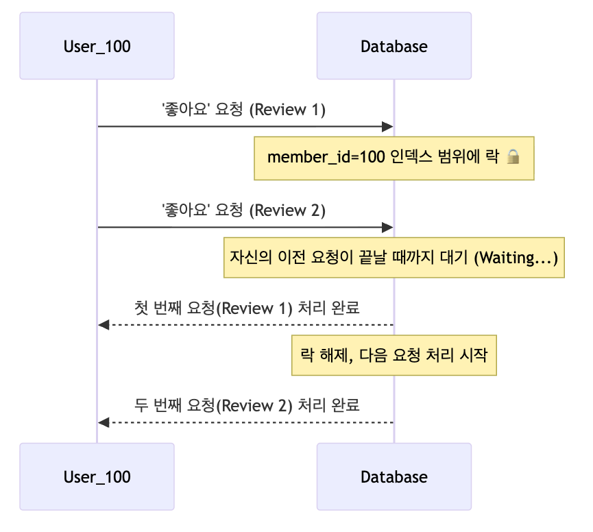
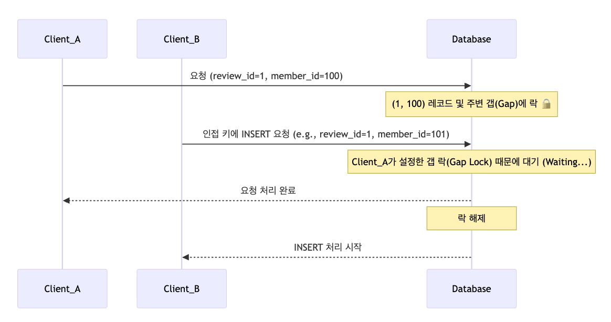

이 글에서는 좋아요 기능을 구현하면서 발생하는 동시성 문제를 DB 락으로 해결하는 과정을 다룬다. 비관적 락의 동작 원리와 함께, 넥스트 키 락(Next-Key Lock)으로 인한 성능 저하 문제까지 살펴본다.

## 좋아요 기능 요구사항 정리

-   다중 서버 환경에서 서버 간 동시성 제어 필요

### 기능 명세

<strong>1) 좋아요 추가</strong>

-   사용자는 리뷰에 좋아요를 누를 수 있다
-   한 사용자는 하나의 리뷰에 한 번만 좋아요 가능 (중복 방지)
-   동시다발적인 요청도 안전하게 처리해야 한다

<strong>2) 좋아요 취소</strong>

-   물리적 삭제가 아닌 논리적 삭제(Soft Delete) 방식 사용
-   취소 후 다시 좋아요를 누를 수 있다

<strong>3) 좋아요 조회</strong>

-   좋아요를 누르지 않은 상태: 비활성화 표시
-   좋아요를 누른 상태: 활성화 표시
-   좋아요를 취소한 상태: 비활성화 표시

### 엔티티 설계

리뷰에 좋아요를 눌렀는지 여부를 판단하기 위해 ReviewLike 엔티티를 설계해보자.

```java
@Entity
public class ReviewLike {

  @Id
  private Long id;
  
  private Long reviewId;
  private Long memberId;
  
  private LocalDateTime deletedAt;
}
```

좋아요를 추가할 때는 ReviewLike를 저장하고, 취소할 때는 deletedAt에 시간을 기록하는 방식으로 동작한다.

### 동시성 처리를 하지 않은 좋아요 기능

먼저 동시성 처리를 하지 않은 코드를 살펴보자.

```java
@Service
@RequiredArgsConstructor
public class ReviewLikeService {
    private final ReviewLikeRepository repository;
    
    public void addLike(Long reviewId, Long memberId) {
        // 이미 좋아요 했는지 체크
        Optional<ReviewLike> existing = repository.findByReviewIdAndMemberId(reviewId, memberId);
        
        if (existing.isEmpty()) {
            ReviewLike newLike = ReviewLike.builder()
                .reviewId(reviewId)
                .memberId(memberId)
                .build();
            repository.save(newLike);
        }
    }
}
```

언뜻 보면 문제가 없어 보인다.

하지만 "따닥..."

유저가 더블클릭으로 동시에 두 번의 요청을 보낸다면 어떻게 될까?



Race Condition이 발생할 수 있다.

두 스레드가 동시에 조회하면 둘 다 "없음"을 받고, 둘 다 저장을 진행하게 된다.

그 결과

-   좋아요를 취소해도 하나가 남아 있는 문제
-   좋아요 카운트가 2번 늘어나는 문제

이런 사이드 이펙트가 발생하게 된다.

### 동시성 제어 방법 고민하기

분산 시스템 환경에서는 Java API가 제공하는 동시성 제어만으로는 부족하다.

<strong>여러 서버에서 동시에 요청이 들어올 수 있기 때문이다.</strong>

#### Unique Key 제약 조건은?

"(member\_id, review\_id) 조합으로 Unique Key를 걸면 되는 거 아니야?" 라고 생각할 수 있다. 하지만 Soft Delete를 사용하기 때문에 같은 조합이 여러 번 들어갈 수 있어 유일성을 보장할 수 없다.

#### X-Lock으로 해결해볼 수 있을까?

이전에 ["UPDATE 한 줄로 끝내는 동시성 문제"](/ko/blog/7/) 글에서는 명시적인 읽기 락 없이 동시성을 제어하는 방법을 다뤘다. 하지만 이번 요구사항에서는 <strong>존재하지 않는 데이터를 새로 만들어야 하기 때문에</strong> 배타락이나 낙관적 락을 사용할 수 없다.

#### 남은 방법은?

member\_id와 review\_id를 키 값으로 Lock을 거는 방법을 고려해볼 수 있다.

-   비관적 락 (Pessimistic Lock)
-   Named Lock
-   분산 락 (Distributed Lock)

이 중 비관적 락의 동작 방식을 자세히 알아보겠다.

## 비관적 락

비관적 락은 트랜잭션이 시작될 때 Shared Lock 또는 Exclusive Lock을 거는 방식이다. <strong>"동시에 같은 데이터를 수정할 것이다"라고 비관적으로 가정하고 미리 락을 거는 것</strong>이다.

SQL로 표현하면 다음과 같다.

```sql
-- 트랜잭션 시작
BEGIN;

-- WHERE 조건에 따라 범위 락을 건다.
SELECT * FROM review_like 
WHERE review_id = :review_id AND member_id = :member_id
FOR UPDATE;

-- 결과가 없으면 INSERT
INSERT INTO review_like (review_id, member_id) 
VALUES (1, 100);

COMMIT;
```

MySQL은 Row Lock과 Gap Lock을 조합한 <strong>Next-Key Lock</strong>을 사용한다.

존재하지 않는 영역까지 락을 거는 기술이기 때문에 이번 요구사항에 적합해 보인다.

하지만 인덱스를 어떻게 설정하느냐에 따라 락의 범위가 크게 달라지므로 주의해야 한다.

각 케이스별로 살펴보자.

### Case01. 인덱스가 없는 경우

인덱스가 없으면 MySQL은 데이터가 어디에 있는지, 또는 어디에 들어가야 할지 전혀 예측할 수 없다.

결과적으로 <strong>테이블 전체를 스캔(Full Table Scan)</strong> 하면서 모든 레코드에 락을 걸어버린다.

해당 리뷰와 관련 없는 다른 모든 요청이 모두 대기하게 되고, 결과적으로 엄청난 성능 저하가 발생하게 된다.



<strong>따라서 Lock을 사용한다면 반드시 인덱스를 고려해야 한다.</strong>

### Case02. (review\_id) 인덱스

review\_id에만 인덱스를 건 경우를 생각해보자.



user\_100이 review\_id=1 조건으로 SELECT FOR UPDATE를 실행했다고 가정해보자.


*(review_id) 인덱스 샘플 데이터*

MySQL은 review\_id=1 인덱스 범위에 Next-Key Lock을 건다.


이는 아래와 같은 결과를 초래하게 된다.

-   여러 명의 유저가 review\_id=1로 동시에 접근하면 모두 Gap Lock을 기다려야 함
-   인기 리뷰일수록 병목 현상 심화

### Case03. (member\_id) 인덱스

member\_id를 기준으로 Next-Key Lock이 잡힌다.




*(member_id) 인덱스 샘플 데이터*

하나의 멤버가 여러 리뷰에 대해 좋아요를 동시에 누르면 병목 발생하게 된다.


### Case04. (review\_id, member\_id) 인덱스

가장 작은 락 범위를 가질 가능성이 높은 방법이다.



예를 들어, 인덱스 데이터가 다음과 같이 구성되어 있다면


*(review_id, member_id) 인덱스 샘플 데이터*

review\_id=1, member\_id=150 조건으로 조회 시, member\_id가 93\~234 범위에 Gap Lock이 걸린다.


하지만 여전히 아래와 같은 문제점을 가지고 있다.

-   가장 좁은 범위지만 여전히 주변 영역에 Gap Lock이 걸림
-   다른 회원의 좋아요 요청에도 영향을 미칠 수밖에 없음

## 비관적 락의 한계

비관적 락을 사용해 동시성 문제는 해결했지만, 처리량이 급감할 수 있다.

인기 리뷰 하나에 100명이 동시에 좋아요를 누르면 지연 시간이 크게 증가하게 된다.

비관적 락의 단점을 정리해보자.

1.  <strong>DB 부하 증가</strong> - 모든 동시성 제어를 DB가 담당
2.  <strong>넥스트 키 락의 넓은 범위</strong> - 필요 이상의 영역까지 락을 걸게 됨
3.  <strong>DB 커넥션 점유</strong> - 락 대기 중에도 커넥션을 홀딩

이런 단점을 고려해봤을 때, 비관적 락이 적합한 경우는 아래와 같다.

-   트래픽이 낮거나 중간 수준인 서비스
-   데이터 정합성이 최우선인 경우
-   구현 복잡도를 낮추고 싶을 때 (SELECT FOR UPDATE로 간단한 구현 가능)

### 더 나은 해결책은?

<strong>"어떤 락이 최고다"라는 정답은 없다.</strong>

서비스의 특성과 예상 트래픽, 그리고 허용 가능한 복잡도를 고려해서 적절한 락 전략을 선택하는 것이 중요하다.

좋아요 같은 소셜 기능은 트래픽이 특정 콘텐츠에 집중되는 경향이 있어, 비관적 락보다는 Named Lock이나 분산 락이 더 나은 선택일 수 있다.

-   <strong>Named Lock</strong> (MySQL)
-   <strong>분산 락</strong> (Redis, Zookeeper 등)

Redis 분산 락에 대해 알아보고 싶다면, ["Lettuce 분산 락의 오해와 진실"](/ko/blog/9/) 포스트를 추천한다.

## 동시성 처리 시리즈

-   [처음부터 다시 배우는 Java 동시성 제어](/ko/blog/11/)
-   [UPDATE 한 줄로 끝내는 동시성 처리](/ko/blog/7/) 
-   좋아요 기능으로 알아보는 넥스트 키 락
-   [Lettuce 분산 락의 오해와 진실](/ko/blog/9/)
-   [AOP로 동시성 처리 코드 분리하기](/ko/blog/13/)
