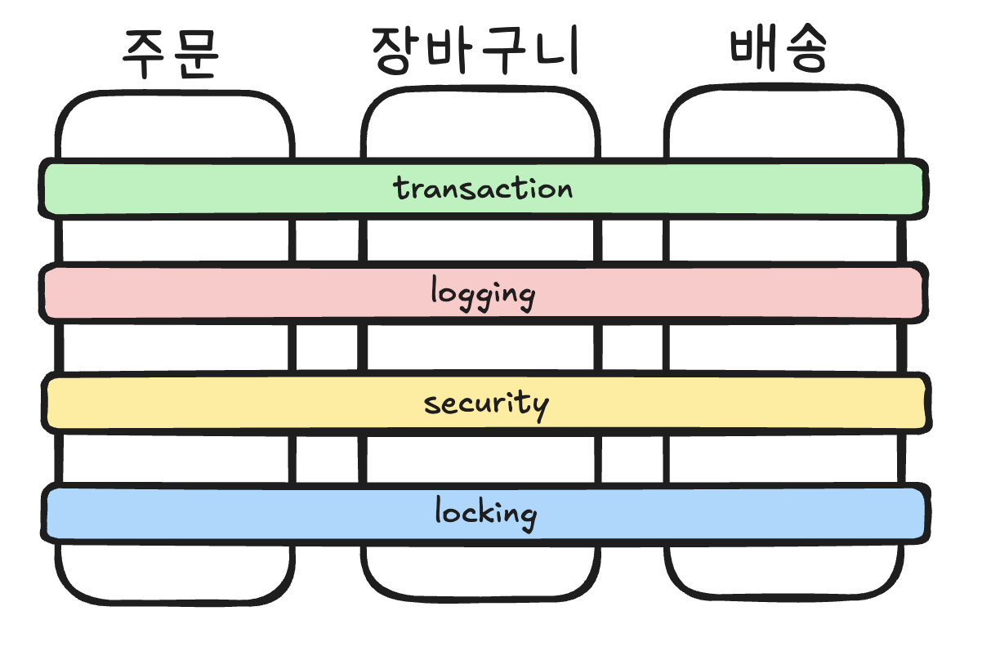
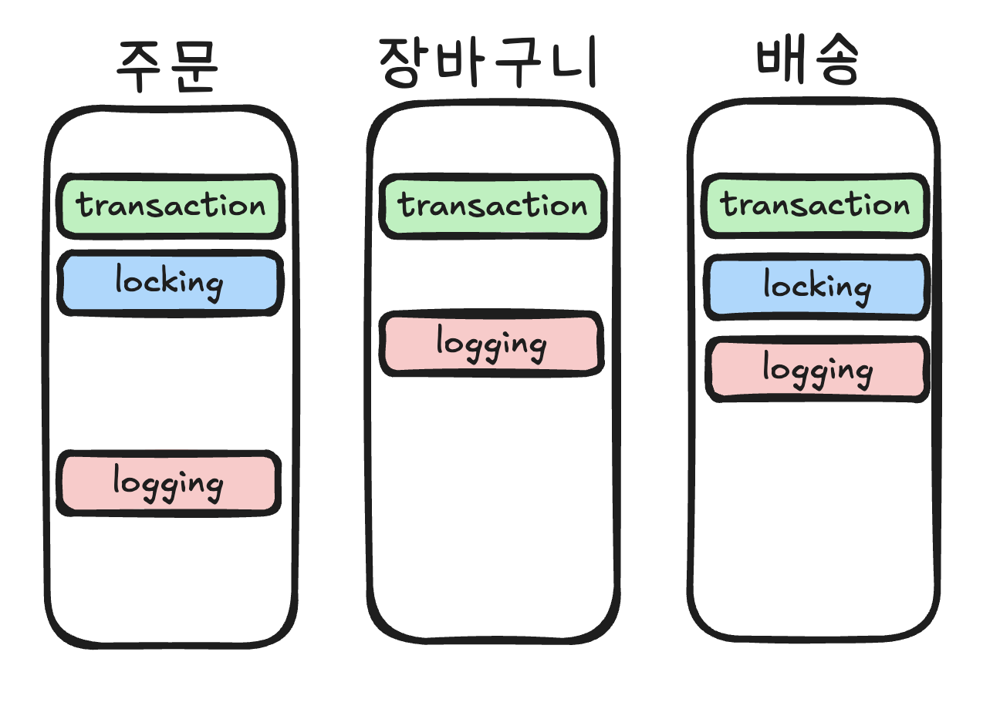
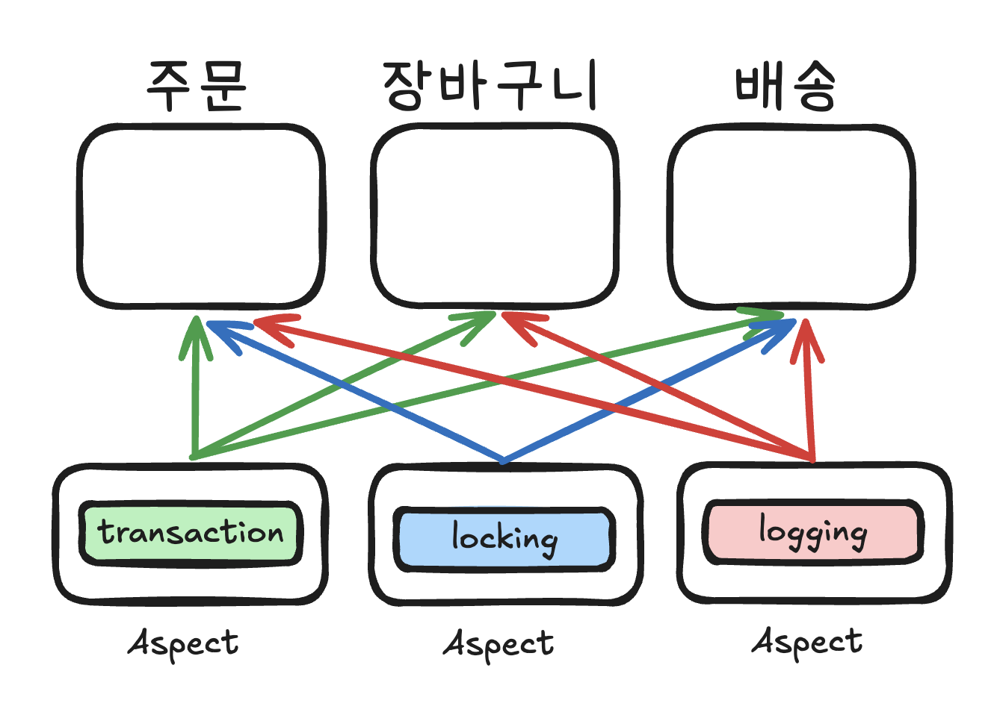
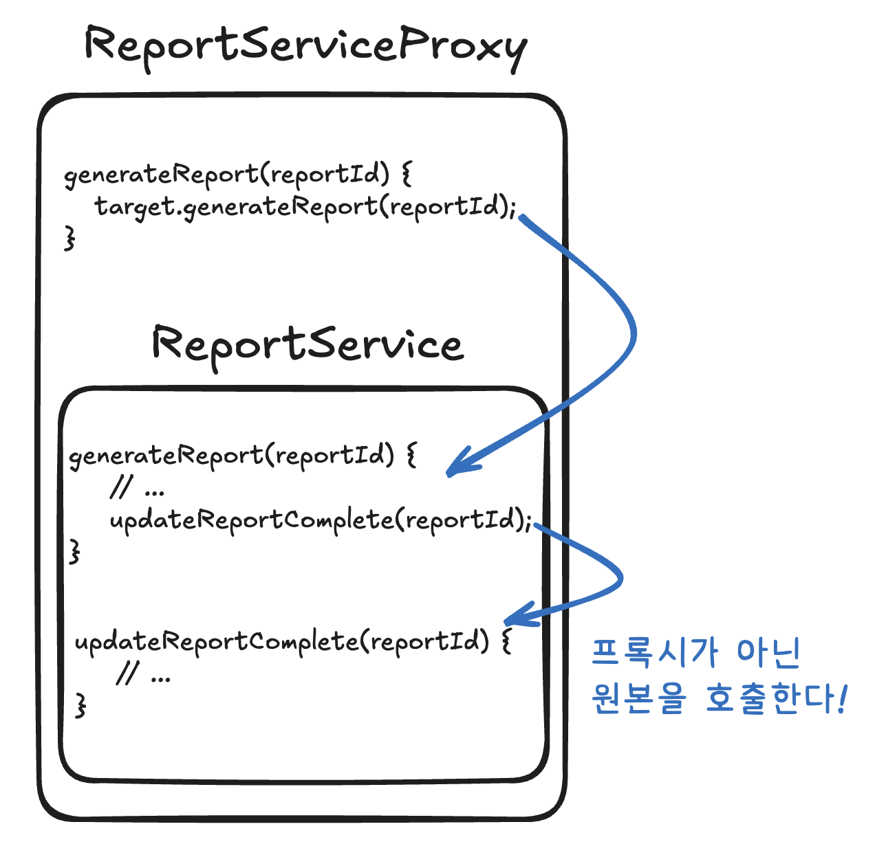
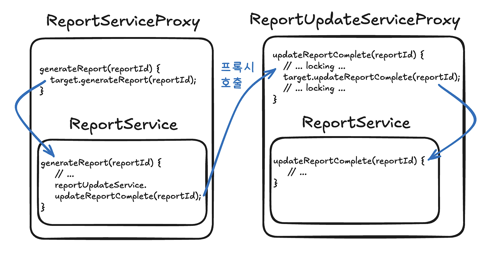

이 글에서는 Spring AOP를 활용해 분산 락 처리 코드를 비즈니스 로직에서 완전히 분리하는 방법을 소개한다. 동시성을 제어를 위해 Lock 인터페이스를 사용할 때, try-finally 블록과 락 관리 코드가 비즈니스 로직을 압도하는 문제를 겪게 된다.

Spring의 @Transactional이 트랜잭션 관리를 단순화한 것처럼, DistributedLock Aspect를 만들어 이 문제를 해결할 것이다. 또한, Spring Cache의 검증된 패턴을 참고하여 SpEL 평가기를 만들어 @DistributedLock의 사용성을 확장해볼 것이다.

## Lock 인터페이스

Java/Spring에서 Lock 인터페이스를 직접 사용하면 필연적으로 try-finally 블록을 작성해야 한다.

에러가 발생했을 때 락을 해제하지 않으면 데드락이 발생하기 때문이다.

```java
@Service
@RequiredArgsConstructor
public class PostService {
    private final LockRegistry lockRegistry;  // RedisLockRegistry, JdbcLockRegistry 등 사용 가능
    private final PostRepository postRepository;
    
    public void likePost(Long postId, Long userId) {
        String lockKey = "lock:post:" + postId + ":like:" + userId;
        Lock lock = lockRegistry.obtain(lockKey);
        
        try {
            if (!lock.tryLock(5000, TimeUnit.MILLISECONDS)) {
                throw new LockAcquisitionException("Failed to acquire lock");
            }
            
            // 비즈니스 로직 //
            
        } catch (InterruptedException e) {
            Thread.currentThread().interrupt();
            throw new LockException("Interrupted while acquiring lock", e);
        } finally {
            lock.unlock();
        }
    }
}
```

### 문제점

#### 1\. 가독성 저하

위의 코드 예시에서 락 처리를 위한 코드가 12줄이나 된다.

또한, try-finally 구문으로 인해 코드 depth가 생긴다.

#### 2\. 코드 중복

다른 곳에서도 Lock 인터페이스를 사용할 때, tryLock()에 대한 예외 처리, 인터럽트에 대한 처리, 락 자원 회수 등의 코드 중복이 발생할 수 있다.

#### 3\. 에러 처리 일관성

개발자마다 락 획득 실패나 인터럽트 처리 방식이 달라질 수 있다.

### 비즈니스 로직에 집중하기

Spring의 @Transactional처럼 어노테이션으로 단순하게 처리할 수 있으면 어떨까?

```java
@Service
public class PostService {
    private final PostRepository postRepository;
    
    @DistributedLock(key = "'lock:post:' + #postId + ':like:' + #userId")
    public void likePost(Long postId, Long userId) {
        // 이제 비즈니스 로직만 남는다.
    }
}
```

메소드에는 비즈니스만 남는다.

@DistributedLock 어노테이션 하나만으로 락 처리를 하는 것이다.

이것을 처리하기 전에 먼저 알아둬야 하는 개념이 있다. AOP와 SpEL이다.

## Spring AOP

### 횡단 관심사를 분리하는 마법

비즈니스 로직이 아닌 애플리케이션의 여러 부분에서 공통적으로 사용되는 기능들이 있다.

예를 들어 로깅, 트랜잭션, 보안 체크, 락 처리 등의 부가 기능이다.

이런 것들을 횡단 관심사라고 부른다. 



*공통 기능이 여러 기능을 횡단하는 것처럼 보인다*

그런데 횡단 관심사가 핵심 비즈니스와 분리되지 않으면 어떤 문제들이 발생할까?

하나의 클래스나 메소드가 너무 많은 책임을 갖게 된다. 응집도가 떨어진다는 말이다. 결합도도 높아진다.

코드도 중복될 가능성이 높아지고, 재사용성이 저하되며, 코드 가독성도 나빠진다.

Spring AOP는 Aspect를 통해 이 문제를 해결한다.

> 참고! Spring AOP 핵심 용어 정리!  
> 1\. Aspect: 횡단 관심사를 모듈화한 것  
> 2\. Advice: 언제 무엇을 할지 정의 (@Around, @Before, @After 등)  
> 3\. Pointcut: 어디에 적용할지 정의 (@Transactional이 붙은 메서드)

### Aspect

횡단 관심사를 분리하지 않으면 코드는 아래와 같은 형태를 띄게 될 것이다.



이때 핵심 비즈니스 로직 곳곳에 흩어져 있는 횡단 관심사를 하나의 클래스에 모아서 처리할 수 있다.

Spring AOP에서 그 모듈을 Asepct라고 한다.



Aspect를 통해 각 클래스와 메소드는 부가 기능을 가져다 사용할 수 있으며, 핵심 비즈니스 로직에 집중할 수 있게 된다. 이를 통해 위에서 제시된 문제점들은 말끔히 해결된다.

### 동작 원리

Spring AOP는 <strong>프록시 패턴</strong>을 사용한다.

다시 말해, 우리가 호출하는 객체를 Spring이 감싸는 래퍼(Wrapper) 객체를 만든다.

@Distributed 어노테이션의 예시를 살펴 보면, 대충 아래와 프록시 객체가 만들어지게 될 것이다.

```java
class PostServiceProxy extends PostService {
    private PostService target;
    
    public void likePost(Long postId, Long userId) {
        // 전처리: 락 획득
        acquireLock(...);
        try {
            // 실제 메서드 호출
            target.likePost(postId, userId);
        } finally {
            // 후처리: 락 해제
            releaseLock(...);
        }
    }
}
```

<strong>스프링은 빈을 주입할 때,</strong> PostService를 주입하지 않고 <strong>PostServiceProxy를 주입해준다.</strong>

결과적으로, likePost를 호출하는 객체들은 PostService가 아닌 PostServiceProxy의 likePost를 호출하게 되고 락 처리가 자동으로 이뤄지게 되는 것이다.

## SpEL(Spring Expression Language)

### 문자열로 코드 작성하기

SpEL은 Spring에서 제공하는 표현식 언어다. <strong>문자열 안에 동적인 로직</strong>을 작성할 수 있게 해준다.

표현식은 보통 #{...} 형태로 작성하고, SpelExpressionParser 구현체를 통해 평가한다.

```java
ExpressionParser parser = new SpelExpressionParser();
```

### 핵심 문법

#### 1\. 기본적인 표현식

-   <strong>리터럴(Literal)</strong>: 문자열, 숫자, boolean, null과 같은 기본적인 값을 직접 표현할 수 있다.

```java
ExpressionParser parser = new SpelExpressionParser();
Expression exp = parser.parseExpression("'Hello World'"); 
String message = (String) exp.getValue();
```

-   <strong>연산자(Operators)</strong>: 산술, 관계, 논리 연산자도 지원한다.

```java
boolean falseValue = parser.parseExpression("2 < -5.0").getValue(Boolean.class);
```

#### 2\. 클래스 표현식

-   객체의 프로퍼티나 메서드를 호출할 수 있다.

```java
String city = (String) parser.parseExpression("placeOfBirth.city").getValue(context);
String bc = parser.parseExpression("'abc'.substring(1, 3)").getValue(String.class);
```

-   빈을 참조하는 것도 가능하다.

```java
Object bean = parser.parseExpression("@someBean").getValue(context);
```

#### 3\. 컬렉션 표현식

-   컬렉션에 접근할 수 있다.

```java
String invention = parser.parseExpression("inventions[3]").getValue(context, tesla, String.class);
String name = parser.parseExpression("members[0].name").getValue(context, ieee, String.class);
```

그 외에 다양한 문법이 있지만 보통 잘 쓰이지 않고, 필요하다면 스프링의 공식 문서를 확인해보도록 하자.

### SpEL 어디에서 사용하는가?

Spring에서 정의된 어노테이션 곳곳에서 이미 SpEL을 사용하고 있다.

```java
@Value("${server.port}") // 프로퍼티 값 주입
```

```java
@Cacheable(key = "'userId:' + #userId") // 캐시 키 생성
```

## DistributedLock 컴포넌트 만들기

이제 위에서 배운 개념을 바탕으로 분산 락을 Aspect로 처리하는 코드를 작성해볼 것이다.

### 어노테이션 활용

락 설정을 선언적으로 정의하기 위해 어노테이션을 활용할 것이다.

락의 키와 획득 대기 시간, 조건부 락 등의 기능이 있다.

```java
@Target(ElementType.METHOD)
@Retention(RetentionPolicy.RUNTIME)
public @interface DistributedLock {
    /**
     * SpEL expression for lock key
     * 예: "'user:' + #userId", "'order-' + #order.id"
     */
    String key();
    
    /**
     * 락 획득 대기 시간 (밀리초)
     */
    long waitTimeMillis() default 5000;
    
    /**
     * 조건부 락 - true일 때만 락 획득
     * 예: "#amount > 1000"
     */
    String condition() default "";
}
```

### SpEL 평가기

메서드 파라미터를 SpEL 변수로 변환하고, 표현식을 평가하는 기능이다.

해당 클래스는 Spring Cache의 기능을 모방해 만들어 봤다.

```java
public class DistributedLockExpressionEvaluator extends CachedExpressionEvaluator {
    
    private final SpelExpressionParser parser = new SpelExpressionParser();
    
    public String getLockKey(String keyExpression, Method method, Object[] args, Object target) {
        
        // 평가 컨텍스트 생성
        EvaluationContext context = createEvaluationContext(method, args, target);
        
        // SpEL 표현식 파싱 및 평가
        Expression expression = parser.parseExpression(keyExpression);
        Object value = expression.getValue(context);
        
        return value != null ? value.toString() : "";
    }
    
    public boolean checkCondition(String condition, Method method, Object[] args, Object target) {
        if (condition.isEmpty()) {
            return true;  // 조건이 없으면 항상 true
        }
        
        EvaluationContext context = createEvaluationContext(method, args, target);
        Expression expression = parser.parseExpression(condition);
        
        return Boolean.TRUE.equals(expression.getValue(context, Boolean.class));
    }
    
    private EvaluationContext createEvaluationContext(Method method, Object[] args, Object target) {
        // 메서드 파라미터를 변수로 등록
        StandardEvaluationContext context = new StandardEvaluationContext(target);
        
        // 파라미터 이름 추출
        ParameterNameDiscoverer discoverer = new DefaultParameterNameDiscoverer();
        String[] paramNames = discoverer.getParameterNames(method);
        
        // 파라미터를 SpEL 변수로 등록
        if (paramNames != null) {
            for (int i = 0; i < paramNames.length; i++) {
                context.setVariable(paramNames[i], args[i]);
            }
        }
        
        return context;
    }
}
```

### DistributedLockAspect

Aspect를 구현한 클래스다.

AOP를 통해 @DistributedLock이 붙은 메서드를 가로채고, 락 처리를 수행한다.

```java
@Aspect
@Component
@Slf4j
public class DistributedLockAspect {
    
    private final LockRegistry lockRegistry;
    private final DistributedLockExpressionEvaluator evaluator;
    
    public DistributedLockAspect(LockRegistry lockRegistry) {
        this.lockRegistry = lockRegistry;
        this.evaluator = new DistributedLockExpressionEvaluator();
    }
    
    @Around("@annotation(distributedLock)")
    public Object handleDistributedLock(ProceedingJoinPoint joinPoint, 
                                        DistributedLock distributedLock) throws Throwable {
        
        // 메서드 정보 추출
        MethodSignature signature = (MethodSignature) joinPoint.getSignature();
        Method method = signature.getMethod();
        Object[] args = joinPoint.getArgs();
        Object target = joinPoint.getTarget();
        
        // SpEL로 락 키 생성
        String lockKey = evaluator.getLockKey(
            distributedLock.key(), 
            method, 
            args, 
            target);
        
        // 조건 확인 (condition이 있고 false면 락 없이 실행)
        if (!evaluator.checkCondition(distributedLock.condition(), method, args, target)) {
            return joinPoint.proceed();
        }
        
        // 락 획득 및 메서드 실행
        Lock lock = lockRegistry.obtain(lockKey);
        boolean acquired = false;
        
        try {
            acquired = lock.tryLock(distributedLock.waitTimeMillis(), TimeUnit.MILLISECONDS);
            
            if (!acquired) {
                throw new LockAcquisitionException(
                    String.format("Failed to acquire lock for key: %s", lockKey)
                );
            }
            
            return joinPoint.proceed();
            
        } catch (InterruptedException e) {
            Thread.currentThread().interrupt();
            throw new LockException("Thread interrupted", e);
        } finally {
            lock.unlock();
        }
    }
}
```

## @DistributedLock 사용 예시

이제 다양한 상황에서 어떻게 활용할 수 있는지 설명해보겠다.

### 파라미터에 접근해서 키 생성하기

클래스 파라미터에 직접 접근해서 키를 생성하는 예시이다.

```java
@DistributedLock(key = "'lock:post:' + #command.postId + ':like:' + #command.userId")
public void likePost(LikePostCommand command) {
    // 비즈니스 로직 //
}
```

### 조건부 락 걸기

인기 상품 타임 핫딜에 대한 예제이다.

```java
@Service
@RequiredArgsConstructor
public class FlashSaleService {

    private final ItemInventoryRepository inventoryRepository;
    private final FlashSaleScheduleManager scheduleManager; // 핫딜 시간 관리 Bean

    @DistributedLock(
        key = "'item:' + #request.itemId",
        // SpEL을 사용하여 'flashSaleScheduleManager' Bean의 isActive 메서드를 호출
        condition = "@flashSaleScheduleManager.isActive(#request.itemId)")
    public boolean purchase(PurchaseCommand command) {
        // 비즈니스 로직 //
    }
}
```

## 정리

### 임계영역을 최소화와 내부 메소드 문제

동시성을 보장하지 않아도 되는 부분까지 락을 걸면 병목이 발생하게 된다.

따라서 임계영역을 최소화하고자 하는 요구가 생길 것이다.

```java
@Service
public class ReportService {

    // Bad: 전체 메서드를 락으로 보호
    @DistributedLock(key = "'report:' + #reportId")
    public ReportResult generateReport(Long reportId) {
        Report report = loadReport(reportId);   // 락 불필요
        FileData file = generateFile(report);   // 락 불필요  
        updateReportComplete(reportId);         // 락 필요!
        return new ReportResult(file);
    }
    
    private void updateReportComplete(Long reportId) {
        // 로직
    }
}
```

그런데 여기서 updateReportComplete에  AOP는 기본적으로 <strong>내부 메소드에 @DistributedLock 어노테이션을 달면 어떻게 될까? 의도한대로 동작하지 않는다. 락이 걸리지 않는다.</strong>

```java
@Service
public class ReportService {

    public ReportResult generateReport(Long reportId) {
        Report report = loadReport(reportId);   // 락 불필요
        FileData file = generateFile(report);   // 락 불필요  
        updateReportComplete(reportId);         // 락 동작하지 않는다.
        return new ReportResult(file);
    }

    @DistributedLock(key = "'report:' + #reportId")
    public void updateReportComplete(Long reportId) {
        // 로직
    }
}
```

<strong>내부 메소드 호출은 프록시(Proxy)를 거치지 않고, 객체 내부에서 직접 일어나기 때문이다.</strong>



updateReportComplete 메소드가 실행되는 시점은 이미 프록시를 통과하여 <strong>원본 ReportService 객체 내부로 들어온 때이다. 이 원본 객체 내부에서 사용하는 this는 <strong>프록시를 가리키는 것이 아니라, 원본 객체 자기 자신</strong>을 가리키므로, 당연히 Lock이 적용되지 않는다.</strong>

따라서 이 문제를 해결하고 싶다면 클래스를 분리하여 updateReportComplete를 구현해줘야 한다.

```java
@Service
public class ReportService {

    private final ReportUpdateService reportUpdateService;

    public ReportResult generateReport(Long reportId) {
        Report report = loadReport(reportId);
        FileData file = generateFile(report);
        reportUpdateService.updateReportComplete(reportId); // 락 동작!!!
        return new ReportResult(file);
    }
}
```

```java
@Service
public class ReportUpdaterService {

    @DistributedLock(key = "'report:' + #reportId")
    public void updateReportComplete(Long reportId) {
        // 로직 //
    }
}
```

이제 프록시를 통과하므로 락이 정상적으로 걸리게 된다.



### 마치며

분산 락 처리 코드가 비즈니스 로직을 압도하는 문제를 AOP와 SpEL을 활용해 해결했다. Spring이 @Transactional로 트랜잭션 관리를 단순화했듯이, 위 예제에서는 @DistributedLock으로 분산 락을 단순화했다.

<strong>코드는 우리의 의도를 표현하는 수단이다.</strong> try-finally 블록과 보일러플레이트 코드로 가득한 메서드는 우리가 정말로 해결하려는 문제를 흐리게 만든다. 반면 @DistributedLock을 사용한 메서드는 "이 작업은 동시에 실행되면 안 돼"라는 의도를 명확히 드러낸다.

<strong>좋은 추상화는 복잡함을 적절한 곳에 격리시키는 거라고 생각한다.</strong> 우리가 만든 @DistributedLock이 바로 그런 역할을 한다. 락의 복잡성은 여전히 존재하지만, 이제 그것은 인프라 레이어에 깔끔하게 격리되어 있다.

## 참고자료

-   [스프링 공식문서, Spring Expression Language](https://docs.spring.io/spring-framework/reference/core/expressions.html)

## 동시성 처리 시리즈

-   [처음부터 다시 배우는 Java 동시성 제어](/ko/blog/11/)
-   [UPDATE 한 줄로 끝내는 동시성 처리](/ko/blog/7/)
-   [좋아요 기능으로 알아보는 넥스트 키 락](/ko/blog/12/)
-   [Lettuce 분산 락의 오해와 진실](/ko/blog/9/)
-   AOP로 동시성 처리 코드 분리하기
