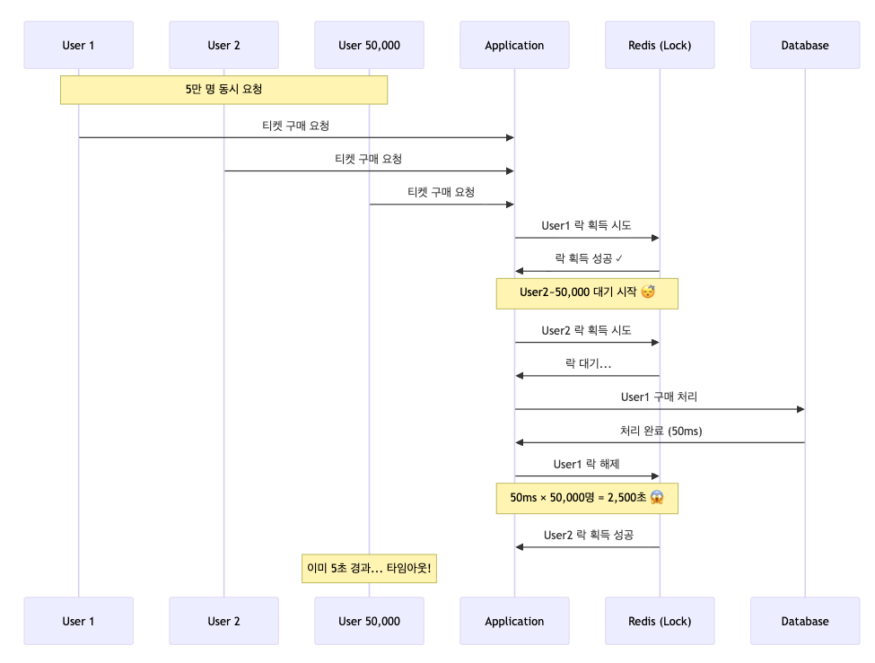
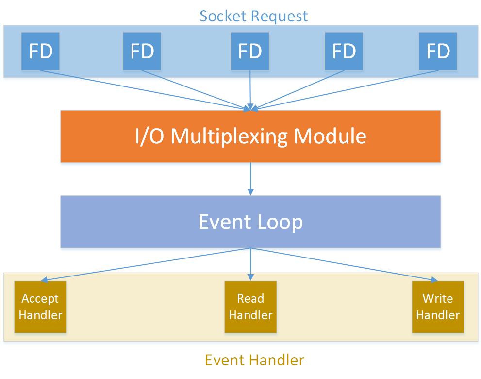
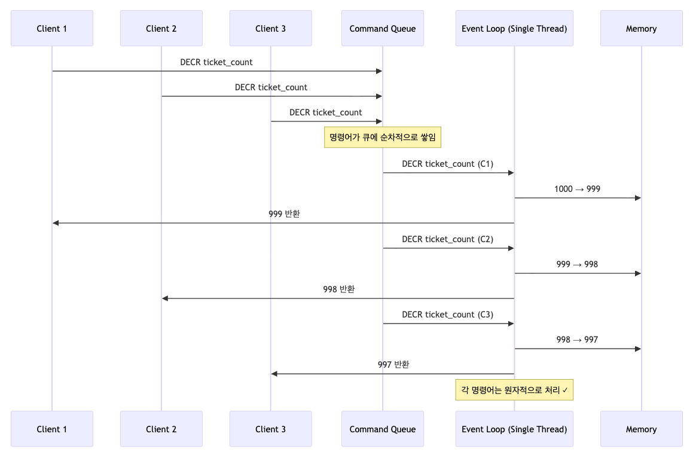
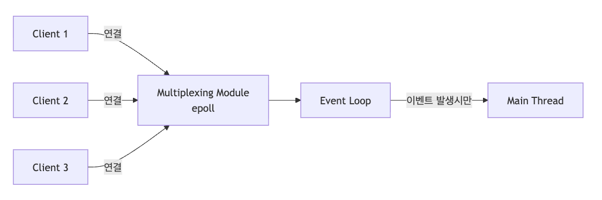

## 티켓팅 시스템

### 요구사항

유명인의 내한으로 이벤트를 열게 되었다. 선착순 1,000명에게만 주어지는 기회다.

티켓팅 신청을 웹 애플리케이션으로 받으려고 계획 중이며, 요구사항은 아래와 같다.

-   <strong>티켓 수량</strong>: 선착순 1,000장
-   <strong>제한</strong>: 1인 1티켓. 중복 불가.
-   <strong>예상 트래픽</strong>: 5만 명 동시 접속
-   <strong>인프라 제약</strong>: 애플리케이션 서버는 필요한 만큼 scale-out 가능
-   <strong>목표 응답시간</strong>: 1초 이내

### 동시성 처리? 락?

분산 락을 통해 락을 걸었다고 해보자. 혹시 완벽하게 동시성을 제어했다고 안심하고 있는가?

티켓 오픈 시간, 수만 명이 몰려올 때 서버에서는 어떤 일이 벌어지게 될까?

대규모 트래픽이 하나의 자원을 획득하기 위해 경쟁하는 상황이 벌어지면, 이는 치명적 병목이 될 수 있다. 아래는 실제로 5만 명이 동시 요청을 보냈을 때의 시나리오다.



락을 한 명씩 순차 처리하기 때문에 2500초, 약 42분의 시간이 소요될 것으로 예상된다. 이에 따라, 대부분의 사용자는 타임아웃(5초)으로 실패하게 될 것이다. 엄청나게 많은 요청이 애플리케이션에서 대기하게 될 것이며, 애플리케이션에서 장애가 발생할 가능성이 높다.

### 락을 걸어서 느려진다면, 락을 걸지 않으면 된다

그렇가면 위 문제를 해결할 수 있을까?

해결 방법은 간단하다. <strong>락을 걸지 않는 것</strong>.

## 락을 안 걸면 된다고? Redis가 그걸 가능하게 한다

"락 없이 어떻게 동시성을 제어하지?"라고 생각할 수도 있다.

답은 Redis의 독특한 아키텍처에 있다.

### Redis는 싱글 스레드다

Redis의 명령어는 <strong>싱글 스레드 기반의 이벤트 루프</strong>에서 실행된다.



*출처: Getting started with Redis*

<strong>핵심은 명령어를 처리하는 주체가 단 하나뿐이라는 것이다.</strong>

5만 명이 동시에 요청을 보내도, Redis는 이를 큐에 담아 한 번에 하나씩 순차적으로 처리한다. 이것이 바로 락 없이도 자연스러운 동시성 제어가 가능한 이유다.



### Redis가 싱글 스레드인데도 빠른 이유

Redis는 명령어 처리는 싱글 스레드로 하지만, 나머지는 철저히 병렬 처리한다.

#### 1\. Multiplexing I/O

Redis는 다수의 연결과 요청을 비동기적으로 처리할 수 있는 기술을 활용한다.



epoll()을 사용하여 소켓 연결의 상태 변화를 논블로킹 방식으로 감지한다. 이벤트 기반으로 변화를 감지하며, 덕분에 다수의 클라이언트 연결(소켓)을 관리할 수 있다.

연결마다 프로세스나 스레드가 할당되는 것이 아니라 컨텍스트 스위칭을 최소화하고 리소스 측면에서도 더 효율적이다.

#### 2\. 자식 프로세스

Redis는 여러 무거운 작업을 자식 프로세스에게 위임한다.

-   <strong>BGSAVE</strong>: RDB 스냅샷을 자식 프로세스에서 생성
-   <strong>BGREWRITEAOF</strong>: AOF 파일 압축/재작성도 자식 프로세스에서 진행
-   <strong>Copy-on-Write</strong>: fork() 직후 메모리 공유, 변경 시에만 복사

위 작업을 하는 동안 메인 스레드는 전혀 블로킹되지 않는다.

#### 3\. 백그라운드 스레드

I/O 스레드를 통해 네트워크 I/O를 멀티 스레드로 처리한다.

1.  멀티플렉싱 모듈에서 epoll()을 통해 이벤트를 발행하면 백그라운드 스레드가 클라이언트 요청을 메인 스레드로 전달
2.  <strong>메인 스레드는 명령어를 처리에만 집중</strong>
3.  처리된 결과를 백그라운드 스레드가 받아 클라이언트에게 전달

또한, BIO 스레드를 통해 fsync나 unlink와 같은 느린 시스템 콜을 처리하여 메인 스레드의 부하를 줄여준다.

#### 4\. 섬세한 최적화

Redis는 눈에 보이지 않는 미세한 지연까지도 최적화한다.

-   Zero-Copy: 데이터를 전송할 때 커널 내부에서 직접 전송함으로써 데이터 복사를 최소화
-   I/O 최적화: 연속된 메모리 블록에 데이터를 배치하여 Random Access를 최소화하고 Sequential Access를 최대화

> 깨알 상식  
> 디스크와 마찬가지로 메모리에서도 Random Access가 발생하며, CPU가 메모리에 어떻게 접근하느냐에 따라 성능 차이가 많이 발생할 수 있다.

### Redis 벤치마크

-   공식문서: [Redis benchmark](https://redis.io/docs/latest/operate/oss_and_stack/management/optimization/benchmarks/)

레디스 공식문서에서 확인할 수 있다시피, 10만 QPS의 연산을 처리할 수 있다.

못 믿겠다면 벤치마크 명령어를 직접 실행해보라.

## DECR, 단 한 줄의 마법

### Redis의 strings 자료구조

먼저 Redis의 Strings 자료구조를 이해해야 한다.

단순한 문자열은 아니다.

```shell
# 숫자로도 사용이 가능하다.
SET counter 100
INCR counter  # 101
DECR counter  # 100
```

Redis는 숫자 문자열의 정수 <-> 문자열 파싱을 지원하며, <strong>증감 명령어</strong>(INCR, DECR, INCRBY, DECRBY)을 통해 <strong>원자적<strong>연산</strong></strong>이 가능하다. 또한 증감 명령어의 결과값을 즉시 반환해준다.

### 핵심 아이디어: 재고를 "카운터"로 관리한다

기존 분산 락을 사용했을 때의 사고 방식은 아래와 같았다.

> (1)재고를 확인하고 (2) 확인한 재고를 차감한다.  
> 두 단계를 원자적으로 처리하려면 락이 필요하다

하지만 [MySQL의 X-Lock을 활용한 처리 방법](/ko/blog/7/)과 동일하게 발상을 전환해보자.

> "재고를 차감하고 → 결과를 확인한다." 한 단계로 통합한다.

먼저 차감하고 결과를 확인하자.

### 코드 예시

먼저 Redis에 총 티켓 수를 세팅해주자.

```shell
SET ticket:count 1000
```

위에서 확인한 것과 같이 재고를 차감하고 확인하면 된다.

```java
@Service
@RequiredArgsConstructor
public class TicketService {
    private final StringRedisTemplate redisTemplate;
    
    public TicketResponse purchaseWithDECR(Long userId) {
        // 재고 차감
        Long remaining = redisTemplate.opsForValue()
            .decrement("ticket:count");
        
        if (Objects.isNull(remaining) || remaining < 0) {
            throw new SoldOutException("매진");
        }
        
        // 티켓팅 성공!!
        saveTicket(userId, remaining);
        return new TicketResponse(remaining);
    }
}
```

굉장히 간단하다.

### 중복 처리

위 코드에서는 한 명의 유저가 중복으로 티켓팅을 할 수 있다는 문제가 있다. 

중복 문제를 해결하기 위해 아래와 같은 접근 방법을 사용해볼 수 있을 것이다.

-   userId에 분산 락을 걸어 발급을 확인.
-   Redis의 Set 자료구조를 통해 중복을 확인.

만약 중복이 발생했다면, 재고를 다시 늘려줘야 한다.

그런데 위의 확인 과정을 진행하는 동안 재고는 차감된다.

이미 -40,000이 되어 재고를 다시 더해주는 것이 무의미해질 수도 있다.

## Lua Script를 통한 원자성 확보

Redis는 Lua 스크립트를 <strong>단일 명령어처럼</strong> 실행한다. 스크립트 실행 중에는 다른 명령어가 끼어들 수 없다는 얘기다. 이를 통해 원자성을 확보할 수 있다.

### Lua 예시

-   `redis.call('SADD', KEYS[2], ARGV[1])`
    -   `SADD`: Set에 멤버를 추가하는 명령이다.
    -   `KEYS[2]`: 구매자 목록 Set Key 전달
    -   `ARGV[1]`: 현재 사용자 ID 전달
    -   반환값이 1이면 새로 추가된 것이고, 반환값이 0이면 이미 값이 존재한다는 의미다.

```lua
-- DECR + 중복 체크를 원자적으로
local remaining = redis.call('DECR', KEYS[1])
if remaining < 0 then
    return -1  -- 매진
end

local purchased = redis.call('SADD', KEYS[2], ARGV[1])
if purchased == 0 then
    redis.call('INCR', KEYS[1])  -- 롤백
    return -2  -- 중복 구매
end

return remaining  -- 성공
```

이제 스프링에서 위의 루아 스크립트를 실행하면 된다.

```java
RedisScript<Long> ticketPurchaseScript = ...;

List<Long> result = redisTemplate.execute(
    ticketPurchaseScript,
    Arrays.asList("ticket:count", "ticket:users"),
    userId.toString()
);
```

### 장단점

장점은 아래와 같다.

1.  <strong>원자성 보장</strong>: 중간 상태에 대한 동시성 문제가 발생하지 않는다.
2.  <strong>네트워크 효율</strong>: 왕복 1회로 모든 것이 처리된다.

반면 단점은 없을까? 사실 Lua도 만능은 아니다.

1.  <strong>관리 포인트 증가</strong>: 애플리케이션 로직이 루아 스크립트로 분산된다.
2.  <strong>호환성 이슈</strong>: Lua 사용자들은 지독한 하위 호환성 문제에 시달리고 있다고 한다. 마이너 버전을 올렸는데 안 되는 기능이 있다는 얘기가 있다.
3.  <strong>클러스터 제약</strong>: 만약 Redis 클러스터를 사용하고 있다면 문제가 발생할 수 있다. Lua는 크로스 슬롯 연산이 불가능하기 때문이다. (모든 키가 같은 해시 슬롯에 있어야만 연산이 가능하다.)
4.  <strong>블로킹 문제</strong>: 위에서 언급했다시피 Redis는 Lua를 단일 명령어 취급하기 때문에, Lua를 실행하는 동안 다른 명령어를 전부 블로킹한다. 따라서 너무 오래 걸리는 작업을 Lua로 실행하지 않도록 주의하자.

결국은 트레이드오프다.

## 정리

검증 과정이 추가되어 5만 QPS 정도의 연산을 처리할 수 있게 되었다.

제목에서처럼 10만 QPS를 처리하진 못하지만, 이 정도면 요구사항을 충족하는 빠른 성능이다.

### 추가 고려사항

#### 1\. Redis의 처리량을 DB가 따라오지 못한다면?

아래 방식을 고려해보자.

-   대기열을 구성하여 Server-Sent Event로 티켓팅 처리
-   이벤트 큐를 통한 비동기 처리로 사용자 응답 분리

#### 2\. 현재 QPS로 부족하다면?

Redis Cluster를 고려하자.

그리고 티켓 키를 분산하자. ex) 100개 단위로 분할

### 결론

Redis의 싱글 스레드 특성을 이해하고 활용하면, 복잡한 분산 락 없이도 동시성을 제어할 수 있음을 봤다.

사실 10만 QPS라는 숫자는 다소 과장되어 보일 수 있다.

실제 프로덕션에서는 네트워크 지연, 애플리케이션 로직, DB 병목 등 수많은 변수가 생길 수 있다.

<strong>하지만 이론적 한계를 알고 있다면, 현실적인 목표도 더 명확히 세울 수 있다고 믿는다.</strong>

Redis가 이론상 10만 QPS가 가능하니, 우리 시스템에서 1만 QPS가 안 나온다면 Redis가 아닌 다른 곳에 병목이 있다는 판단을 할 수 있게 된다.

최근 유튜브에서 "개발의 본질은 문제 해결"이라는 메시지를 담은 [개발감각 있는지 확인하는 법](https://www.youtube.com/watch?si=hgEcPzjbem5BWBOh&v=Du1aeNElueA&feature=youtu.be) 영상을 봤다.

깊이 공감한다. 하지만, 문제를 제대로 해결하려면 어느 정도 깊이 있는 이론적 토대가 필요하다고 생각한다.

<strong>깊은 이론적 이해가 있을 때, 비로소 단순하고 우아한 해결책이 보인다.</strong>

앞으로도 "그냥 되네?"에서 멈추지 않고, 원리를 이해할 수 있는 개발자로 성장해나가고 싶다.

## 참고자료

-   [Getting started with Redis](https://subscription.packtpub.com/book/data/9781783988167/1)
-   개발자를 위한 레디스
-   [https://chapakook.tistory.com/6](https://chapakook.tistory.com/6)
