CDN을 도입했는데 매달 나가는 비용이 부담스럽다고 생각한 적이 있는가? 우리 팀은 브라우저 캐시 설정만으로 연간 100만원 이상의 CDN 비용을 절감했다. 단순히 Cache-Control 헤더를 적절히 설정하는 것만으로도 가능하다.

이 글에서는 CDN의 기본 원리부터 시작해서, Cache-Control 헤더에 대한 설명과 브라우저 캐시를 활용해 어떻게 비용을 절감할 수 있는지 실제 경험을 바탕으로 공유하려고 한다.

## CDN

### CDN의 필요성

한국에 있는 사용자가 미국 서버에 있는 이미지를 요청한다고 생각해보자.

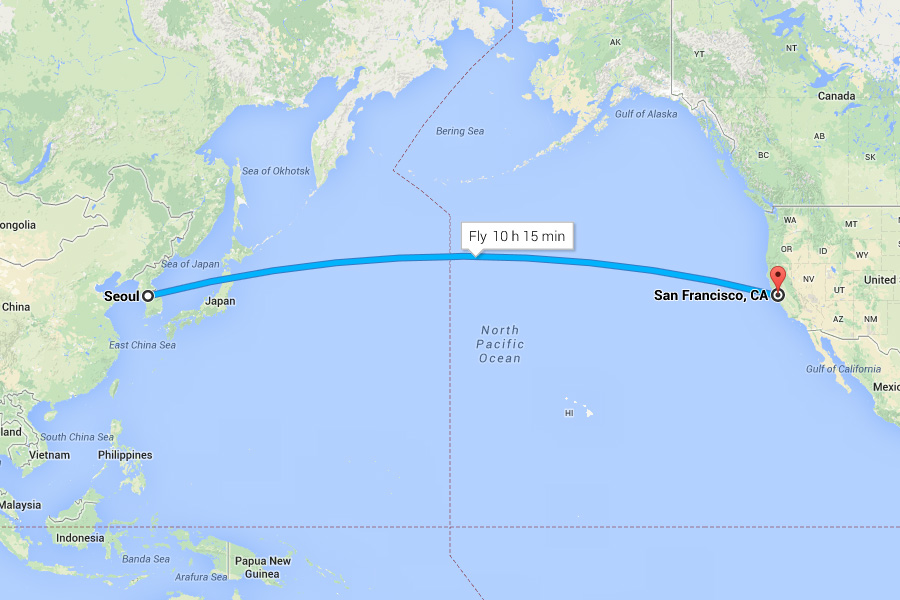

사용자의 컴퓨터 → 공유기 → 한국 통신사(ISP) → 해저 케이블 게이트웨이 → 태평양 해저 케이블 → 미국 통신사 → 데이터 센터 라우터 → 최종 서버 등 수십 개의 장비(Router/Switch)를 거쳐야 하므로 오랜 시간이 걸릴 수밖에 없다.

여기에 더해, 전 세계의 수억 명의 사용자가 미국 서버에 동시 요청을 보낸다면 어떻게 될까? 엄청난 서버 부하가 발생할 것이다.

이때, CDN을 사용하면 이 문제를 해결할 수 있다.

### CDN이란

CDN(Content Delivery Network)은 전 세계에 분산된 캐시 서버 네트워크다.

원본 서버(Origin)의 콘텐츠를 각 지역의 엣지 서버에 복사해두고, 사용자와 가장 가까운 서버에서 콘텐츠를 전송한다.

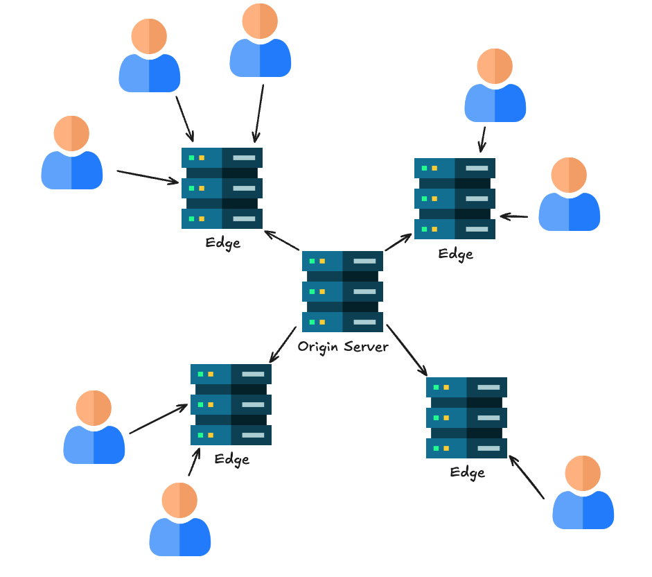

이렇게 하면 물리적 거리가 줄어들어 속도가 빨라지고, 원본 서버의 부하도 줄어든다. 특히 이미지, 동영상, CSS, JavaScript 같은 정적 파일 제공에 사용하기 좋다.

### CDN의 비용 구조

CDN 서비스의 비용은 보통 요청량에 따라 결정된다. 아래는 NCloud Global Edge 서비스의 요금 정보이다.

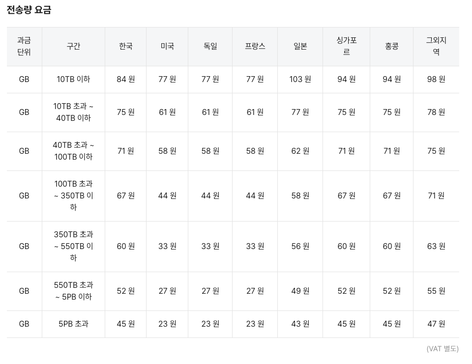

보는 것처럼 GB당 금액이 청구된다. 여기서 이미지 파일을 기준으로 금액을 계산해보자.

-   이미지 1장 크기: 평균 1MB
-   홈페이지에서 사용되는 이미지 개수: 50개
-   일일 페이지뷰: 100,000회

만약 캐시 없이 매번 CDN에서 홈페이지의 정적 파일을 서빙하면 어떻게 될까?

-   일일 전송량: 1MB × 50 × 100,000 = 5TB
-   월간 전송량: 5TB × 30 = 150TB

<strong>월 예상 비용은 약 900만원</strong>이나 된다. 심지어 유저가 홈페이지를 나갔다가 다시 들어오거나, 다른 페이지에 살펴 보는 등의 행동을 하면 더 많은 비용이 청구될 것이다. 특히 이미지가 많은 커머스나 미디어 서비스는 더욱 부담이 크다.

## 브라우저 캐시

이 문제를 어떻게 해결하면 될까? 한 번 받은 파일은 브라우저에 저장해두고 재사용하게 만들면 된다.

그럼 한 번 받은 정적 파일을 CDN에 매번 요청하지 않게 된다.

### Cache-Control 헤더

브라우저 캐시를 제어하는 핵심은 Cache-Control 헤더다.

응답값에 Cache-Control 헤더가 있으면 브라우저는 해당 값을 브라우저 캐시에 저장한다.

```bash
HTTP 200 OK
Content-Type: image/jpeg
Cache-Control: max-age=84600
Content-Length:32512

~~~~
```

Cache-Control에서 설정할 수 있는 값들은 아래와 같다.

-   max-age: 초 단위로 캐시 유효 시간 설정
-   no-cache: <strong>데이터는 캐시</strong>해도 되지만 <strong>항상 Origin Server에 검증</strong> (캐시를 안 하는 것이 아니다! 주의!)
-   no-store: 데이터에 민감한 정보가 포함되어 있어 저장 X
-   public: public 캐시에 저장 가능 (프록시 캐시 서버 개념)
-   private: public 캐시에 저장 불가
-   s-maxage: 프록시 캐시 서버에 적용되는 max-age
-   Age: Origin Server 의 응답이 프록시 캐시 서버에 머문 시간 (초 단위)
-   must-revalidate: 캐시 만료 후 조회시 Origin Server에 검증

Cloud 서비스를 사용한다면 해당 서비스에서 Cache-Control 헤더에 대한 설정을 할 수 있다.

### 브라우저 캐시 동작 방식

Cache-Control 헤더가 있는 경우 브라우저는 어떤 식으로 작동하는지 설명해보겠다.

#### 1\. 최초 요청

클라이언트가 서버로부터 응답을 받았을 때, Cache-Control가 있다면 해당 응답 자체를 캐싱한다.

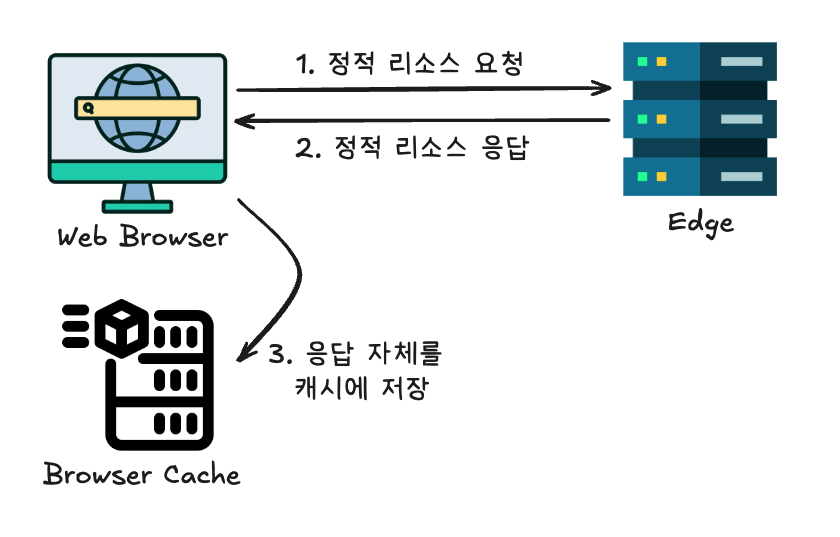

#### 2\. 재차 요청: 캐시가 유효한 경우

만약 해당 값을 재차 요청하면 서버를 호출하지 않고 캐시 저장소를 먼저 확인한다.

캐시를 가져오기 전에 먼저 캐시가 유효한지 검증한다.

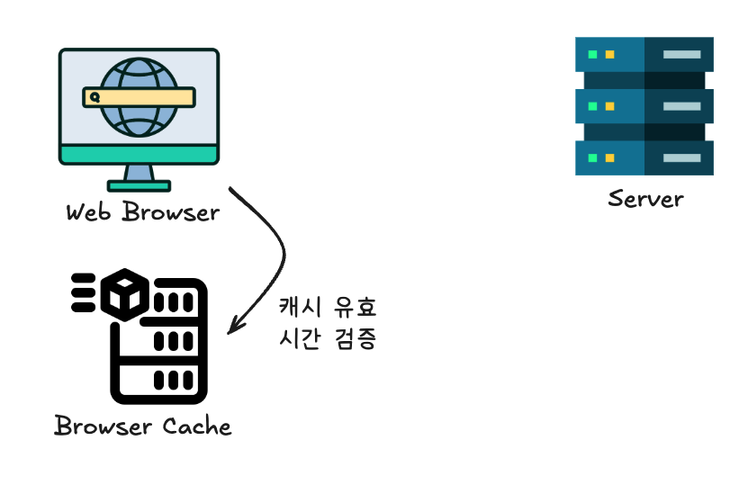

만약 캐시가 유효하다면 캐시 저장소에서 값을 반환하고 서버를 호출하지 않는다.

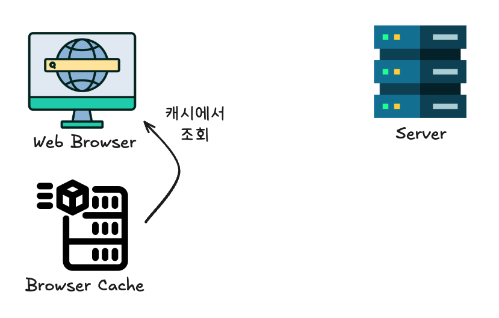

#### 3\. 재차 요청: 캐시가 유효하지 않은 경우

만약 재차 요청을 했고 캐시를 검증했는데 시간이 초과하여 유효하지 않다면 어떻게 될까?

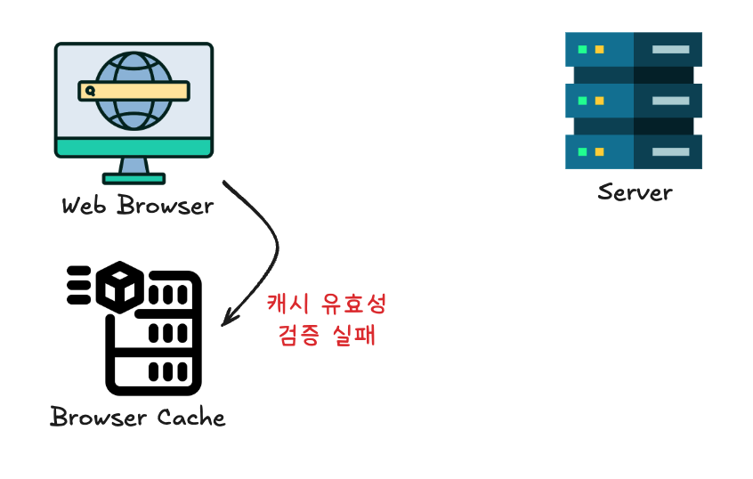

그 땐 다시 서버에 값을 다시 요청하고, 그 응답값을 다시 캐시에 저장한다.


## 실전

### NCloud 설정해보기

Global Edge의 Management 설정으로 들어가 원하는 서비스의 룰빌더를 선택한다.

캐시 상세 룰 메뉴에서 Add cache rules 버튼을 클릭해보자.

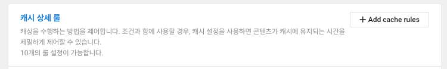

원하는 정적 리소스의 Directory, File Extension 등을 설정하고, 원본 Cache-Control 헤더 우선으로 설정해준다. 그리고 Advanced settings에서 브라우저 캐시를 허용해주자.

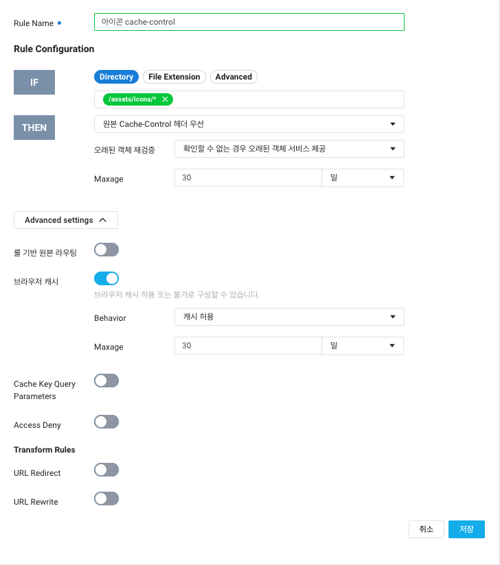

이제 정적 리소스를 호출해보자. Cache-Control 헤더가 붙은 걸 확인할 수 있다.

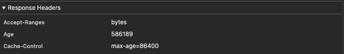

해당 정적 리소스를 다시 호출하면 해당 요청에 캐싱된 것을 확인할 수 있다.

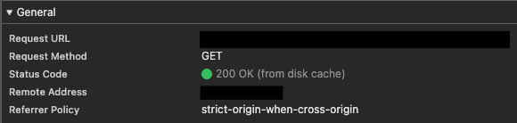

## 간단한 설정이 생각보다 큰 임팩트를 낼 수 있다

Cloud 서비스에서 딸깍.

설정만 하면 된다.

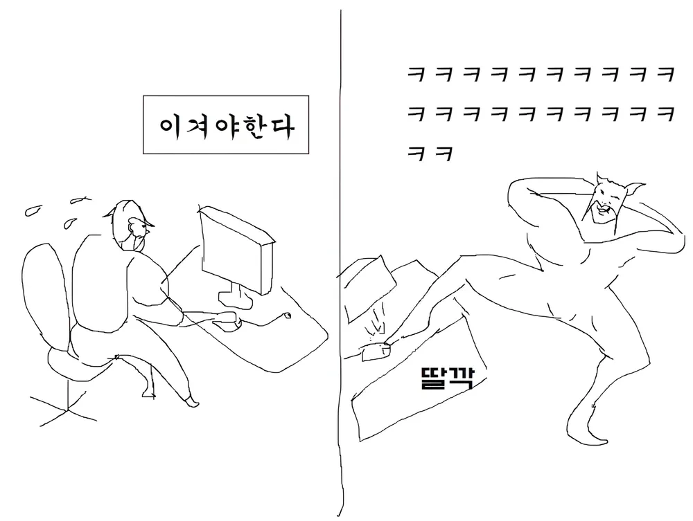

개발을 하다 보면 복잡한 솔루션에 매몰되기 쉽다. 예를 들어, 브라우저 캐시를 사용하기 위해 프론트엔드 코드 레벨의 fetch에 캐시 설정을 하거나, 여기서 좀 더 나아가 tanstack-query를 사용하는 것이다.

하지만 때로는 기본에 충실한 작은 최적화만으로도 큰 효과를 낼 수 있다.

더 쉽고 효율적인 방법을 찾기 위해 항상 노력하자.

## 참고자료

-   [CDN과 캐시 설정으로 정적 파일을 빠르게](https://velog.io/@heka1024/CDN%EA%B3%BC-%EC%BA%90%EC%8B%9C-%EC%84%A4%EC%A0%95%EC%9C%BC%EB%A1%9C-%EC%A0%95%EC%A0%81%ED%8C%8C%EC%9D%BC%EC%9D%84-%EB%B9%A0%EB%A5%B4%EA%B2%8C)
-   [웹 브라우저의 캐시 전략 Cache Headers 다루기](https://inpa.tistory.com/entry/HTTP-%F0%9F%8C%90-%EC%9B%B9-%EB%B8%8C%EB%9D%BC%EC%9A%B0%EC%A0%80%EC%9D%98-%EC%BA%90%EC%8B%9C-%EC%A0%84%EB%9E%B5-Cache-Headers-%EB%8B%A4%EB%A3%A8%EA%B8%B0)
-   [NCloud Global Edge](https://www.ncloud.com/product/contentDelivery/globalEdge#pricing)
