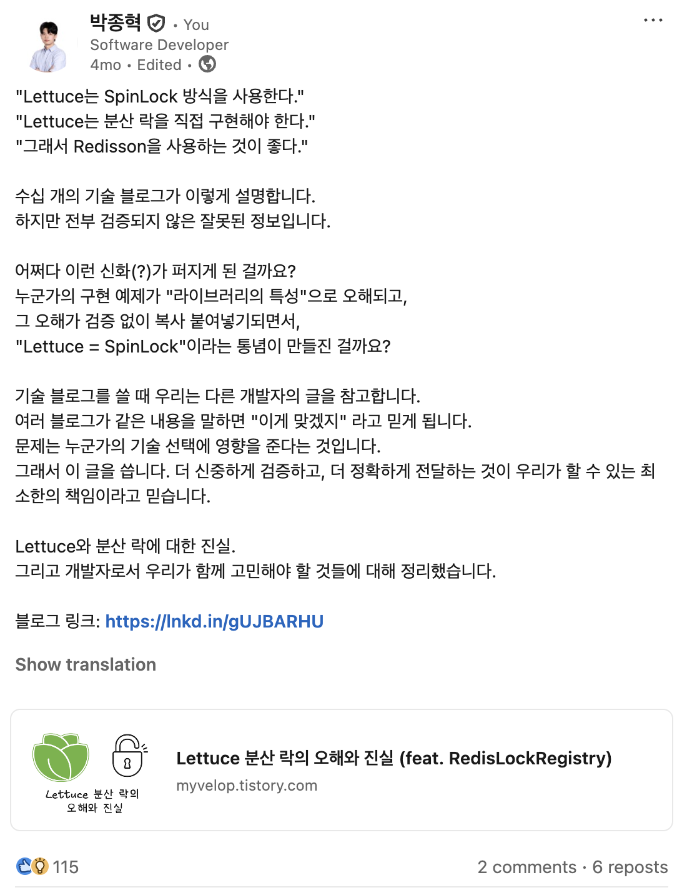
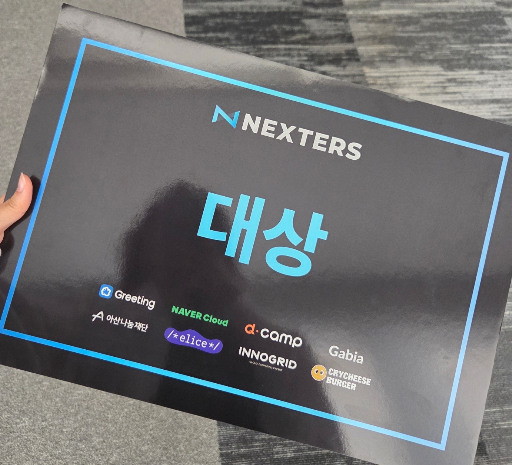

## 개발자로서 성장

### 임팩트

기술만 좋으면 된다고 믿었다.  
클린 코드, 리팩토링, TDD, 도메인 주도 설계.  
좋은 코드를 짜는 것이 개발자의 최고 덕목이라 생각하며 끊임없이 수련했다.  
그런데 AI 시대가 오면서 그 전제가 흔들렸다.  
코드를 잘 작성하는 것만으로는 대체 불가능한 가치를 만들 수 없다는 걸 체감했다.  
   
그렇다면 개발자가 진짜 집중해야 할 것은 무엇인가.  
나는 <strong>도메인에 깊이 들어가는 것</strong>이라고 결론 내렸다.  
어떤 문제를 먼저 풀어야 하는지 판단하고, 가장 빠르게 해결하는 방법을 설계하는 능력이 가장 중요하다.  
   
토스 러너스 하이를 기점으로 이 관점을 의식적으로 연습했다.  
어떻게 하면 임팩트를 키울 수 있을지, 무엇을 먼저 풀어야 할지 계속 고민했다.  
그 과정에서 내가 먼저 바꾼 건 “바로 구현에 들어가는 습관”이었다.  
요구사항을 받으면 곧장 설계부터 하던 내가 이제는  
"<strong>누구의 어떤 불편을 줄이려는지"</strong>, "<strong>성공을 무엇으로 측정할지"</strong>, "<strong>지금 풀어야 하는 이유가 뭔지"</strong>   
질문부터 던지게 됐다.  
   
가능한 한 빨리 ‘정답’이 아니라 <strong>검증</strong>에 도달하려고 한다.  
처음부터 완벽한 구조를 만드는 대신, 작은 범위로 가설을 시험하고 결과를 보고 다음 결정을 내린다.  
이 과정에서 “더 많은 코드”를 쓰기보다, <strong>덜 만들고 더 빨리 배우는 선택</strong>이 임팩트를 키우는 경우가 많았다.  
솔직히 아직 확신은 없다.  
다만 요구사항을 파악하고 사람들과 대화하며 설계하는 데 더 많은 시간을 쓰고 있다.  
코드는 AI가 대부분 작성하고, 나는 리뷰어로서 방향과 품질을 지키는 역할에 가까워졌다.  
 

### 공유

링크드인에 생각을 글로 올렸는데, 예상보다 큰 반응을 받았다.  
감사한 마음과 동시에, <strong>내가 쓰는 한 문장이 다른 개발자의 선택과 시간에 영향을 줄 수 있다는 책임감</strong>을 더 크게 느꼈다.  
   
“그렇다더라”가 아니라 <strong>근거와 맥락이 남는 글</strong>을 꾸준히 쓰려고 한다.  
독자와 함께 고민할 수 있는 글을 쓰고 싶다.  
더 나은 선택을 돕고, <strong>좋은 영향을 주는 개발자</strong>가 되고 싶다.

## 넥스터즈

넥스터즈에서 두 번의 프로젝트를 경험했다.  
   
첫 번째는 PM으로 참여했다.  
처음에는 정말 <strong>“될 때까지 밀어붙이는”</strong> 방식으로 했다.  
매일 새벽 2\~3시까지 개발하고, 일정에 쫓기면서 어떻게든 결과물을 만들어내는 데 집중했다.  
그때는 그게 성실함이고 책임감이라고 생각했다.  
그렇게 몇 주를 태우고 나니 3월쯤 번아웃이 왔다.  
그리고 솔직히 말하면, 그렇게 고생한 것에 비해 결과도 만족스럽지 못했다.  
“이 정도로 갈아 넣었는데 이 정도라면, 내가 뭔가 잘못하고 있는 거 아닌가?”라는 생각이 들었다.  
노력의 양이 임팩트를 보장하지 않는다는 걸 몸으로 배운 시간이었다.  
   
그 뒤 여름에는 방향을 바꿨다.  
이번에는 ‘잘 만들어야 한다’는 압박보다 <strong>제품을 만드는 즐거움</strong>을 더 크게 두기로 했다.  
무리해서 시간을 늘리기보다, 여유를 확보하고 중요한 것부터 차근차근 만들었다.  
완성도도 중요했지만, 무엇보다 <strong>만드는 과정 자체를 즐기는 상태</strong>를 유지하려고 했다.  
아이러니하게도 그때 결과가 더 좋았다.  
즐기면서 하다 보니 팀의 호흡도 좋아졌고, 판단도 더 명확해졌고, 제품의 디테일도 더 살아났다.  
결국 대상을 받았다.

   
이 경험들을 통해 배운 건 단순했다.  
임팩트는 얼마나 열심히 했느냐가 아니라, 어떻게 지속 가능한 방식으로 만들어 갔느냐에서 나왔다.  
앞으로도 무작정 갈아 넣는 대신, <strong>즐길 수 있는 속도로 꾸준히</strong> 만들어가려 한다.  
   
 

## 첫 이직

토스 면접 기회를 얻었던 적이 있다.  
하지만 넥스터즈 활동 이후 번아웃이 크게 왔고, 면접을 제대로 준비하지 못한 채 탈락했다.  
애초에 준비가 안 되어 있었다.  
내가 왜 그 기술을 선택했는지조차 설명하지 못했다.  
   
탈락하고 나서 생각보다 오래 멍했다.  
“조금만 더 준비했으면” 하는 아쉬움이 남았다.  
그때 결심했다. 다시는 준비 부족으로 기회를 흘려보내지 말자.  
조급하게 다음을 보지 말고, 최소 3년은 내 일을 제대로 쌓고 정리한 다음 움직이자.  
그래서 이력서와 포트폴리오를 손보고,  
스터디에 들어가 꾸준히 피드백을 받고,  
매주 블로그와 링크드인에 기록을 남기며 루틴을 만들기 시작했다.  
   
그러던 중 부스트캠프 동기에게 연락이 왔다.  
“우리 회사 와볼 생각 있냐?”  
처음엔 망설였다. 지금까지 해온 것과 기술 스택이 완전히 달랐기 때문이다.  
그런데 이야기를 나눌수록, 다들 일에 몰입하는 분위기와 문제를 대하는 태도가 마음에 들어 결국 도전해보기로 했다.  
   
지금은 TypeScript와 NestJS라는 새로운 스택 위에서 일하고 있다.  
코드베이스도 전통적인 객체지향 스타일이라기보다는 <strong>함수형 기반에 가까운 방식</strong>이 많다.  
익숙하지 않은 만큼 『이펙티브 타입스크립트』를 다시 읽고,  
도메인 주도 개발 관점에서 함수형 프로그래밍을 다루는 책과 자료들을 찾아보며 차근차근 따라가는 중이다.  
   
기술적으로 새로 배우는 것도 많다.  
Graphite, Linear 같은 협업 도구부터 Pulumi, Fluent Bit, Lambda까지, 손대볼 만한 요소들이 정말 다양하다.  
   
무엇보다 좋은 건 사람이다.  
열심히 일하는 사람이 많고, 배울 수 있는 사람이 많다. 다들 개발에 진심이다.  
회사에 남아서 몰입하는 사람도 있고,  
Tailscale로 망을 구성해 휴대폰으로 로컬 컴퓨터에 원격 접속한 뒤 Claude를 활용해 생산성을 끌어올리는 등  
각자만의 방식으로 더 잘 일하는 방법을 실험한다.  
주말에도 이것저것 만들어보며 시간을 보내는 모습을 보면서 자극을 많이 받고 있다.  
   
이제 “다음 기회”를 기다리기보다, <strong>매일 준비된 상태에 가까워지자.</strong>  
   
 

## 여행

성인이 되고 나서 첫 해외여행을 다녀왔다.  
   
원래 갈 생각이 없었다. 엄청 지쳐 있었고, 그냥 아무것도 안 하고 싶었다.  
그런데 회사를 추천해준 친구가 링크를 하나 던져왔다.  
"쉬는데 아무것도 안 하면 시간이 너무 아깝잖아."  
마침 이직하는 회사에서 입사가 일주일 미뤄져 시간이 비었다. 그래서 그냥 떠났다.  
출발 전까지는 기대가 없었는데, 도착하니 모든 게 새로웠다.  
예전엔 여행을 돈과 시간 낭비라고 생각했다.  
그 시간에 책 한 장 더 읽고, 뭔가 하나라도 더 하는 게 더 낫다고 믿었다.  
   
그런데 꼭 그렇진 않았다.  
잘 쉬고 돌아오니 다시 달릴 힘이 생겼다.  
룸메이트였던 변리사 형은 37년 만에 처음 해외에 나온 거라고 했다.  
<strong>"이제야 온 게 후회된다. 한 살이라도 어릴 때 이것저것 경험해볼 걸."</strong>  
그 말이 꽤 오래 남았다.  
가끔 공백이 생기면, 이렇게 한번 다녀오는 것도 꽤 괜찮겠다.

## 독서

올해는 다양한 분야의 책을 여러 권 읽었다.  
아무래도 작년보다 더 많은 책을 읽을 수 있었던 이유는 강의보는 시간이 줄었고, 그만큼 책에 투자할 수 있게 되었기 때문일 것이다. 평일 저녁에는 회사에 남아 개발 관련 서적을 읽었고, 주말에는 집 앞에 있는 스타벅스에 가서 책을 봤다.  
   
책을 읽는 방식도 약간 바뀌었다.  
예전엔 이해가 되지 않았을 때 그냥 넘어가버렸다면 이제는 이해가 될 때까지 다시 읽어보고, 스스로 고민해보며, 정 안되면 Gemini나 GPT에게 물어봐 이해했다. 여기에 더해, 그 책에 대한 내 생각을 마크다운 파일로 정리했다. 확실히, 사고력이 좋아진 걸 느꼈다. <s>여전히 말은 잘 못하지만..</s>

#### 기술

-   클린 아키텍처, 로버트 C 마틴
-   실용주의 프로그래머, 앤드류 헌트, 데이비드 토머스
-   대규모 시스템 설계 기초1 , 알렉스 쉬 <strong>\[재독\]</strong>
-   대규모 시스템 설계 기초2, 알렉스 싀, 산 람
-   Real MySQL1 <strong>\[재독\]</strong>
-   토비의 스프링1, 이일민
-   개발자를 위한 레디스, 김가람
-   실전 레디스, 하야시 쇼고
-   엘라스틱 스택 개발부터 운영까지, 김준영 & 정상운 지음
-   DDD 시작하기, 최범균 지음 <strong>\[재독\]</strong>
-   데이터베이스 인터널스, 알렉스 페트로프
-   이펙티브 타입스크립트
-   코틀린 인 액션, 세바스티안 아이그너 <strong>\[...읽는 중...\]</strong>
-   이펙티브 코틀린, 마르친 모스칼라 <strong>\[...읽는 중...\]</strong>
-   단위테스트, 블라디미르 코리코프
-   운영체제 10판 (공룡책) <strong>\[...읽는 중...\]</strong>
-   주니어 백엔드 개발자가 반드시 알아야 할 실무 지식, 최범균

#### 데이터 분석

-   고객을 끌어오는 구글 애널리틱스4, 문준영 지음
-   데이터 과학자의 가설 사고

#### 디자인

-   UX 리서치 교과서

#### 과학

-   이기적 유전자, 리처드 도킨스

#### 철학

-   의무론, 키케로
-   인생철학이야기, 세네카 지음
-   순수이성비판, 임마누엘 칸트 1편 => 정명오 번역본 & 코디정 번역본
-   자유론, 존 스튜어트 밀
-   이성의 기능, 알프레드 노스 화이트헤드  <strong>\[...읽는 중...\]</strong>

#### 경제/비즈니스

-   일의 감각, 조수용
-   변화하는 세계질서, 레이 달리오
-   The Lean Startup, 에릭 리스
-   작은 브랜드를 위한 판매전략 지침서, 스몰브랜더
-   본질의 발견, 최장순
-   컨테이저스, 조나 버거
-   유난한 도전, 정경화

#### 문학

-   페스트, 알베르 카뮈
-   에세2, 미셀 드 몽테뉴
-   무의미의 축제, 밀란 쿤데라
-   위대한 개츠비, F. 스콧 피츠제럴드
-   왜 나는 너를 사랑하는가, 알랭 드 보통
-   오뒷세이아, 호메로스
-   너와 세상 사이의 싸움에서, 프란츠 카프카

#### 영문책

-   Sapiens, Yuval Noah Harari <strong>\[...읽는 중...\]</strong>

#### 기타

-   린치핀, 세스 고딘
-   팩트풀니스, 한스 로슬링
-   원칙, 레이 달리오

## 체력 관리

### 운동

운동은 꾸준히 하고 있다. 체력과 집중력의 원천이다.  
운동을 하지 않은 날은 확실히 업무 퍼포먼스가 떨어짐을 느낀다.

### 수면

수면 시간이 충분하다고 생각하는데, 피로감이 그에 비해 심하다.  
예전에 군대에서 코골이가 엄청 심하지는 않는데 갑자기 코골이를 멈춘다거나, 컥컥대는걸 본 적이 있다고 들었다. 수면 다원 검사의 필요성을 느끼고 있다.

### 기타

술자리를 많이 줄였다. 요즘 술을 마시면 더 빠르게 취하고, 피로감이 예전보다 더 심하다는 걸 느낀다. 점점 술을 멀리하고 있다.  
   
 

## 올해 계획

-   나이만큼 책 읽기 지속
-   오픈소스 기여 혹은 만들어보기
