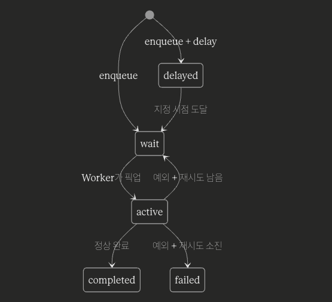
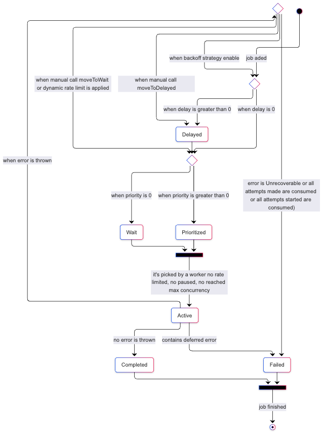
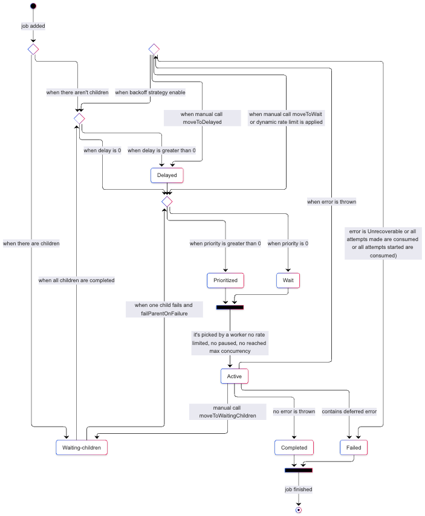
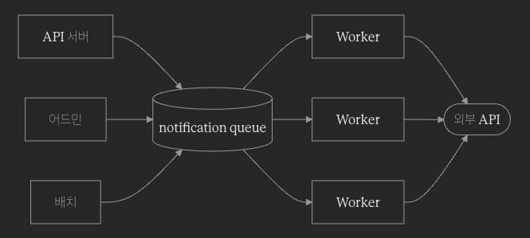

## 들어가며

알림톡, 이메일, 푸시처럼 사용자에게 메시지를 보내는 기능은 어느 서비스에나 있다. 그런데 알림 발송을 단순한 HTTP 호출로 구현하다 보면 금세 한계에 부딪힌다.

-   <strong>여러 도메인에서 동일한 외부 API를 호출한다.</strong> API 서버, 어드민, 배치까지 발송 경로가 흩어진다.
-   <strong>외부 API는 rate limit이 있다.</strong> 외부 API의 "5초당 100건" 같은 제약을 어디선가 강제해야 한다.
-   <strong>즉시 발송이 아닌 경우가 많다.</strong> "인증 후 D+1에 안내", "결제 실패 시 3일 뒤 재안내" 같은 시점 분기가 필요하다. 그러나 상태값으로 확인하기 어려운 요구사항도 있다 — 어드민이 특정 사용자에게 특정 시점에 거는 일회성 예약처럼, 도메인 모델에 자연스럽게 매핑되지 않는 경우다.
-   <strong>벌크 발송은 실패 케이스가 항상 일부 발생한다.</strong> 어떤 메시지가 실패했고 재시도가 필요한지 추적할 수 있어야 한다.

이 문제들 각각은 다른 도구로도 풀 수 있다. 발송 모듈을 하나로 모으고, 함수 안에 rate limit을 두고, 스케줄러로 시점 분기를 만들고, 발송 이력 테이블에 실패를 기록한다. 가능은 하다.

그런데 네 가지가 한 시스템 안에서 동시에 풀려야 하고, 그것도 분산 환경(API 서버 + 여러 워커 인스턴스)에서 일관되게 작동해야 한다면, 별도의 인프라 추상이 필요해진다. 큐가 이때 선택할 도구 중 하나다. 이 글에서는 BullMQ를 선택한 이유와 구체적 활용 방식을 정리한다.

## BullMQ란

BullMQ는 Redis 기반 Node.js 작업 큐 라이브러리다. Producer가 Job을 큐에 적재하면, 별도의 Worker 프로세스가 큐에서 Job을 꺼내 처리한다.

핵심 개념은 세 가지뿐이다.

-   <strong>Queue</strong> — Job이 적재되는 논리적 채널. Redis 키 prefix로 구분된다.
-   <strong>Job</strong> — 처리해야 할 단위 작업. payload(데이터)와 옵션(delay, attempts 등)을 가진다.
-   <strong>Worker</strong> — Job을 처리하는 프로세스. 큐를 구독하고 비동기로 처리한다.

```typescript
// Producer
await queue.add('send-alimtalk', { userId, template }, { delay: 60_000 });

// Worker
new Worker('notification', async (job) => {
  await alimtalkService.send(job.data);
}, { connection, limiter: { max: 20, duration: 1000 } });
```

### 어떻게 돌아가는가?

BullMQ의 핵심은 <strong>Redis가 큐의 모든 상태를 보관한다</strong>는 점이다. Producer가 만든 Job, 처리 대기 중인 Job 목록, 지연 발송 대기 중인 Job, 처리 중인 Job의 lock — 전부 Redis 안에 살고 있다. Worker는 Redis를 지속적으로 들여다보며 처리할 Job을 꺼내 쓴다.

이 구조 덕분에 두 가지가 가능해진다.

<strong>Producer와 Worker가 완전히 분리된다.</strong> Producer는 Job을 만들어 Redis에 넣는 것까지만 한다. Worker는 Redis에서 Job을 꺼내 처리하는 것만 한다. 두 쪽이 같은 프로세스에 있을 필요도, 같은 서버에 있을 필요도 없다. 같은 Redis만 바라보면 된다.

<strong>Worker가 여러 인스턴스로 떠 있어도 일관성이 유지된다.</strong> 처리 중인 Job은 Redis에 lock으로 표시되어 다른 Worker가 동시에 픽업하지 못한다. Rate limiter 카운터도 Redis에 있어서 여러 Worker가 합산해서 한도를 지킨다. "공유 상태는 모두 Redis에 있다" 가 BullMQ의 분산 동작 원리다.

Job은 큐 안에서 몇 가지 상태를 거친다.



wait는 처리 대기, delayed는 시점 분기 대기, active는 처리 중, completed/failed는 종착점이다. 이 상태들은 Redis의 자료구조(list, sorted set, hash) 위에 표현되어 있고, 상태 전환은 Lua 스크립트로 원자적으로 처리된다 — 여러 Worker가 동시에 같은 Job을 픽업하지 못하게 막는 안전장치다.

### 아키텍처

-   Queue.add()로 추가한 Job이 어떤 경로로 흘러가는지에 대한 lifecycle
-   delayed에 있던 Job은 시간이 도래하면 곧장 active로 가는 게 아니라 <strong>내부적으로 wait 또는 prioritized로 승격(promote)된 후</strong> active로 진입한다.



-   FlowProducer.add()로 추가된 Job의 lifecycle
-   waiting-children은 "<strong>다른 누군가의 처리를 기다리는</strong>" 상태다.
-   마지막 자식이 완료되는 순간, 부노가 wait / prioritized / delayed 중 하나로 승격된다.



BullMQ에서 Job은 상태 머신이다.

Queue.add()를 호출하는 순간 Job은 lifecycle에 진입하고, 완료 또는 실패로 끝날 때까지 여러 상태를 거친다. 실패한 Job이 재시도되면 새로운 lifecycle을 다시 시작한다. 여기서 중요한 건, BullMQ에서 "상태"란 단순한 enum으로 관리하지 않고, <strong>Redis 내의 서로 다른 자료구조에 Job ID를 넣어서 관리한다.</strong>

| 상태 | 자료구조 | 설명 |
| --- | --- | --- |
| wait | LIST(bull:queue:wait) | FIFO 큐의 자연스러운 표현, BRPOPLPUSH로 atomic하게 pop+active 이동 |
| prioritized | ZSET | priority 값을 score로 사용해 자동 정렬 |
| delayed | ZSET | 실행 시각(timestamp)을 score로 사용 → 시간 기반 정렬 |
| acitve | LIST | 처리 중인 Job들의 집합 (worker가 죽었을 때 stalled 감지에 사용) |
| completed/failed | ZSET | 완료 시각을 score로, 오래된 Job 정리(removeOnComplete)에 활용 |
| waiting-children | ZSET | 부모-자식 의존성을 위한 특수 상태 |

## BullMQ의 핵심 기능

### 1\. Delayed Job

Job을 적재할 때 delay 옵션을 주면, 지정한 시간이 지난 뒤에야 Worker가 픽업한다.

```typescript
// 3일 뒤에 발송
await queue.add('reapply-guide', payload, { delay: 3 * 24 * 60 * 60 * 1000 });
```

내부적으로는 Redis sorted set에 score를 timestamp로 넣고, delayed → wait 상태로 이동시키는 별도 스케줄러가 돌고 있다.

### 2\. Rate Limiter

Worker에 limiter 옵션을 주면 단위 시간당 처리 개수가 강제된다.

```typescript
new Worker(name, handler, {
  limiter: { max: 20, duration: 1000 }, // 1초당 20건
});
```

카운터는 Redis에 저장되며, Worker를 여러 인스턴스로 띄워도 합산해서 limit이 적용된다. 따라서 외부 API rate limit에 정확히 대응할 수 있다.

### 3\. 중복 제거

jobId를 명시적으로 지정하면, 같은 ID의 Job은 큐에 한 번만 들어간다.

BullMQ에서 잡 데이터는 Redis Hash로 저장된다. 키 형식은 <strong>`bull:{queueName}:{jobId}`</strong> 이다. 사실, jobId를 명시하지 않으면, BullMQ는 bull:{queueName}:id 카운터에 INCR을 호출해서 1, 2, 3... 단조 증가하는 정수를 발급한다.

<strong>jobId를 명시하면</strong>, addJob.lua 스크립트가 원자적으로 다음 흐름을 수행한다.

> 1\. EXISTS bull:{queueName}:{jobId} -- 해당 Hash 키가 존재하는가?  
> 2\. 존재한다 → 큐(wait/delayed/prioritized)에 push하지 않고 기존 jobId를 그대로 반환, 'duplicated' 이벤트 발행  
> 3\. 존재하지 않는다 → HSET으로 Hash 생성 + 큐에 jobId push

만약 Job이 성공해서 끝나버린 상태라면

아래와 같이 jobId를 지정할 수 있다.

```typescript
await queue.add(name, data, { jobId: `payment-request-${paymentId}` });
```

### 4\. Retry & Backoff

처리 중 throw가 발생하면 BullMQ가 자동으로 재시도한다. attempts, backoff 전략(fixed, exponential)을 옵션으로 줄 수 있다.

```typescript
await queue.add(name, data, {
  attempts: 3,
  backoff: { type: 'exponential', delay: 5000 },
});
```

### 5\. Concurrency

Worker가 동시에 처리할 Job 개수를 지정한다.

I/O 위주 작업(외부 API 호출)에서는 concurrency를 높여서 throughput을 올리는 것이 좋다.

```typescript
new Worker(name, handler, { concurrency: 50 });
```

### 6\. Flows

FlowProducer로 부모-자식 관계가 있는 Job 그래프를 만들 수 있다. 부모 Job은 모든 자식이 완료될 때까지 waiting-children 상태로 머물다가, 자식이 전부 끝난 뒤에야 처리된다.

```typescript
import { FlowProducer } from 'bullmq';

const flow = new FlowProducer({ connection });

await flow.add({
  name: 'aggregate-results',
  queueName: 'order',
  data: { batchId: 'b-2026-01-15' },
  children: [
    { name: 'item', queueName: 'item-queue', data: { chunk: 1 } },
    { name: 'order', queueName: 'order-queue', data: { chunk: 2 } },
    { name: 'notification', queueName: 'notification-queue', data: { chunk: 3 } },
  ],
});
```

대량 작업을 청크로 쪼개고 모든 청크가 끝난 뒤 결과를 집계해야 하는 경우, 또는 "전처리 → 발송 → 사후 처리" 같은 다단계 파이프라인을 표현할 때 자연스럽다. 자식 중 하나라도 실패하면 부모는 처리되지 않으므로, 의존 관계가 명확한 작업 흐름을 안전하게 관리할 수 있다.

## BullMQ는 작업 큐다 — 이벤트 드리븐과의 차이

동기로 처리하고, 큐 같은 무언가가 가운데에 있고, 결합도가 낮아진다는 점에서 이벤트 드리븐이라고 생각할수도 있다. 그런데 도구를 본격적으로 쓰다 보면 BullMQ는 이벤트 드리븐과 다른 모델이라는 게 보일 것이다.

### Producer가 consumer를 아는가

작업 큐에서는 producer가 어떤 큐로, 어떤 잡 이름으로 보낼지를 코드에 직접 적는다.

```typescript
await queue.add('send-alimtalk', { userId, template });
```

producer 코드를 보면 "send-alimtalk이라는 잡을 처리할 누군가가 있다"는 걸 명시적으로 알고 있다. 어떤 큐로, 어떤 페이로드로 보낼지 결정하는 책임이 전적으로 producer에 있다. 작업을 직접 위임하는 것이다.

이벤트 모델은 다르다.

```typescript
eventBus.emit('user.signed-up', { userId });
```

publisher는 "회원가입이 일어났다" 는 사실만 발행한다. 누가 듣고 무엇을 할지는 publisher의 관심사가 아니다. 분석 시스템이 들을 수도 있고, 알림 시스템이 들을 수도 있고, 아무도 안 들을 수도 있다. 새 listener가 추가되어도 publisher 코드는 바뀌지 않는다. 이게 이벤트 드리븐의 본질이다.

사실 이벤트 드리븐을 하고자 한다면 RabbitMQ나 Kafka를 사용하는 것이 나을 수 있다.

> 참고: BullMQ Event  
> BullMQ에서 말하는 "이벤트"는 큐와 워커의 내부 상태 변화를 관찰하기 위한 콜백 메커니즘이다. Job이 완료됐다, 실패했다, stalled됐다, progress가 업데이트됐다 같은 큐 내부의 라이프사이클 사건들을 받을 수 있다.

### BullMQ는 언제 선택해야하는가?

아래와 같은 상황이라면 BullMQ를 사용하는 것이 나은 선택일 수 있다.

-   발송 트리거가 여러 도메인에 분산돼 있다.
-   외부 API의 rate limit을 엄격히 지켜야 한다.
-   수평확장할 수 있는 서버에 <strong>작업을 위임</strong>하고 싶다.
-   Redis를 이미 운영 중이며, NodeJS를 사용하고 있다.
-   라이브러리 레벨에서 제공하는 강력한 재시도 로직을 사용하고 싶다. (실패한 메시지만 골라 재시도하고 싶다.)

## Notification 서버 BullMQ 개요

### 1\. 분산된 발송 경로를 단일 큐로 모은다

API 서버, 어드민, 배치 등 발송 트리거는 사방에서 일어난다.

모두 동일한 notification 큐에 적재하고, 발송 책임은 별도의 Worker 서비스 하나에 위임한다.



발송 로직(템플릿 매핑, 전화번호 정규화, 외부 API 호출)을 한 곳에서만 관리한다.

처리량이 부족하면 Worker 인스턴스를 늘리면 된다.

같은 큐를 구독하는 여러 Worker가 자동으로 작업을 나눠 가지며, rate limiter가 Redis 기반 카운터를 공유하기 때문에 인스턴스가 1대든 10대든 외부 API에 가는 호출 합은 한도 안에서 일관되게 유지된다.

### 2\. 외부 API rate limit을 Worker limiter로 제어한다

외부 API가 "5초당 100건"이라면 Worker limiter를 { max: 20, duration: 1000 }으로 설정한다.

1초당 20건이 5초 누적으로 100건이 되어 한도 이내에 들어온다.

트래픽 spike가 발생해도 큐에 쌓이며 평탄화될 뿐, 외부 API는 영향받지 않는다.

### 3\. 유료 플랜을 사용한다면 Batch 기능을 활용하여 Bulk 처리를 할 수 있다

```typescript
import { WorkerPro } from '@taskforcesh/bullmq-pro';

const worker = new WorkerPro('alimtalk-queue', async (job: JobPro) => {
  const batch = job.getBatch();           // ← 여러 잡이 배열로 들어옴
  for (const batchedJob of batch) {
    await sendAlimtalk(batchedJob.data);
  }
}, {
  connection,
  batch: { 
    size: 10,        // 한 batch에 최대 10개
    minSize: 5,      // 최소 5개가 모일 때까지 대기
    timeout: 30000,  // 5개 못 모여도 30초 후엔 그냥 처리
  }
});
```

현재 사용하고 있는 외부 API의 Rate Limit이 빡빡하다면 Batch를 통해 Bulk 요청하는 것을 고려해볼 수 있다.

다만 부분실패 문제, 재시도 단위가 비대해지는 등의 트레이드오프를 잘 따져봐야한다.

## 이어서

BullMQ가 무엇인지 알아보고, 기능을 활용해 Notification 서버를 간단하게 설계해봤다.

뒤이어 작성될 글에서는 운영하면서 마주친 사고와 트레이드오프들을 살펴볼 것이다.

## 참고

-   [BullMQ 공식문서](https://docs.bullmq.io/guide/architecture)
