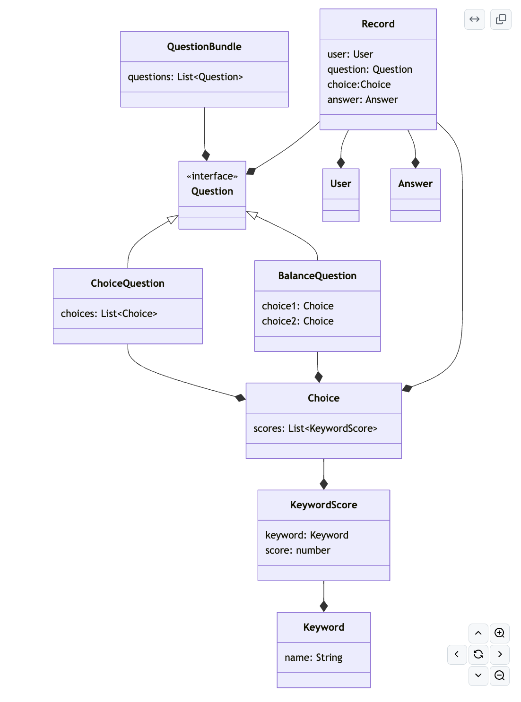
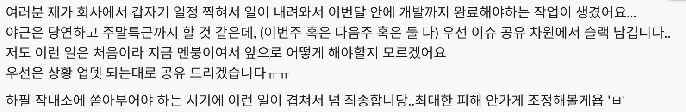
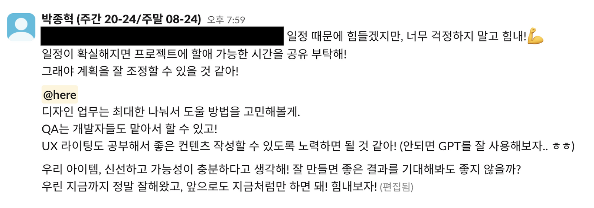
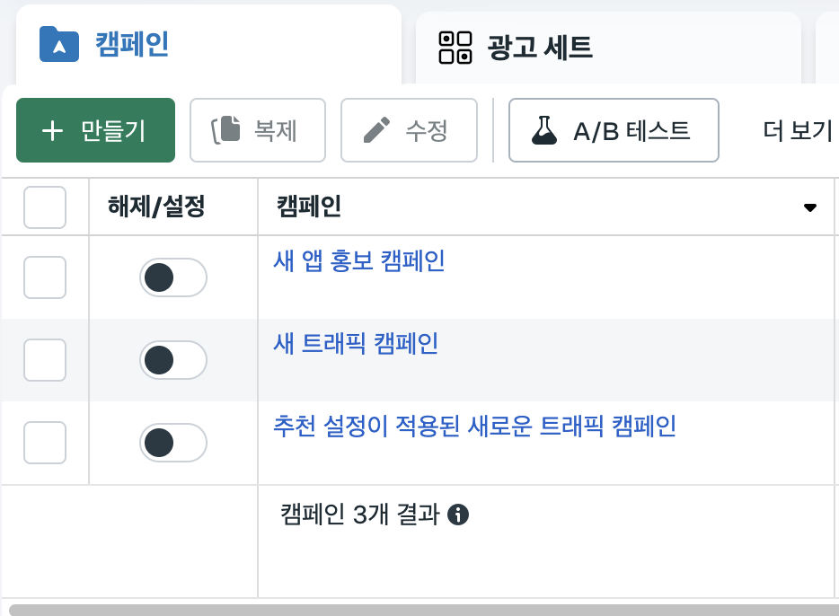
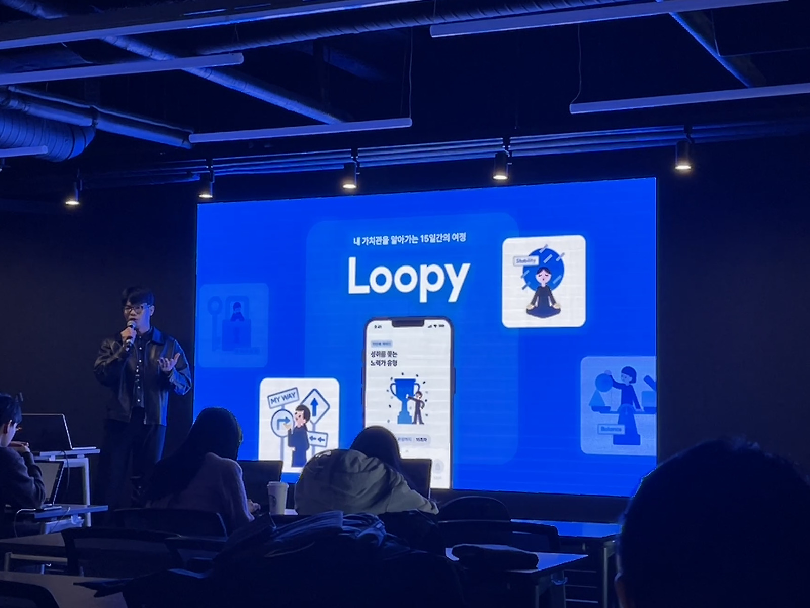

## PM에 도전하다.

넥스터즈가 어떤 식으로 진행되는지도 몰랐던 나는, 패기롭게 아이디어를 제출했다.

PM의 역할을 맡으면 이것저것 챙길 일이 많아질 테지만, 제대로 고생 한 번 해보면 <strong>스스로 더 성장할 수 있을 거라고 믿었다.</strong> 나는 <strong>협업의 중심점 역할을 맡아, 팀을 이끌고 문제를 해결하는 경험</strong>을 해보고 싶었다. 단순히 맡은 업무를 수행하는 것이 아니라, 팀이 효율적으로 움직일 수 있도록 방향을 제시하는 사람이 되고 싶었다.

## 나는 어떤 PM이었나?

PM이란 "프로덕트를 성공시키기 위해 무엇이든 할 수 있는 역할"이라고 생각했다. 하지만 구체적인 역할을 정의하지 못했던 나는 프로젝트 초기에 약간 방황하며 어려움을 겪었다.

이 과정에서 회사의 PM 분과 커피챗을 요청해 이야기를 나눴다. 그분 역시 "PM의 존재 이유는 프로덕트를 성공시키는 것"이라는 점에 동의했지만, 이를 달성하기 위한 본인의 포지셔닝을 정하는 것이 중요하다는 조언을 해주셨다. 

기획자 베이스의 PM, 디자이너 베이스의 PM이 각자의 강점을 갖추었듯이, 백엔드 개발자로서의 강점을 활용하는 방법을 고민해보라는 말이었다. 이 대화를 계기로 PM으로서의 역할을 보다 구체적으로 정의하고 수행할 수 있었다.

### 일정 계획자

PM에게 가장 중요한 역할 중 하나는 프로젝트 일정을 맞추는 것이라고 생각했다.

나는 1차, 2차, 3차에 나누어 중간 목표를 세워 최종 목표에 도달할 수 있도록 계획했다.

계획을 100% 이행하지는 못했지만, 각 단계에서 진행 상황을 점검하며 일정 조율에 집중했다. 특히, 예상보다 일정이 밀리는 경우, 팀원들과 논의하여 유연하게 조정하는 방식으로 대응했다.

### 병목 파괴자

넥스터즈는 2달이라는 짧은 시간 안에 결과물을 만들어내야 했기 때문에, <strong>병목은 곧 실패로 이어진다</strong>고 생각했다. 병목을 최소화하는 것이 가장 중요한 임무 중 하나였다.

-   팀원들에게 <strong>빠르게 피드백을 제공</strong>하여 진행 속도를 유지했다. (출근 전, 점심시간을 활용한 코드 리뷰 등)
-   직무 간 협업이 필요한 경우 <strong>각 팀과의 의사소통을 빠르게 조율</strong>했다.
-   팀 내 논의가 필요할 때 <strong>회의를 주도적으로 개최</strong>하여 지연이 발생하지 않도록 했다.

### 백엔드 리딩

우리 팀은 백엔드 팀원이 다른 팀에 비해 많았다. 세부적인 구현은 팀원들에게 맡기고, 큰 틀에서 방향성을 잡아주며 프로젝트가 원활히 진행될 수 있도록 했다.

앱 팀과 프론트엔드 팀이 API를 기다리는 시간을 최소화하는 것이 목표였고, 백엔드 팀원들이 바로 작업을 시작할 수 있도록 작업 계획을 세워 Github에서 마일스톤 및 이슈로 제공했다. 또한, 비즈니스 정책이 결정되자마자 도메인 모델링을 진행했고, 다이어그램을 제시해 백엔드 팀과 함께 논의하며 구조를 빠르게 확정했다.

### 함께 하는 파트너

"가치관 탐색"이라는 추상적인 개념을 서비스로 구현하려다 보니 기획 단계에서 예상보다 많은 시간이 소요되었다. 디자인이 확정되었을 때는 최종 발표까지 한 달도 남지 않은 상태였고, 작업해야 할 페이지가 많았다.

PM의 역할이 마감 기한을 맞추기 위해 업무량을 조정하는 것이지만, 앱의 완성도를 고려했을 때 뺄 수 있는 기능이 하나도 없었다.

당연히 우리 팀원들의 능력이라면 충분히 해낼 수 있다고 믿었지만, 문제는 사기였다. 프론트엔드 팀이 작업량에 압도된 듯 보였고, 기한 내에 완성할 수 있을지에 대한 의문이 커지고 있었다.

이 상황에서 내가 할 수 있는 선택지는 하나였다. <strong>프론트엔드 개발을 직접 지원하는 것.</strong>

가능한 모든 시간을 활용해 프론트엔드 개발에 전념했고, 일주일 만에 1차 MVP 페이지를 완료했다. 덕분에 계획했던 UT(사용성 테스트)를 성공적으로 진행할 수 있었고, 작은 성취를 경험한 프론트엔드 팀은 자신감을 되찾아 빠르게 개발을 진행했다. 결국 3주 만에 모든 페이지를 완성하는 기염을 토해냈다.

### 잡일 담당자

PM으로서 팀원들이 본인의 업무에 집중할 수 있도록 돕는 것도 중요한 역할이었다. 그래서 나는 <strong>플러터 개발, iOS 심사, 백엔드 병목 해결, 자잘한 프론트 이슈 해결, QA 등 다양한 업무를 직접 수행했다.</strong> 그 외에도 <strong>광고 작업, 발표 준비, 회의 장소 예약</strong> 등 크고 작은 업무들도 도맡아 처리했다. 백엔드를 리딩하면서도 다양한 실무를 병행하느라 정신없이 움직였다. <s>그리고 사업가의 삶이 얼마나 고달픈지 체감할 수 있었다.</s>

## 리더에게 필요한 것

리더의 실수는 팀 전체에 영향을 미친다. 하지만 중요한 것은 실수를 통해 배우고, 같은 실수를 반복하지 않는 것이다. 나는 이번 경험을 통해 리더가 가져야 할 핵심 역량에 대해 고민해봤다.

### 판단력

리더의 판단이 팀의 방향을 결정한다. 리더가 방향을 잘못 설정하면, 팀원들은 불필요한 시행착오를 겪고 고생하게 된다. 따라서 리더는 자신의 프로덕트에 대한 깊은 이해를 갖추고, 많은 정보를 확보하며, 트렌드에도 민감해야 한다. 무엇보다도 각 직무에 대한 높은 이해도를 바탕으로 매끄러운 협업을 이끌어낼 수 있어야 한다.

하지만 나는 이 부분에서 부족했다. <strong>트렌드에 둔감했고, 내 결정에 대한 확신이 없었다.</strong>  특히, UI/UX나 사용자 경험 설계에 대한 이해가 부족해 디자인 팀과 논의할 때 논리적인 피드백을 주지 못했다. 특히, <strong>'사용자 중심의 인터랙션'</strong>을 간과했다.

<strong>확신이 부족한 상태에서 결정을 내리는 것이 두려웠다.</strong> 디자인을 수정해야 한다는 직감을 느꼈지만, "리소스가 낭비될까 봐", "내가 디자인에 대해 뭘 안다고 판단을 해"라는 생각에 쉽게 결정을 내리지 못했다. 중요한 사안에서도 망설였고, 때로는 <strong>명확한 결정을 내리지 못한 채 팀원들에게 판단을 유보했다.</strong> 

이로 인해 <strong>팀이 혼란스러워졌고, 기획이 길어졌다.</strong> 기획의 방향이 명확하지 않다 보니 <strong>디자인 팀은 계속해서 수정을 반복해야 했고, 개발 팀도 불확실한 상태에서 일을 진행해야 했다.</strong> 결과적으로 프로젝트 전체 일정이 지연되었다.

리더는 완벽한 답을 내놓는 사람이 아니다. 중요한 것은 <strong>불확실한 상황에서도 팀이 나아갈 방향을 명확히 제시하는 능력이 필요하다.</strong>

### 계획과 전략

리더에게는 명확한 계획과 전략이 있어야 한다. 전략 없이 실행부터 하면, 팀원들은 쓸데없는 작업을 반복하게 되고 사기가 떨어진다. 몇 수 앞을 내다보고 고민하는 것이 리더의 역할이다

우리 팀은 서비스 아이템을 결정한 후, 유저 리서치를 통해 인사이트를 도출했고, 바로 와이어프레임 제작을 진행했다. 그러나 와이어프레임을 기반으로 논의를 시작하면서 큰 문제가 발생했다. <strong>핵심 정책이 결정되지 않은 상태에서 디자인 작업이 먼저 진행되었기 때문</strong>이다. 결국 디자인을 다시 해야 했고, 불필요한 수정 작업이 발생하면서 많은 시간이 낭비되었다.

다음과 같은 순서로 진행했더라면 훨씬 효율적이었을 것이다.

> 핵심 정책 논의 및 결정 -> 와이어프레임 작업 -> 디테일한 플로우 피드백 -> 디자인 작업

이처럼 <strong><strong>일의 중요도와 순서를 고려한 전략적인 접근이 필요하다.</strong></strong> 리더가 명확한 방향을 제시하지 않으면 팀은 시행착오를 반복하게 된다. 전략 없는 실행은 리소스 낭비로 이어지고, 결국 목표 달성도 어려워진다. <strong>좋은 리더는 단순히 실행을 독려하는 사람이 아니다.</strong> 팀이 <strong>옳은 방향으로 움직이도록 전략을 세우고, 최적의 경로를 설계하는 사람</strong>이어야 한다.

### 위기 대응 능력

팀이 위기에 잘 대응할 수 있도록 돕는 것도 중요한 능력이라고 생각한다.

일정 중간에 팀원 중 한 명에게 갑작스러운 회사 일정이 생겨, 더 이상 프로젝트에 참여하기 어려운 상황이 온 적이 있었다.

특히, <strong>일러스트레이션이 핵심 요소였던 우리 팀에서 디자이너의 이탈은 큰 위기였다.</strong> 순간적으로 멘탈이 흔들렸지만, 팀원들이 패닉 상태에 빠지지 않도록 <strong>긍정적인 분위기를 유지</strong>하려고 노력했다.

*프로젝트가 끝난 후, 사실 멘탈이 많이 흔들렸었다고 고백했는데 전혀 안 그래보였다고 해서 다행..*

나는 디자인 팀의 부담을 줄여주기 위해 캐릭터 소개를 위한 UX 라이팅을 직접 맡기로 결정했다. 회사에 있던 "UX 라이팅 교과서"를 찾아 읽으며, GPT와 한동안 씨름하며 최적의 표현을 고민했다.

다른 팀원들도 컨텐츠 제작과 QA에 적극적으로 참여하며 앱의 완성도를 높여나갔다.

결과적으로, 프로젝트 일정은 흔들리지 않았고, 우리는 위기 속에서도 최선을 다해 프로젝트를 마무리할 수 있었다. 이번 경험을 통해, 예상치 못한 상황에서도 침착하게 해결책을 찾고 팀을 이끄는 것이 얼마나 중요한지 깨달았다.

## 나에게 생긴 변화

### 리더의 관점

PM의 역할을 하다보니, 회사에서도 리더의 관점으로 생각해보는 일이 잦아졌다. 내가 말하는 리더의 관점이란 우리 팀의 리소스를 파악하고 그에 따라 현실적인 일정을 계획하며 프로덕트가 더 좋은 방향으로 나아갈 수 있게 고민할 수 있는 것이다. <strong>단순히 업무를 하는 사람이 아니라, 팀이 가진 역량을 최적화하고 최선의 결과를 도출하는 사람</strong>이어야 한다.

팀의 계획이 틀어질 것 같다면, <strong>역할을 가리지 않고 선뜻 나서서 문제를 해결</strong>하려 했다. 또한, <strong>팀원이 더 성장할 수 있는 방향을 고민하며 돕는 것이 자연스러워졌다.</strong>

### 광고에 대한 이해

나는 회사에서 광고 담당자와 긴밀히 협업하며, <strong>Google Tag Manager, Google Ads, Meta Tag Manager</strong> 등을 효과적으로 활용할 수 있도록 <strong>코드를 추가하는 역할</strong>을 하고 있다. 하지만 이 과정에서 나는 광고 시스템을 <strong>기술적인 관점에서만 바라보고 있었다.</strong> 광고가 어떻게 기획되고 운영되는지, 어떤 전략이 필요한지에 대한 고민은 상대적으로 적었다.

그러던 중, <strong>PM 역할을 맡으며 직접 광고를 운영해볼 기회가 생겼다.</strong>  
회사에서는 광고 관련 요청이 오면 <strong>트래킹 코드 추가, 이벤트 태깅, 픽셀 설정</strong> 등을 담당했지만, 이번에는 <strong>광고의 성과를 직접 측정하고 분석해야 하는 입장</strong>이 되었다. 단순히 "어떤 데이터를 수집할 것인가"를 고민하는 것이 아니라, <strong>"광고 전략을 어떻게 최적화할 것인가"라는 새로운 시각이 필요</strong>해졌다.

나는 <strong>Meta 광고 관리자</strong>를 활용해 직접 광고를 진행해보았다.  
큰 금액은 아니었지만, <strong>내 사비를 들여 광고를 운영해보는 경험을 했다.</strong> 광고를 운영해보면서 회사의 담당자분과도 대화를 나눌 기회가 생겨 이것저것 배울 수 있었다. 특히, 광고 타겟 설정이 성과에 얼마나 큰 영향을 미치는지, 앱 광고에서 유저의 관심을 끄는 최적의 단계별 전략은 무엇인지 등 구체적인 인사이트를 얻을 수 있었다.

이 경험을 통해, 내가 수집해왔던 데이터들이 단순한 숫자가 아니라, <strong>실제 비즈니스 성과를 좌우하는 핵심 자료임을 깨달았다.</strong> 작은 변화지만, 이는 나에게 <strong>단순한 개발자가 아닌, 비즈니스를 이해하는 개발자로 성장하는 과정</strong>이었다. 앞으로도 <strong>기술과 비즈니스 사이에서 더 넓은 시각을 갖춘 개발자가 되고 싶다.</strong>

## 후기

*발표는 정말 질리도록 했다..*

PM 역할을 맡으면서, 나는 단순히 개발자가 아니라 <strong>팀을 이끌고 방향을 고민하는 역할</strong>을 경험하게 되었다.  
처음에는 막막했고, "PM이란 무엇을 해야 하는 역할인가?"라는 질문부터 시작했다. 하지만 프로젝트를 진행하면서 점점 <strong>나만의 방식으로 PM의 역할을 정의</strong>할 수 있었다.

<strong>단순히 기술을 익히는 것을 넘어, 더 넓은 시각을 가진 사람이 되고 싶다.</strong>  
어떤 역할을 맡든, <strong>문제를 해결하고 팀을 성장시킬 수 있는 사람이 되는 것.</strong>
