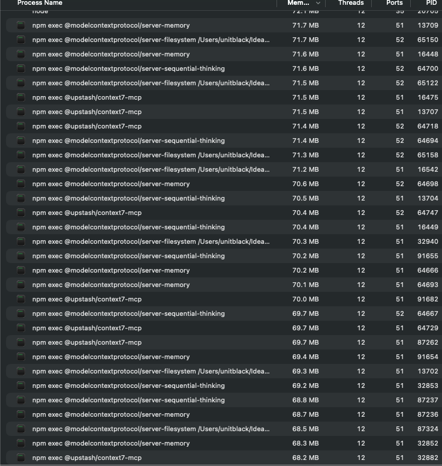
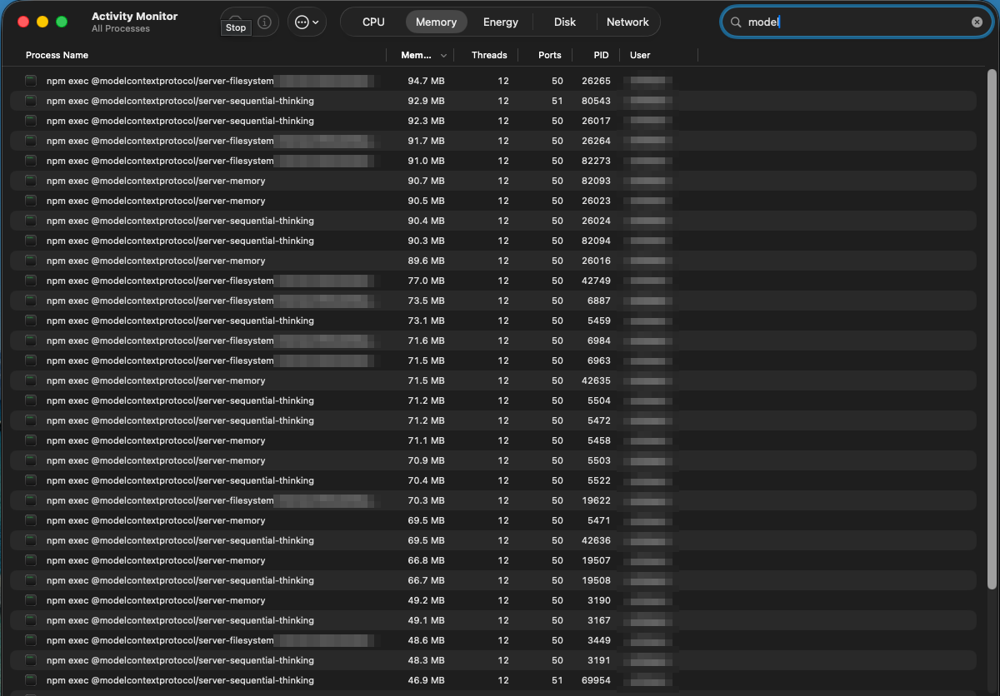
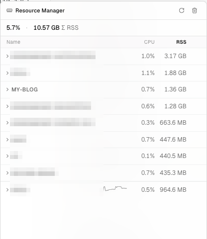

## 들어가며

노트북 팬이 그칠 줄을 몰라서 Activity Monitor를 열었다. 검색창에 "model"을 치자 목록이 한 화면에 다 안 담겼다.



`server-filesystem`, `server-memory`, `server-sequential-thinking`, `context7-mcp`가 PID만 바꿔가며 수십 줄 반복되고 있었고, 하나가 50~90MB씩 물고 있었다. 이 글은 이 목록을 지워나간 과정이다. 처음에는 메모리를 아끼는 이야기로 시작했는데, 끝에 가서는 "MCP가 아직 필요한가"라는 질문이 남았다.

## 세션 수 × 서버 수 × 2

원인부터 짚어보자. stdio MCP 서버는 클라이언트가 자식 프로세스로 직접 띄워서 stdin/stdout으로 JSON-RPC를 주고받는 구조다. 여기서 클라이언트는 Claude Code 세션 하나하나다. 터미널 탭마다 세션을 열어두는 습관이라면, 세션을 열 때마다 등록해둔 MCP 서버 전부가 새로 뜬다.

여기에 배수가 하나 더 붙는다. 서버를 `npx -y <패키지>`로 등록하면 npm exec 래퍼 프로세스(약 85MB)가 실제 서버(약 65MB) 옆에 같이 뜬다. 서버 하나가 프로세스 두 개인 셈이다.



내 머신에서 실측해보니 세션 17개에 서버 5개가 붙어 프로세스 169개, RSS 합계 6.7GB였다. 세션별로 묶어 보면 블로그 작업 세션 하나가 1.36GB를 물고 있었다.



## 프로세스 하나를 나눠 쓰면 되잖아: mmux

곰곰이 보면 이상한 그림이다. MCP 서버는 결국 "이 도구들을 이렇게 쓰면 된다"는 사용법을 노출하고 들어온 호출을 실행해주는 프로세스다. 세션 17개에 떠 있는 server-filesystem 17개는 같은 설정으로 같은 디렉터리를 보며 완전히 같은 일을 한다. 그렇다면 하나만 띄워놓고 17개 세션이 나눠 쓰면 될 일 아닌가.

그래서 프록시를 만들었다. 이름은 [mmux](https://github.com/kkokworks/mmux)다.

<pre class="mermaid">
flowchart LR
    accTitle: mmux 구조
    accDescr: 여러 Claude Code 세션이 HTTP로 mmux에 접속하고, mmux는 stdio MCP 서버를 종류별로 하나씩만 띄워 모든 세션이 공유한다.
    S1["세션 1"] --&gt; M["mmux&lt;br/&gt;127.0.0.1:9090"]
    S2["세션 2"] --&gt; M
    S3["세션 17"] --&gt; M
    M --&gt;|stdio| B1["server-memory × 1"]
    M --&gt;|stdio| B2["server-filesystem × 1"]
    M --&gt;|stdio| B3["context7 × 1"]
</pre>

구조는 단순하다. mmux가 기동할 때 설정에 적힌 백엔드 서버를 한 번만 띄우고 각각을 `http://127.0.0.1:9090/<이름>/mcp`라는 HTTP 엔드포인트로 노출한다. 설정은 기존 Claude Code 설정에서 `command`, `args`, `env`를 그대로 복사하면 된다. 서버 입장에서는 Claude Code가 띄웠는지 mmux가 띄웠는지 구분할 방법이 없다.

```json
{
  "listen": "127.0.0.1:9090",
  "servers": {
    "memory": {
      "command": "npx",
      "args": ["-y", "@modelcontextprotocol/server-memory"],
      "env": { "MEMORY_FILE_PATH": "/Users/me/.claude/memory.jsonl" }
    },
    "filesystem": {
      "command": "npx",
      "args": ["-y", "@modelcontextprotocol/server-filesystem", "/Users/me/projects"]
    }
  }
}
```

세션 쪽에서는 stdio 대신 HTTP transport로 등록한다.

```sh
claude mcp add --scope user memory --transport http http://127.0.0.1:9090/memory/mcp
```

프록시 본체가 하는 일은 정확히 두 가지다.

1. <strong>요청 id 재작성</strong> — id는 클라이언트마다 로컬이라 세션 A와 B가 동시에 `id=1`을 보낼 수 있다. 백엔드로 나갈 때 전역 id로 바꾸고 응답이 돌아오면 원래 id로 되돌린다.
2. <strong>`initialize` 가로채기</strong> — 백엔드는 기동할 때 한 번만 초기화한다. 이후 세션들의 `initialize`에는 캐시해둔 결과로 응답한다. 그대로 전달하면 백엔드가 재초기화되면서 이미 붙어 있던 세션이 전부 깨지기 때문이다.

나머지 메시지는 손대지 않고 그대로 흘려보낸다. 메서드를 해석하지 않으니 MCP 스펙에 새 메서드가 추가돼도 프록시 코드를 고칠 일이 없다.

효과는 이렇다.

| | stdio 그대로 | mmux |
| --- | --- | --- |
| 서버 3개 × 세션 15개 | 프로세스 90개 · 3.48GB | 프로세스 7개 · 456MB |
| 세션을 늘리면 | 선형 증가 | 변화 없음 |

더 줄이고 싶으면 npx 래퍼를 없애면 된다. 패키지를 글로벌 설치하고 설정에서 바이너리를 직접 가리키면, 서버 3개 기준 456MB가 220MB까지 내려간다.

## 공유하면 안 되는 서버도 있다

여기에 함정이 하나 있다. 프록시는 공유를 <strong>가능</strong>하게 해줄 뿐 <strong>안전</strong>하게 만들어주지는 않는다. 서버가 프로세스 안에 세션별 상태를 들고 있다면 공유는 절약이 아니라 버그다.

chrome-devtools가 대표적이라는 얘기를 들었다. 공유하면 격리된 테스트를 못 돌린다는 것이었다. 정말 그런지 확인해봤더니 사실이었다. chrome-devtools-mcp는 서버 프로세스 하나가 Chrome 인스턴스 하나를 수명 내내 물고 있는 구조다. 여러 에이전트가 서버 하나를 공유하는 상황에 공식 README가 내놓는 답은 [`--experimentalPageIdRouting`](https://github.com/ChromeDevTools/chrome-devtools-mcp) 하나뿐인데, 에이전트마다 자기 탭으로 호출을 라우팅해주는 옵션이다. 탭은 나뉘어도 쿠키, localStorage, 로그인 세션은 같은 프로필에 묶여 있어서 전부 공유된다. 서로 다른 계정으로 로그인한 상태를 가정하는 병렬 테스트는 성립할 수가 없다.

흥미롭게도 이 서버는 프로세스를 따로 띄워도 문제가 남는다. 상태(브라우저와 프로필)가 프로세스 밖 디스크에 있기 때문이다. 기본 user-data-dir가 고정 경로라 브라우저 하나가 쓰는 동안 잠기고 두 번째 세션의 Chrome이 뜨지 못하는 문제가 실제로 [보고](https://github.com/ChromeDevTools/chrome-devtools-mcp/issues/2052)되어 있다. 공식 해법은 세션마다 `--isolated` 옵션으로 임시 프로필을 만드는 것이고 [playwright-mcp](https://github.com/microsoft/playwright-mcp)도 같은 경고를 README에 박아뒀다. 어느 쪽이든 방향이 "공유"가 아니라 "더 철저한 분리"라는 게 요점이다.

sequential-thinking도 공유가 안 된다. 이쪽은 반대로 상태가 프로세스 안에 있다. 모델이 보낸 생각(thought)의 체인을 인스턴스 배열에 쌓기 때문에, 두 세션이 붙으면 서로의 사고 흐름 사이에 끼어들며 체인을 오염시킨다.

판별 기준을 한 줄로 줄이면 이렇다. <strong>요청 하나에 응답에 필요한 정보가 전부 담겨 있으면 공유해도 된다. 서버가 "이 클라이언트가 아까 뭘 했는지"를 기억해야 하면 안 된다.</strong>

| 서버 | 공유 | 이유 |
| --- | --- | --- |
| server-memory | ✅ | 오히려 이득이다. N개 인스턴스가 같은 memory.jsonl에 동시에 쓰던 경합이 사라진다 |
| server-filesystem | ✅ | 허용 루트가 설정에 고정되어 모든 세션에 동일하다 |
| context7 | ✅ | 상태 없는 문서 조회다 |
| sequential-thinking | ❌ | 사고 체인이 프로세스 내 배열이다. 세션이 섞이면 오염된다 |
| chrome-devtools | ❌ | 브라우저·탭·프로필 상태를 쥔다. 세션끼리 탭을 뺏는다 |

## 아껴 쓸 게 아니라 안 써도 되는 것 아닐까

여기까지 하고 메모리는 돌아왔다. 그런데 공유 가능 여부를 가리느라 sequential-thinking의 소스를 읽다가 다른 생각이 들었다. 이 서버는 공유를 못 하는 게 문제가 아니라 애초에 지금도 필요한 물건인가 하는 생각이었다.

이 서버가 하는 일은 이렇다. 제공하는 도구는 `sequentialthinking` 하나뿐이다. 모델이 `thought`, `thoughtNumber`, `totalThoughts` 같은 파라미터로 "지금 N번째 생각"을 보내면, 서버는 그걸 받아 번호를 붙여 되돌려준다. 그게 전부다. 서버 쪽에는 아무 연산이 없다. 추론은 전부 모델이 하고 서버는 장부 역할만 한다. 본질은 기능이 아니라 "생각을 한 번에 쏟아내지 말고 단계로 쪼개라"는 행동 규약을 도구 호출 형태로 강제하는 프로토콜이다.

2024년 말에서 2025년 초, 모델의 자체 추론이 지금보다 약하던 시절에는 이 강제가 실제로 효과가 있었다. 프롬프트에 "step by step"을 써넣는 것보다 강제력이 셌으니까. 그 전제가 이제 바뀌었다. 지금 모델들은 extended thinking을 네이티브로 내장한다. 단계적 사고, 중간 수정, 분기 탐색처럼 이 서버가 프로토콜로 강제하던 것들을 모델이 학습 단계에서 이미 체화했다. 남는 것은 비용뿐이다. 같은 사고를 내부 thinking과 MCP 호출로 두 번 하게 되고, 생각 하나마다 도구 호출 왕복이 붙고, 도구 정의가 컨텍스트를 차지한다.

sequential-thinking은 절약할 대상이 아니라 지울 대상이었다.

```sh
claude mcp remove sequential-thinking -s user
```

그러자 질문이 커진다. 지운 게 이거 하나라면 다행인데, 남은 서버들은 왜 MCP여야 하지? 6.7GB는 증상이고, 병은 "왜 이걸 다 띄워놓고 있는가" 쪽에 있는 것 아닐까.

## 대체제가 많아졌다

이 질문에는 이미 답이 꽤 쌓여 있었다. 2026년 초 "MCP is dead. Long live the CLI"라는 [글](https://ejholmes.github.io/2026/02/28/mcp-is-dead-long-live-the-cli.html)이 Hacker News 1위까지 올라간 적이 있는데, 자극적인 제목을 걷어내면 논거는 착실하다. 그 논거의 상당 부분은 Anthropic [공식 문서](https://code.claude.com/docs/en/best-practices)가 먼저 말한 것이다. 외부 서비스와 상호작용할 때는 `gh`, `aws`, `gcloud`, `sentry-cli` 같은 CLI 도구를 쓰라고 권하면서, CLI가 "가장 컨텍스트 효율적인 방법"이라고 명시한다.

CLI가 코딩 에이전트와 잘 맞는 이유는 몇 가지로 정리된다.

- <strong>모델이 이미 안다.</strong> `gh`, `kubectl`, `terraform`의 사용법은 학습 데이터에 통째로 들어 있다. 처음 보는 CLI도 `--help` 한 번이면 익힌다. 도구 정의를 컨텍스트에 미리 실어줄 필요가 없다.
- <strong>사람이 재현할 수 있다.</strong> 에이전트가 실행한 명령이 이상하면 같은 명령을 터미널에 그대로 붙여넣어 확인하면 된다.
- <strong>조합이 된다.</strong> `terraform plan`의 방대한 출력을 `grep`과 `jq`로 걸러서 필요한 부분만 컨텍스트에 넣을 수 있다. MCP 도구 호출의 결과는 통째로 컨텍스트를 통과한다.
- <strong>인증이 이미 풀려 있다.</strong> `gh auth`, AWS 프로필, kubeconfig처럼 수년간 검증된 자격증명 체계를 그대로 쓴다.

CLI조차 필요 없는 경우도 있다. 상당수 MCP 서버는 모델이 이미 호출법을 아는 REST API의 얇은 래퍼다. GitHub API 정도는 Claude가 `curl`로 직접 때리면 되고 공식 문서도 이를 인정한다.

방향이 같은 흐름이 하나 더 있다. 2025년 10월에 나온 Agent Skills다. 마크다운 지시문과 스크립트 몇 개를 폴더에 담은 것이 전부인데, 세션이 시작될 때는 메타데이터 몇십 토큰만 로드되고 필요할 때만 본문을 읽는다. Simon Willison이 ["MCP보다 더 큰 사건일지 모른다"](https://simonwillison.net/2025/Oct/16/claude-skills/)고 쓴 이유가 이 토큰 경제학이다. 실제로 Stripe, Cloudflare, Supabase, Sentry는 자사 CLI를 감싼 공식 Skill을 배포한다. MCP 서버 상주 대신 "CLI + 사용법 문서"라는 조합으로 옮겨갔다.

Anthropic 스스로도 ["Code execution with MCP"](https://www.anthropic.com/engineering/code-execution-with-mcp)라는 글에서 도구 호출을 코드 실행으로 바꾸면 같은 작업의 컨텍스트 소비가 150,000토큰에서 2,000토큰으로, 98.7% 줄어든다는 실측을 내놨다. 도구 정의를 미리 다 싣고 중간 결과를 매번 모델에 통과시키는 방식, 그러니까 우리가 아는 MCP 사용 방식이 병목이라는 진단이다.

sequential-thinking을 지운 손이 멈추지 않는 이유가 여기 있다. 램만 아까운 게 아니었다. 세션마다 띄워놓은 서버 대부분이 더 싸고 더 검증 가능한 수단으로 대체 가능했다.

## 그래도 MCP가 필요한 곳

그럼 MCP의 시대는 끝난 걸까. 전부 지우면 되는 걸까. 그건 아니다. 지워지지 않는 자리가 분명히 있고, 찾아보면 패턴이 보인다.

<strong>첫째, CLI가 없고 OAuth만 열려 있는 SaaS다.</strong> Notion, Slack, Figma, Linear에는 `gh` 같은 공식 CLI가 없다. 대신 공식 remote MCP 서버가 있고, 클릭 한 번의 OAuth로 연결되며 토큰 발급과 갱신을 프로토콜이 처리한다. 사용자가 API 키를 만들어 환경변수에 심는 과정 자체가 사라진다. CLI를 권장하는 Anthropic 문서가 같은 페이지에서 Notion·Figma는 MCP로 연결하라고 안내하는 이유다.

<strong>둘째, 상태를 유지해야 하는 도구다.</strong> 브라우저 자동화가 대표적이다. 로그인해둔 브라우저 세션이 대화가 이어지는 내내 살아 있어야 하는데, CLI는 매 호출이 독립 프로세스라 이 연속성을 만들 수 없다. 앞에서 chrome-devtools를 "공유가 안 되는 골칫거리"로 분류했지만 뒤집어 보면 그 상태성이야말로 이 서버가 MCP여야 하는 이유다. MCP에 비판적인 Armin Ronacher조차 ["다른 방법으로 쓰기 너무 어려운 것"](https://lucumr.pocoo.org/2025/6/12/agentic-coding/)의 예로 브라우저 원격 조종을 인정한다.

<strong>셋째, 셸이 없는 환경이다.</strong> "CLI로 충분하다"는 논거는 에이전트가 터미널 앞에 앉은 개발자 도구라는 전제 위에 서 있다. 그 전제가 깨지는 곳이 많다. claude.ai 웹과 모바일에는 셸이 없다. Obsidian 플러그인처럼 샌드박스 안에서 도는 에이전트는 서브프로세스를 만들 수 없다. 멀티테넌트 서비스는 사용자마다 터미널에서 `gcloud auth login`을 시킬 수 없다. ["MCP isn't dead. You just aren't the target audience"](https://allen.hutchison.org/2026/03/14/mcp-isnt-dead-you-just-arent-the-target-audience/)라는 반박 글의 제목이 정확하다. 보안 관점에서 얻는 것도 있다. `read_file`과 `create_issue` 두 개만 가진 에이전트는 무제한 bash를 가진 에이전트보다 프롬프트 인젝션을 당했을 때의 폭발 반경이 훨씬 작다.

<strong>넷째, 대화 속 UI다.</strong> 2025년 말 Anthropic과 OpenAI가 공동 제안한 [MCP Apps](https://blog.modelcontextprotocol.io/posts/2025-11-21-mcp-apps/)는 서버가 대화 안에 인터랙티브 위젯을 렌더링하게 한다. 텍스트를 뱉는 CLI로는 원천적으로 만들 수 없는 영역이다.

그리고 MCP 자체도 군살을 덜어내는 중이다. Claude Code에는 [Tool Search](https://www.anthropic.com/engineering/advanced-tool-use)가 기본 탑재되어 도구 정의를 필요할 때만 지연 로딩하고 [2026년 7월 스펙](https://blog.modelcontextprotocol.io/posts/2026-07-28/)은 코어를 무상태로 바꾸면서 거의 쓰이지 않던 sampling, roots, logging을 폐기 예고했다. 비판이 향하던 지점들이 프로토콜 차원에서 하나씩 깎여나가고 있다.

## 정리

팬 소음에서 시작한 일이 도구 전반의 재고 조사로 끝났다. 순서대로 정리하면 이렇다.

1. <strong>지울 수 있으면 지운다.</strong> CLI나 API 직접 호출로 되는 일이면 MCP 서버를 상주시킬 이유가 없다. sequential-thinking처럼 전제가 낡은 서버는 그냥 지운다.
2. <strong>남는 서버 중 상태가 없는 것은 공유한다.</strong> memory, filesystem, context7 같은 서버는 mmux 뒤에 두면 세션이 아무리 늘어도 프로세스는 하나다.
3. <strong>상태가 있는 것은 격리한다.</strong> chrome-devtools는 세션마다 `--isolated`로 따로 띄운다. 여기서 드는 메모리는 낭비가 아니라 그 도구의 본질적인 비용이다.

MCP의 시대가 끝났다기보다, "외부 연동은 일단 MCP"라던 만능 계층의 시대가 끝났다. 남은 자리는 좁고 분명하다. OAuth 뒤의 SaaS, 상태를 쥔 도구, 셸이 없는 환경, 대화 속 UI 넷이다. 그 밖의 자리는 CLI와 코드가 도로 가져갔다.

도구는 그 도구가 만들어진 시점의 모델 능력을 전제한다. 전제가 바뀌면 도구도 다시 평가해야 하는데, MCP 서버는 한번 등록하면 눈에 안 띄어서 이 재평가를 놓치기 쉽다.
