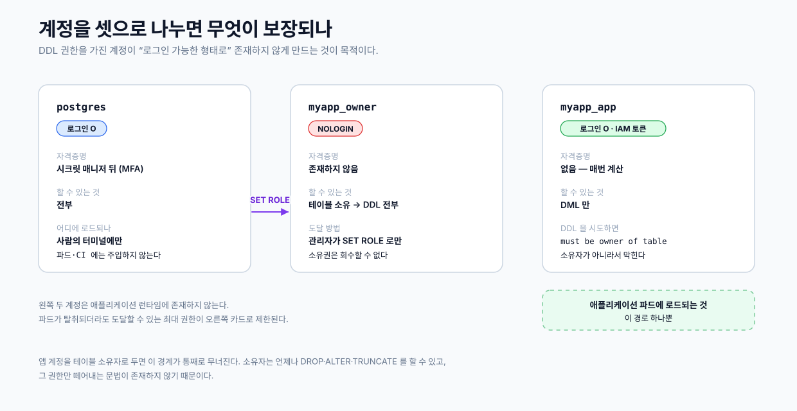

import PasswordlessAuthDemo from "@/materials/24/PasswordlessAuthDemo";
import PrivilegesTimingDemo from "@/materials/24/PrivilegesTimingDemo";
import TrustChainDiagram from "@/materials/24/TrustChainDiagram";
import PrivilegesOrderDiagram from "@/materials/24/PrivilegesOrderDiagram";

## 들어가며

애플리케이션의 DB 접근 권한은 성격이 다른 두 층으로 나뉜다.

- <strong>인증</strong> — 이 프로세스가 DB에 붙어도 되는지를 정한다.
- <strong>인가</strong> — 붙은 다음에 무엇을 할 수 있는지를 정한다.

두 층은 담당하는 시스템도 다르다. 쿠버네티스에 올린 애플리케이션이라면 인증은 클라우드 IAM이 정하고 인가는 DB 엔진이 정한다. 이 글은 각 층을 어떻게 구성하면 저장된 비밀번호가 아예 존재하지 않고 권한도 최소로 유지되는지를 원리 위주로 정리했다.

앞부분은 AWS EKS와 RDS 기준이고 뒷부분(권한 설계)은 PostgreSQL이면 어디서나 통한다.

## 1부. 인증 — 비밀번호를 없앤다

### IRSA — 파드가 신원을 증명하는 방법

IRSA(IAM Roles for Service Accounts)는 쿠버네티스 ServiceAccount를 IAM role에 연결하는 구조다. 이 연결 하나로 파드는 액세스 키를 넣지 않고도 AWS 자격증명을 얻는다.


흐름을 단계로 끊으면 이렇다.

① ServiceAccount에 role ARN을 애노테이션으로 붙인다.

```yaml
apiVersion: v1
kind: ServiceAccount
metadata:
  name: myapp
  annotations:
    eks.amazonaws.com/role-arn: arn:aws:iam::<account>:role/myapp-db
```

② Pod Identity Webhook이 파드 스펙을 변형한다. EKS가 관리하는 mutating admission webhook이다. 파드가 생성될 때 위 애노테이션을 읽고 두 가지를 주입한다.

- 환경변수 `AWS_ROLE_ARN`, `AWS_WEB_IDENTITY_TOKEN_FILE`
- 프로젝티드 서비스어카운트 토큰을 담을 볼륨

여기가 처음 볼 때 잘 안 보이는 지점이다. 매니페스트에는 애노테이션 한 줄만 썼는데 컨테이너 안에 환경변수가 생겨 있는 이유가 이 웹훅이다.

③ kubelet이 JWT를 파일로 써준다. 프로젝티드 토큰은 클러스터 키로 서명된 JWT이고 주요 클레임은 이렇다.

```
aud: sts.amazonaws.com
sub: system:serviceaccount:<namespace>:<serviceaccount>
exp: 기본 24시간 (kubelet이 만료 전 갱신, SDK가 다시 읽음)
```

<strong>`sub`가 신원의 실체다.</strong> 네임스페이스와 ServiceAccount 이름의 조합이 곧 "누구인지"다.

④ AWS SDK가 STS를 호출한다. SDK의 자격증명 체인은 `AWS_WEB_IDENTITY_TOKEN_FILE`이 있으면 그 파일을 읽어 `AssumeRoleWithWebIdentity`를 호출한다. 애플리케이션 코드가 할 일은 없다.

⑤ STS가 JWT를 검증한다. 검증 방식이 중요하다. STS는 클러스터에 물어보지 않는다. IAM에 OIDC provider로 등록된 발급자의 공개 JWKS를 가져와 서명을 확인한다. 그래서 클러스터마다 OIDC provider를 한 번 등록해두는 절차가 필요하다.

서명이 맞으면 role의 신뢰 정책 조건을 대조한다.

```json
"Condition": {
  "StringEquals": {
    "oidc.eks.<region>.amazonaws.com/id/<hash>:aud": "sts.amazonaws.com",
    "oidc.eks.<region>.amazonaws.com/id/<hash>:sub": "system:serviceaccount:myapp-dev:myapp"
  }
}
```

`sub`가 조건과 다르면 거부되니 다른 네임스페이스의 파드는 같은 role을 훔쳐 쓸 수 없다.

⑥ 임시 자격증명이 발급된다. 액세스 키·시크릿·세션 토큰 3종이고 수명은 기본 1시간이다. 파드는 이걸로 AWS API를 호출한다.

정리하면 IRSA의 신뢰 사슬은 이렇게 이어진다.

<TrustChainDiagram />

<strong>어디에도 저장된 비밀번호가 없다.</strong> 유출될 대상 자체가 존재하지 않는다. 그게 이 구조의 핵심이다.

### RDS IAM 인증 — 임시 자격증명으로 DB 토큰을 만든다

이제 DB에 붙어야 한다. RDS는 비밀번호 대신 IAM 토큰을 받을 수 있다.

여기서 오해하기 쉬운 부분이 하나 있다. 토큰 발급은 <strong>네트워크 호출이 아니다.</strong> SDK가 임시 자격증명으로 특정 형식의 URL에 SigV4로 서명해서 만들어내는 로컬 계산이다. 그 서명 문자열이 그대로 "비밀번호" 자리에 들어간다.

> <strong>SigV4(AWS Signature Version 4)</strong> — AWS API 요청에 서명하는 표준 방식이다. 요청 내용과 시각을 시크릿 키로 HMAC 서명해 붙이면 AWS는 시크릿을 건네받지 않고도 "그 키의 주인이 보낸 변조되지 않은 요청"임을 검증할 수 있다. 모든 AWS SDK 호출이 내부적으로 이 서명을 쓰고 RDS IAM 토큰은 그 서명을 접속용 URL에 적용한 결과다.

```ts
postgres({
  host, port, database, username,
  // 함수로 넘기면 커넥션을 열 때마다 호출된다 → 매번 새 토큰
  password: () => signer.getAuthToken(),
  ssl: 'require',   // IAM 인증은 TLS 필수
})
```

`require`는 통신을 암호화할 뿐 서버 인증서를 검증하지 않는다. 토큰이 곧 비밀번호이므로 운영에서는 RDS CA 번들을 지정해 `verify-full` 수준으로 검증하는 편이 안전하다.

토큰 수명은 15분이다. 커넥션마다 새로 만들면 만료된 걸 재사용할 일이 없다. 서명에는 IAM 신원이 담겨 있어서 RDS는 그 요청이 `rds-db:connect` 권한을 가진 주체에게서 왔는지 판정할 수 있다.

IAM 정책은 이렇게 생겼다.

```json
{
  "Effect": "Allow",
  "Action": "rds-db:connect",
  "Resource": "arn:aws:rds-db:<region>:<account>:dbuser:<cluster-resource-id>/myapp_dev_app"
}
```

Resource에 DB 계정 이름이 박혀 있어 개발용 role은 개발용 DB 계정으로만 붙을 수 있다. 운영 계정 이름은 이 정책에 없으므로 토큰을 만들어도 거부된다.

### grant rds_iam — DB 쪽 스위치

여기까지가 AWS 쪽이고 DB 쪽에도 짝이 되는 설정이 하나 필요하다.

```sql
create user myapp_dev_app with login;
grant rds_iam to myapp_dev_app;
```

`rds_iam`은 RDS/Aurora가 인스턴스 안에 미리 만들어 두는 PostgreSQL role이다. grant 문장 자체는 평범하지만 `rds_iam`은 표준 PostgreSQL 배포판에 존재하지 않는 role이다. 순정 PostgreSQL 17에서 확인해보면 이렇다.

```sql
select rolname from pg_roles where rolname like 'rds%';
-- (0 rows)

grant rds_iam to myapp_app;
-- ERROR: role "rds_iam" does not exist
```

`pg_read_all_data`, `pg_monitor` 같은 PostgreSQL 내장 role은 정상적으로 조회되는 것으로 보아 `rds_` 계열만 RDS가 따로 넣은 role임을 알 수 있다.

이 role을 부여하면 RDS는 해당 계정을 IAM 토큰으로만 인증한다. 중요한 부수 효과도 하나 있다. <strong>그 계정은 비밀번호 인증이 막힌다.</strong> 비밀번호를 설정해두더라도 쓸 수 없다.

"토큰으로도 되고 비밀번호로도 되는" 어중간한 상태가 존재하지 않는다는 뜻이다. "운영에는 정적 비밀번호가 없다"는 원칙이 문서상의 약속이 아니라 DB 엔진 차원에서 강제된다.

인증 층을 정리하면 이렇게 짝을 이룬다.

| 빠진 설정 | 없으면 |
|---|---|
| DB: `grant rds_iam` | RDS가 토큰을 거부한다 |
| AWS: `rds-db:connect` 정책 | 파드가 토큰을 만들어도 권한이 없다 |
| AWS: IAM role + 신뢰 정책 | 파드가 임시 자격증명 자체를 못 받는다 |

셋 중 하나만 빠져도 붙지 않는다. 매니페스트에 애노테이션만 넣어두고 role을 안 만들면 파드는 STS 단계에서 실패한다.

1부의 흐름을 처음부터 끝까지 이어 붙이면 아래와 같다. 파드에서 출발한 신원이 STS를 거쳐 DB 접속까지 이어지는 동안 어느 단계에도 저장된 비밀번호가 등장하지 않는다.

<PasswordlessAuthDemo client:visible />

## 2부. 인가 — 권한을 최소로 유지한다

인증을 통과해 붙었다고 끝이 아니다. 그 계정이 DB 안에서 무엇을 할 수 있는지는 IAM이 전혀 모른다. 그건 전적으로 PostgreSQL의 권한 설정이 정한다.

### 소유권은 권한이 아니라 속성이다

PostgreSQL에서 객체 소유자는 `DROP`·`ALTER`·`TRUNCATE`를 <strong>언제나</strong> 할 수 있다. 소유권에 딸려오는 성질이지 `GRANT`로 부여된 권한이 아니다. 그래서 떼어낼 문법이 존재하지 않는다.

```sql
revoke drop on table employees from myapp_app;  -- 이런 구문은 없다
```

그래서 "앱 계정에 DDL 권한을 준 적 없다"는 것만으로는 부족하다. 앱 계정이 <strong>소유자</strong>라면 준 적 없는 DDL이 이미 가능하다. 최소 권한을 실제로 성립시키려면 소유자를 다른 role로 빼야 한다.

### SET ROLE은 실행자가 아니라 소유자를 바꾼다

소유자를 분리하되 로그인은 막는다.

```sql
create role myapp_owner nologin;
grant myapp_owner to admin;  -- SET ROLE에 필요한 멤버십
```

로그인이 안 되는 role로 테이블을 만드는 방법은 이렇다. 관리자 계정으로 접속한 뒤 `SET ROLE`로 전환한다. 이때 대상 role의 멤버십이 필요해서 위 `grant`를 함께 걸었다. RDS 관리자 계정은 superuser가 아니므로 멤버십 없이는 전환이 거부된다. `SET ROLE`은 실행 권한을 빌려오는 것이 아니라 이 세션이 만드는 객체의 소유자를 바꾼다.

```sql
create table t_without (x int);
set role myapp_owner;
create table t_with (x int);
reset role;

select tablename, tableowner from pg_tables where tablename like 't_%';
```

```
 tablename |  tableowner
-----------+--------------
 t_with    | myapp_owner
 t_without | admin
```

마이그레이션 도구의 커넥션에 `PGOPTIONS='-c role=myapp_owner'`로 걸어두면 파일마다 신경 쓸 필요가 없다.

보안 면에서 뜻하는 바는 분명하다. 테이블을 삭제할 수 있는 권한을 가진 계정이 로그인 가능한 형태로 존재하지 않는다. 소유자는 NOLOGIN이고 거기 도달하려면 관리자 자격증명으로 접속해 명시적으로 `SET ROLE`을 해야 한다. 관리자 자격증명이 시크릿 매니저 뒤에 있다면 DDL이 가능한 자격증명은 평상시 어디에도 로드되어 있지 않다. 파드에도, CI에도 없다.



앱 계정이 DDL을 시도하면 이렇게 막힌다.

```
ERROR: must be owner of table employees
```

### ON ALL TABLES는 미래를 포함하지 않는다

소유자를 분리했으니 앱 계정에는 DML만 따로 준다.

```sql
grant select, insert, update, delete on all tables in schema public to myapp_app;
```

`ALL TABLES`라는 표현 때문에 미래형으로 읽히지만 실제로는 그 문장을 실행하는 순간 존재하는 테이블 목록을 훑어 각각에 grant를 거는 것이다. 이후 추가되는 테이블은 포함되지 않는다.

마이그레이션으로 테이블을 붙이면 그 테이블만 권한이 빈다. 증상이 "새로 만든 테이블에서만 permission denied"라 애플리케이션 버그처럼 보이는 게 이 문제의 고약한 점이다.

특히 놓치기 쉬운 게 <strong>시퀀스</strong>다.

```sql
insert into audit_log (...) values (...);
-- ERROR: permission denied for sequence audit_log_id_seq
```

`bigserial` 컬럼은 내부적으로 시퀀스를 쓰므로 테이블 권한만으로는 `INSERT`가 안 된다. 테이블 grant는 챙기고 시퀀스 grant를 빠뜨리면 `SELECT`는 되는데 `INSERT`만 죽는 상태가 되고, 이게 진단하기가 번거롭다.

### ALTER DEFAULT PRIVILEGES는 "누가 만들었는지"로 매칭된다

`ALTER DEFAULT PRIVILEGES`가 하는 일은 한 줄로 줄일 수 있다.

> <strong>앞으로</strong> 지정한 role이 만들 객체에 자동으로 이 권한을 붙여라.

같은 데이터베이스의 시간을 두 방식으로 돌려보면 이렇다. 권한이 걸리는 시점의 차이가 이후 마이그레이션의 결과를 가른다.

<PrivilegesTimingDemo client:visible />

```sql
alter default privileges for role myapp_owner in schema public
  grant select, insert, update, delete on tables to myapp_app;
alter default privileges for role myapp_owner in schema public
  grant usage, select on sequences to myapp_app;
```

소급 적용되지 않는다. 이미 존재하는 객체는 건드리지 않는다. 뒤집어 말하면 테이블이 하나도 없는 시점에 걸어두면 이후 생기는 전부에 권한이 자동으로 붙는다.

<PrivilegesOrderDiagram />

스냅샷 grant 문장 자체가 필요 없어진다.

`FOR ROLE`은 실제 생성자와 일치해야 한다. 이 규칙이 객체를 <strong>생성한 role</strong>로 매칭되기 때문이다. 마이그레이션이 `myapp_owner`가 아니라 관리자 계정으로 테이블을 만들면 규칙이 걸리지 않는다. 그런데 이때 에러가 나지 않는다. 테이블은 정상적으로 생기고 권한만 조용히 빈다.

앞의 `SET ROLE`과 여기가 짝이다. 한쪽만 어긋나면 침묵하므로 마이그레이션 후 소유자를 확인하는 습관이 필요하다.

```sql
select tablename, tableowner from pg_tables where schemaname = 'public';
```

### 확인

로컬 PostgreSQL 17로 그대로 재현했다. 스냅샷 grant는 한 번도 실행하지 않았고 계정 생성과 default privileges만 건 뒤 마이그레이션을 돌렸다.

```
      table_name       |            privs
-----------------------+-----------------------------
 access_requests       | DELETE,INSERT,SELECT,UPDATE
 app_users             | DELETE,INSERT,SELECT,UPDATE
 audit_log             | DELETE,INSERT,SELECT,UPDATE
```

앱 계정으로 직접 접속해서도 확인했다.

| 동작 | 결과 |
|---|---|
| `insert into audit_log ...` (bigserial 시퀀스) | 성공 |
| `select` / `update` / `delete` | 성공 |
| `drop table app_users` | `must be owner of table app_users` |
| `alter table app_users add column ...` | `must be owner of table app_users` |

시퀀스를 쓰는 `INSERT`가 통과했다는 건 앞에서 말한 "테이블 grant는 있는데 시퀀스 grant가 없는" 상태가 구조적으로 생기지 않는다는 뜻이다.

주의할 점도 하나 있다. default privileges는 그 role이 만든 <strong>모든</strong> 객체에 걸리므로 마이그레이션 도구가 적용 이력을 기록하는 테이블에도 권한이 붙는다. 앱이 그 이력을 건드릴 이유는 없으니 최소 권한 관점에서 권한을 도로 거둔다.

```sql
revoke all on schema_migrations from myapp_app;
```

### 알아두면 좋은 제약 둘

PostgreSQL 15부터 `public` 스키마 규칙이 바뀌었다. 소유자 role로 테이블을 만들려 할 때 이런 에러를 만날 수 있다.

```
ERROR: permission denied for schema public
```

15부터 `public` 스키마는 `pg_database_owner` 소유가 되고 PUBLIC의 CREATE 권한이 빠졌다. database 소유자가 아닌 role은 `public`에 객체를 만들 수 없다. `create database ... owner myapp_owner`로 만들었다면 소유자가 곧 `pg_database_owner`의 구성원이 되므로 문제가 없다. 다만 이미 있는 database에 소유자 role만 새로 추가하는 경우라면 이 조건을 따로 맞춰야 한다.

`psql -c`로 여러 문장을 주면 한 트랜잭션으로 묶인다.

```sh
psql -c "create database myapp_dev; revoke connect on database myapp_dev from public;"
# ERROR: CREATE DATABASE cannot run inside a transaction block
```

`CREATE DATABASE`는 트랜잭션 블록 안에서 실행할 수 없다. `-f`나 stdin으로 파일을 넘기면 문장별 autocommit이라 정상 동작하지만 `-c`에 세미콜론으로 이어 붙이면 막힌다. GUI 클라이언트라면 auto-commit 설정을 확인해야 한다.

## 정리

<strong>인증</strong> — 파드의 신원은 네임스페이스와 ServiceAccount 이름이고 그게 서명된 JWT를 거쳐 IAM role로 이어진다. `rds_iam`을 부여받은 DB 계정은 비밀번호 인증이 아예 막히므로 유출될 비밀번호가 존재하지 않는다.

<strong>인가</strong> — 소유권은 회수할 수 없는 속성이라 앱 계정을 소유자로 두면 최소 권한이 성립하지 않는다. 소유자를 `NOLOGIN`으로 분리하면 DDL 권한을 가진 로그인 경로가 사라진다.

`GRANT ... ON ALL TABLES`는 스냅샷이다. 미래에 생길 객체까지 덮으려면 `ALTER DEFAULT PRIVILEGES`를 쓰되, 소급 적용되지 않으므로 <strong>객체가 생기기 전에</strong> 걸어야 한다. `FOR ROLE`이 실제 생성자와 어긋나면 에러 없이 침묵한다는 점만 기억하면 된다.
