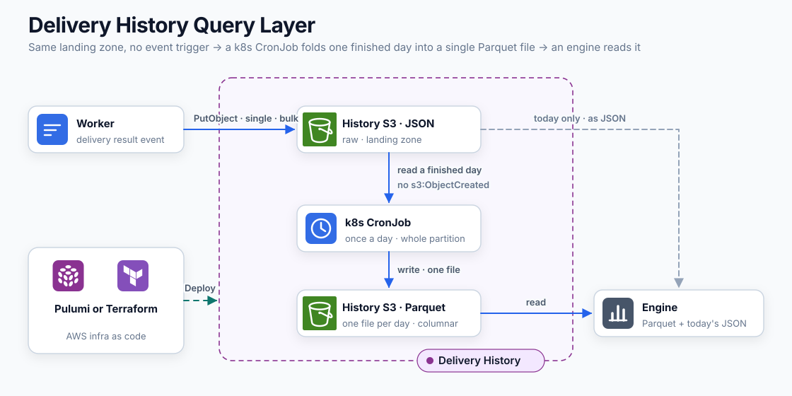

import ColumnarLayoutDemo from "@/materials/25/ColumnarLayoutDemo";
import ParquetLayoutDemo from "@/materials/25/ParquetLayoutDemo";
import RangeReadDemo from "@/materials/25/RangeReadDemo";
import RowGroupPruningDemo from "@/materials/25/RowGroupPruningDemo";
import SmallFilesDemo from "@/materials/25/SmallFilesDemo";

## 들어가며

[3편](/ko/blog/22)은 발송 이력을 어디에 쌓을 것인가에 대한 이야기였다.
S3를 단일 원천으로 두고 일자 파티션으로 적재하는 구조를 골랐고 그 구조는 지금 잘 돌고 있다.
남은 것은 3편 말미에 그려만 두고 만들지 않은 조회 계층이다.

S3에는 잘게 쪼개진 JSON 파일이 쌓여 있다. 이것을 그대로 질의하면 어떻게 될까? 느리다. 왜 느린지는 어느 안을 골라도 같지만 그 대가를 언제 치르는지는 안마다 다르다.

이 글은 그 저울질이다. 먼저 왜 JSON 더미를 그대로 읽기 어려운지 두 가지 배경을 짚고 그 위에서 네 가지 안을 놓는다. Athena나 BigQuery 같은 서버리스 엔진에 그대로 물리는 안, 분석 플랫폼에 정식으로 적재하는 안, Parquet으로 변환해서 읽는 안, 그 위에 Iceberg를 얹는 안이다. 정답은 없고 조건이 있다. 우리가 고른 것과 그 조건이 어긋나면 답도 달라진다.

## 무엇을 물을 것인가

3편에서 정리한 조회 패턴을 다시 가져와 본다.

- 기간별 실패율과 사유 분포
- 템플릿·채널별 성과
- 유저 축 반응·리텐션 분석
- CS 문의 시 특정 수신자의 이력 조회

이 조회는 매일, 그것도 하루에 수백 번 일어난다. CS 문의가 들어오면 그 유저에게 어떤 알림톡이 나갔는지 그날 확인해야 하고 마케팅 쪽에서는 템플릿별 성과를 주기적으로 본다. 다만 최신성 요구는 낮아서 어제까지의 데이터면 대체로 충분하다. <strong>빈도는 하루 수백 번이고 최신성은 어제까지다.</strong> 안을 가르는 건 이 조합이다.

조회 축을 정리하면 성격이 둘로 갈린다. 앞의 셋은 집계와 대량 스캔이고 마지막 CS 조회만 점 조회다. 3편에서는 점 조회를 서드파티 조회 API에 캐시를 씌운 쪽에 맡겼는데, 그쪽은 보관 6개월과 요청 한도에 종속되고 발송 자체가 실패한 건은 애초에 상대에게 기록이 없다. 그래서 이 글의 조회 계층도 점 조회를 감당할 수 있어야 한다.

## 그대로 읽기 어려운 두 가지 배경

쌓는 쪽 구조는 이렇다. 발송 그룹(BullMQ job) 하나가 객체 하나가 되고 키는 `dt=2026-07-29/<group_id>.json`처럼 일자 파티션을 이룬다. 수신자별 결과는 객체 안의 `entries` 배열에 중첩돼 있다.

이 구조는 쓰기에 최적이다. PutObject 한 번이 원자적이라 반쯤 쓰인 파일이 없고 같은 job이 재시도되면 같은 키를 덮어써서 중복도 없다. 문제는 이 모양 그대로 읽으려 할 때 시작된다.

### 1. 파일이 너무 많다

job 하나가 객체 하나이므로 파일 수는 job 수만큼 늘어난다. 발송이 몰리는 기간에는 하루에 수십만 건이 나가니, 단건 발송 비중이 크면 하루 파티션에 객체가 수천에서 수만 개 쌓인다.

S3는 파일 하나를 읽을 때마다 HTTP 왕복이 필요하다. 그래서 <strong>총 용량이 작아도 파일이 많으면 조회가 느리다.</strong> 100MB를 파일 하나로 읽는 것과 만 개로 나눠 읽는 것은 완전히 다른 작업이다. 3편에서 PUT 요청 비용 때문에 Firehose를 저울질했는데 같은 문제가 읽기 쪽에서는 왕복 지연으로 나타나는 셈이다.

이건 우리만의 사정이 아니라 문서에 적혀 있는 성질이다. Athena 성능 문서를 보면 작은 파일이 많은 데이터셋을 명시적으로 경고한다. 쿼리를 계획할 때 파티션 위치를 전부 나열해야 하고, S3의 LIST는 한 번에 1,000개씩만 돌려주므로 파티션 하나에 파일이 1,000개를 넘으면 나열만 여러 번 왕복한다. 심하면 S3 요청 한도에 걸려 `SlowDown` 응답으로 쿼리가 실패하기까지 한다.

같은 바이트라도 어떻게 나뉘어 있느냐에 따라 읽는 데 걸리는 시간이 이렇게 갈린다.

<SmallFilesDemo client:visible />

<strong>이 문제는 포맷과 무관하다.</strong> JSON을 Parquet으로 바꿔도 파일이 만 개면 왕복도 만 번이다. <strong>파일을 합쳐야 풀린다.</strong> 이 사실은 뒤에서 변환 주기를 정할 때 다시 나온다.

### 2. 데이터가 행 단위로 묶여 있다

이력 조회는 질문마다 읽어야 하는 열이 다르고, 특별한 목적이 아니면 읽히지 않는 열도 있다.

| 질문 | 실제로 읽는 열 |
| --- | --- |
| 기간별 실패율 | `status` · `sent_at` |
| 템플릿별 발송량 | `template_type` · `sent_at` |
| 실패 사유 분포 | `status_code` |
| 유저 축 분석 | `user_id` · `sent_at` |

어떤 질문도 열 서너 개를 넘지 않는다. 그런데 엔트리에서 용량이 가장 큰 것은 치환이 끝난 발송 내용(`variables`)과 수신처다. 이 열들은 특정 발송 내용을 확인하는 목적이 아니면 읽히지 않는다. <strong>제일 무거운 열이 제일 안 읽힌다.</strong>

행 지향 포맷(JSON)은 한 수신자의 모든 필드를 한 줄에 묶는다.

```
{user_id:1, phone:…, status:…, variables:{…수백 바이트…}}
{user_id:2, phone:…, status:…, variables:{…수백 바이트…}}
```

`status` 하나만 필요해도 그 값들은 수백 바이트씩 떨어져 있고 저장소는 블록 단위로 읽으므로 `variables`가 통째로 끌려온다. 여기에 텍스트 포맷이라는 비용이 한 겹 더 붙는다. 읽어온 바이트를 행마다 파싱해서 `"12345"`를 숫자로 바꾸는 일을 수십만 번 반복해야 한다.

열 지향 포맷은 같은 필드끼리 모아서 묶는다.

```
[status:    ACCEPTED, ACCEPTED, FAILED, …]   ← 이것만 읽는다
[variables: {…}, {…}, {…}]                   ← 손도 대지 않는다
```

담긴 바이트는 그대로 두고 묶는 방향만 바꿔도 같은 질문이 건드리는 범위가 달라진다.

<ColumnarLayoutDemo client:visible />

열 기반 포맷의 표준이 Parquet이다. 다만 Parquet은 열로만 모으지 않는다. 파일 전체를 열 하나로 길게 이어버리면 조금만 읽으려 해도 파일 전체를 알아야 하고 여러 코어로 나눠 읽을 수도 없다. 그래서 <strong>행을 먼저 덩어리(row group)로 자르고 그 안에서 열별로 모은다.</strong> 그리고 파일 꼬리에 덩어리마다의 위치와 열별 최소·최대를 적어둔다. 읽는 쪽은 꼬리를 먼저 읽고 필요한 자리로 곧장 건너뛴다.

<ParquetLayoutDemo client:visible />

이 배치를 짚어두는 이유는 뒤에 나올 이야기가 전부 여기 얹히기 때문이다. 건너뛰기도, Bloom filter도, 정렬해서 쓰는 것도 이 구조 위에서 도는 일이다.

필요한 열만 읽는 것(projection) 외에 따라오는 성질도 있다.

<strong>압축이 실제로 먹는다.</strong> 압축은 비슷한 값이 인접해야 효과가 나는데 행 지향은 숫자·문자열·객체가 섞여 있어 패턴이 보이지 않는다. 열로 모으면 `status`는 세 종류 값의 대량 반복이라 사전(dictionary) 인코딩으로 거의 사라지고 `sent_at`은 비슷한 값의 연속이라 차이만 저장하면 된다. 집계는 사전 상태 그대로 셀 수 있어서 원래 문자열로 되돌릴 필요도 없다.

<strong>집계가 벡터화된다.</strong> 같은 타입의 값이 연속으로 붙어 있으므로 엔진이 수천 개 단위로 한 번에 처리한다. 행마다 텍스트 파싱을 거쳐야 하는 JSON에서는 구조적으로 불가능한 방식이다.

열 기반의 이득을 흔히 "스캔 바이트가 줄어서 비용이 싸진다"로 설명하는데, <strong>비용을 정하는 건 쌓인 총량이 아니라 훑는 총량이다.</strong> Athena는 스캔 1TB에 $5이고 BigQuery 온디맨드는 월 1TiB까지 무료다. 예를 들어 한 달치가 10GB라면 그걸 한 번 훑는 값은 5센트다. 여기까지만 보면 비용은 논점이 아닌데 곱해야 할 수가 빠져 있다. JSON은 열을 골라 읽을 수 없어 어떤 질문이 와도 10GB를 다 훑고, <strong>유저 수백 명의 CS를 받으면 그 스캔이 하루 수백 번이다.</strong> 네 번이면 BigQuery 무료 한도가 그달에 끝나고, 수백 번이면 Athena로 월 수백 달러다. Parquet에서 두 열만 읽으면 훑는 바이트가 한 자릿수 퍼센트로 떨어진다. <strong>조회 비용은 첫 번째 안과 세 번째 안을 가른다.</strong>

파일은 S3에 있는데 일부만 읽는다는 게 이상하게 들릴 수 있다. S3가 HTTP 범위 요청(`Range`)을 받기 때문에 되는 일이다. 엔진은 파일을 통째로 내려받지 않고 <strong>꼬리를 먼저 받아 자리를 알아낸 다음 필요한 구간만 다시 요청한다.</strong>

<RangeReadDemo client:visible />

## 이제 조회 계층을 고른다

네 안을 같은 잣대 셋으로 본다. 상시로 켜두고 돌볼 것이 몇 개인가(상시 인프라), 앞의 배경 둘이 만드는 대가를 언제 치르는가(조회 비용의 모양), 물어볼 수 있는 가장 최근 시점은 언제인가(최신성)다.

### 1. JSON 그대로 서버리스 엔진에 물린다

가장 적게 만드는 안부터 본다. S3 위에 외부 테이블을 하나 정의하고 Athena나 BigQuery 같은 서버리스 엔진으로 질의한다. 변환도 없고, 파이프라인도 없고, 상시로 켜두는 것도 없다. `dt=` 키가 이미 Hive 파티셔닝 규약이라 날짜 조건은 그대로 파티션 프루닝으로 동작한다.

성질도 좋다. <strong>최신성이 가장 높다.</strong> 방금 워커가 올린 객체가 다음 쿼리에 바로 잡힌다. 날이 바뀌어 새 파티션이 생길 때만 예외인데, Athena라면 `MSCK REPAIR TABLE`을 돌리거나 partition projection을 켜야 그날 치가 눈에 들어온다. `dt=` 규약이 이미 서 있어서 후자는 테이블 정의에 한 줄이다. 원본과 조회 대상이 같은 파일이므로 둘이 어긋날 일도 없다. 백필이라는 개념 자체가 없다.

대신 <strong>앞의 배경 둘을 매 쿼리마다 다시 지불한다.</strong> 파일 수만 개를 나열하고 왕복하는 비용, 필요 없는 열까지 읽고 행마다 파싱하는 비용이 조회할 때마다 처음부터 발생한다. 시간으로도 요금으로도 그렇다. 그런데 우리 조회는 하루에도 수백 번이므로 같은 대가를 그만큼 다시 내는 구조가 된다.

이 안이 맞는 때는 <strong>조회가 정말 드물 때</strong>다. 분기에 한 번 리포트를 뽑거나 장애가 났을 때 한 번 열어보고 마는 임시 분석이라면 변환 파이프라인을 만드는 것 자체가 낭비다. 한 번 느린 쿼리를 참는 편이 싸다. 우리도 조회가 지금처럼 잦지 않았다면 이 안에서 멈췄을 것이다.

### 2. 분석 플랫폼에 정식으로 적재한다

3편 말미에 그렸던 안이 이것이다. S3에 객체가 생기면 알림이 SQS를 거쳐 Lambda로 가고 Lambda가 중첩 구조를 펼쳐 분석 플랫폼에 넣는다.

조회 성능과 최신성을 동시에 가져가는 안이다. 적재가 발송 경로 밖에서 초·분 단위로 따라붙으므로 최신성은 첫 번째 안에 가깝고 조회는 분석 플랫폼이 자기 포맷으로 정리해둔 것을 읽으므로 세 번째 안만큼 빠르다. 여기서 짚어둘 것이 있는데 <strong>분석 플랫폼도 안을 열면 열 지향이다.</strong> 이 안의 조회가 빠른 이유는 세 번째 안이 빠른 이유와 같고, 그것을 직접 만드느냐 사서 쓰느냐가 다를 뿐이다. 3편에서 조건으로 걸었던 운영 DB의 유저 테이블 조인도 여기서는 플랫폼 안의 문제로 끝난다.

문제는 <strong>이 성질을 상시 인프라로 산다</strong>는 데 있다. SQS와 Lambda가 항상 떠 있어야 하고, DLQ에 쌓인 실패분을 누군가 봐야 하고, 스키마를 바꾸려면 Lambda를 다시 배포해야 한다. 원본 S3와 플랫폼 쪽이 어긋나면 백필 스크립트를 돌리는 사람도 필요하다. 데이터가 두 벌 존재한다는 것도 그 자체로 비용이다. 요금이 나가는 시점도 조회와 끊어진다. 아무도 묻지 않는 날에도 적재는 돌고 저장은 두 벌로 쌓인다. 액수가 문제가 아니라 <strong>내는 시점이 조회와 무관하다</strong>는 것이 세 번째 안과 갈리는 지점이다.

극단으로 밀면 조회 전용 마트를 RDS에 두는 안이 나온다. 다들 익숙한 SQL을 그대로 쓸 수 있고 CS 점 조회는 인덱스 하나로 끝난다. 그런데 집계에서는 <strong>배경 2가 그대로 돌아온다.</strong> 행 기반이라 `status` 하나를 세는 데도 `variables`가 실린 행을 통째로 읽는다. 억 단위 행이 쌓이고 나면 그 차이가 그대로 시간이 된다. 여기에 <strong>인스턴스는 24시간 돌고 요금도 24시간 붙는다.</strong> 우리 조회는 하루 수백 번이지만 그걸 다 합쳐도 인스턴스가 실제로 일하는 시간은 몇 분이다. 나머지는 아무도 묻지 않는 시간이고 그 시간에도 요금은 똑같이 나간다. 3편에서 물량 때문에 관계형 DB를 적재처로 쓰지 않기로 했는데 조회처로 쓰는 것도 값이 맞지 않았다. 이번에는 물량이 아니라 켜둔 시간이 이유다. 굳이 올릴 이유를 찾지 못했다.

이 안이 맞는 때는 <strong>최신성과 응답 시간이 요구가 될 때</strong>다. 실패율이 대시보드에 상시로 떠 있어야 하거나, 방금 나간 발송을 바로 확인해야 하거나, 조직에 분석 플랫폼과 그것을 돌보는 사람이 이미 있다면, 이 안의 비용은 새로 내는 값이 아니다. 그때는 세 번째 안이 오히려 우회로가 된다.

### 3. Parquet으로 변환해서 읽는다

배경 1(파일을 합쳐야 한다)과 배경 2(열로 다시 묶어야 한다)를 한 번의 변환으로 같이 푸는 안이다.

원본은 그룹 안에 `entries`가 중첩된 두 층 구조다. Parquet은 LIST와 STRUCT 타입을 지원해서 이 모양 그대로 담을 수도 있다. 하지만 그렇게 두면 쿼리마다 중첩을 푸는 UNNEST가 반복된다. 변환하는 김에 한 번만 펼쳐서 관계형 한 층으로 만들었다. 수신자 1명이 1행이 되고 그룹 레벨 필드는 각 행에 복제한다.

```sql
COPY (
  SELECT g.group_id, g.sent_at, g.notification_type, g.template_type,
         e.message_id, e.user_id, e.status, e.status_code, e.variables
  FROM read_json_auto('s3://…/dt=2026-07-29/*.json', hive_partitioning = true) g,
       UNNEST(g.entries) AS t(e)
) TO 's3://…/parquet/dt=2026-07-29/data.parquet' (FORMAT PARQUET);
```

예시는 DuckDB 문법으로 썼다. 엔진은 아직 고르지 않았고 이 SQL을 돌릴 도구는 여럿이다.

복제가 낭비로 보일 수 있는데 열 기반에서는 성립하지 않는 걱정이다. `sent_at`이나 `template_type` 같은 그룹 필드는 수신자 수만큼 반복되지만 같은 값의 반복은 사전 인코딩이 거의 0에 가깝게 압축한다. 행 지향 DB에서 비정규화가 비싼 것과 달리 여기서는 사실상 공짜이고, 이후의 모든 쿼리가 조인 없이 `WHERE`와 `GROUP BY`만으로 끝난다. 예외는 `variables`다. 템플릿마다 키가 달라서 고정 컬럼으로 펼 수 없으니 MAP 타입으로 담아 두고 필요할 때 키로 꺼낸다.

평탄화하고 나면 그룹은 구조가 아니라 컬럼 값이 된다. 한 시간대에 발송 그룹이 몇 개였든 쿼리 입장에서는 행이 더 많은 것뿐이고, 시간대별이든 템플릿별이든 그룹별이든 원하는 축으로 다시 묶으면 된다.

```sql
SELECT date_trunc('hour', sent_at) AS h,
       count(*) AS sent,
       count(*) FILTER (WHERE status = 'FAILED') AS failed
FROM read_parquet('s3://…/parquet/dt=*/*.parquet', hive_partitioning = true)
WHERE dt BETWEEN '2026-07-01' AND '2026-07-31'
GROUP BY h ORDER BY h;
```

#### 언제 모아서 한 번에 쓸 것인가

Parquet 파일은 커야 한다. 행 몇 개짜리 Parquet은 메타데이터가 본문보다 크고 압축은 반복할 값이 모여야 효과가 난다. 그러니 job마다 바로 Parquet을 쓰는 것은 답이 아니고 어딘가에 모았다가 묶어서 써야 한다.

버퍼를 워커 안에 두는 안부터 검토했다. 기각했다. 지금은 job이 끝나는 즉시 결과가 S3로 나가므로 파드가 죽어도 나간 기록은 남는다. 워커가 한 시간치를 메모리에 들고 있으면 그 한 시간이 통째로 유실 창이 된다. 이력의 유실을 줄이려고 만든 구조에서 유실 창을 키우는 방향이라 앞뒤가 맞지 않았다. 복제본이 여럿이면 버퍼도 여럿이라 파일이 파드 수만큼 쪼개지고 graceful shutdown에서 버퍼를 비우는 일도 따라온다.

결론은 버퍼를 새로 만들지 않는 것이었다. <strong>지금 S3에 쌓이는 JSON이 이미 버퍼다.</strong> 워커는 지금처럼 job마다 JSON을 즉시 적재하고(착륙 지대), 배치가 그 파일들을 주기적으로 Parquet으로 바꾼다. 파일 개수 문제와 포맷 문제가 이 한 번의 변환으로 같이 풀린다.

여기서 3편에 그린 파이프라인과 갈라진다. 그쪽은 객체가 생길 때마다 알림이 SQS를 거쳐 Lambda를 깨우는 이벤트 구동이었다. 최신성을 얻으려면 그게 맞다. <strong>그런데 Parquet에는 건건이 반응해서 얻을 것이 없다.</strong> 파일이 커야 값을 하므로 쌓일 때까지 가만히 뒀다가 한 번에 긁는 편이 낫다. 그래서 이벤트가 아니라 cron이다. 정해진 시각이 되면 cron job이 그동안 쌓인 파티션을 통째로 읽어 파일 하나로 접는다. 3편의 구조에서 SQS와 Lambda가 하던 자리를 스케줄 하나가 대신하는 셈이다.



남는 것은 주기다.

| 주기 | 3년치 파일 수 | 최신성 | 문제 |
| --- | --- | --- | --- |
| 시간 | 2만 개 넘게 | 한 시간 전 | 배경 1이 그대로 재발한다 |
| 하루 | 천 개 남짓 | 어제까지 | 오늘 치는 JSON으로 읽어야 한다 |
| 한 달 | 수십 개 | 지난달까지 | 이번 달 전체가 JSON으로 남는다 |

<strong>하루로 잡았다.</strong> 묻는 단위가 하루이기 때문이다. 실패율도 템플릿 성과도 날짜로 끊어서 보고 어제 하루가 어땠는지를 매일 확인한다. 변환 단위를 조회 단위에 맞춰두면 쿼리 하나가 파일 경계를 넘을 일이 줄어든다. 크기는 이 선택을 막지 않는다. 하루치면 파일 하나로 묶기에 충분하고 3년을 쌓아도 천 개 남짓이라 배경 1이 되살아나지 않는다.

월 단위가 파일 수로는 가장 좋지만 우리 조건에 맞지 않았다. 조회가 매일 있는데 이번 달 데이터 전체가 변환되지 않은 JSON으로 남아 있으면, 월 초에는 거의 모든 쿼리가 결국 JSON 더미를 훑게 된다. 첫 번째 안으로 되돌아가는 셈이다. 하루로 자르면 JSON을 읽는 범위가 <strong>항상 오늘 하루치</strong>로 고정된다.


CS 점 조회도 이 주기 덕을 본다. 앞에서 본 대로 덩어리마다의 최소·최대가 꼬리에 적혀 있어서 조건에 맞지 않는 덩어리는 건너뛴다. 여기에 더해 파일이 하루 단위로 잘려 있으면 그 앞 단계인 파일 프루닝이 먼저 일한다. "이 유저가 지난주에 받은 알림톡"은 파일 일곱 개만 열면 되고 나머지 천 개는 애초에 열리지 않는다. CS 문의는 대개 최근 며칠 안의 건이라 날짜 범위가 자연스럽게 붙는다.

#### 날짜 없이 유저를 찾아야 한다면

문제는 날짜 범위가 붙지 않는 조회다. `user_id` 하나만 들고 보관 기간 전체에서 찾아야 하면 파일 프루닝이 걸리지 않아 천 개를 다 열게 된다. 덩어리 단위 건너뛰기도 도움이 안 되는데, <strong>지금처럼 시간순으로 쓰면</strong> 특정 유저의 발송이 모든 덩어리에 흩어져 최소·최대 범위가 서로 겹치기 때문이다.

다만 이건 포맷의 한계가 아니라 <strong>쓰는 방식의 결과다.</strong> 상쇄할 수단이 둘 있다.

<strong>파일 안에서 정렬해 쓴다.</strong> 변환할 때 `user_id`로 정렬하면 덩어리마다 유저 구간이 좁게 잡히고 서로 겹치지 않아서, 유저 조회에서도 건너뛰기가 산다. 잃는 것은 시간 축 정렬인데 우리 구조에서는 손실이 작다. 날짜는 `dt=` 파티션이 이미 자르고 있어서 파일 하나는 어차피 하루치이기 때문이다. <strong>바깥은 날짜로 자르고 안은 유저로 정렬한다</strong>는 배치가 된다. 덩어리 크기도 같이 봐야 한다. 덩어리가 정렬 키의 좁은 구간에 머물러야 효과가 나고, 그렇다고 잘게 쪼개면 병렬로 돌릴 덩어리가 모자란다.

<strong>Bloom filter를 심는다.</strong> Parquet은 열에 Bloom filter를 붙일 수 있다. 덩어리마다 "이 값은 확실히 없다"를 비트맵으로 답하는 구조인데, 없다는 판정은 확실하고 있다는 판정만 확률이라 헛읽기는 생겨도 놓치는 행은 없다. 값 종류가 너무 많아 사전 인코딩을 붙이기 어려운 열이 대상이고 `user_id`가 정확히 거기 해당한다. 정렬은 축을 하나만 고를 수 있지만 Bloom filter는 여러 열에 걸 수 있다는 점도 다르다.

쓰는 방식만 바꿔도 같은 조회가 여는 덩어리 수는 넷에서 하나로 줄어든다.

<RowGroupPruningDemo client:visible />

단서가 하나 붙는다. <strong>이건 엔진이 지원해야 쓴다.</strong> 쓸 때 심어야 하고 읽을 때 볼 줄 알아야 한다. DuckDB는 1.2.0부터 읽기와 쓰기를 모두 지원한다. 엔진을 아직 고르지 않았으니, 고를 때 확인할 항목이 하나 늘어난 셈이다.

그래서 유저 축 조회 때문에 포맷 밖으로 나가야 한다는 결론은 이르다. 정렬과 Bloom filter로 상당 부분 상쇄되고, 그러고도 모자랄 만큼 조회가 잦아지면 그때가 두 번째 안으로 넘어갈 때다.

#### Parquet을 어디에 둘 것인가

S3에 둔다고 정해놓고 시작했지만 꼭 그래야 하는 것은 아니다. 변환을 k8s CronJob이 맡으므로 PVC를 붙여 EBS 볼륨에 쓰고 조회도 그 볼륨에서 할 수 있다.

<strong>끌리는 지점은 읽는 속도다.</strong> S3는 파일을 열 때마다 HTTP 왕복이 붙지만 마운트된 디스크는 그렇지 않다. 열 기반 포맷은 필요한 열만 골라 읽느라 파일 안을 건너뛰며 읽는데, 이런 접근에서는 왕복 지연이 그대로 비용이 된다. 배경 1이 파일 개수의 문제였다면 이건 파일 하나 안에서 벌어지는 문제다.

그래도 접었다.

<strong>디스크는 켜져 있는 내내 돈을 낸다.</strong> EBS는 실제로 채운 용량이 아니라 프로비저닝한 용량만큼 과금한다. 조회는 하루 몇 번인데 볼륨은 24시간 붙어 있다. 앞에서 RDS를 접은 것과 같은 모양이고, 상시 인프라라는 축에 그대로 걸린다. S3는 넣어둔 만큼만 낸다.

<strong>용량을 미리 정해야 한다.</strong> 3년치가 몇 GB가 될지 지금 못 박아야 하고 모자라면 늘리는 작업이 생긴다. 미뤄도 되는 결정을 미룰 수 없는 결정으로 바꾸는 셈이다.

<strong>AZ와 노드에 묶인다.</strong> EBS는 AZ 단위 자원이라 파드가 다른 AZ로 스케줄되면 붙지 않고, gp3는 노드 하나에만 붙으므로 다른 노드의 파드는 같은 볼륨을 열지 못한다. 지금은 조회 주체가 하나라 티가 나지 않지만 늘어나는 순간 구조를 다시 짜야 한다.

3편에서 세운 원칙도 걸린다. S3를 단일 원천으로 둔 것이 그 구조의 핵심인데, 변환본만 디스크에 있으면 수명주기와 삭제 요청을 두 곳에서 관리하게 된다.

디스크가 맞는 때는 <strong>조회가 잦고 지연이 곧 사용자 경험일 때</strong>다. 대시보드가 상시로 붙어 있다면 로컬 디스크가 값을 한다. 다만 거기까지 가면 두 번째 안이 더 맞는 답이다. 그 사이를 노린다면 캐시라는 자리가 있다. 원천은 S3에 두고 자주 읽는 최근 며칠만 디스크로 당겨오는 식인데, 지금 요구되는 응답 시간에는 필요가 없어서 두지 않았다.

#### 얻는 것과 내주는 것

이 구조의 성질 중에 아끼는 것이 있다.

<strong>워커 코드가 한 줄도 바뀌지 않는다.</strong> 변환은 발송 경로 밖에서 도는 배치이고 3편에서 발송과 이력을 끊어둔 경계가 여기서도 그대로 유지된다.

<strong>변환이 멱등이다.</strong> 원본 JSON이 남아 있는 한 변환은 실패해도 다시 돌리면 되고 스키마를 바꾸고 싶으면 소급해서 다시 만들면 된다. 새벽 배치가 하루 걸러도 다음 날 이틀 치를 돌리면 그만이다.

<strong>상시로 켜둘 것이 없다.</strong> 변환은 JSON을 읽어 Parquet으로 쓰는 도구 하나로 끝나고 그 도구는 배치가 도는 동안만 산다. 조회 계층에 24시간 떠 있는 프로세스가 하나도 없다는 뜻이다.

내주는 것도 있다. 조회 계층에 <strong>배치가 하나 생기고</strong>, 오늘 데이터까지 보려면 <strong>Parquet과 오늘 치 JSON을 UNION</strong>해야 한다. 앞은 실패해도 다시 돌리면 그만인 부담이고 뒤는 조회 도구 쪽 한 겹의 불편이다. 두 번째 안이 상시 파이프라인으로 치르는 값을 이 안은 하루 한 번의 배치와 UNION 한 줄로 치르는 셈이다.

### 4. Parquet 위에 Iceberg를 얹는다

Parquet을 검토하면 Iceberg가 따라 나온다. Parquet 파일 위에 테이블 시맨틱을 얹는 포맷인데, ACID 스냅샷 커밋, 스키마 진화, 타임트래블, 행 단위 삭제가 붙는다.

목록을 다시 보면 대부분 <strong>쓰기 쪽 문제의 해결책</strong>이다. 여러 라이터가 동시에 커밋하고, 스키마가 자주 바뀌고, 행 단위 수정이 필요한 환경에서 값을 한다. 우리 이력은 라이터가 하나에 append만 하고, 확정 후 기록이라 수정도 없다. 풀어줄 문제가 없다. 남는 것은 파일 통계 기반 프루닝인데, 앞에서 본 대로 날짜 축은 경로만으로 이미 프루닝이 되고 유저 축은 정렬과 Bloom filter가 파일 안에서 푼다. 둘 다 Iceberg 없이 되는 일이다.

반면 비용은 확실하다. 읽으려면 쿼리 엔진이 필요하고, 카탈로그를 둬야 하고, 파일 병합(compaction) 잡을 돌려야 한다. 세 번째 안에서 배치 하나로 끝났던 것이 상시 리소스 세 개로 늘어난다. 두 번째 안을 피한 이유가 상시 인프라였는데 그것을 다른 이름으로 다시 들이는 셈이다.

이 안이 맞는 때는 <strong>라이터가 여럿이거나 행 단위 삭제가 잦을 때</strong>다. 개인정보 삭제 요청이 하루에도 여러 건 들어와 특정 `user_id`의 행만 지워야 한다면 Iceberg의 행 단위 삭제가 정확히 그 문제를 푼다. 우리는 3편에서 그 요구를 원본 S3의 수명주기 만료로 넘겨뒀다. 변환본도 같은 일자 파티션이라 같은 정책을 걸면 원본과 함께 사라진다. 지금 빈도로는 여기까지로 충분하다.

### 나란히 놓고 보면

| | 1. 서버리스 질의 | 2. 분석 플랫폼 | 3. Parquet 변환 | 4. Iceberg |
| --- | --- | --- | --- | --- |
| 상시 인프라 | 없음 | SQS·Lambda·플랫폼 | 없음(배치 1개) | 카탈로그·엔진·compaction |
| 변환 | 없음 | 상시 스트리밍 | 매일 새벽 1회 | 매일 + compaction |
| 조회 지연 | 높음(쿼리마다 파일 수만 개) | 낮음 | 낮음(오늘 치만 JSON) | 낮음 |
| 최신성 | 즉시 | 초·분 단위 | 어제까지 + 오늘은 JSON | 커밋 단위 |
| 조회 비용의 모양 | 쿼리마다 | 상시 + 쿼리마다 | 변환할 때만 | 상시 + 쿼리마다 |
| 데이터 벌 수 | 1벌 | 2벌 | 2벌(원본·변환본) | 2벌 |
| 맞는 때 | 조회가 드물다 | 최신성·응답 시간이 요구다 | 조회가 잦고 인프라는 안 늘리고 싶다 | 라이터가 여럿이거나 행 삭제가 잦다 |

표를 보면 <strong>첫 번째와 두 번째가 양 끝이고 세 번째가 그 사이</strong>라는 게 드러난다. 첫 번째 안은 아무것도 만들지 않는 대신 읽을 때마다 대가를 치르고, 두 번째 안은 상시로 대가를 치르는 대신 읽을 때 공짜다. 세 번째 안은 그 대가를 하루 한 번으로 몰아둔다. 다만 빈도가 이 셋을 한 줄로 세우지는 않는다. 조회가 잦아질수록 첫 번째 안은 시간으로도 요금으로도 빠르게 나빠지지만 그렇다고 두 번째 안 쪽으로 밀려나지는 않는다. <strong>빈도는 첫 번째 안을 접게 하는 축이고, 두 번째 안과 세 번째 안을 가르는 것은 최신성과 상시 인프라다.</strong>

우리 조건은 이렇다. <strong>조회는 하루 수백 번이지만 최신성은 어제까지면 대체로 충분하고, 상시로 돌볼 인프라는 늘리고 싶지 않다.</strong> 그만큼 잦으니 첫 번째 안의 "매번 다시 지불"이 시간으로도 요금으로도 쌓이고, 어제까지면 되니 두 번째 안의 초 단위 최신성에 상시 파이프라인을 낼 이유가 없다. 그래서 세 번째 안을 골랐다.

조건이 바뀌면 답도 바뀐다. 조회가 분기에 한 번으로 줄면 배치를 유지하는 것 자체가 낭비라 첫 번째 안이 맞고, 최신성 요구가 초·분 단위로 올라가거나 실패율 대시보드처럼 쿼리 지연이 곧 사용자 경험이 되면 두 번째 안으로 옮겨야 한다. 우리 조건이 특별해서 세 번째 안인 것이 아니라, 지금 최신성 요구가 저 사이에 있어서 세 번째 안인 것이다.

이 결정이 가벼워지는 이유가 하나 더 있다. <strong>호환성이다.</strong> Parquet은 분석 생태계의 사실상 표준 컬럼 포맷이라 DuckDB, Spark, Trino, Athena, BigQuery, pandas가 전부 네이티브로 읽는다. 지금은 상시 엔진 없이 시작하지만 나중에 두 번째 안으로 옮기게 되더라도 데이터를 다시 만들 필요가 없다. 포맷 선택이 도구 선택을 묶지 않는다. 그래서 엔진을 아직 고르지 않은 것도 미뤄둔 결정일 뿐이고, 조회가 어떻게 굳어지는지 보고 나중에 정해도 데이터 쪽 비용은 0이다.

## 정리

3편이 "어디에 쌓을 것인가"였다면 이번 글은 "쌓아둔 것을 어떻게 읽을 것인가"였다. 답은 저장과 조회의 포맷을 분리하는 것이었다. 착륙은 지금처럼 행(JSON)으로 즉시 하고, 조회는 매일 새벽에 열(Parquet)로 바꿔서 한다. 워커는 바뀌지 않고, 변환은 멱등이고, 상시로 켜둘 조회 인프라는 없다. 엔진도 아직 고르지 않았다.

경험으로 남은 것은 세 가지다.

첫째, <strong>쌓는 데 좋은 모양과 읽는 데 좋은 모양은 다르다.</strong> job 단위 JSON 객체는 원자적 쓰기와 멱등 덮어쓰기라는 쓰기 쪽 성질 때문에 고른 모양이고 그 성질은 여전히 유효하다. 다만 그 모양 그대로 질의까지 되기를 바라는 것은 무리였고, 읽기 좋은 모양은 변환으로 따로 만드는 것이 맞았다.

둘째, <strong>최신성 요구와 조회 빈도는 다른 축이다.</strong> 늦어도 된다는 것과 드물다는 것은 붙어 다니기 쉬운데 실제로는 별개다. 우리 조회는 어제까지면 충분하면서 하루에도 수백 번이었고, 둘을 붙여서 봤다면 그 수백 번을 전부 느린 쿼리로 참는 구조가 됐을 것이다.

셋째, 결정에는 <strong>미룰 수 있는 것과 없는 것</strong>이 있다. 포맷 전환과 엔진 선택은 원본이 남아 있는 한 소급이 되므로 미뤄도 된다. 반대로 어떤 필드를 쌓을지는 소급이 안 된다. 3편에서 스키마에 `user_id`를 넣어둔 덕분에 이 글의 유저 축 분석이 성립했다. 쌓는 시점에 남기지 않은 것은 나중에 어떤 포맷으로 바꿔도 만들어낼 수 없다.

## 참고

- [Apache Parquet 문서](https://parquet.apache.org/docs/)
- [Amazon Athena - 데이터 최적화](https://docs.aws.amazon.com/athena/latest/ug/performance-tuning-data-optimization-techniques.html)
- [Amazon Athena 요금](https://aws.amazon.com/athena/pricing/)
- [BigQuery 요금](https://cloud.google.com/bigquery/pricing)
- [Apache Parquet - Bloom filter](https://parquet.apache.org/docs/file-format/bloomfilter/)
- [DuckDB - Parquet](https://duckdb.org/docs/stable/data/parquet/overview.html)
- [DuckDB - Parquet 팁](https://duckdb.org/docs/stable/data/parquet/tips)
- [Parquet Bloom Filters in DuckDB](https://duckdb.org/2025/03/07/parquet-bloom-filters-in-duckdb)
- [DuckDB - httpfs 확장](https://duckdb.org/docs/stable/core_extensions/httpfs/overview.html)
- [DuckDB - Hive 파티셔닝](https://duckdb.org/docs/stable/data/partitioning/hive_partitioning.html)
- [Dremel: Interactive Analysis of Web-Scale Datasets](https://research.google/pubs/dremel-interactive-analysis-of-web-scale-datasets-2/)
- [Apache Iceberg](https://iceberg.apache.org/)
