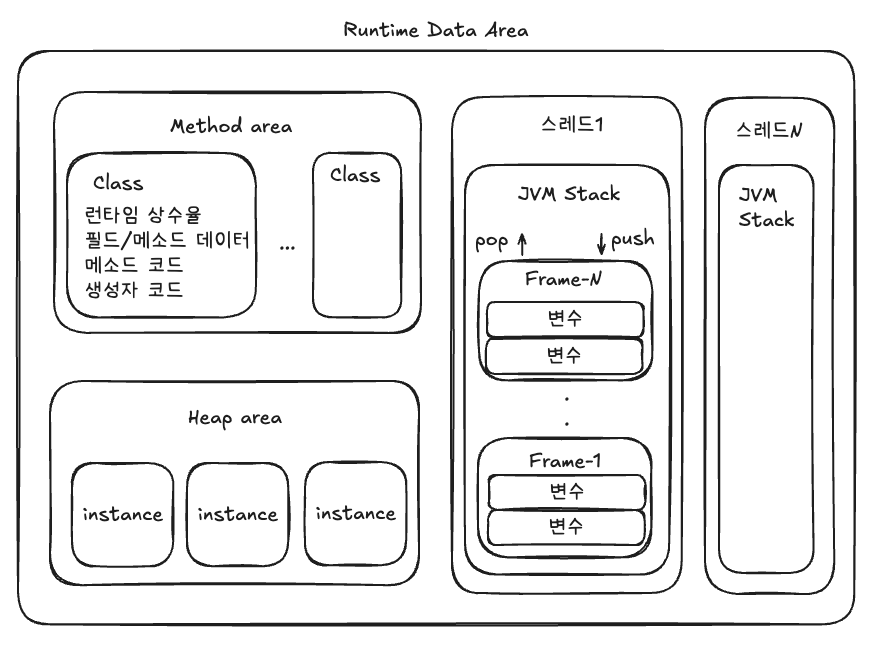
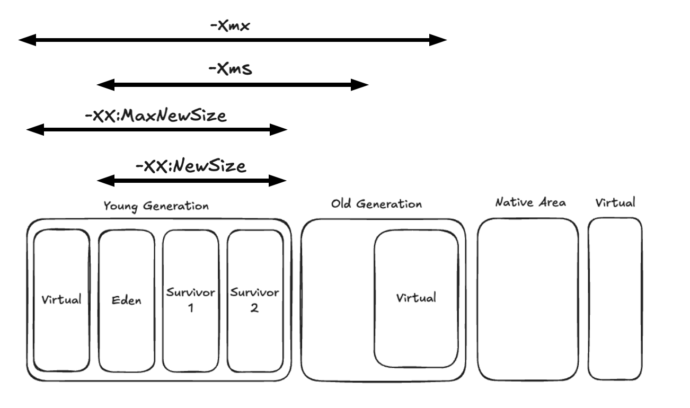

## 당신의 애플리케이션은 안전한가요?

"혹시 서비스 운영 중 아무런 이상이 없어 보이던 시스템이 갑자기 느려지고, 응답 시간이 증가하며, 결국 장애로 이어진 경험이 있지는 않나요? 우리가 흔히 간과하는 작은 코드 한 줄이 <strong>애플리케이션 성능 저하와 서버 장애를 초래할 수 있다는 사실</strong>, 알고 계셨나요?"

이런 문제는 <strong>대부분 메모리 관리의 작은 실수에서 시작된다.</strong>

애플리케이션이 실행되는 동안 메모리는 끊임없이 할당되고 해제된다. 특히 <strong>Java의 JVM 메모리 관리 방식</strong>을 제대로 이해하지 못하면, 시스템 성능 저하와 장애를 초래하는 <strong>메모리 누수(memory leak)</strong>가 발생하여 시스템 성능이 점점 저하될 수 있다.


위 그래프는 JVM 메모리 사용량을 보여준다. 특정 시점에 <strong>메모리 사용량이 급격히 증가</strong>하고 있다. 많은 객체가 생성되었고, 그 객체들이  메모리에서 해제되지 않고 계속 남아있어 메모리 점유하고 있다<strong>.</strong> 이는 성능 저하와 장애로 이어질 가능성이 있다.

이 글에서는 <strong>JVM 메모리 구조, 메모리 누수가 발생하는 원인, 그리고 이를 방지하는 방법</strong>에 대해 다뤄보려고 한다. JVM 메모리를 이해하고 최적화하면 성능 저하와 장애를 예방할 수 있다. 지금부터 하나씩 살펴보자!

## JVM의 메모리

### 메모리 구조

JVM의 메모리는 크게 Heap, Stack, PC Register, Native Method Stack 등이 있다.



이 중 Heap 영역은 JVM 메모리 중 가장 크고, GC의 주요 대상이기 때문에 최적화 효과가 가장 크다. Heap을 잘 튜닝하면 GC 오버헤드를 줄이고 애플리케이션의 응답 속도를 개선할 수 있다.

### 메모리 설정 옵션

Heap의 크기를 적절히 설정해줘야 Minor GC가 너무 빈번하게 발생하지 않는다. 반면, Heap을 너무 크게 설정하면 GC 시 애플리케이션이 멈추는 시간이 길어질 수 있으므로, Heap의 크기를 적절히 설정해줘야 한다.

JVM에서 사용할 수 있는 메모리 설정 옵션을 몇 가지만 소개하자면 아래와 같다.

| 옵션 | 설명 |
| --- | --- |
| -Xms{size} | JVM의 최소 메모리 크기를 지정 |
| -Xmx{size} | JVM의 최대 메모리 크기를 지정 |
| -XX:InitialRAMPercentage={size} | 전체 RAM의 {size}%를 Heap 크기로 설정 |
| -XX:MaxRAMPercentage={size} | 전체 RAM의 {size}%를 최대 Heap 크기로 설정 |
| -XX:NewRatio={ratio} | New 영역과 Old 영역의 비율<br>-XX:NewRatio=1로 설정하면 {New}:{Old} = 1:1<br>-XX:NewRatio=2로 설정하면 {New}:{Old} = 1:2 |
| -XX:NewSize={size} | New 영역의 크기 |
| -XX:SurvivorRatio={ratio} | Eden 영역과 Survivor 영역의 비율 |
| -XX:PermSize={size} | JVM이 사용하는 초기 메모리 크기 지정. 영구적으로 사용.<br>JDK 8부터 PermGen이 제거되고 Meatspace로 대체되었기 때문에 무시된다. 주의! |
| -XX:MaxPermSize={size} | JVM이 사용하는 최대 메모리 크기 지정. 영구적으로 사용<br>-XX:PermSize={size}와 마찬가지로 무시된다. 주의! |



아래와 같이 java 명령어에 옵션으로 실행할 수 있다.

```bash
$ java -Xms1024m -Xmx1024m -jar myapp.jar
```

```shell
$ java -XX:InitialRAMPercentage=50.0 -XX:MaxRAMPercentage=50.0 -jar myapp.jar
```

이 때 위와 같이 메모리의 초기 값과 Max 값을 동일하게 맞춰주는 것이 좋다. 이유는 아래와 같다.

-   초기 메모리 사이즈와 최대 메모리 사이즈가 다르게 설정하면, Heap 메모리가 부족해질 때마다 추가적으로 메모리를 할당받게 된다. Heap 메모리 크기를 동적으로 조정하는 과정에서 GC가 발생하며, 이는 성능에 악영향을 미친다.
-   또한, 초기 메모리 사이즈와 최대 메모리 사이즈를 동일하게 해야 메모리 할당과 해제에 따른 변동성이 줄어 애플리케이션의 성능이 더 예측 가능해진다.

또한 Heap의 사이즈를 어떻게 설정하느냐에 따라 GC의 발생 횟수와 GC의 수행 시간이 달라지므로, 신중하게 설정해야 한다.

-   메모리 크기가 클 때, GC 발생 횟수는 감소하나 GC 수행 시간이 늘어난다.
-   메모리 크기가 작을 때, GC 수행 시간이 감소하나 GC 발생 횟수가 증가한다.

예를 들어, <strong>Minor GC가 빈번하게 발생</strong>하는 상황이라고 가정해보자. Minor GC가 너무 빠르게 발생하면, Young 영역에서 수명이 짧은 객체를 충분히 정리하지 못하고 <strong>Old Generation으로 더 많은 객체가 승격</strong>된다. 이로 인해 Old 영역이 빠르게 채워지고, 결국 Full GC가 자주 실행되어 애플리케이션 성능 저하를 초래한다. 따라서, 이런 경우 Young 영역을 확장하여 Minor GC 빈도를 줄이는 것이 필요하다.

```bash
$ java -Xms1024m -Xmx1024m -XX:NewSize=256m -jar myapp.jar
```

### GC 설정 옵션

JVM에서는 여러 가지 GC 알고리즘을 제공한다. 각각의 GC는 메모리 관리 방식과 성능 특성이 다르므로, 프로젝트의 특성에 맞는 GC를 선택하는 것이 중요하다. 예를 들어, 낮은 지연 시간이 중요한 실시간 애플리케이션에서는 Shenandoah GC가 적합할 수 있으며, 대규모 서비스에서는 ZGC나 G1GC가 효율적일 수 있다. 따라서, 단순히 기본 GC를 사용하는 것이 아니라 애플리케이션의 성능 요구 사항과 시스템 환경을 고려하여 최적의 GC 알고리즘을 적용해야 한다.

| GC | 옵션 | 특징 |
| --- | --- | --- |
| Serial GC | -XX:+UesSerialGC | 단일 스레드, 작은 메모리 환경. |
| Parallel GC | -XX:+UseParallelGC | 멀티 스레드, 높은 처리량.<br>JDK8에서 default |
| G1GC | -XX:UseG1GC | Region 단위의 관리로 지연 시간을 줄임.<br>Full GC의 시간을 수백 밀리초 이하로 관리하고 싶을 때 사용.<br>JDK11에서 default |
| ZGC | -XX:+UseZGC | 초저지연 GC. 대용량 메모리에서 Stop-The-World 시간을 최대한 줄이는 것이 목표.<br>10GB 이하의 메모리에서 비효율적일 수 있음. 50GB 이상일 경우 매우 적합하다고 함.<br>JDK11+ |
| Shenandoah GC | -XX:UseShenandoahGC | 작은 GC를 여러 번 실행하여 낮은 지연시간을 보장. JDK12+ |

## Memory Metrics

메모리 사용량이 급격히 증가하지 않는지, GC가 과도하게 실행되고 있지는 않는지, 로컬 캐시 사용이 지나쳐 메모리가 부족해지지는 않는지 판단하려면, 관련 지표를 지속적으로 모니터링해야 한다.

### Actuator에서 Memory Metrics 확인해보기

스프링 부트에서 actutator를 통해 jvm 메모리 관련 메트릭을 확인해볼 수 있다. 아래와 같이 의존성을 추가해준다.

```kotlin
implementation("org.springframework.boot:spring-boot-starter-actuator")
```

application.yaml 설정 파일에서 metrics를 활성화해주자.

```yaml
management:
  endpoints:
    web:
      exposure:
        include: metrics
```

이제 애플리케이션을 실행하고 <strong>`/actuator/metrics`</strong> 경로에 접속하면 아래의 메모리 관련 메트릭과 함께 다양한 메트릭을 확인해볼 수 있다.

```json
{
  "names": [
    ...
    "jvm.memory.committed",
    "jvm.memory.max",
    "jvm.memory.usage.after.gc",
    "jvm.memory.used",
    ...
  ]
}
```

이 중에서 <strong>`jvm.memory.used`</strong>를 더 상세하고 확인하고 싶다면 <strong>`/actuator/metrics/jvm.memory.used`</strong> 경로에 접속해보자. 여기서 `availableTags`를 확인해보면 <strong>`area`</strong> 태그의 <strong>`heap`</strong>과 <strong>`nonheap`</strong>. <strong>`id`</strong> 태그의 <strong>`G1 Eden Space`</strong>, <strong>`G1 Old Gen`</strong> 등 메모리 영역이 분류되어 있는 것을 확인할 수 있다.

```json
{
  "name": "jvm.memory.used",
  "description": "The amount of used memory",
  "baseUnit": "bytes",
  "measurements": [
    {
      "statistic": "VALUE",
      "value": {number}
    }
  ],
  "availableTags": [
    {
      "tag": "area",
      "values": [
        "heap",
        "nonheap"
      ]
    },
    {
      "tag": "id",
      "values": [
        "G1 Survivor Space",
        "Compressed Class Space",
        "Metaspace",
        "CodeCache",
        "G1 Old Gen",
        "G1 Eden Space"
      ]
    }
  ]
}
```

### 시각화

JVM의 Heap 메모리 사용량은 Kibana를 활용해 직관적으로 시각화할 수 있다. 아래는 그래프는 Heap 메모리 영역의 Max, Used, Commited 값과 사용량 최대값을 시각화해 놓은 예시다. 


Heap 메모리 사용량 자체를 시각화하는 작업은 비교적 간단하다. Kibana에서 <strong>`jvm.memory.max`</strong>, <strong>`jvm.memory.used`</strong>, `jvm.memory.commited` 메트릭을 사용해 시각화에 넣어주기만 하면, 전체 Heap 사용량을 쉽게 확인할 수 있다. 하지만 GC 사이클을 분석하기 위해 메모리 시각화하는 작업은 조금 더 복잡하다.

Kibana APM에서 JVM 메모리 사용량을 추적하는 메트릭이 <strong>`jvm_memory_used`</strong>로 기록된다. 위의 actuator에서 확인해봤던 <strong>`area`</strong> 태그와 <strong>`id`</strong> 태그를 활용해 각 메모리 영역별(heap & nonheap, GC 관련) 데이터 필터링이 가능하다.


Minor GC가 발생하는 Eden 영역의 메모리 사용량을 추적하기 위해 필터링 조건을 적용해보자. <strong>`Eden Space`</strong>의 데이터를 확인하기 위해 필터링 조건을 아래와 같이 적용하면 된다. 추가적으로 <strong>`max`</strong>와 <strong>`commited`</strong> 값을 확인하는 축도 작성했다.

```shell
average(jvm_memory_used, kql='labels.id:"Eden Space"  and labels.area:"heap"')
```

```shell
average(jvm_memory_max, kql='labels.id:"Eden Space"  and labels.area:"heap"')
```

```shell
average(jvm_memory_committed, kql='labels.id:"Eden Space"  and labels.area:"heap"')
```

그래프를 확인해보면, Eden 영역의 사용량이 약 140MB 수준이며, 몇 십 분 주기로 Minor GC가 발생하는 것을 확인할 수 있다. 위에서 설명했다시피 Minor GC가 너무 빈번하게 발생하면 문제가 발생할 수 있기 때문에 빈도를 잘 체크해줘야 한다.


다음으로 Old Generation의 메모리 사용량을 분석해보자. 

아래와 같이 <strong>`labels.id`</strong>를 Old 영역에 맞게 필터링하는 <strong>`vertical axis`</strong>들을 추가해주면 된다.


```shell
average(jvm_memory_used, kql='labels.id:"Tenured Gen"  and labels.area:"heap"')
```

```shell
average(jvm_memory_max, kql='labels.id:"Tenured Gen" and labels.area:"heap"')
```

```shell
average(jvm_memory_committed, kql='labels.id:"Tenured Gen"  and labels.area:"heap"')
```


Old Generation은 Eden에서 승격된 객체들이 쌓이는 공간으로 Old Generation이 지속적으로 증가하면 Full GC가 발생할 가능성이 높다. 만약 Major GC나 Full GC 이후에도 Old Generation의 사용량이 줄어들지 않고 계속해서 증가한다면 메모리 누수 가능성이 높은 상태다.

이 때 메모리 누수의 원인을 파악할 수 있는 방법이 있는데, 자바 애플리케이션에서 Heap Dump를 추출하고 Memory Analyzer Tool로 분석하는 방법이다.

## Heap Dump

### Heap Dump 명령어

Heap Dump를 뜨는 명령어는 간단하다.

```shell
$ jmap -dump:format=b,file=/tmp/<filename>.hprof <JAVA_PROCESS_ID>
```

-   `jamp` 명령어의 <strong>`-dump`</strong> 옵션으로 Heap Dump를 뜰 수 있다.
    -   <strong>`format=b`</strong>는 바이너리 형식을 의미한다.
    -   <strong>`file={경로}/{파일명}.hprof`</strong>는 저장할 파일이름을 지정한다.
-   <JAVA\_PROCESS\_ID>는 애플리케이션이 실행되고 있는 프로세스 ID를 의미하며, 컨테이너 환경에서는 보통 PID  <strong>` 1 `</strong>  값을 가진다. 이는 컨테이너가 "애플리케이션 실행"에 최적화된 경량 환경으로 설계되었기 때문이다. 컨테이너는 호스트 OS의 커널을 공유하여 불필요한 시스템 프로세스를 실행할 필요가 없고, 덕분에 내부에서 실행되는 애플리케이션이 자연스럽게 PID  <strong>` 1 `</strong> 을 차지하게 된다.

하지만 여기서 <strong>주의</strong>해야할 사항이 있다.

<strong>Heap Dump를 생성할 때</strong>, JVM은 전체 힙 메모리를 스냅샷처럼 저장해야 한다. 이를 위해 <strong>GC가 모든 애플리케이션 스레드를 중단(Stop-the-World)시킨다.</strong> 또한, Heap Dump 파일을 생성하는 과정에서 대량의 메모리 데이터를 디스크에 기록해야 하므로, 디스크 I/O가 발생한다. 디스크 쓰기 속도는 상대적으로 느린 편에 속하며, 이 과정에서 <strong>수십 초 이상의 시간이 소요</strong>될 수 있다.

### 운영 환경에서의 Heap Dump

앞서 설명한 것처럼, <strong>`jmap`</strong> 명령어를 통해 Heap Dump를 추출하면 Java 애플리케이션이 수십 초 동안 중단될 수 있다. 따라서 실제 운영환경에서 무작정 Heap Dump를 수행하면 시스템 장애로 이어질 위험이 크다.

하지만 개발(Dev) 또는 스테이징(Staging) 환경에서 확인하려고 해도, 네트워크 요청량이 적어 Old Generation에 충분한 객체가 적재되지 않는 경우가 많다. 그렇다면 이 때는 어떻게 해야 할까?

이 경우, 로드밸런서를 활용해 Dump 대상 컨테이너로의 API 유입을 차단한 후 Heap Dump를 추출하면 된다. Kubenetes 환경이라면, Service와 연결된 Pod의 Endpoint를 일시적으로 해제하는 방식으로 이를 구현할 수 있다.

Kubernetes에서는 Service의 <strong>`spec.selector.app`</strong> 설정을제거하면 기존 Endpoint가 유지된 상태에서 새로운 Pod를 찾지 않도록 설정할 수 있다.

```shell
$ kubectl describe pod -n my-namespace
# 연결을 끊고자하는 Pod의 Endpoint 확인

$ kubectl edit endpoints -n my-namespace my-svc
# 제거하고자 하는 Endpoint를 지우고 저장

$ kubectl get ep -n my-namespace
# 해당 Endpoint가 제거된 것을 확인할 수 있음
```

이제 해당 Pod로는 API 요청이 유입되지 않으므로 Heap Dump를 안전하게 추출할 수 있는 상태가 된다. Dump 파일이 생성되었다면,  해당 파일을 내가 사용하는 디바이스로 꺼내오자. 그리고 Pod 내부의 Heap Dump 파일을 제거한다.

```shell
$ kubectl cp \
  my-namespace/my-api-deploy-59b79c4795-q8l6p:/tmp/my-api-20250226.hprof \ 
  /Users/myroot/dumps/my-api-20250226.hprof
  
$ kubectl exec -it my-api -n my-namespace -- rm -f /tmp/my-api-20250226.hprof
# Pod 내부에 남아있는 Heap Dump 파일 삭제 처리
```

모든 작업이 완료되었다면, 서비스 트래픽을 다시 원래대로 복구해야 한다. Service의 <strong>`spec.selector.app`</strong> 설정을 다시 추가하고 적용해준다. 이제 Kubernetes가 자동으로 Endpoints를 복구할 것이다. 아래 명령어를 동해 정상적으로 연결되었는지 확인해보자.

```shell
$ kubectl get ep -n my-namespace
```

### Eclipse Memory Analyzer

Heap Dump를 추출한 후, Eclipse Memory Analyzer라는 MAT(Memory Analyzer Tool)을 활용하면  
메모리 사용 패턴을 분석하고 메모리 누수의 원인을 파악할 수 있다.

-   [Eclipse Memory Analyzer 링크](https://eclipse.dev/mat/)

Eclipse MAT을 설치했다면 설정에서 Keep unreachable objects를 활성화해줘야 한다. 이 설정은 heap dump 도중에 parsing하는 과정에서 객체와의 연결을 잃어버린 객체들을 확인할 수 있도록 해준다.


이제 방금 전에 생성했던 Heap dump 파일(.hprof)을 프로그램에서 열고, 메모리 누수 분석 버튼을 클릭하면 아래와 같이 문제를 확인할 수 있다.


Leak Suspects Report에서 주의 깊게 볼 항목은 아래와 같다.

-   <strong>Biggest Objects by Retained Size</strong>: 가장 많은 메모리를 차지하는 객체 (문제 원인일 가능성 높음)
-   <strong>Class Histogram</strong>: 특정 클래스에서 생성된 객체 수 및 점유 메모리 확인

Heap Dump를 통해 누수 원인을 확인했다면, 이제 코드를 수정하거나 메모리 관리 전략을 최적화할 차례다. 구체적인 해결 방법은 발생한 문제에 따라 다르므로, 분석한 데이터를 기반으로 적절한 조치를 취해야 한다.

## 무심코 작성한 코드 한 줄, 메모리 누수의 원인?

### 1\. inner class를 static으로 선언하지 않는다

"이펙티브 자바"의 아이템 24 "멤버 클래스는 되도록 static으로 만들라"를 보면 아래와 같은 문구가 있다.

> 정적 멤버 클래스와 비정적 멤버 클래스의 구문상 차이는 단지 static이 붙어있고 없고 뿐이지만, 의미상 차이는 의외로 꽤 크다. 비정적 멤버 클래스의 인스턴스는 바깥 클래스의 인스턴스와 암묵적으로 연결된다. 그래서 비정적 멤버 클래스의 인스턴스 메소드에서 정규화된 this를 사용해 바깥 인스턴스의 메소드를 호출하거나 바깥 인스턴스의 참조를 가져올 수 있다.

"비정적 멤버 클래스의 인스턴스는 바깥 클래스의 인스턴스와 암묵적으로 연결된다." 라는 문구가 요점이다. static을 생략하면 바깥 인스턴스로의 숨은 외부 참조를 같게 된다는 의미다. 이때 심각한 문제가 발생하게 된다. 가비지 컬렉션이 바깥 클래스의 인스턴스를 수거하지 못하는 메모리 누수가 생길 수 있다는 것이다.

내부 클래스를 선언할 때는 static을 꼭 붙여주도록 하자.

### 2\. ThreadLocal

<strong>`ThreadLocal`</strong>은 기본적으로 자바의 스레드와 생명주기를 같이 한다. 때문에 <strong>`ThreadLocal`</strong>을 적절히 관리하지 않으면 메모리 누수가 발생할 수 있다. 이를 이해하려면 <strong>`ThreadLocal`</strong>의 동작 원리를 알아야 한다.

#### ThreadLocal의 동작 원리?

<strong>`Thread`</strong> 클래스를 살펴보면, 내부에 <strong>`ThreadLocalMap`</strong>으로 선언된 <strong>`threadLocals`</strong>라는 필드를 확인할 수 있다.

```java
public class Thread implements Runnable {
  //...
  ThreadLocal.ThreadLocalMap threadLocals;
  //...
}
```

<strong>`ThreadLocalMap`</strong>을 확인해보면 <strong>`Entry`</strong> 배열로 관리됨을 알 수 있다. 즉, 각각의 <strong>`Thread`</strong>가 독립적인 <strong>`ThreadLocal`</strong> 저장소를 갖는다.

```java
static class ThreadLocalMap {
  //...
  private Entry[] table;
  //...
}
```

#### Thread Pool과 ThreadLocal

(Platform Thread 시스템을 사용한다고 가정했을 때) 서버에서 단순히 스레드를 생성하고 버린다면 ThreadLocal도 함께 사라지므로 문제가 되지 않는다. 하지만 <strong>스레드 생성 비용이 크기 때문에, 대부분의 서버는 스레드 풀링(Thread Pooling) 시스템을 사용</strong>한다. 

예를 들어, 스프링 서버에 요청을 보내면 Thread Pooling 시스템이 스레드를 할당한다. 해당 스레드가 작업을 마치고 응답을 반환하면, 스레드는 삭제되지 않고 스레드 풀로 반환된다.

이때, 사용한 <strong>`ThreadLocal`</strong>의 데이터를 명시적으로 삭제하지 않으면 그대로 남아 있게 된다. 만약 비싼 리소스를 풀링해서 <strong>`ThreadLocal`</strong>에 저장했다면, <strong>스레드가 풀로 반환될 때도 값이 유지</strong>되어 메모리가 낭비될 수 있다. 따라서 작업이 끝난 후 <strong>`ThreadLocal.remove()`</strong>를 반드시 호출해야 한다.

```java
threadLocal.remove();
```

#### ScopedValue

이 문제를 해결하는 한 가지 방법은 <strong>실행 컨텍스트에서만 값을 저장</strong>하는 <strong>`ScopedValue`</strong>를 활용하는 것이다. <strong>`ScopedValue`</strong>를 사용하면 특정 실행 범위 내에서만 값을 유지하고, 실행이 끝나면 자동으로 정리된다.

#### 가상스레드가 대안이 될 수 있을까?

"<strong>`ThreadLocal`</strong>이 스레드와 생명주기를 함께 한다면, 작업이 끝나면 삭제되는 <strong>가상 스레드(Virtual Thread)</strong> 를 사용하면 문제를 해결할 수 있지 않을까?"라고 생각할 수도 있다. 하지만, 가상 스레드를 사용하면 추가적인 고려가 필요하다. 이론상으로 가상 스레드는 무한정 생성될 수 있으므로, 각 스레드가 ThreadLocal을 사용한다면 메모리가 무한정 증가할 수 있다. 순간적으로 많은 메모리가 점유된다면 OOM(Out of Memory)이 발생해 서버가 다운될 위험이 생긴다.

### 3\. String

`String`은 불변 객체이기 때문에,  <strong>` + `</strong>  연산자로 문자열을 연결할 때마다 새로운 <strong>`String`</strong> 객체가 생성된다. 이로 인해 작은 문자열이 많이 생성되면 GC 부담이 증가하여 성능 저하와 메모리 낭비로 이어질 수 있다.

하지만, Java는 이러한 문제를 방지하기 위해 일부 문자열 연산을 자동으로 최적화한다. 특히, 단순한  <strong>` + `</strong>  연산자는 컴파일러 내부적으로 <strong>`StringBuilder`</strong>로 변환하여 성능을 개선한다.

```java
public String getName() {
  retrun firstName + " " + lastName;
  // 내부적으로는 아래와 같이 동작
  // return new StringBuilder().append(firstName).append(" ").append(lastName).toString();
}
```

그러나  <strong>` + `</strong>  연산자가 여러 줄에 걸쳐 사용되거나 반복문 내에서 사용될 경우, 최적화가 적용되지 않는다. 이때는 매번 <strong>`String`</strong> 객체가 새로 생성되면서 메모리 사용량이 급격히 증가할 수 있다.

```java
public String badStringConcat() {
    String result = "";
    for (int i = 0; i < 10000; i++) {
        result += i;
    }
    return result;
}
```

따라서 반복적인 문자열 연결이 필요할 경우 <strong>`StringBuilder`</strong>나 <strong>`StringBuffer`</strong>를 직접 사용하는 것이 가장 좋은 해결책이다.

```java
public String goodStringConcat() {
    StringBuilder sb = new StringBuilder();
    for (int i = 0; i < 10000; i++) {
        sb.append(i);
    }
    return sb.toString();
}
```

## DB Connection, 보이지 않는 폭탄

DB Connection은 애플리케이션이 정상적으로 실행될 때는 큰 문제가 없어 보이지만, <strong>적절히 관리되지 않으면 보이지 않는 폭탄이 되어 시스템을 위협할 수 있다</strong>.

과거에는 JDBC를 이용해 직접 DB Connection을 열고 닫아야 했기 때문에, 연결을 명시적으로 해제하지 않으면 누수가 발생할 가능성이 높았다. 하지만 최근에는 MyBatis, JPA 같은 ORM 프레임워크가 Connection을 관리해주기 때문에, 많은 개발자가 더 이상 Connection 누수를 걱정할 필요가 없다고 생각한다.

그러나, <strong>보이지 않는 문제들이 여전히 존재한다.</strong>

### 1\. AbandonedConnectionCleanupThread

<strong>`AbandonedConnectionCleanupThread`</strong>는 개발자가 DB 작업을 완료한 후 명시적으로 DB Connection이 닫지 않았을 때, 이를 자동으로 정리하기 위해 MySQL JDBC 드라이버(Connector/J)에서 내부적으로 실행되는 백그라운드 스레드다.

사실 Spring Boot 2.0부터 기본 데이터베이스 커넥션 풀링 시스템이 HikariCP로 변경되면서, HikariCP의 <strong>`HouesKeeper`</strong>가 커넥션 정리를 자동으로 수행하게 되었다.이로 인해 <strong>`AbandonedConnectionCleanupThread`</strong>가 필요하지 않게 되었다.

DB 커넥션 누수 문제를 다룬 [99%가 모른다는 DB Connection 누수 문제](https://helloworld.kurly.com/blog/connection-leak/) 글을 보면 max-lifetime이 짧을 경우 <strong>`AbandonedConnectionCleanupThread`</strong>가 폭발적으로 늘어나 문제가 되는 현상을 볼 수 있다. 몇몇 개발자는 이 글을 읽고 max-lifetime이 충분히 길면 문제가 없는 것이 아닌가? 라고 생각할 수 있다. 하지만, MAT로 메모리 누수를 분석해보면 max-lifetime가 충분히 길더라도 <strong>`AbandonedConnectionCleanupThread`</strong>로 인해 누수가 서서히 발생하는 것을 확인할 수 있다.


따라서 이 문제를 완전히 해결하려면 AbandonedConnectionCleanup을 사용하지 않는 것이 필요하다.

다행히도 mysql-connector-j 8.0.22 버전 이상부터는 AbandonedConnectionCleanup을 비활성화 할 수 있는 옵션이 생겼다. 아래와 같이 `java` 명령어에 <strong>`-Dcom.mysql.cj.disableAbandonedConnectionCleanup=true`</strong> 옵션을 추가해주면 문제를 해결할 수 있다.

```shell
$ java -Dcom.mysql.cj.disableAbandonedConnectionCleanup=true -jar myapp.jar
```

### 2\. EntityManager 주입

EntityManager를 아래와 같이 스프링 프레임워크의 의존성 주입으로 받게 되면 동시성 문제가 발생할 수 있다.

```java
@Repository
public class MyRepository {

  private final EntityManager em;
  
  public MyRepository(EntityManager em) {
    this.em = em;
  }
}
```

JPA를 사용하면 애플리케이션 내에서 여러 개의 <strong>`EntityManager`</strong> 인스턴스가 생성되고, Bean으로 관리된다. 스프링 프레임워크의 의존성 주입(<strong>`@Autowired`</strong>, 생성자 주입 등)을 통해 <strong>`EntityManager`</strong>를 받을 경우, 여러 개의 <strong>`EntityManager`</strong> 중 하나의 인스턴스에 의존하게 된다.

그러나 스프링은 기본적으로 멀티스레드로 실행되며, 여러 요청을 동시에 수행할 수 있다. 이때 동일한 <strong>`EntityManager`</strong> 인스턴스가 여러 스레드에서 공유될 경우, 동시성 문제가 발생할 수 있다.

사실, <strong>`EntityManager`</strong>는 Thread-Safe하지 않다. <strong>`EntityManager`</strong>를 스레드 간에 공유하게 된다면, 한 스레드가 DB Connection을 닫으려는 순간, 다른 스레드가 동일한 <strong>`EntityManager`</strong>를 통해 쿼리르 실행할 수도 있다. 이로 인해 커넥션 반환이 제대로 이루어지지 않는 문제가 발생할 수 있다.

따라서 <strong>`@PersistenceContext`</strong>를 통해 <strong>`EntityManager`</strong>를 주입하는 방식을 권장한다. <strong>`@PersistenceContext`</strong>를 사용하면 <strong>`EntityManager`</strong>가 아닌 <strong>`SharedEntityManagerBean`</strong>이라는 공유 프록시를 반환한다. 이 프록시 인스턴스는 스레드 간 <strong>`EntityManager`</strong>를 공유하는 것을 방지해준다. 해당 프록시는 현재 트랙잭션과 연결된 <strong>`EntityManager`</strong>를 반환하여 동기화 시켜준다. (없다면 생성해준다.) 따라서 트랙잭션별로 독립적인 <strong>`EntityManager`</strong>를 사용하게 되고 이를 통해 Thread-Safe한 동작을 보장하여, <strong>`Connection.close()`</strong>도 문제 없이 실행하게 된다.

스프링 환경에서는 <strong>`@PersistenceContext`</strong>를 사용하는 것이 가장 안전한 방법이다.

(최신 스프링 부트 버전에서는 스프링의 의존성 주입으로 받아도 프록시 객체를 반환하는 것으로 보인다.)

```java
@Repository
public class MyRepository {

  @PersistenceContext
  private EntityManager em; 
}
```

## 결론

우리가 간과했던 작은 코드 한 줄이 예상치 못한 메모리 누수, GC 과부하, 성능 저하로 이어질 수 있다. JVM 메모리는 자동으로 관리되지만, <strong>적절한 코드 최적화와 메모리 사용 패턴을 이해하지 않으면</strong> 애플리케이션의 성능 저하, 심한 경우 OOM(Out of Memory)이 발생해 서비스 중단될 수도 있다.

이번 글에서 살펴본 것처럼, JVM의 메모리 구조를 이해하고, 메모리 누수를 방지하는 방법을 적용하면 불필요한 객체 유지, 과도한 GC 실행, 메모리 부족 등의 문제를 효과적으로 예방할 수 있다.

메모리 관리는 애플리케이션 성능 최적화에서 <strong>가장 중요한 요소 중 하나</strong>다.  
눈에 보이지 않는 문제라고 해서 무시하면 결국 <strong>서비스 장애와 성능 저하라는 대가</strong>를 치르게 된다.

JVM 메모리 누수를 예방하는 작은 실천이 <strong>더 빠르고 안정적인 시스템을 만드는 첫걸음</strong>이 될 것이다.

## 참고자료

-   [JVM 내부 구조 & 메모리 영역 총정리](https://inpa.tistory.com/entry/JAVA-%E2%98%95-JVM-%EB%82%B4%EB%B6%80-%EA%B5%AC%EC%A1%B0-%EB%A9%94%EB%AA%A8%EB%A6%AC-%EC%98%81%EC%97%AD-%EC%8B%AC%ED%99%94%ED%8E%B8)
-   [Permgen vs Metaspace in Java](https://www.baeldung.com/java-permgen-metaspace)
-   [Java 8에서 사라진 MaxPermSize, PermSize을 대체하는 옵션?](https://blog.voidmainvoid.net/184)
-   [가비지 컬렉션 GC 튜닝 절차 맛보기](https://inpa.tistory.com/entry/JAVA-%E2%98%95-%EA%B0%80%EB%B9%84%EC%A7%80-%EC%BB%AC%EB%A0%89%EC%85%98-GC-%ED%8A%9C%EB%8B%9D-%EB%A7%9B%EB%B3%B4%EA%B8%B0)
-   [99%가 모른다는 DB Connection 누수 문제](https://helloworld.kurly.com/blog/connection-leak/)
-   이펙티브 자바, 조슈아 블로크, 프로그래밍 인사이트
-   [java21 - scoped value에 대해서 알아보자](https://devel-repository.tistory.com/68)
-   [ThreadLocal의 개념과 동작 방식](https://velog.io/@semi-cloud/%EC%8A%A4%ED%94%84%EB%A7%81-%EA%B3%A0%EA%B8%89%ED%8E%B81-ThreadLocal)
-   [HikariCP와 커넥션 누수(Connection Leak) 관련 트러블슈팅](https://do-study.tistory.com/97)
-   [EntityManager를 주입할 때 @PersistenceContext 대신 @Autowired를 사용하면 안될까?](https://velog.io/@biddan606/EntityManager%EB%A5%BC-%EC%A3%BC%EC%9E%85%ED%95%A0-%EB%95%8C-Autowired-vs-PersistContext)
