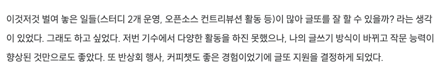
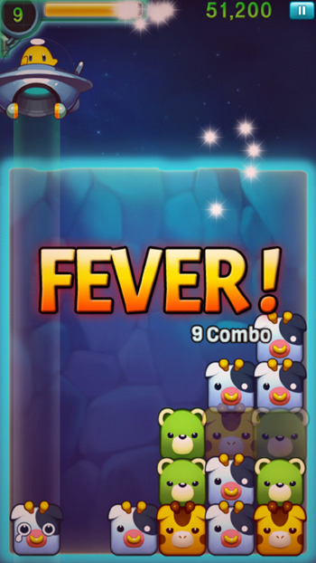
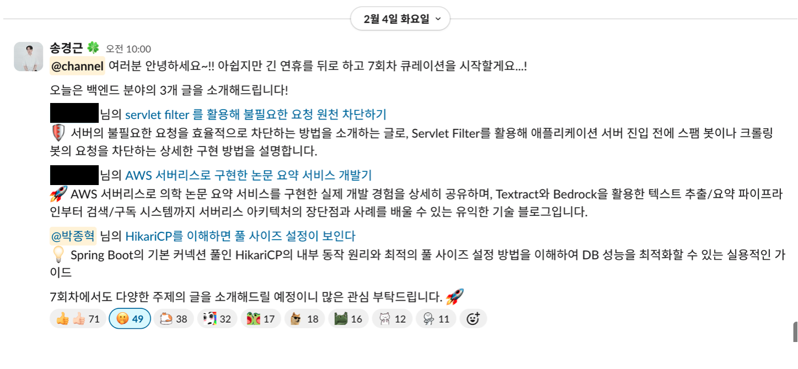
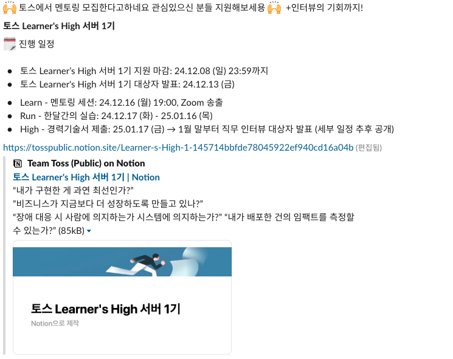
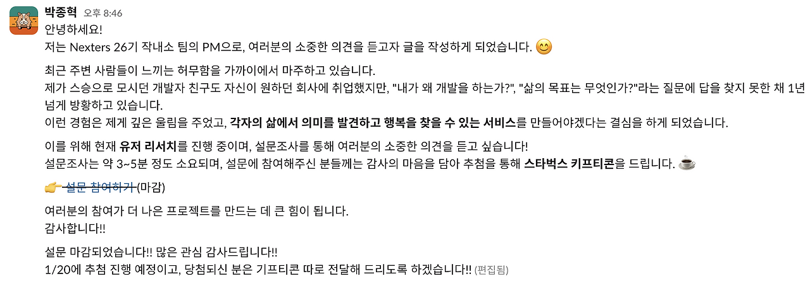

## 시작할 때의 마음

글또 9기가 좋았다.

커뮤니티에 속해 다른 사람들과 교류하고, 글을 쓰며 발전해나가는 내 모습이 마음에 들었다. 그래서 10기에도 참여했다.

마지막 글또를 시작하며 몇 가지 목표를 세웠었다.

1.  즐기기
2.  한 달에 한 명씩 알아가기
3.  일주일 앞서서 글 제출하기

그렇게 부담스럽지 않은 목표였다.

글또 9기 때처럼 매일 야근에 시달리고 있는 시기도 아니었기에, 이번엔 좀 더 여유롭게 할 수 있으리라 생각했다. 

게다가, 이번엔 회사 동료분과 함께 하는 활동이었기에 심리적 부담도 덜햇다.

'동료가 커뮤니티 활동에 참여하면 나도 껴야지\~'

'다른 활동에 참여할 때, 회사 분들에게 권유도 해봐야지\~'

그런 긍정적인 생각으로 시작했다.

하지만 우려했던 일이 결국 벌어지고 말았다.

"지금도 벌여 놓은 일이 많은데, 글또 커뮤니티 활동에 제대로 참여할 수 있을까?"

지원 전에 잠깐 스쳐 지나갔던 이 생각이, 현실이 되어버린 것이다.

*그 걱정은 현실이 되어버렸고...*

## 욕심이 너무 많았다

회사 일은 늘 많았다.

그 와중에 스터디 2개를 운영했고,

7월부터 12월까지는 오픈소스 컨트리뷰션,

12월부터 1월까지는 토스 러너스 하이,

그리고 1월부터 2월까지는 Nexters에서 PM으로 활동을 했다.

'이번 글또는 다를 거야. 더 적극적으로 참여해보자!'라는 포부와 달리, 현실은 주어진 일정조차 감당하기 벅찼다.

작년 하반기부터 올해 초는 내게 <strong>피버 타임</strong>이었다.

*콤보가 연속되면 피버타임이 온다 (출처: https://biz.heraldcorp.com/article/10300285)*

나에게 주어진 거의 모든 시간을 개발에 쏟았다.

머릿속에 뒤엉켜 있던 개발 지식들이 하나씩 퍼즐처럼 맞춰지며, 개발 지식에 한해 내 머리가 스펀지와 같은 흡수력을 가지는 시기였다. <strong>성장 경험치 2배 이벤트</strong>. 그 기회를 놓치기 싫어서, 할 수 있는 활동에 전부 도전해봤다.

공교롭게도

'그냥 한 번 넣어나 보자. 떨어지면 말고.'

그렇게 가볍게 지원했던 활동에도 모두 붙어버렸다.

'이 활동만 끝나면 글또 커뮤니티에 집중해보자'는 생각만 반복하며 일을 계속 벌였 놓았고, 결국 글또 커뮤니티 활동은 자연스럽게 우선순위에서 밀려났다. 심지어 이번 기수에서는 커피챗 한 번조차 하지 못했다. 

그 결과, "글 제출 일주일 앞서기" & "한달에 한 명씩 알아가기" 라는 목표들은 결국 실패로 남았다.

## 잘 즐기다 갑니다

그래도 첫번째 목표였던 "즐기기"는, 이건 확실히 달성했다.

커피챗은 아쉽게도 못 했지만, 백엔드 반상회에 참여해 다른 개발자 분들과 교류할 수 있었고, 우리 팀 채널방과 큐레이션 채널방에서 올라오는 글들도 슬쩍슬쩍 훔쳐(?) 보면서 도움도 많이 받았다.

Nexters 활동 당시 너무 바쁘던 시기엔 패스 2회를 쓰기도 했지만, <strong>한 번도 글을 미제출한 적은 없었다.</strong> 자투리 시간을 쪼개 글을 쓸 땐 <strong>부담</strong>보다는 되려 즐거움을 느꼈다. 내가 생각하는 "좋은 글"을 쓰기 위해 고민하고, 단어 하나하나 써내려가는 시간이 즐거웠다.

이번 기수 제출 현황은 아래와 같다.

✅ 1회차 제출 | [글또 10기 시작!](https://myvelop.tistory.com/244)

✅ 2회차 제출 | [SonarQube로 코드 품질 관리하기](https://myvelop.tistory.com/239)

✅ 3회차 제출 | [REST API 문서 자동화로 업무 효율 극대화하는 방법](https://myvelop.tistory.com/246)

✅ 4회차 제출 | [나만의 Swagger UI 서버, 쿠버네티스에서 운영하기](https://myvelop.tistory.com/247)

✅ 5회차 제출 | [Nexters 26기 지원 및 면접 후기](https://myvelop.tistory.com/248)

⏩ 6회차 패스

✅ 7회차 제출 | [HikariCP를 이해하면 풀 사이즈 설정이 보인다](https://myvelop.tistory.com/250) | <strong>큐레이션</strong>

✅ 8회차 제출 | [2024년 회고](/ko/blog/1/)

⏩ 9회차 패스

✅ 10회차 제출 | [기술과 관리 사이에서 (넥스터즈 26기 후기)](/ko/blog/2/) 

✅ 11회차 제출 | [당신의 메모리는 안녕하십니까?](/ko/blog/3/)

✅ 12회차 제출 | 마지막 글또

## 고마운 커뮤니티, 감사합니다

(글을 다 썼다는 가정하에) 돈 한 푼 내지 않고 이렇게 좋은 경험을 할 수 있는 커뮤니티가 또 있을까?

바쁜 와중에도 글을 꾸준히 쓸 수 있었던 이유는 글또 덕분이었다. 글쓰기가 나에게 변화를 만들어준다는 걸 느꼈기 때문일 것이다. 처음 9기를 시작할 땐 블로그에서 완전히 손을 놓고 있었는데, 이제는 좋은 글 소재가 떠오르면 블로그부터 열게 된다. (물론 작성하다 말고 쌓인 글도 많지만…)

특히 큐레이션 좋은 동기부여였다. 동료 개발자들에게 내가 생각하는 "좋은 글"을 보여줄 수 있다는 게 좋았다. 큐레이션에 선정됐을 땐 그렇게 뿌듯할 수가 없었다. 

*큐레이션은 못 참지\~*

토스 러너스 하이를 통해 나의 커리어를 성장시킬 수 있는 기회를 얻은 것도 글또 덕분이었다.

넥스터즈에서 PM 활동을 할 때는 글또 자유 홍보 채널에서 유저 리서치 설문을 올린 적이 있었는데, 정말 많은 분들이 참여해주신 덕분에 이틀 만에 100명 이상의 응답을 받았고 빠르게 기획을 진행할 수 있었다.

*유저 리서치*

글또는 나를 긍정적으로 변화시켜준, 너무나 고마운 커뮤니티였다.

운영진 분들, 그리고 변성윤님!

그동안 정말 감사했습니다.
