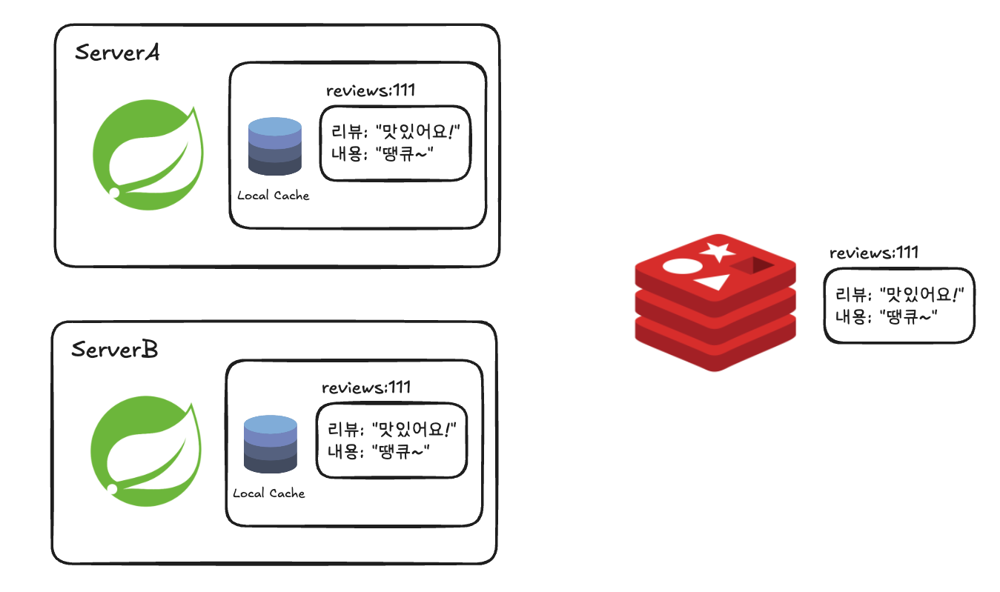
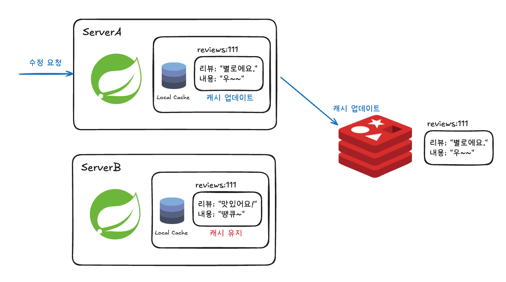
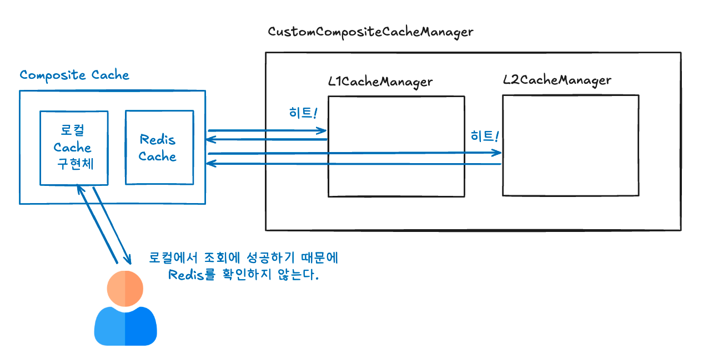
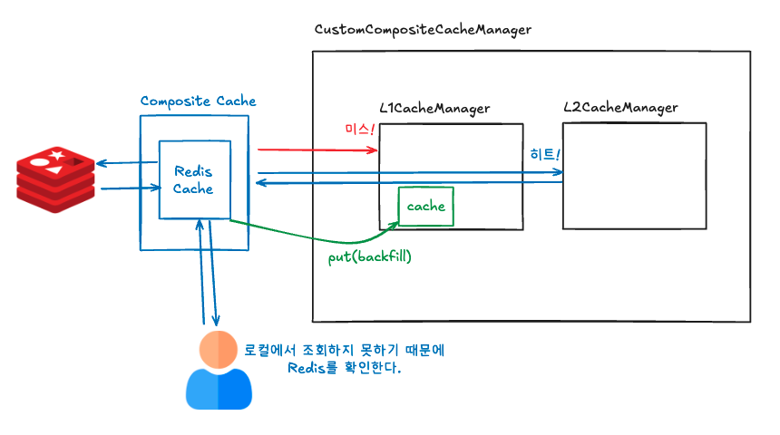
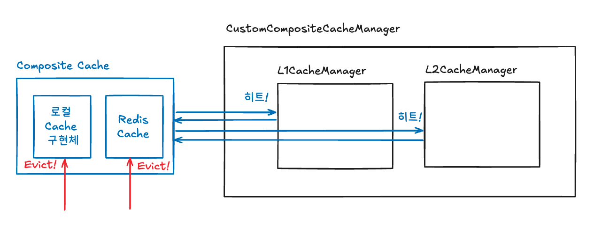
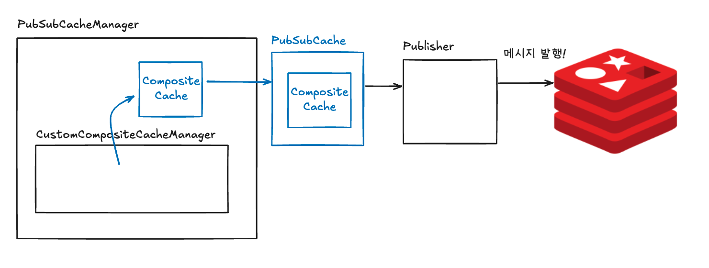
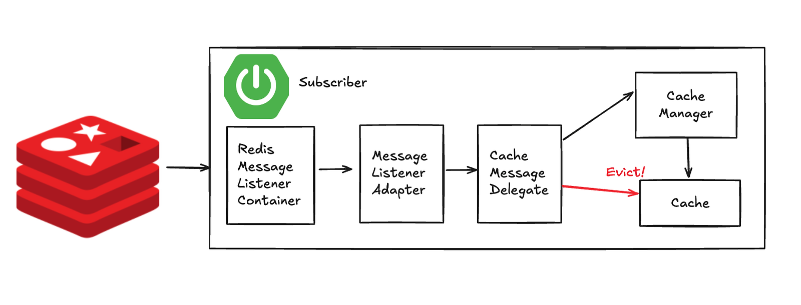

## 너무 느린 외부 API

우리 팀은 외부 시스템과의 연동 프로젝트를 진행하게 되었다. 요구사항은 간단해 보였다. "해당 일자에 주문이 가능한지 외부 API를 통해 확인할 수 있어야 한다." 하지만 실제로 구현해보니, 고객에게 정확한 정보를 전달하기 위해선 한 화면에서 40\~60건의 날짜별 배송 계획을 한 번에 조회해야 했다.

병렬 처리를 적용했음에도 불구하고 API 응답 시간은 <strong>500ms에서 1초</strong>, 심지어 요청이 여러 번 겹치면 그 이상 소요되었다. 연동사에서 제공해준 bulk API를 사용했는데 오히려 더 느려졌다.

사용자가 주문 가능 일자를 확인할 때마다 1초 이상을 기다려야 한다니, 이건 명백히 사용성에 심각한 문제였다.

우리는 데이터가 일자 단위로 예측 가능하고 실시간이 덜 중요하다는 점을 주목했다.

캐시 적용은 당연한 선택이었다.

### Redis 캐시 도입

Redis 캐시를 적용한 후, 성능은 확실히 개선되었다.

1초가 걸리던 API 호출이 50\~100ms로 줄어들었으니 약 10배 정도 빨라진 셈이었다.

하지만 여전히 뭔가 아쉬웠다.

> <strong>Redis 캐시 적용</strong>:       50 \~ 100ms  
> <strong>외부 API 직접 호</strong>출:   500ms \~ 1초

"왜 캐시를 적용했는데도 여전히 수십 밀리초가 걸릴까?"

답은 간단했다. <strong>아무리 빨라도 네트워크는 네트워크</strong>였던 것이다. Redis가 아무리 빠르다고 해도, 네트워크를 통해 데이터를 가져오고, 수십 건의 데이터를 직렬화/역직렬화하는 과정은 피할 수 없었다.

### 로컬 캐시의 등장

"그럼 애플리케이션 메모리에 캐시를 두면 어떨까?"

로컬 캐시(Caffeine)를 Redis 캐시 앞단에 추가했다. 결과는 놀라웠다.

> <strong>L1 Cache (로컬 메모리)</strong>:   \~10ms ⚡  
> <strong>L2 Cache (Redis)</strong>:             50\~100ms  
> <strong>외부 API 직접 호출</strong>:               500ms \~ 1초

로컬 캐시는 자바 Object를 메모리에 그대로 저장하기 때문에 네트워크 왕복과 JSON 파싱이 과정이 생략된다. 따라서 눈에 띄게 속도가 빨라진 것이다.

### 새로운 문제: 분산 환경의 딜레마

하지만 우리가 놓친 게 있다. 우리 서비스는 여러 대의 서버에서 동작하는 <strong>분산 시스템</strong>이었다.

문제 상황을 그려보면 아래와 같다.



이때 ServerA에서 리뷰를 수정했다고 해보자.



ServerA는 자신의 로컬 캐시를 비우고 새로운 값을 넣었지만, ServerB는 여전히 옛날 데이터를 가지고 있게 된다. 사용자가 어느 서버에 정보를 요청하느냐에 따라 다른 가격 정보를 보게 되는 것이다!

## 해결책?

캐시 무효화 이벤트를 모든 서버에 전파할 방법이 필요했다. 그리고 우리가 선택한 해결책은 <strong>Redis Pub/Sub</strong>이었다.

### Redis Pub/Sub은 무엇인가?

Redis Pub/Sub을 라디오 방송에 비유해보겠다.

DJ가 사연을 읽으면, 그 주파수에 맞춰놓은 모든 청취자가 동시에 같은 내용을 듣게 된다. 심지어 사연을 보낸 본인도 라디오를 켜놓았다면 자신의 사연을 듣게 된다.

Redis Pub/Sub도 똑같다.

-   <strong>Redis(<strong>방송국):</strong></strong> 메시지를 중간에서 받아 전달해주는 <strong>메시지 브로커(Message Broker)</strong> 역할
-   <strong>Publisher(사연자)</strong>: 메시지를 보내는 주체
-   <strong>Subscriber(청취자)</strong>: 특정 채널을 구독하고 메시지를 받는 주체
-   <strong>Channel(주파수)</strong>: 메시지가 전달되는 통로

### 왜 Redis Pub/Sub을 선택했을까?

Redis Pub/Sub을 사용하게된 이유는 아래와 같다.

1.  <strong>이미 Redis를 쓰고 있었다</strong>: 추가 인프라 없이 바로 사용 가능
2.  <strong>실시간 전파</strong>: 메시지 전달 지연이 거의 없음 (수십 ms 이내)
3.  <strong>간단한 구현</strong>: 복잡한 설정 없이 바로 적용 가능
4.  <strong>Fire-and-Forget</strong>: 메시지를 보내고 신경 쓸 필요 없음

## 구현해보기

### 1\. Spring CompositeCacheManager의 한계와 커스텀 구현

Spring이 제공하는 CompositeCacheManager은 여러모로 아쉬운 점이 많다.

CompositeCacheManager는 캐시 매니저를 List로 가지고 있으며, 캐시를 사용할 때 캐시 매니저 리스트를 순회하며 첫 번째로 발견되는 캐시만 반환한다. 그래서 아래와 같은 문제가 발생하게 된다.

-   <strong>캐시 간 동기화 없음</strong>: 각 캐시 매니저가 독립적으로 동작한다. Put이나 Evict을 해도 선택된 캐시에만 적용된다. L1/L2 캐시의 일관성이 깨진다는 말이다.
-   <strong>백필(Backfill) 미지원</strong>: L1 미스 → L2 히트 시, L2 데이터를 L1에 자동 저장하지 않음
    -   <strong>주의사항: Backfill은 캐시 TTL 문제 존재</strong>

Spring Github 이슈에서도 한 번 언급된 적이 있었다. 스프링 측의 답변은 명확했다. "CompositeCacheManager는 fallback 용이지 multi-level용이 아닙니다."

-   Gihub Issue: [Spring cache multiple level cache support](https://github.com/spring-projects/spring-framework/issues/23531)

따라서 우리는 요구사항에 맞는 캐시 매니저 구현체를 직접 구현하기로 결정했다.

데코레이터 패턴을 활용해봤다.

아래 코드를 보면 캐시를 반환할 때, CompositeCache라는 Cache 구현체로 감싸서 반환하는 것을 확인할 수 있다.

```java
@Component
public class CustomCompositeCacheManager implements CacheManager {
    private final List<CacheManager> cacheManagers;
    
    public CustomCompositeCacheManager(
        CacheManager l1CacheManager,
        CacheManager l2CacheManager) {
        // 순서 중요! L1 → L2 순으로 조회됨
        this.cacheManagers = List.of(l1CacheManager, l2CacheManager);
    }
    
    @Override
    public Cache getCache(String name) {
        List<Cache> caches = cacheManagers.stream()
            .map(manager -> manager.getCache(name))
            .filter(Objects::nonNull)
            .toList();
            
        return caches.isEmpty() ? null : new CompositeCache(caches);
    }
}
```

```java
// CompositeCache.java - 실제 Multi-Level 로직
public class CompositeCache implements Cache {
    private final List<Cache> caches;
    
    @Override
    public ValueWrapper get(Object key) {
        List<Cache> missedCaches = new ArrayList<>();
        
        for (Cache cache : caches) {
            ValueWrapper value = cache.get(key);
            if (value != null) {
                // 핵심! 상위 캐시들에 백필
                backfillCaches(key, value.get(), missedCaches);
                return value;
            }
            missedCaches.add(cache);  // 미스된 캐시 추적
        }
        return null;
    }
    
    private void backfillCaches(Object key, Object value, List<Cache> missedCaches) {
        // L1 미스 → L2 히트 시, L1에 자동 저장
        missedCaches.forEach(cache -> cache.put(key, value));
    }
    
    @Override
    public void put(Object key, Object value) {
        // Write-Through: 모든 레벨에 동시 저장
        caches.forEach(cache -> cache.put(key, value));
    }
    
    @Override
    public void evict(Object key) {
        // 모든 레벨에서 동시 제거
        caches.forEach(cache -> cache.evict(key));
    }
}
```

이제 커스텀 캐시 매니저로 L1/L2 캐시를 주입해서 빈으로 등록하면 끝이다.

L1을 로컬 캐시, L2를 글로벌 캐시로 설정해주면 된다.

```java
@Configuration
public class CacheConfig {
    
    @Bean
    @Primary
    public CacheManager cacheManager(
        @Qualifier("l1CacheManager") CacheManager l1,
        @Qualifier("l2CacheManager") CacheManager l2) {
        
        return new CustomCompositeCacheManager(l1, l2);
    }
}
```

이 구조를 그림으로 그려본다면 아래와 같다.

#### GET을 시도했을 때, L1/L2 캐시가 모두 존재하는 경우



#### GET을 시도했을 때, L2 캐시만 존재하는 경우



#### EVICT를 시도하면 모든 캐시 계층에 접근하여 삭제



### 2\. Redis Pub/Sub을 통한 캐시 정합성 보장

먼저 Redis 설정이 필요하다.

```java
@Configuration
public class RedisConfig {
    
    @Bean
    public RedisConnectionFactory pubSubConnectionFactory(RedisProperties properties) {
        LettuceConnectionFactory factory = new LettuceConnectionFactory(
            new RedisStandaloneConfiguration(properties.host(), properties.port()));
            
        // PubSub 전용 연결 풀 설정
        factory.setShareNativeConnection(false);
        return factory;
    }
    
    @Bean
    public RedisTemplate<String, String> pubSubRedisTemplate(
        RedisConnectionFactory connectionFactory) {
        RedisTemplate<String, String> template = new RedisTemplate<>();
        template.setConnectionFactory(connectionFactory);
        template.setDefaultSerializer(new StringRedisSerializer());
        return template;
    }
}
```

그리고 메세지를 전송할 Publisher를 선언한다.

```java
@Component
public class RedisPublisher implements MessagePublisher {
    private final RedisTemplate<String, String> redisTemplate;
    private final ObjectMapper objectMapper;
    
    @Override
    public void publish(String channel, Object message) {
        try {
            String json = objectMapper.writeValueAsString(message);
            redisTemplate.convertAndSend(channel, json);
            log.debug("Published message to channel: {}", channel);
        } catch (JsonProcessingException e) {
            // 발행 실패해도 로컬 캐시는 이미 무효화됨
            log.error("Failed to publish message", e);
        }
    }
}
```

그리고 메시지를 구독하는 부분을 만들어야 하는데 MessageListenerAdapter와 RedisMessageListenerContainer 이렇게 2개의 구현체를 활용할 것이다.

RedisMessageListenerContainer의 내부 동작은 아래와 같다.

-   <strong>초기화</strong>: Spring 컨텍스트 시작 시 Redis SUBSCRIBE 명령 실행
-   <strong>블로킹 리스닝</strong>: 별도 스레드에서 Redis 연결을 통해 메시지 대기
-   <strong>메시지 수신</strong>: Redis로부터 메시지 수신 시 TaskExecutor로 처리 위임
-   <strong>비동기 처리</strong>: 메시지마다 별도 스레드에서 리스너 호출
-   <strong>자동 재연결</strong>: 연결 끊김 시 자동으로 재구독 시도

```java
@Configuration
public class MessageConfig {

    @Bean
    public MessageListenerAdapter messageListenerAdapter(
        CacheMessageDelegate delegate) {
        // handleMessage 메서드로 메시지 라우팅
        return new MessageListenerAdapter(delegate, "handleMessage");
    }
    
    @Bean
    public RedisMessageListenerContainer messageListenerContainer(
        RedisConnectionFactory connectionFactory,
        MessageListenerAdapter listenerAdapter) {
        
        RedisMessageListenerContainer container = new RedisMessageListenerContainer();
        container.setConnectionFactory(connectionFactory);
        
        // 에러 핸들러 설정
        container.setErrorHandler(throwable -> log.error("Error in message listener", throwable));
        
        // 구독할 채널 등록
        container.addMessageListener(
            listenerAdapter, 
            new ChannelTopic("cache:evict")
        );        
        return container;
    }
}
```

CacheMessageDelegate를 통해 구독한 메시지를 수신하여 Eviction 동작을 실행하게 만들 것이다.

```java
@Component
public class CacheMessageDelegate {
    private final CacheManager l1CacheManager;
    private final ObjectMapper objectMapper;
    private final String serverId = UUID.randomUUID().toString();
    
    public void handleMessage(String message, String channel) {
        try {
            // 1. JSON 파싱
            CacheMessage cacheMessage = objectMapper.readValue(
                message, CacheMessage.class);
            
            // 2. 자기 메시지 필터링 (무한 루프 방지!)
            if (serverId.equals(cacheMessage.getSenderId())) {
                log.debug("Ignoring self message");
                return;
            }
            
            // 3. L1 캐시에서만 무효화 (L2는 이미 최신 상태)
            Cache l1Cache = l1CacheManager.getCache(cacheMessage.getCacheName());
            if (l1Cache != null) {
                l1Cache.evict(cacheMessage.getKey());
            }
            
        } catch (Exception e) {
            // 메시지 처리 실패해도 다음 메시지는 계속 처리
            log.error("Failed to handle cache message", e);
        }
    }
}
```

```java
public record CacheMessage(
	String senderId, 
    String cacheName, 
    String key, 
    Object value) {}
```

Redis Pub/Sub을 사용하기 위한 준비는 다 끝났다.

이제 메시지 발행을 어떻게 할 것인지만 결정하면 된다.

메시지 퍼블리싱은 다양한 방법으로 구현해볼 수 있겠지만, 여기서는 데코레이터 패턴을 통해 구현할 것이다.

PubSubCache라는 Cache구현체로 캐시를 감싸서 메시지를 퍼블리싱하도록 했다.

```java
public class PubSubCache implements Cache {

    private final Cache delegate;  // 실제 캐시
    private final MessagePublisher publisher;
    
    @Override
    public void evict(Object key) {
        // 1. PubSub 메시지 발행
        publishEvictMessage(key);
        
        // 2. 실제 캐시에서 제거
        delegate.evict(key);
    }
    
    private void publishEvictMessage(Object key) {
        publisher.publish(
        	"cache:evict", // 채널 이름
            new CacheMessage(MessageConfig.getSenderId(), delegate.getName(), key.toString()));
    }
    
    // ...
}
```

캐시 매니저 또한 PubSubCacheManager로 감싸, 캐시 매니저가 PubSubCache를 통해 메시지를 발행할 수 있도록 구성한다.

```java
public class PubSubCacheManager implements CacheManager {

  private final CacheManager cacheManager;
  private final MessagePublisher messagePublisher;

  public PubSubCacheManager(
      final CacheManager cacheManager, final MessagePublisher messagePublisher) {
    this.cacheManager = cacheManager;
    this.messagePublisher = messagePublisher;
  }

  @Override
  public Cache getCache(final String name) {
    return new PubSubCache(cacheManager.getCache(name), messagePublisher);
  }

  @Override
  public Collection<String> getCacheNames() {
    return cacheManager.getCacheNames();
  }
}
```

이제 CacheConfig에서 데코레이터로 감싸진 캐시 매니저를 사용하도록 설정하면 끝이다.

```java
@Configuration
public class CacheConfig {
    
    @Bean
    @Primary
    public CacheManager cacheManager(
        @Qualifier("l1CacheManager") CacheManager l1,
        @Qualifier("l2CacheManager") CacheManager l2,
        CircuitBreaker circuitBreaker,
        MessagePublisher publisher) {
        
        // 1. 기본 Multi-Level 캐시
        CacheManager composite = new CustomCompositeCacheManager(l1, l2);
        
        // 2. PubSub 기능 추가
        CacheManager withPubSub = new PubSubCacheManager(composite, publisher);
        
        return withPubSub;
    }
}
```

이미지로 도식화하면 아래와 같은 플로우처럼 메시지 발행 및 구독이 이뤄질 것이다.

#### 메시지 발행



#### 메시지 구독



## 성과와 교훈

### 최종 성과

> <strong>초기 상태</strong>:                500ms \~ 1초  
> <strong>Redis 캐시 적용</strong>:     50 \~ 100ms (10배 개선)  
> <strong>로컬 캐시 추가</strong>:      \~10ms (추가 5\~10배 개선)  
>   
> <strong>최종 개선율</strong>:             50\~100배 🚀

### Trade-off

Redis Pub/Sub은 메시지 순서를 보장하지 않고, 메시지가 유실될 수 있다.

하지만 캐시의 순서가 바뀔 정도로 업데이트가 잦지 않았고, TTL로 최종 일관성이 보장할 수 있었기 때문에 Redis Pub/Sub으로 충분하다고 생각했다.

### 마치며: 여러분의 상황에 맞는 선택

우리가 Redis Pub/Sub을 선택한 이유는

-   이미 Redis를 사용 중이었고
-   구현이 간단해 빠르게 도입할 수 있었으며,
-   완벽한 일관성보다는 성능이 우선이었기 때문이다.

만약 상황이 다르다면, 다른 선택지도 충분히 고려해봐야 한다.

-   <strong>Kafka</strong>: 내구성/재처리/순서 중요, 소비 지연 허용
-   <strong>RabbitMQ</strong>: 복잡한 라우팅이 필요
-   <strong>Hazelcast</strong>: JVM 통합

질리도록 듣는 얘기겠지만 기술 선택에 정답은 없다. 현재 상황과 제약사항을 잘 파악하고, Trade-off를 고려해서 <strong>"지금 우리에게 가장 적합한"</strong> 기술을 선택하는 것이 중요하다.
