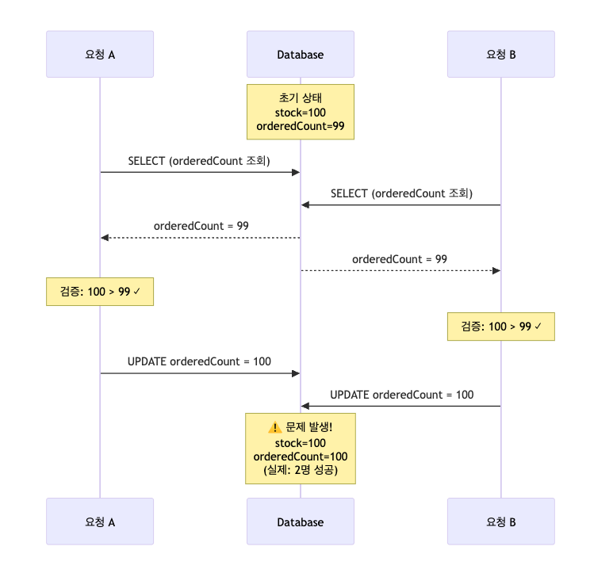
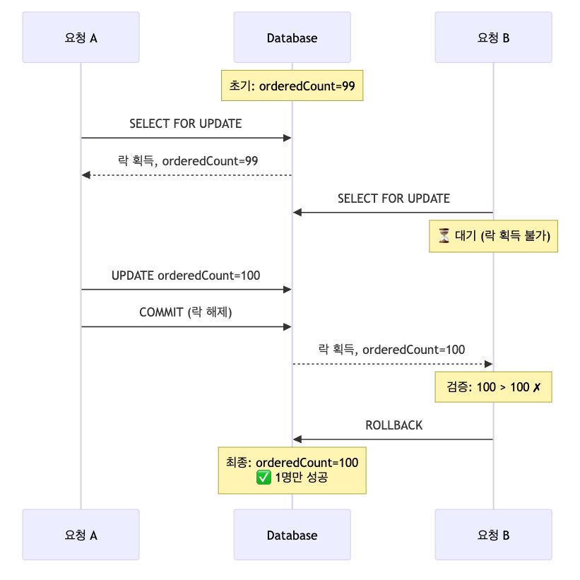
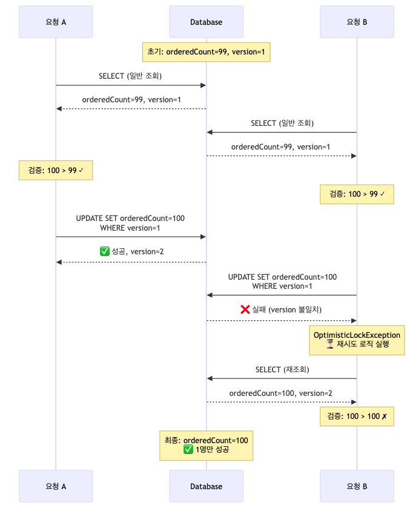
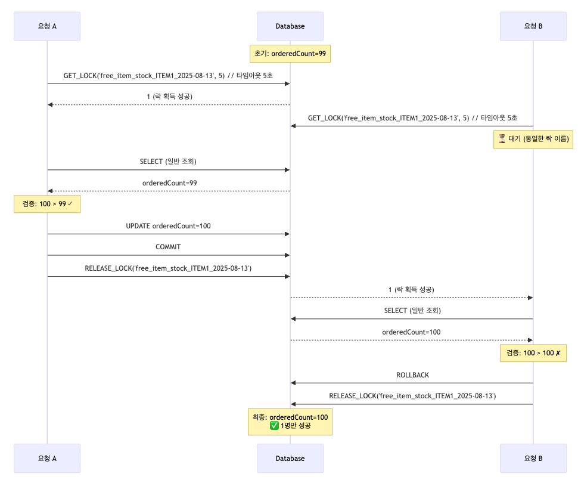
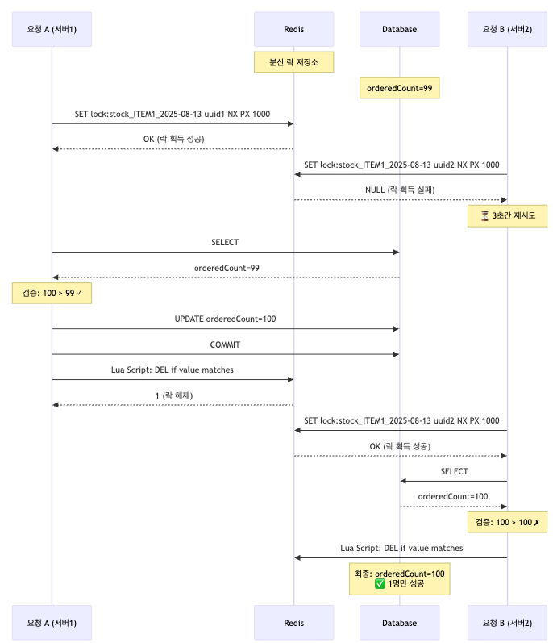
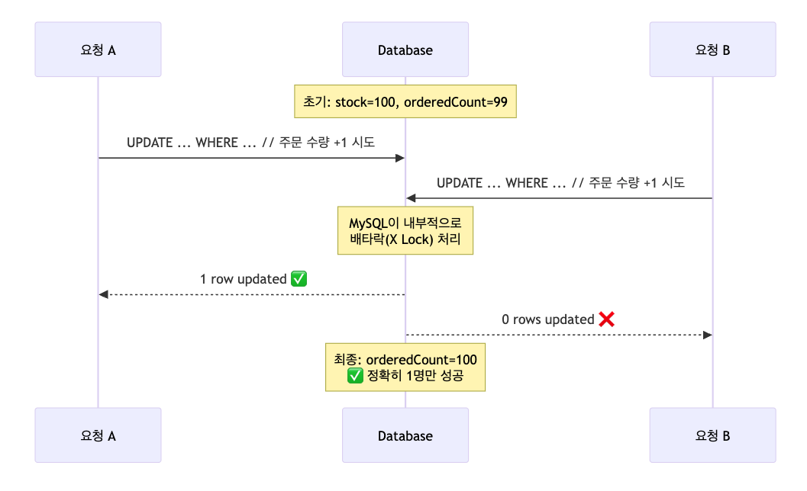
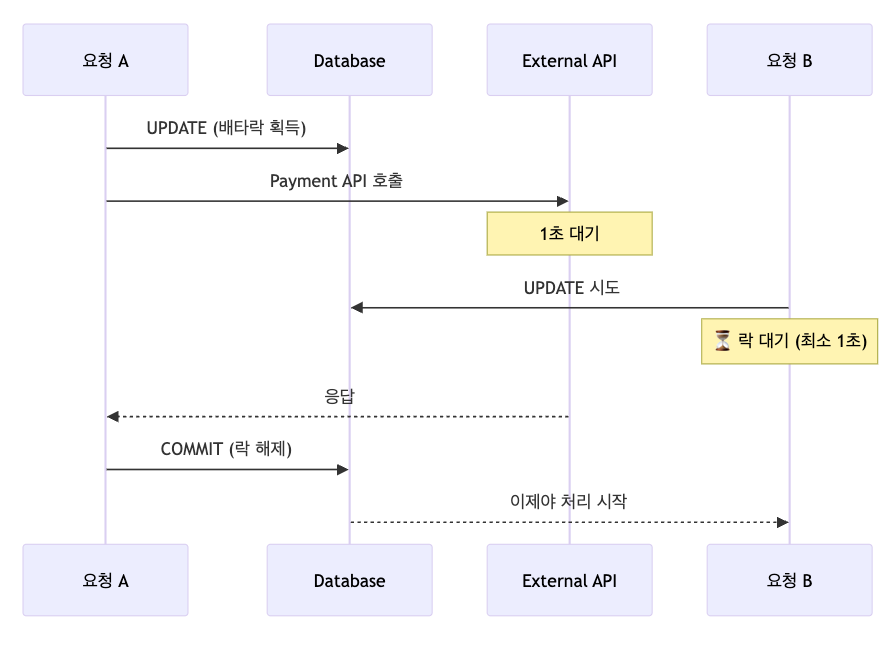

선착순 이벤트 시스템을 설계한다고 가정해보자. 요구사항은 아래와 같다.

#### <strong>요구사항:</strong>

-   매일 제한된 수량의 무료 체험 제공
-   선착순 N명 정확히 선정
-   1명만 1개만 주문 가능
-   동시 요청 처리 필수
-   일별 재고 수량 기록 필요
-   단일 데이터베이스 시스템, 여러 개의 서버 컨테이너

가장 중요한 것은 <strong>동시성 제어</strong>이다.

100개의 재고가 있을 때 동시에 1,000명이 요청하면 어떻게 정확히 100명에게만 제공할 수 있을까?

이때 일반적으로 제시되는 해결책들은 아래와 같다.

-   비관적 락(SELECT FOR UPDATE)
-   낙관적 락(JPA @Version)
-   데이터베이스 네임드 락
-   Redis 분산 락

하지만 단일 데이터베이스 환경에서 분산 락은 오버엔지니어링일 수 있고, 낙관적 락은 재시도 로직이 복잡하며, 비관적 락은 대기 시간이 길어질 수 있다.

이 글에서는 <strong>MySQL의 UPDATE 쿼리와 배타락을 활용한 간단하면서도 효과적인 방법</strong>을 소개하고, 각 방법들의 트레이드오프를 분석해보겠다.

## 문제 상황 구체화

### 데이터 모델 소개

먼저 데이터 모델을 소개하겠다.

```java
@Entity
public class FreeItemStock {
    private String itemType;         // 상품 종류
    private LocalDate date;          // 날짜
    private Integer stock;           // 제공 개수 (비즈니스 분석용)
    private Integer orderedCount;    // 주문된 수량 
}
```

일별로 무료 상품을 제공하기 때문에 date 필드가 포함되어 있다.

요구사항에서 "일별 재고 수량 기록 필요"가 있었기 때문에, stock은 초기 설정 후 변경하지 않고 유지한다. 대신 주문 요청이 들어올 때마다 orderedCount를 증가시켜 실제 주문된 수량을 추적하는 방식으로 구현할 것이다.

### 동시성 문제 발생

이제 동시성 제어 없이 구현한다면 어떤 일이 발생할까?

```java
public void claimFreeItem(String itemType, LocalDate date) {
    // 1. 현재 재고 조회
    FreeItemStock stock = repository.findByItemTypeAndDate(itemType, date);
    
    // 2. 재고 확인 (초기 재고 - 주문된 수량)
    if (stock.getStock() > stock.getOrderedCount()) {
        // 3. 주문 수량만 증가
        stock.setOrderedCount(stock.getOrderedCount() + 1);
        repository.save(stock);
    }
}
```



두 요청이 거의 동시에 들어오면 둘 다 orderedCount를 99로 읽고, 둘 다 주문에 성공한다.

<strong>재고는 1개였지만 2명이 상품을 받아가는</strong> 심각한 문제가 발생한다.

## 일반적인 해결책들과 한계

### 1\. 비관적 락 (SELECT ... FOR UPDATE)

비관적 락은 데이터를 읽을 때부터 락을 걸어 다른 트랜잭션이 접근하지 못하도록 한다.

Spring Data JPA에서 비관적 락을 구현하는 방법은 아래와 같다.

@Lock 어노테이션과 LockModeType을 활용하면 JPA가 자동으로 SELECT ... FOR UPDATE 쿼리를 생성한다.

```java
@Repository
public interface FreeItemStockRepository extends JpaRepository<FreeItemStock, Long> {
    
    @Lock(LockModeType.PESSIMISTIC_WRITE)
    @Query("SELECT s FROM FreeItemStock s WHERE s.itemType = :itemType AND s.date = :date")
    FreeItemStock findByItemTypeAndDateForUpdate(
        @Param("itemType") String itemType, @Param("date") LocalDate date);
}
```

아래 시퀀스를 보면 비관적 락의 특징이 명확히 드러난다. 요청 A가 먼저 SELECT FOR UPDATE로 데이터를 조회하면서 락을 획득하면, 요청 B는 같은 데이터에 접근하려 해도 <strong>락이 해제될 때까지 대기</strong>해야 한다.

요청 A가 트랜잭션을 커밋하고 락을 해제한 후에야 요청 B가 데이터에 접근할 수 있다. 이때 이미 orderedCount가 100이 되어 재고가 소진되었으므로 요청 B는 주문에 실패한다.



이 방식은 동시성 제어가 확실하지만, <strong>모든 요청이 순차적으로 처리</strong>되어야 한다는 단점이 있다.

✅ 데이터 일관성 보장 확실

✅ 구현이 직관적

✅ 완벽한 순서 보장

❌ <strong>긴 대기 시간</strong>: 락을 기다리는 동안 스레드 블로킹

❌ <strong>데드락 위험</strong>: 여러 자원에 대한 락 순서가 다를 경우

❌ <strong>처리량 저하</strong>: 순차 처리로 인한 성능 하락

### 2\. 낙관적 락 (Versioning)

낙관적 락은 실제로 데이터를 수정하는 시점에 충돌을 감지하는 방식이다.

JPA의 @Version 어노테이션을 사용하여 구현할 수 있다.

```java
@Entity
public class FreeItemStock {
    private String itemType;
    private LocalDate date;
    private Integer stock;
    private Integer orderedCount;
    
    @Version
    private Long version;  // 낙관적 락을 위한 버전 필드
}
```

낙관적 락은 재시도 로직이 필요하다.

```java
@Service
@RequiredArgsConstructor
public class FreeItemService {
    private final FreeItemStockRepository repository;
    
    @Retryable(
        value = {OptimisticLockException.class},
        maxAttempts = 3,
        backoff = @Backoff(delay = 50)
    )
    @Transactional
    public FreeItemStock claimFreeItemWithOptimisticLock(String itemType, LocalDate date) {
        FreeItemStock stock = repository.findByItemTypeAndDate(itemType, date);
        
        if (stock.getStock() <= stock.getOrderedCount()) {
            throw new OutOfStockException("재고가 소진되었습니다");
        } 
        stock.setOrderedCount(stock.getOrderedCount() + 1);
        repository.save(stock);  // 버전 불일치 시 OptimisticLockException 발생
    }
    
    // 재시도 실패 시 처리
    @Recover
    public void recover(OptimisticLockException e, String itemType, LocalDate date) {
        throw new RuntimeException("동시 요청이 많아 처리할 수 없습니다. 잠시 후 다시 시도해주세요.", e);
    }
}
```

낙관적 락의 동작 과정을 살펴보면, 두 요청이 <strong>동시에 데이터를 조회</strong>할 수 있다는 점이 비관적 락과의 큰 차이이다. 하지만 UPDATE 시점에 버전 체크를 통해 충돌을 감지한다.

요청 A가 먼저 UPDATE에 성공하면 version이 1에서 2로 증가한다. 요청 B가 뒤이어 UPDATE를 시도하지만, WHERE 조건의 <strong>version이 더 이상 맞지 않아 업데이트가 실패</strong>하고 OptimisticLockException이 발생한다.



#### 선착순 시스템에서 낙관적 락이 부적합한 이유

낙관적 락이 적합한 상황은 아래와 같다.

-   충돌이 드물게 발생하는 환경 (읽기가 많고 쓰기가 적은 경우)
-   사용자가 폼을 작성하는 동안 다른 사용자의 수정을 방지해야 할 때
-   긴 시간 동안 락을 유지하기 어려운 경우

그런데 선착순 이벤트는 <strong>동시에 많은 사용자가 같은 데이터를 수정</strong>하려고 시도한다.

100명 한정 이벤트에 수백 명이 동시 접속하면 대부분의 요청이 충돌하게 되고, <strong>재시도가 반복되면서 오히려 성능이 저하</strong>될 것이다.

✅ 동시 읽기 가능 (락 대기 없음)

✅ 데드락 위험 없음

❌ <strong>재시도 로직 필수</strong>: 추가 설정과 예외 처리 필요

❌ <strong>충돌이 잦으면 비효율적</strong>: 재시도가 반복되면 오히려 성능 저하

❌ <strong>버전 관리 부담</strong>: 엔티티에 version 필드 추가 필요

❌ <strong>불필요한 쿼리 반복</strong>: 재시도마다 SELECT 쿼리 실행

❌ <strong>순서 보장 어려움</strong>: 재시도가 뒤엉켜 순서가 보장되지 않을 수 있다.

### 3\. 네임드 락

네임드 락은 MySQL이 제공하는 사용자 정의 락으로, 임의의 문자열을 기준으로 락을 생성할 수 있다.

비관적 락은 특정 로우에만 락을 걸 수 있지만, 네임드 락은 더 유연한 범위 설정이 가능하다. 예를 들어 "특정 사용자의 모든 주문 처리"처럼 여러 테이블에 걸친 작업을 하나의 락으로 제어할 수 있다.

아래 2개의 Function을 기반으로 네임드 락 동시성 제어를 구성할 수 있다.

-   GET\_LOCK('lockname', timeout): 네임드 락 획득
-   RELEASE\_LOCK('lockname'): 네임드 락 해제

#### 네임드 락의 특징

-   <strong>트랜잭션과 독립적</strong>: 트랜잭션이 커밋/롤백되어도 락은 유지됩니다. 명시적으로 해제해야 한다.
-   <strong>문자열 기반</strong>: 테이블이나 로우가 아닌, 개발자가 정의한 문자열을 기준으로 락을 생성한다.
-   <strong>세션 단위 관리</strong>: 락은 MySQL 세션(커넥션) 단위로 관리되며, 세션이 종료되면 자동 해제된다.
-   <strong>전역 범위</strong>: 데이터베이스 전체에서 동일한 이름의 락은 하나만 존재할 수 있다.

#### 동작

편의상 구현은 생략하고 동작 원리만 설명하도록 하겠다.

요청 A가 GET\_LOCK()으로 특정 이름의 락을 획득합니다. 이때 <strong>타임아웃을 5초로 설정</strong>했으므로, 락 획득을 위해 최대 5초까지 기다린다.

요청 B가 동일한 이름의 락을 요청하면, 요청 A가 락을 해제할 때까지 대기한다. 만약 5초가 지나도 락을 획득하지 못하면 0을 반환하며 실패한다.

중요한 점은 <strong>트랜잭션 커밋과 락 해제가 별개</strong>라는 것이다. 요청 A가 트랜잭션을 커밋해도 락은 유지되며, RELEASE\_LOCK()을 명시적으로 호출해야 락이 해제된다. 이후 대기 중이던 요청 B가 락을 획득하지만, 이미 재고가 소진되어 주문에 실패한다.



✅ 유연한 락 범위 설정 가능

✅ 트랜잭션과 독립적으로 동작

❌ <strong>수동 락 관리</strong>: 락 해제를 놓치면 누수가 발생

❌ <strong>MySQL 종속적</strong>: 다른 DB로 전환 시 코드 수정 필요

❌ <strong>별도 커넥션 필요</strong>: 락 관리용 추가 DB 커넥션 필요

❌ <strong>복잡한 에러 처리</strong>: 락 획득 실패, 타임아웃 등 처리

❌ <strong>커넥션 풀 고갈 위험</strong>: 락을 기다리는 동안 커넥션을 점유

### 4\. Redis 분산 락

Redis 분산 락은 <strong>SET NX(Not eXists)</strong> 명령어를 사용하여 원자적으로 락을 획득한다. NX 옵션은 키가 존재하지 않을 때만 설정하고, PX 1000은 1초(1000ms) 후 자동 만료를 의미한다.

<strong>TTL이 설정되어 있어</strong> 프로세스가 비정상 종료되어도 지정된 시간 후 자동으로 락이 해제된다. 서로 다른 애플리케이션 서버에서 실행되는 요청들도 Redis를 통해 동시성을 제어할 수 있다는 것이 가장 큰 장점이다.

#### 동작

Redis를 통한 분산 락 동작도 편의상 구현은 생략하고 (Redisson을 사용했다고 가정하고) 동작 원리만 설명하도록 하겠다.

요청 A가 락을 획득하면, 요청 B는 락 획득에 실패하고 재시도 로직을 실행한다. DB 작업이 완료되면 Redisson은 <strong>Lua 스크립트를 사용하여 원자적으로</strong> 락을 해제한다. 이는 자신이 설정한 락만 해제하도록 보장한다.



여기서 주의할 점이 있다.

SET NX를 사용할 경우 선착순이 보장되지 않아, 선착순 요구사항을 만족하지 못하게 된다.

그렇다면 Fair Lock을 사용해야 한다. 대기 큐를 구현하여 순서를 보장해야 하고, 그로 인해 오버헤드가 발생할 수 있다.

✅ 분산 환경에서 효과적

✅ 메모리 기반의 높은 성능

✅ 데드락 방지

❌ <strong>추가 인프라 필요</strong>: Redis 클러스터 구축/운영

❌ <strong>네트워크 오버헤드</strong>: 매 요청마다 Redis 통신

❌ <strong>복잡한 에러 처리</strong>: Redis 장애, 네트워크 단절 대응

❌ <strong>트랜잭션 문제</strong>: Redis와 DB 간 트랜잭션 보장 어려움

## UPDATE WHERE 배타락

### 단순하지만 강력한 해결책

지금까지 살펴본 방법들은 각각 장단점이 있었다. 비관적 락은 대기 시간이 길고, 낙관적 락은 재시도 로직이 복잡하며, 네임드 락은 관리가 번거롭고, Redis는 추가 인프라가 필요하다.

그런데 <strong>MySQL의 UPDATE 쿼리 하나로</strong> 이 모든 문제를 해결할 수 있다면 어떨까?

```sql
UPDATE free_item_stock 
SET ordered_count = ordered_count + 1
WHERE item_type = :itemType 
  AND date = :date 
  AND stock > ordered_count;
```

WHERE 절의 조건이 만족할 때만 UPDATE가 실행되고, <strong>UPDATE 자체가 원자적 연산</strong>이므로 동시성 문제가 발생하지 않는다.

애플리케이션의 구현도 훨씬 간단해진다.

```java
@Service
@RequiredArgsConstructor
public class FreeItemService {
    private final FreeItemStockRepository repository;
    
    @Transactional
    public void claimFreeItem(String itemType, LocalDate date) {
        int updatedCount = repository.incrementOrderedCount(itemType, date);
        
        if (updatedCount == 0) {
            throw new OutOfStockException("재고가 소진되었습니다");
        }
    }
}
```

```java
@Repository
public interface FreeItemStockRepository extends JpaRepository<FreeItemStock, Long> {
    
    @Modifying
    @Query("""
        UPDATE FreeItemStock s 
        SET s.orderedCount = s.orderedCount + 1 
        WHERE s.itemType = :itemType 
          AND s.date = :date 
          AND s.stock > s.orderedCount
    """)
    int incrementOrderedCount(
    	@Param("itemType") String itemType, @Param("date") LocalDate date);
}
```

MySQL은 UPDATE 문을 실행할 때 다음과 같은 과정을 거친다.

1.  <strong>WHERE 절 평가</strong>: 조건에 맞는 로우를 찾는다.
2.  <strong>배타락 획득</strong>: 해당 로우에 자동으로 배타락(X Lock)을 건다.
3.  <strong>UPDATE 실행</strong>: 값을 변경한다.
4.  <strong>커밋 시 락 해제</strong>: 트랜잭션 커밋 시 락이 해제된다.

따라서 두 요청이 동시에 들어와도 MySQL이 내부적으로 순서를 보장한다.

첫 번째 UPDATE가 성공하면 orderedCount가 100이 되고, 두 번째 UPDATE는 WHERE 조건(stock > orderedCount, 즉 100 > 100)을 만족하지 못해 0 rows를 반환하게 된다.



✅ <strong>코드가 단순</strong>: 재시도 로직, 락 관리 코드 불필요

✅ <strong>성능 최적화</strong>: SELECT 없이 UPDATE 한 번으로 끝

✅ <strong>자동 동시성 제어</strong>: MySQL이 알아서 처리

✅ <strong>롤백 자동 처리</strong>: 트랜잭션 롤백 시 자동 복구

✅ <strong>추가 인프라 불필요</strong>: Redis, 별도 커넥션 불필요

❌ 복잡한 비즈니스 로직에는 부적합할 수 있음

❌ UPDATE 결과만으로 판단 (상세한 실패 이유 파악 어려움)

### Redis 분산 락과 비교

#### DB 배타락이 더 나은 경우

-   데이터 일관성 (ACID 보장)
-   네트워크 오버헤드 최소화 (1번의 쿼리로 해결)
-   기존 인프라 활용하여 운영 복잡도를 줄이고 싶을 때

#### Redis가 더 나은 경우

-   초고속 처리가 필요한 경우 (마이크로초 단위)
-   대규모 동시 접근 (수만 TPS)
-   분산 락이 필요한 마이크로서비스 환경, 여러 데이터베이스 간 동시성 제어

## 유의사항

### 인덱스 설계 전략

UPDATE WHERE 방식의 성능을 극대화하려면 <strong>인덱스 설계가 필수</strong>다. MySQL의 InnoDB 스토리지 엔진은 데이터의 일관성과 무결성을 지키기 위해 인덱스를 기준으로 넥스트 키 락을 거는데, <strong>만약 인덱스가 없다면 테이블 전체에 락을 걸어버리기 때문에 성능이 크게 저하될 수 있다.</strong>

적절한 인덱스 설정은 락의 범위를 최소화하기에 바람직하다.

<strong>1\. WHERE 절 분석</strong>

-   item\_type = :itemType (등호 조건)
-   date = :date (등호 조건)
-   stock > ordered\_count (범위 조건)

<strong>2\. 인덱스 컬럼 순서 결정 원칙</strong>

복합 인덱스에서 컬럼 순서는 성능에 절대적인 영향을 미친다.

-   <strong>1순위: 등호(=) 조건 컬럼들</strong>
    -   조회 범위를 가장 효과적으로 좁혀준다.
    -   item\_type, date가 여기에 해당

-   <strong>2순위: 범위(<, >) 조건 컬럼</strong>
    -   등호 조건으로 범위를 좁힌 후 추가 필터링
    -   stock > ordered\_count 조건에서 활용

<strong>3\. 카디널리티(Cardinality) 고려</strong>

등호 조건 컬럼들 간의 순서는 <strong>중복도</strong>에 따라 결정한다. 중복도가 낮은 컬럼(카디널리티가 높은 컬럼)을 먼저 오게 하면 된다.

아래와 같이 조회했는데 상품의 종류가 10, 날짜가 1,000이라고 해보자. 그렇다면 date가 먼저 오게 해야 한다.

```sql
SELECT 
    COUNT(DISTINCT item_type) as item_type_cardinality,
    COUNT(DISTINCT date) as date_cardinality
FROM free_item_stock;
```

가장 적합해 보이는 복합 인덱스는 (date, item\_type, stock) 이다.

### 커버링 인덱스 문제

성능을 높여 보겠다고 커버링 인덱스를 고려할 수도 있다. (date, item\_type, stock, ordered\_count)

하지만 경우에 따라 UPDATE 문의 성능이 오히려 나빠질 수 있다. 

```sql
EXPLAIN UPDATE free_item_stock 
SET ordered_count = ordered_count + 1
WHERE item_type = 'ITEM1' 
  AND date = '2025-08-13' 
  AND stock > ordered_count;
```

| id | select_type | ... | Extra |
| --- | --- | --- | --- |
| 1 | UPDATE | ... | Using where; Using temporary |

Using temporary. 임시 테이블을 만들었다는 얘기다. 왜 일까?

커버링 인덱스는 SELECT 쿼리에서는 탁월한 성능을 보인다. 조회할 필드와 검색 조건이 모두 인덱스에 포함되어 있다면, 실제 테이블에 접근하지 않고 인덱스만으로 결과를 반환할 수 있기 때문이다.

하지만 UPDATE 문에서는 상황이 다르다. 인덱스를 통해 조건에 맞는 로우를 찾았더라도, 결국 실제 테이블의 데이터를 수정해야 한다. 이 과정에서 MySQL은 인덱스에서 찾은 정보를 임시 테이블에 저장한 후, 이를 기반으로 실제 테이블을 업데이트한다.

이러한 임시 테이블 생성은 추가적인 메모리와 CPU를 사용하므로 오버헤드가 발생한다. 특히 예제처럼 카디널리티가 높은 경우, 즉 업데이트할 로우를 정확히 특정할 수 있는 경우, 임시 테이블 생성이 오히려 성능을 악화시킬 수 있다.

### Transaction 문제

UPDATE WHERE 방식이 아무리 효율적이어도, 트랜잭션 관리를 잘못하면 모든 장점이 무너진다.

UPDATE 쿼리가 실행되는 순간 해당 로우에 배타락이 걸린다. 하지만 트랜잭션이 끝날 때까지 락이 유지되므로 만약 시간이 오래 걸리는 작업과 같은 트랜잭션에 묶여 있다면 다른 요청들이 모두 대기하게 된다.



## 결론

### 기술 선택 기준

동시성 제어 방법을 선택할 때 고려해야 할 질문들

-   <strong>분산 환경인가?</strong>
-   <strong>충돌이 얼마나 자주 발생하는가?</strong>
-   <strong>순서 보장이 중요한가?</strong>
-   <strong>팀의 기술 스택은 무엇인가?</strong>

### 오버엔지니어링을 피하자

이 글에서 소개한 UPDATE WHERE 방식이 모든 상황에 적합한 것은 아니다.

복잡한 비즈니스 로직이나 여러 테이블에 걸친 작업, 실제 분산 환경에서는 다른 해결책이 필요할 수 있다.

하지만 많은 경우, 특히 단순한 요구사항에서는 데이터베이스가 제공하는 기본 기능만으로도 충분하다.

화려한 기술 스택보다는 <strong>문제의 본질을 정확히 파악하고 적절한 해결책을 선택하는 것</strong>이 중요하다고 생각한다.

<strong>간단한 동시성 문제. UPDATE 한 줄로 끝내자.</strong>

## 동시성 처리 시리즈

-   [처음부터 다시 배우는 Java 동시성 제어](/ko/blog/11/)
-   UPDATE 한 줄로 끝내는 동시성 문제
-   [좋아요 기능으로 알아보는 넥스트 키 락](/ko/blog/12/)
-   [Lettuce 분산 락의 오해와 진실](/ko/blog/9/)
-   [AOP로 동시성 처리 코드 분리하기](/ko/blog/13/)
