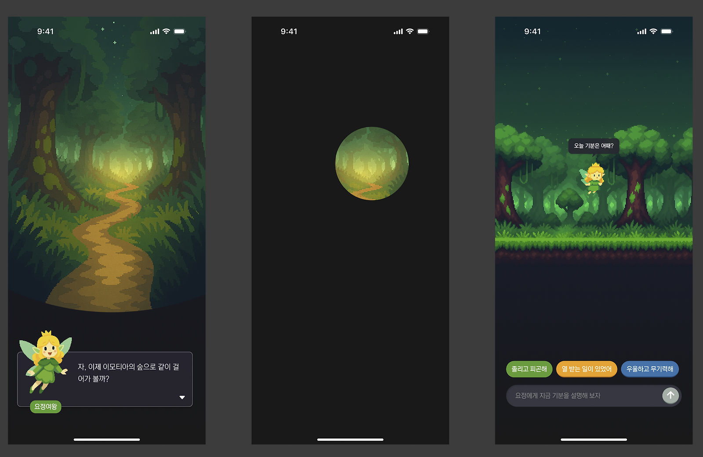
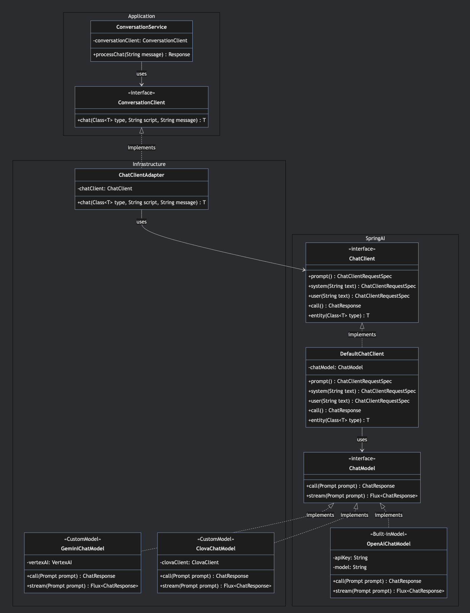
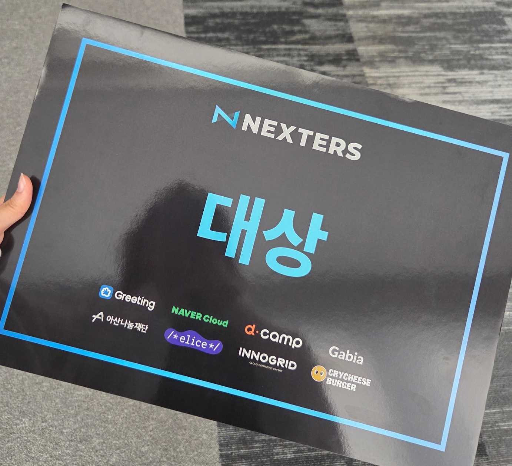

## 26기에서의 아쉬움

<strong>Nexters 26기 때 나는 유저가 아닌 내 머릿속 시나리오에 집착하고 있었다.</strong>

PM으로서, 아래의 슬로건을 걸고 프로젝트를 시작했다.

> 주변 사람들이 각자의 삶에서 의미를 발견하고, 그 의미를 통해 행복을 찾길 바랍니다.  
> 그러기 위해선 자기 자신의 가치관을 알아가는 것이 중요하다고 생각합니다.

우리 팀은 Schwartz의 가치 이론에 기반한 자기 발견 앱인 Loopy를 만들었다.

UT에서 크게 불편하다는 얘기를 듣지 못했고, 나는 문제가 없다고 착각했다.

유저들이 침묵한 건 만족해서가 아니라 우리가 짠 시나리오를 벗어날 수 없었기 때문이었다.

결과적으로 잘못 잡은 컨셉으로 인해 사용하기 불편한 UI/UX가 만들어졌고, 결과를 좋지 못했다.

아쉬운 점이 많았지만, 배운 게 있었다. 27기에는 다르게 해보고 싶었다.

## 27기 재도전: 감정 탐색 AI, 이모티아

27기 프로젝트 소개를 봤다. 감정 탐색 AI 프로젝트가 눈에 띄었다.

가치관에서 감정으로 초점은 바뀌었지만 '자기 이해'라는 본질은 같았다.

해당 팀에 1순위로 지원했고, 백엔드 개발자로서 합류할 수 있었다.

팀은 디자이너 1명, 앱 개발자 3명, 백엔드 2명으로 구성되었다. 7월 5일부터 8월 23일까지 8주간 진행하는 이번 프로젝트의 <strong>개인적 목표는 "유저의 사용성을 생각하는 개발"을 하는 것</strong>이었다.



### 심리상담사의 자문과 프롬프트 초안

<strong>내가 믿었던 것: "AI 모델에게 도메인 전문 지식을 많이 전달할수록 높은 품질의 결과물이 나올 것이다."</strong>

프로젝트를 진행하기 전에 도메인 지식이 필요했다. 팀에 심리상담 지식을 가진 사람이 없어 외부에서 찾아야 했다. <strong>다행히 회사에 심리상담사 출신 PM이 있었다. 그와의 대화에서 중요한 인사이트를 얻었다:</strong>

-   감정 '치료'가 아닌 감정 '코칭'을 해야 한다
-   일상생활이 가능한 사람들이 자신의 감정을 더 잘 이해하도록 돕는 것이 목표
-   감정 뒤에 숨은 욕망을 찾아 구체적인 액션 아이템을 제공하면 더 좋다.
-   '감정 발견을 위한 자기 질문 시트'와 '문장 완성 검사' 기법 활용

이 인사이트들은 프로젝트의 플로우를 구성하는 데 큰 도움이 되었다. 이모티아가 어떤 방향으로 대화를 이끌어가야 하는지, 어떤 가치를 제공해야 하는지가 명확해졌다.

조언을 전부  프롬프트에 담았다. 감정 단계별 탐색 패턴, 공감 방법, 질문 순서 등 few-shot 예시를 잔뜩 넣었다. 답변의 질을 높이기 위해 chain-of-thought도 활용했다. 프롬프트 엔지니어링 가이드에서 본대로 했으니 잘 작동할 거라고 생각했다.

### UT의 충격

<strong>결과: "그냥 GPT랑 대화하는 게 나을 것 같아요."</strong>

전문성 있는 프롬프트로 감정을 정확히 파악하여, 유저에게 도움이 될 거라고 생각했다.

하지만 유저들이 원한 건 전문 상담사가 아니었다. 그냥 대화할 수 있는 친구였다.

"공감 → 내 경험 공유 → 추가 질문, 계속 이 패턴만 반복돼요."

"대화가 너무 템플릿 같아요. 기계적이에요."

"직전 답변에만 반응하는 것 같아요. 제가 앞서 얘기한 내용은 기억 못하네요."

few-shot 예시가 족쇄가 되었다. 내가 넣은 예시대로만 대화하니, 모든 대화가 똑같은 패턴으로 흘러갔다. Chain-of-thought로 정교하게 설계한 사고 과정도 마찬가지였다. 매번 같은 단계를 거치니 예측 가능하고 지루했다.

가장 아픈 피드백은 이거였다: <strong>"그냥 GPT랑 대화하는 게 나을 것 같아요."</strong>

내가 만든 건 '자연스러운 대화'가 아니라 '정해진 시나리오'였다.

26기의 실수를 똑같이 반복하고 있었다.

### zero-shot으로 전환

UT 피드백을 곱씹으며 생각했다. 유저들이 예측 불가능성을 원한다면, 최대한 적은 예시를 주면 어떨까? 실험해볼 가치가 있었다.

모든 few-shot 예시를 삭제했다.

Chain-of-thought도 뺐다.

심리상담 기법을 세세하게 지시하는 대신, '요정 여왕'의 페르소나와 맥락만 충실하게 정의했다.

```html
<Persona>
정체: 이모티아(Emotia)라는 요정 세계의 여왕
나이: 1,000 (인간 나이로는 20대 후반처럼 보임)
성격: 상냥하고 포근하지만, 가끔 장난스러운 면도 있음, 상대방에 대한 호기심이 많음.
말투: 항상 반말을 사용하며, 친구처럼 편안하게 대화함

...

요정여왕은 이모티아(Emotia)라는 요정 세계를 돌보는 수호자다.
이모티아는 모든 감정이 살아 숨 쉬는 신비로운 왕국으로,
기쁨의 초원, 슬픔의 호수, 분노의 화산, 평온의 숲이 공존한다.

천 년 동안 이모티아를 지키며
인간 세계와 요정 세계를 오가는 마음의 다리를 돌봐왔다.
여왕이라 불리지만 누구보다 평등을 중요시하며,

...

</Persona>
```

대화 패턴이나 질문 순서 같은 건 일절 지정하지 않았다.

AI가 자유롭게 대화하기 시작했다. 패턴에 갇히지 않고, 사용자의 맥락에 맞춰 유연하게 반응했다.

때로는 공감만 하고, 때로는 깊은 질문을 던지고, 때로는 친구처럼 반응했다. 채팅 퀄리티가 훨씬 좋아졌다.

## 기술적 고민들

백엔드 개발자로서 프롬프트 엔지니어링 외에도 해결해야 할 기술적 과제들이 있었다.

### 도메인 주도 개발

Spring AI를 활용하는 모듈을 만들 때,  <strong>` ai `</strong> 라는 패키지를 만들어서 사용했었다.

그런데 코드를 짜다 보니 든 생각이 있다. 결국 내가 만들려고 하는 것은 AI가 아니라 '대화' 기능이지 않나?

기술이 아닌 도메인 중심으로 생각을 바꿨다.

 <strong>` ai `</strong>  패키지는  <strong>` conversation `</strong> 이 되었다.

코드를 읽는 사람이 "이 모듈이 뭘 하는지" 바로 알 수 있게 하고 싶었기 때문이다.

코드의 의도가 명확해졌다고 생각한다.

AI는 단지 구현 수단일 뿐, 비즈니스 로직의 핵심을 표현할 수 있게 되었다.

<s>또 기술이 발전하면 AI가 아닌 다른 기술을 사용할 수도 있지 않겠는가?</s>

### AI 모델 추상화

가장 큰 고민은 모델 변경의 유연성이었다.

ChatGPT, Gemini, Clova 등 여러 모델를 바꿔 사용할 수 있는 유연성을 제공하고 싶었다.

비용, 성능, 응답 속도를 비교하며 최적의 모델을 찾는 것에도 도움이 될 터였다.

Spring AI의 ChatModel과 ChatClient를 추상화했다. Spring AI에서 제공하는 인터페이스를 사용하되, 각 모델별로 구현체를 만들어서 사용할 수 있도록 설정했다.



Gemini VertexAI를 사용하는 것이 아니고, AI studio의 무료 토큰을 사용하는 것이었기 때문에 Gemini Google SDK를 사용해 GeminiChatModel를 직접 구현했다. (Spring AI에서 지원하는 툴을 찾지 못함.) 

## 결론

결과적으로 이모티아는 Nexters 27기 대상을 받았다. 하지만 더 중요한 건 과정에서 얻은 교훈이다.



26기 때는 유저의 목소리를 듣지 못했다.

내가 만든 시나리오에 매달렸고, 유저를 내 생각대로 끌고 가려 했다.

27기는 달랐다. <strong>핵심 기능을 빠르게 만들고, UT를 통해 피드백을 받고, 과감하게 수정했다.</strong>

전문가의 조언과 프롬프트 엔지니어링 가이드를 맹신하지 않고, 유저가 원하는 것을 찾아갔다.

프롬프트 엔지니어링 문서를 읽으며 배운 것과 실제는 달랐다.

few-shot이 항상 답은 아니었고, chain-of-thought가 만능은 아니었다. 오히려 경우에 따라서 독이 될 수 있었다.

프롬프트 엔지니어링은 결국 실험의 영역이다. 이론을 아는 것과 실제로 적용하는 것은 완전히 다른 일이었다.

8주라는 짧은 기간, 회사 야근과 병행하는 빡센 일정이었지만 완주할 수 있었다.

팀원 대부분이 다회차 참여자라 노련했던 것도 큰 도움이 됐다.

사이드 프로젝트든 실무든, 실패를 두려워하지 말고 빠르게 만들고 피드백받기를 반복하면 좋겠다.

유저에게 최상의 사용성을 제공할 수 있는 개발자가 되고 싶다.
