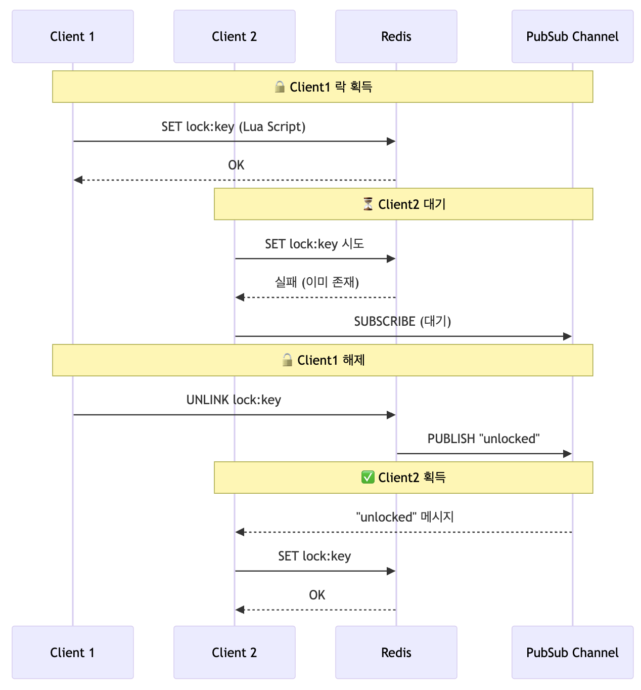

이전 글인 ["좋아요 기능으로 알아보는 비관적 락"](/ko/blog/12/)에서 이어지는 글이다. 

"Lettuce는 SpinLock만 지원한다"는 잘못된 정보를 바로잡고, Spring RedisLockRegistry의 PubSub Lock 설정으로 Redisson 없이도 효율적인 분산 락을 구현하는 방법을 소개한다.

## Lettuce에 대한 오해, 당신도 믿고 있는가?

구글에 "Redis 분산 락"를 검색하면 수십 개의 블로그가 같은 내용을 반복한다:

-   "Lettuce는 SpinLock 방식이라 Redis에 부하를 준다"
-   "그래서 Redisson을 써야 한다"
-   "Lettuce로는 PubSub 방식을 구현할 수 없다"

<u><b>이런 주장들이 마치 정설처럼 반복되고 있다.</b></u>


*lettuce가 스핀락을 사용한다는 오해1*


*lettuce가 스핀락을 사용한다는 오해2*

<u><b>그리고 이러한 논리를 바탕으로 Redisson 구현체를 추천한다.&nbsp;</b></u> 


*Lettuce가 spin lock이라는 근거를 통해 Redisson을 사용을 추천하는 글*


*Lettuce가 spin lock이라 CPU 사용량이 많기 때문에 Redisson을 사용을 추천하는 글*

<strong>하지만, 이는 전부 잘못된 정보이다.</strong>

### 첫 번째 오해! Lettuce는 무조건 Spin Lock 방식이다?

> "Lettuce는 spin lock 방식으로 구현되어 Redis에 부하를 준다"

수많은 블로그에서 이렇게 단정하지만, 이는 Lettuce 자체의 특성이 아니다.

<strong>개발자가 While 문으로 반복해서 락 획득을 시도하도록 구현했기 때문에</strong> Spin Lock이 된 것일 뿐이다.

Lettuce를 사용하더라도 <strong>RedisMessageListenerContainer를 통해 특정 채널을 구독하는 방식</strong>으로 구현하면 <strong>Pub/Sub 기반 락을 충분히 구현할 수 있다</strong>.

<u><b>Lettuce는 단지 Redis 클라이언트 라이브러리일 뿐, 락 구현 방식을 강제하지 않는다.</b></u>

### 두 번째 오해! Lettuce에서 분산 락을 직접 구현해야 한다.

> "Lettuce는 분산 락 구현을 제공하지 않으니 Redisson을 쓰는 게 낫지 않을까?"

많은 사람들이 이를 근거로 Redisson 사용을 제안한다.

Lettuce 자체가 분산 락 기능을 제공하지 않는 것은 사실이다.

하지만 Spring Integration이 제공하는 RedisLockRegistry를 활용하면 직접 구현하지 않고도 손쉽게 분산 락을 사용할 수 있다. Lettuce 기반으로도 충분히 프로덕션 레벨의 분산 락 구현이 가능하다는 의미다.

### 이 잘못된 정보는 어떻게 퍼졌을까?

이 오해는 아마도 다음과 같은 경로로 확산된 것으로 보인다.

1.  누군가 Lettuce로 While 루프 기반 락을 구현한 예제 코드 작성
2.  이를 "Lettuce = Spin Lock"이라고 잘못 일반화
3.  후속 글들이 검증 없이 이 내용을 인용하며 확산
4.  결과적으로 잘못된 통념으로 고착화

실제로 많은 개발자들이 공식 문서나 소스 코드를 직접 확인하지 않고, 이미 작성된 블로그 글을 근거로 기술을 선택하고 있는 것으로 보인다.

## RedisLockRegistry 살펴보기

<strong>Spring 공식 문서를 읽다가 LockRegistry라는 Spring의 락을 통합하는 인터페이스</strong>를 알게 되었고, 덕분에 RedisLockRegistry라는 구현체를 알게 되었다. 

### Lua 스크립트

Lua 스크립트를 통해 Redis 분산 락을 구현했다.

```java
private abstract class RedisLock implements Lock {

    private static final String OBTAIN_LOCK_SCRIPT = """
            local lockClientId = redis.call('GET', KEYS[1])
            if lockClientId == ARGV[1] then
                redis.call('PEXPIRE', KEYS[1], ARGV[2])
                return true
            elseif not lockClientId then
                redis.call('SET', KEYS[1], ARGV[1], 'PX', ARGV[2])
                return true
            end
            return false
            """;
}
```

Lua 스크립트 통해 다음과 같은 효과를 얻을 수 있다. 

-   <strong>단일 명령</strong>으로 실행 (중간에 다른 명령 끼어들 수 없음)
-   GET과 SET 사이의 Race Condition 원천 차단

## SpinLock과 PubSubLock

RedisLockRegistry는 SpinLock 방식과 PubSubLock 방식을 동시에 제공한다.

```java
private Function<String, RedisLock> getRedisLockConstructor(RedisLockType redisLockType) {
    return switch (redisLockType) {
        case SPIN_LOCK -> RedisSpinLock::new;
        case PUB_SUB_LOCK -> RedisPubSubLock::new;
    };
}
```

SpinLock은 위에서 얘기한 것과 같이 반복문을 통해 락 획득을 지속적으로 확인해야 한다.

RedisLockRegistry의 RedisSpinLock 구현체도 while 문을 통해 락을 시도한다.

```java
while (!obtainLock()) {
    Thread.sleep(RedisLockRegistry.this.idleBetweenTries.toMillis()); //NOSONAR
}
```

SpinLock 방식은 CPU 자원을 낭비하게 되는 문제가 있다.

반면 RedisPubSubLock 구현체는 Redis Pub/Sub을 활용해 CPU 자원을 낭비하는 문제를 해결한다.

해당 구현체는 Lock을 획득하지 못했을 때, lockKey에 대해 구독한다.

```java
Future<String> future =
    RedisLockRegistry.this.unlockNotifyMessageListener.subscribeLock(this.lockKey);
```

먼저 락을 획득한 스레드가 락을 해체하면 아래 Lua 스크립트를 호출하고, 해당 채널에 이벤트를 발행한다.

```java
private final class RedisPubSubLock extends RedisLock {

    private static final String UNLINK_UNLOCK_SCRIPT = """
            local lockClientId = redis.call('GET', KEYS[1])
            if (lockClientId == ARGV[1] and redis.call('UNLINK', KEYS[1]) == 1) then
                redis.call('PUBLISH', ARGV[2], KEYS[1])
                return true
            end
            return false
            """;
}
```

RedisLockRegistry를 PubSubLock 모드로 설정하면 RedisMessageListenerContainer를 실행하고, lockKey에 대한 topic을 구독하고 있다. 이를 구독하고 있던 애플리케이션은 이벤트가 발행되면 락을 획득하여 임계 영역으로 진입하게 된다.

```java
public final class RedisLockRegistry implements ExpirableLockRegistry, DisposableBean {

  private volatile RedisMessageListenerContainer redisMessageListenerContainer; 
  
  private void setupUnlockMessageListener(RedisConnectionFactory connectionFactory) {
		Assert.isNull(RedisLockRegistry.this.redisMessageListenerContainer,
				"'redisMessageListenerContainer' must not have been re-initialized.");
		Assert.isNull(RedisLockRegistry.this.unlockNotifyMessageListener,
				"'unlockNotifyMessageListener' must not have been re-initialized.");
		RedisLockRegistry.this.redisMessageListenerContainer = new RedisMessageListenerContainer();
		RedisLockRegistry.this.unlockNotifyMessageListener = new RedisPubSubLock.RedisUnLockNotifyMessageListener();
		final Topic topic = new ChannelTopic(this.unLockChannelKey);
		this.redisMessageListenerContainer.setConnectionFactory(connectionFactory);
		this.redisMessageListenerContainer.setTaskExecutor(this.executor);
		this.redisMessageListenerContainer.setSubscriptionExecutor(this.executor);
		this.redisMessageListenerContainer.addMessageListener(this.unlockNotifyMessageListener, topic);
	}
}
```

RedisPubSubLock의 동작을 다이어그램으로 정리하면 아래와 같다.



## RedisLockRegistry 적용해보기

### 설정하기

RedisLockRegistry를 사용하기 위해선 아래 의존성을 추가해야 한다.

```kotlin
dependencies {
    implementation("org.springframework.integration:spring-integration-redis")
}
```

그리고 RedisLockRegistry를 생성하고, 어떤 락을 설정한 뒤 빈으로 등록하면 사용 준비 완료다.

```java
@Configuration
public class RedisLockConfig {

  public static final String REDIS_LOCK_REGISTRY = "redisLockRegistry";
  private static final Duration DEFAULT_LOCK_EXPIRE = Duration.ofSeconds(10);

  @Primary
  @Bean
  public LockRegistry redisLockRegistry(RedisConnectionFactory redisConnectionFactory) {
    RedisLockRegistry redisLockRegistry =
        new RedisLockRegistry(
            redisConnectionFactory, REDIS_LOCK_REGISTRY, DEFAULT_LOCK_EXPIRE.toMillis());
    redisLockRegistry.setRedisLockType(RedisLockType.PUB_SUB_LOCK);
    return redisLockRegistry;
  }
}
```

### LockRegistry 주입받기

그리고 LockRegistry를 주입받아 사용하면 된다.

이전 글에서 비관적 락을 통해 처리했던 로직을 분산 락을 이용해 처리해보았다.

```java
@Service
@RequiredArgsConstructor
public class ReviewLikeService {

  // 기타 의존성들
  // ....

  // RedisLockRegistry
  private final LockRegistry RedisLockRegistry;

  @Transactional
  public ReviewLikeResult likeReview(final ReviewLikeCommand command) {
    final String key =
        String.format(
            "review-like:reviewId:%d:memberId:%d", command.reviewId(), command.memberId());
    final Lock lock = RedisLockRegistry.obtain(key);
    if (lock.tryLock(5000, TimeUnit.MILLISECONDS)) {
      try {
        // 비즈니스 로직
      } finally {
        lock.unlock();
      }
    }
    return ReviewLikeResult.empty();
  }
```

## 결론: 개발자로서의 자세

<strong>"Lettuce는 SpinLock만 지원한다"</strong>

<strong>이 한 문장이 검증 없이 수십 개의 블로그에서 반복되고 있다는 사실에 놀랐다.</strong> 심지어 주변 동료들도 "Lettuce가 Spin Lock 방식이라서 Redisson을 선택했다"고 말하는 것을 듣고 충격을 받았다.

분산 락 하나만 필요한데, Redisson의 수십 가지 기능을 모두 가져올 필요가 있을까? 이 글을 읽었다면, <strong>Spring Integration이 제공하는 가벼운 솔루션으로 충분히 해결 가능하다</strong>는 사실을 알게 되었을 것이다.

### 우리가 놓치고 있는 것

<strong>다른 사람의 글을 읽을 때 한 번 더 의심하고 검증하는 습관</strong>이 얼마나 중요한지 다시 한번 깨달았다.

-   블로그 글만이 아니라 <strong>공식 문서</strong>도 함께 읽어보기
-   블로그에 작성된 코드가 정말 맞는지 <strong>직접 실행하고 검증</strong>해보기
-   필요하다면 <strong>사용하는 라이브러리의 소스 코드</strong>까지 읽어보기

이것이 진짜 개발자의 자세 아닐까?

### 기술 선택의 기준

Redisson이 나쁘다는 게 아니다. Redisson은 분명 강력하고 편리한 도구다.

<strong>하지만 "모두가 그렇게 하니까"가 기술 선택의 이유가 되어서는 안 된다.</strong>

<strong>실제로 필요한 기능</strong>이 무엇인지, <strong>트레이드오프</strong>는 무엇인지, <strong>우리 팀의 상황</strong>에 맞는 선택인지를 고민해야 한다.

단순히 분산 락이 필요하다면 Spring Integration의 RedisLockRegistry로 충분할 수 있다. 복잡한 분산 자료구조와 고급 기능이 필요하다면 그때 Redisson을 선택해도 늦지 않다.

## 동시성 처리 시리즈

-   [처음부터 다시 배우는 Java 동시성 제어](/ko/blog/11/)
-   [UPDATE 한 줄로 끝내는 동시성 처리](/ko/blog/7/) 
-   [좋아요 기능으로 알아보는 넥스트 키 락](/ko/blog/12/)
-   Lettuce 분산 락의 오해와 진실
-   [AOP로 동시성 처리 코드 분리하기](/ko/blog/13/)
